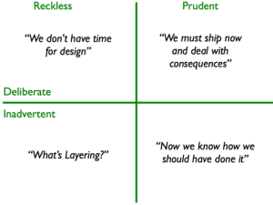

# Understanding Technical Debt: A Strategic Approach

**Date:** 2015-03-18
**Description:** Technical debt represents the implicit cost of rework caused by choosing an easy solution now instead of the ideal one. It’s a critical concept for any software development team to understand and manage effectively. Ignoring technical debt can lead to a system that’s increasingly difficult and expensive to maintain, ultimately jeopardizing the long-term success of the project.

---

## The Core Concept: What is Technical Debt?

Technical debt, as popularized by Ward Cunningham, is a metaphor for the implicit cost of rework caused by choosing an easy solution now instead of the ideal one. It’s not necessarily “bad” debt, like financial debt; it’s a trade-off. Teams frequently take on technical debt to meet deadlines, explore new technologies, or address immediate business needs. However, unmanaged technical debt accumulates over time, impacting maintainability, scalability, and overall system quality. Think of it like this: you're borrowing time and effort to deliver a feature, but you're accumulating interest that will eventually require significant repayment.

## Why Does Technical Debt Occur?

Technical debt arises from several factors. Primarily, it stems from the trade-off between speed and quality. Teams often prioritize delivering a working product quickly, even if it means sacrificing code quality, proper architecture, or thorough testing. This can be driven by:

- **Tight Deadlines:** Pressure to deliver features quickly often leads to shortcuts.
- **New Technologies:** Exploring unfamiliar technologies can introduce complexity and require rework later.
- **Lack of Resources:** Limited time, budget, or personnel can force compromises.
- **Changing Requirements:** Shifting requirements can render existing code obsolete and necessitate redesign.

## The Technical Debt Quadrant: Categorizing the Debt

Martin Fowler formalized this understanding with the “Technical Debt Quadrant,” a framework for classifying technical debt based on intentionality and awareness. This helps teams understand the nature of their debt and prioritize repayment.



The quadrant divides debt into four categories:

- **Red - Reckless (Accidental):** This represents the least desirable type of technical debt. It’s the debt you _didn’t know_ you were incurring. Often, it's the result of unforeseen complexities or a lack of understanding during the initial development. This debt is characterized by a lack of awareness and usually can’t be easily remedied. Examples include integrating a third-party library without understanding its long-term maintenance or relying on a temporary workaround that becomes increasingly complex over time.

- **Orange - Reckless (Deliberate):** This is debt you _knew_ you were incurring, but consciously chose to create. It's often driven by a desire for speed, even if it means sacrificing quality. This kind of debt often arises during periods of intense pressure. Example: a rushed implementation of a feature that ignores best practices due to a looming deadline.

- **Green - Prudent (Deliberate):** This represents debt incurred intentionally, but with a conscious understanding of the trade-offs. Teams acknowledge the quality implications but prioritize delivering a working solution in the short term. This type of debt is typically tracked and planned for repayment during subsequent maintenance cycles. For example, a feature might be implemented with a slightly less-than-ideal design to accelerate delivery, with a commitment to refactor it later.

- **Blue - Prudent (Accidental):** This debt arises from a _learning_ experience. It’s the result of discovering problems with your design choices after the fact. This can be incredibly valuable, as it demonstrates the team's growing understanding of the system and highlights areas for improvement. Example: After delivering a feature, the team realizes the data model isn't scalable and identifies the need for a redesign.

## Managing Technical Debt: A Strategic Approach

Here’s a step-by-step approach to managing technical debt:

1.  **Identify and Track Debt:** Conduct regular code reviews, use static analysis tools, and track issues raised by developers. Document all identified technical debt with a description, estimated effort to fix, and a priority score.

2.  **Prioritize Remediation:** Not all debt is created equal. Focus on the debt that poses the greatest risk to the system (e.g., security vulnerabilities, performance bottlenecks, scalability limitations).

3.  **Allocate Time for Refactoring:** Dedicate a percentage of each sprint to refactoring and addressing technical debt. Don't treat this as an "extra" task – it’s a core part of maintaining a healthy codebase.

4.  **Embrace Continuous Integration and Continuous Delivery (CI/CD):** Automated testing and deployment practices help catch and prevent technical debt from accumulating.

5.  **Foster a Culture of Quality:** Encourage developers to prioritize code quality and share their knowledge.

## Real-World Examples

- **E-commerce Platform:** A rushed implementation of a new payment gateway resulted in poor error handling and performance issues. Addressing this required a significant overhaul of the payment processing module.
- **Social Media App:** An undocumented API integration led to compatibility issues and increased maintenance overhead.
- **Financial System:** A workaround for a security vulnerability introduced a complex and fragile code path.

## Quotes

[https://twitter.com/ardalis/status/168048081454104576](https://twitter.com/ardalis/status/168048081454104576)

[https://twitter.com/codestandards/status/573128284608724992](https://twitter.com/codestandars/status/573128284608724992)

[https://twitter.com/dwhelan/status/780412196018728960](https://twitter.com/dwhelan/status/780412196018728960)

[https://twitter.com/Christophano/status/781141242432421888](https://twitter.com/Christophano/status/781141242432421888)

## References

[The Human Cost of Technical Debt](http://www.daedtech.com/human-cost-tech-debt/)

[Refactoring Fundamentals](https://www.pluralsight.com/courses/refactoring-fundamentals) to eliminate common sources of Technical Debt

---

**Call to Action:** Mastering the concept of technical debt is crucial for any software development team. By proactively identifying, prioritizing, and addressing technical debt, you can improve system reliability, reduce maintenance costs, and accelerate innovation. Don’t let technical debt become a systemic problem. Invest the time and effort to manage it effectively, and you’ll see a tangible improvement in your team's productivity and the overall quality of your software.

```

```
