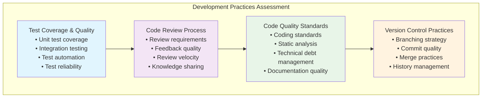

# Engineering Excellence Assessment Framework

> *"What gets measured gets managed."* - Peter Drucker

Picture this: You're a Staff Engineer who just joined a new organization. In your first week, you need to understand the current state of engineering practices, identify areas for improvement, and create a roadmap for technical excellence. Where do you start?

You could spend weeks in meetings, reading documentation, and conducting informal interviews. Or you could use a systematic assessment framework that quickly reveals the organization's engineering maturity across all critical dimensions.

**This assessment framework provides a structured approach to evaluating engineering excellence across multiple domains**, drawing from industry best practices and research from organizations like Google, Netflix, Amazon, and ThoughtWorks. It's designed for Staff Engineers who need to quickly understand current capabilities and create evidence-based improvement strategies.

The framework evaluates six critical domains of engineering excellence, each with specific practices, measurement criteria, and maturity levels. Use this tool to baseline your organization's current state, identify improvement priorities, and track progress over time.

## How to Use This Assessment

### Assessment Process

1. **Gather Evidence**: Use multiple data sources (metrics, surveys, interviews, observations)
2. **Score Each Practice**: Rate current capability on a 1-5 scale
3. **Identify Patterns**: Look for strengths, gaps, and systemic issues
4. **Prioritize Improvements**: Focus on high-impact, achievable changes
5. **Create Action Plans**: Develop specific, measurable improvement initiatives
6. **Track Progress**: Re-assess quarterly to measure improvement

### Scoring Guidelines

**1 - Ad Hoc**: Practice is inconsistent, undocumented, and dependent on individuals
**2 - Developing**: Practice exists but is informal, with significant gaps in execution
**3 - Defined**: Practice is documented and followed, but not optimized or measured
**4 - Managed**: Practice is measured, monitored, and continuously improved
**5 - Optimized**: Practice is a competitive advantage and shared across the organization

## Domain 1: Development Practices and Code Quality

Evaluates how teams write, review, and maintain code to ensure long-term sustainability and quality.



### Test Coverage and Quality

**Assessment Questions:**
- What percentage of code is covered by automated tests?
- How reliable are the tests (what's the flaky test rate)?
- How fast does the test suite execute?
- Are tests written before or after implementation?

**Evidence Collection:**
```python
# Metrics to collect
test_metrics = {
    "unit_test_coverage": "percentage",
    "integration_test_coverage": "percentage", 
    "test_suite_execution_time": "minutes",
    "flaky_test_rate": "percentage",
    "test_failure_rate": "percentage",
    "tests_per_feature": "ratio"
}

# Survey questions for team members
test_quality_survey = [
    "How confident are you that tests catch regressions? (1-5)",
    "How often do tests fail due to environmental issues? (1-5)", 
    "How easy is it to understand what failed tests are testing? (1-5)",
    "How often do you write tests before implementing features? (1-5)"
]
```

**Maturity Levels:**

**Level 1 (Ad Hoc)**:
- Test coverage below 40%
- Manual testing required for most changes
- Frequent test failures due to environment issues
- Tests written only when required

**Level 2 (Developing)**:
- Test coverage 40-60%
- Basic unit tests exist but integration testing is limited
- Some automated testing in CI pipeline
- Occasional TDD practices

**Level 3 (Defined)**:
- Test coverage 60-80%
- Comprehensive unit and integration test suites
- Consistent test automation practices
- Regular test maintenance and improvement

**Level 4 (Managed)**:
- Test coverage 80-95%
- Fast, reliable test execution
- Test-driven development is common practice
- Test quality metrics are tracked and improved

**Level 5 (Optimized)**:
- Comprehensive test coverage with quality gates
- Tests are treated as first-class code
- Advanced testing strategies (property-based, mutation testing)
- Testing expertise shared across organization

### Code Review Process

**Assessment Questions:**
- Are all code changes reviewed before merging?
- How thorough and constructive are code reviews?
- What's the average time from review request to approval?
- Do reviews effectively transfer knowledge and catch issues?

**Evidence Collection:**
```python
# Code review metrics
review_metrics = {
    "review_coverage": "percentage of PRs reviewed",
    "review_time": "hours from request to approval",
    "review_comments_per_PR": "average number",
    "review_rounds_per_PR": "average iterations",
    "defects_found_in_review": "percentage",
    "post_merge_issues": "issues found after merge"
}

# Qualitative assessment through surveys
review_quality_survey = [
    "How often do code reviews catch potential bugs? (1-5)",
    "How helpful are review comments for learning? (1-5)",
    "How respectful and constructive are review discussions? (1-5)",
    "How consistent are review standards across teams? (1-5)"
]
```

**Maturity Levels:**

**Level 1 (Ad Hoc)**:
- Code reviews are optional or inconsistent
- Reviews focus mainly on style rather than substance
- Long delays between review requests and responses
- Limited knowledge transfer through reviews

**Level 2 (Developing)**:
- Most code changes are reviewed
- Reviews catch some functional issues
- Inconsistent review quality across teams
- Some knowledge sharing occurs

**Level 3 (Defined)**:
- All code changes require review
- Reviews follow documented standards
- Reasonable review turnaround times
- Regular knowledge sharing and mentoring

**Level 4 (Managed)**:
- High-quality, constructive reviews
- Fast review cycles without compromising quality
- Reviews effectively prevent defects
- Review process continuously improved

**Level 5 (Optimized)**:
- Reviews are a key learning and quality mechanism
- Advanced techniques (pair programming, mob programming)
- Review practices shared and standardized
- Metrics drive continuous improvement

### Code Quality Standards

**Assessment Questions:**
- Are coding standards documented and enforced?
- How is technical debt tracked and managed?
- What static analysis tools are used?
- How consistent is code quality across the codebase?

**Evidence Collection:**
```python
# Code quality metrics
quality_metrics = {
    "cyclomatic_complexity": "average per method",
    "code_duplication": "percentage",
    "technical_debt_ratio": "percentage",
    "static_analysis_violations": "count per KLOC",
    "documentation_coverage": "percentage",
    "code_consistency_score": "automated measurement"
}

# Technical debt assessment
debt_assessment = {
    "debt_identification": "How is technical debt identified?",
    "debt_prioritization": "How is debt prioritized for resolution?",
    "debt_resolution": "How often is debt actually addressed?",
    "debt_prevention": "What prevents new debt introduction?"
}
```

**Maturity Levels:**

**Level 1 (Ad Hoc)**:
- No consistent coding standards
- Technical debt accumulates without tracking
- Manual code quality checks only
- High variability in code quality

**Level 2 (Developing)**:
- Basic coding standards exist
- Some automated quality checks
- Technical debt recognized but not systematically managed
- Inconsistent application of standards

**Level 3 (Defined)**:
- Documented and enforced coding standards
- Regular static analysis and quality gates
- Technical debt tracked and occasionally addressed
- Consistent code quality practices

**Level 4 (Managed)**:
- Comprehensive quality standards and automation
- Proactive technical debt management
- Quality metrics tracked and improved
- High consistency across codebase

**Level 5 (Optimized)**:
- Quality standards drive architectural decisions
- Technical debt is investment decision
- Advanced quality practices (architecture fitness functions)
- Quality practices shared organization-wide

## Domain 2: Continuous Integration and Deployment

Evaluates the automation and reliability of build, test, and deployment processes.

### Build and CI Pipeline

**Assessment Questions:**
- How long does it take to get feedback from CI?
- How reliable is the build pipeline?
- Are builds reproducible across environments?
- How is build configuration managed?

**Evidence Collection:**
```python
# CI/CD metrics
cicd_metrics = {
    "build_time": "minutes from commit to feedback",
    "build_success_rate": "percentage",
    "build_frequency": "builds per day",
    "pipeline_stages": "number and types",
    "feedback_time": "time to first failure notification",
    "resource_utilization": "build infrastructure efficiency"
}

# Pipeline quality assessment
pipeline_assessment = [
    "How often do builds fail due to infrastructure issues? (1-5)",
    "How easy is it to reproduce build failures locally? (1-5)",
    "How quickly can build issues be diagnosed and fixed? (1-5)",
    "How confident are you in build and test results? (1-5)"
]
```

**Maturity Levels:**

**Level 1 (Ad Hoc)**:
- Manual or inconsistent build processes
- Long build times with frequent failures
- Different build processes across teams
- Build configuration not version controlled

**Level 2 (Developing)**:
- Basic automated builds on code changes
- Some consistency in build processes
- Build failures addressed reactively
- Limited build optimization

**Level 3 (Defined)**:
- Consistent CI pipelines across teams
- Reasonable build times and reliability
- Build configuration as code
- Standard failure notification and resolution

**Level 4 (Managed)**:
- Fast, reliable builds with comprehensive testing
- Build performance monitored and optimized
- Advanced CI features (parallel builds, smart testing)
- Proactive build health management

**Level 5 (Optimized)**:
- Industry-leading build performance and reliability
- Advanced optimization (incremental builds, distributed testing)
- Build infrastructure as competitive advantage
- Best practices shared across organization

### Deployment Practices

**Assessment Questions:**
- How frequently can teams deploy to production?
- How risky are production deployments?
- Can deployments be rolled back quickly?
- Are deployments automated and consistent?

**Evidence Collection:**
```python
# Deployment metrics (DORA metrics)
deployment_metrics = {
    "deployment_frequency": "deployments per day/week",
    "lead_time": "commit to production time",
    "change_failure_rate": "percentage requiring rollback/hotfix",
    "recovery_time": "time to recover from failures",
    "deployment_success_rate": "percentage",
    "rollback_capability": "time to rollback"
}

# Deployment process assessment
deployment_process = [
    "How confident are you making production deployments? (1-5)",
    "How often do deployments cause production issues? (1-5)",
    "How quickly can you rollback a problematic deployment? (1-5)",
    "How much manual work is required for deployments? (1-5)"
]
```

**Maturity Levels:**

**Level 1 (Ad Hoc)**:
- Infrequent, risky deployments
- Manual deployment processes
- Long lead times from development to production
- Deployment issues are common

**Level 2 (Developing)**:
- Some deployment automation
- Weekly or bi-weekly deployment cycles
- Basic rollback capabilities
- Moderate deployment success rates

**Level 3 (Defined)**:
- Reliable automated deployment pipelines
- Daily or more frequent deployments possible
- Good rollback and monitoring capabilities
- Consistent deployment practices

**Level 4 (Managed)**:
- Multiple daily deployments with high confidence
- Advanced deployment patterns (blue-green, canary)
- Fast recovery from deployment issues
- Deployment metrics tracked and optimized

**Level 5 (Optimized)**:
- On-demand, low-risk deployments
- Zero-downtime deployments as standard
- Deployment practices as competitive advantage
- Advanced patterns (feature flags, progressive delivery)

## Domain 3: Site Reliability and Operations

Evaluates system reliability, observability, and operational practices.

### System Reliability

**Assessment Questions:**
- How reliable are production systems?
- Are reliability targets defined and measured?
- How quickly are outages detected and resolved?
- What practices prevent reliability issues?

**Evidence Collection:**
```python
# SRE and reliability metrics
reliability_metrics = {
    "uptime_percentage": "availability SLI",
    "error_rate": "percentage of failed requests",
    "response_time_p95": "95th percentile latency",
    "mean_time_to_detection": "MTTD for issues",
    "mean_time_to_resolution": "MTTR for issues",
    "incident_frequency": "incidents per month"
}

# Reliability practices assessment
reliability_practices = [
    "Are SLOs defined and tracked for key services? (1-5)",
    "How quickly are production issues detected? (1-5)", 
    "How effective are post-incident reviews? (1-5)",
    "How proactive is reliability improvement? (1-5)"
]
```

**Maturity Levels:**

**Level 1 (Ad Hoc)**:
- Frequent outages and reliability issues
- Reactive approach to reliability problems
- No defined reliability targets
- Limited incident response processes

**Level 2 (Developing)**:
- Basic monitoring and alerting in place
- Some reliability targets defined
- Incident response processes developing
- Reliability issues addressed reactively

**Level 3 (Defined)**:
- SLOs defined for critical services
- Comprehensive monitoring and alerting
- Structured incident response and postmortems
- Regular reliability improvements

**Level 4 (Managed)**:
- Proactive reliability management
- Error budgets and SLO-based decision making
- Advanced monitoring and observability
- Continuous reliability improvement

**Level 5 (Optimized)**:
- Reliability as competitive advantage
- Chaos engineering and proactive testing
- Industry-leading reliability practices
- Reliability expertise shared organization-wide

### Observability and Monitoring

**Assessment Questions:**
- Can teams quickly diagnose production issues?
- Are systems instrumented with comprehensive telemetry?
- How actionable are alerts and dashboards?
- Can system behavior be understood from observability data?

**Evidence Collection:**
```python
# Observability metrics
observability_metrics = {
    "monitoring_coverage": "percentage of services monitored",
    "alert_precision": "true positive rate",
    "dashboard_usage": "active dashboard usage",
    "trace_coverage": "percentage of requests traced",
    "log_completeness": "critical paths covered",
    "diagnostic_time": "time to understand issues"
}

# Observability effectiveness
observability_assessment = [
    "How quickly can you diagnose production issues? (1-5)",
    "How actionable are your alerts? (1-5)",
    "How complete is your system instrumentation? (1-5)",
    "How useful are your dashboards for operations? (1-5)"
]
```

**Maturity Levels:**

**Level 1 (Ad Hoc)**:
- Limited monitoring and observability
- Reactive detection of issues
- Poor visibility into system behavior
- Manual diagnosis processes

**Level 2 (Developing)**:
- Basic monitoring and logging
- Some automated alerting
- Limited observability tooling
- Inconsistent instrumentation

**Level 3 (Defined)**:
- Comprehensive monitoring and alerting
- Structured logging and metrics
- Standard observability practices
- Good diagnostic capabilities

**Level 4 (Managed)**:
- Advanced observability (metrics, logs, traces)
- Proactive monitoring and alerting
- High-quality dashboards and runbooks
- Fast issue diagnosis and resolution

**Level 5 (Optimized)**:
- Industry-leading observability practices
- Advanced techniques (distributed tracing, chaos engineering)
- Observability-driven development
- Observability expertise shared widely

## Domain 4: Architecture and Design

Evaluates architectural practices, design quality, and system evolvability.

### System Architecture

**Assessment Questions:**
- How well does the architecture support business requirements?
- How easy is it to make changes to the system?
- How well are architectural decisions documented?
- How does the architecture handle scale and complexity?

**Evidence Collection:**
```python
# Architecture assessment metrics
architecture_metrics = {
    "coupling_metrics": "dependencies between components",
    "cohesion_metrics": "relatedness within components",
    "change_impact": "components affected by typical changes",
    "scalability_limits": "known performance bottlenecks",
    "technical_debt_impact": "architecture debt assessment",
    "decision_documentation": "ADR coverage and quality"
}

# Architecture quality survey
architecture_survey = [
    "How easy is it to understand the system architecture? (1-5)",
    "How easy is it to make changes without side effects? (1-5)",
    "How well documented are architectural decisions? (1-5)",
    "How well does the architecture support team autonomy? (1-5)"
]
```

**Maturity Levels:**

**Level 1 (Ad Hoc)**:
- Unclear or undocumented architecture
- High coupling and low cohesion
- Architectural decisions made ad-hoc
- Difficult to make changes safely

**Level 2 (Developing)**:
- Basic architectural patterns in use
- Some documentation of design decisions
- Inconsistent architectural practices
- Moderate change difficulty

**Level 3 (Defined)**:
- Clear architectural patterns and principles
- Documented architectural decisions (ADRs)
- Consistent architectural practices
- Reasonable change velocity

**Level 4 (Managed)**:
- Evolutionary architecture practices
- Architecture supports business agility
- Regular architectural reviews and improvements
- Strong architectural governance

**Level 5 (Optimized)**:
- Architecture as competitive advantage
- Advanced architectural patterns and practices
- Architecture expertise shared widely
- Continuous architectural innovation

### Design Practices

**Assessment Questions:**
- How are design decisions made and documented?
- How well do designs consider non-functional requirements?
- How is design quality maintained over time?
- How effectively do teams collaborate on design?

**Evidence Collection:**
```python
# Design process metrics
design_metrics = {
    "design_review_coverage": "percentage of features reviewed",
    "design_iteration_time": "time from concept to implementation",
    "design_change_frequency": "post-implementation design changes",
    "cross_team_design_collaboration": "involvement in design decisions",
    "design_pattern_consistency": "reuse of established patterns",
    "non_functional_consideration": "performance, security, etc."
}

# Design quality assessment
design_assessment = [
    "How thorough is the design process before implementation? (1-5)",
    "How well do designs consider operational requirements? (1-5)",
    "How effectively do teams collaborate on design? (1-5)",
    "How consistent are design patterns across the organization? (1-5)"
]
```

**Maturity Levels:**

**Level 1 (Ad Hoc)**:
- Design happens during implementation
- Limited consideration of non-functional requirements
- Inconsistent design practices
- Poor design documentation

**Level 2 (Developing)**:
- Some upfront design for complex features
- Basic design review processes
- Informal design collaboration
- Limited design pattern reuse

**Level 3 (Defined)**:
- Structured design processes
- Regular design reviews and collaboration
- Documented design patterns and standards
- Good consideration of non-functional requirements

**Level 4 (Managed)**:
- Design-driven development practices
- Comprehensive design reviews and validation
- Strong design pattern library and reuse
- Design quality metrics and improvement

**Level 5 (Optimized)**:
- Design excellence as organizational capability
- Advanced design practices and tools
- Design patterns as competitive advantage
- Design expertise shared organization-wide

## Domain 5: Team Practices and Collaboration

Evaluates how teams work together, share knowledge, and continuously improve.

### Team Collaboration

**Assessment Questions:**
- How effectively do teams communicate and coordinate?
- How well do teams share knowledge and learn from each other?
- How are conflicts and disagreements resolved?
- How well do teams support each other?

**Evidence Collection:**
```python
# Collaboration metrics
collaboration_metrics = {
    "cross_team_contributions": "PRs/issues across team boundaries",
    "knowledge_sharing_frequency": "documentation, presentations, etc.",
    "incident_collaboration": "teams involved in incident response",
    "design_review_participation": "cross-team involvement",
    "mentorship_activity": "formal and informal mentoring",
    "team_satisfaction": "survey scores"
}

# Collaboration effectiveness survey
collaboration_survey = [
    "How easy is it to get help from other teams? (1-5)",
    "How effectively do teams share knowledge? (1-5)",
    "How well are conflicts resolved constructively? (1-5)",
    "How supported do you feel by your peers? (1-5)"
]
```

**Maturity Levels:**

**Level 1 (Ad Hoc)**:
- Teams work in isolation
- Limited cross-team communication
- Knowledge hoarding and silos
- Conflicts create lasting friction

**Level 2 (Developing)**:
- Basic cross-team communication
- Some knowledge sharing activities
- Conflicts sometimes resolved constructively
- Inconsistent team support

**Level 3 (Defined)**:
- Regular cross-team collaboration
- Structured knowledge sharing processes
- Good conflict resolution practices
- Strong peer support networks

**Level 4 (Managed)**:
- Seamless cross-team collaboration
- Proactive knowledge sharing and mentoring
- Constructive conflict resolution as norm
- High levels of psychological safety

**Level 5 (Optimized)**:
- Collaboration as competitive advantage
- Organization-wide learning and improvement
- Advanced collaboration practices and tools
- Collaboration expertise shared widely

### Continuous Learning and Improvement

**Assessment Questions:**
- How do teams identify and implement improvements?
- How is learning and development supported?
- How are experiments and innovations encouraged?
- How do teams learn from failures and successes?

**Evidence Collection:**
```python
# Learning and improvement metrics
learning_metrics = {
    "improvement_initiatives": "number and success rate",
    "experiment_frequency": "A/B tests, trials, etc.",
    "learning_time_allocation": "percentage of time for learning",
    "conference_attendance": "external learning participation",
    "internal_training": "training sessions and workshops",
    "innovation_projects": "non-roadmap exploration"
}

# Learning culture assessment
learning_survey = [
    "How supported are you in learning new skills? (1-5)",
    "How encouraged are experimentation and innovation? (1-5)",
    "How effectively do teams learn from failures? (1-5)",
    "How well do improvement initiatives succeed? (1-5)"
]
```

**Maturity Levels:**

**Level 1 (Ad Hoc)**:
- Learning happens only when necessary
- Limited support for skill development
- Failures blamed rather than learned from
- Few improvement initiatives

**Level 2 (Developing)**:
- Some learning and development support
- Basic retrospectives and improvement processes
- Occasional experimentation
- Mixed success with improvements

**Level 3 (Defined)**:
- Regular learning and development activities
- Structured improvement processes
- Encouraged experimentation and innovation
- Good learning from failures

**Level 4 (Managed)**:
- Learning integrated into daily work
- Systematic improvement and innovation
- Strong learning culture and psychological safety
- High success rate with improvements

**Level 5 (Optimized)**:
- Learning and improvement as core competency
- Advanced practices (communities of practice, innovation time)
- Learning culture as competitive advantage
- Learning practices shared organization-wide

## Domain 6: Security and Compliance

Evaluates security practices, compliance management, and risk mitigation.

### Security Practices

**Assessment Questions:**
- How are security requirements integrated into development?
- How is security testing performed?
- How are security vulnerabilities managed?
- How is security knowledge shared across teams?

**Evidence Collection:**
```python
# Security metrics
security_metrics = {
    "vulnerability_detection_time": "time to identify security issues",
    "vulnerability_resolution_time": "time to fix security issues",
    "security_test_coverage": "automated security testing",
    "dependency_vulnerability_rate": "known vulnerabilities in dependencies",
    "security_incident_frequency": "security-related incidents",
    "security_training_coverage": "team members with security training"
}

# Security practices assessment
security_survey = [
    "How well integrated is security into development? (1-5)",
    "How confident are you in the security of your systems? (1-5)",
    "How quickly are security issues identified and resolved? (1-5)",
    "How well do teams understand security requirements? (1-5)"
]
```

**Maturity Levels:**

**Level 1 (Ad Hoc)**:
- Security considered after development
- Manual, infrequent security testing
- Slow response to security issues
- Limited security knowledge across teams

**Level 2 (Developing)**:
- Some security requirements defined
- Basic automated security scanning
- Reactive approach to security issues
- Inconsistent security practices

**Level 3 (Defined)**:
- Security integrated into development process
- Regular security testing and scanning
- Structured vulnerability management
- Basic security training and awareness

**Level 4 (Managed)**:
- Security by design practices
- Comprehensive automated security testing
- Proactive security monitoring and response
- Strong security culture and expertise

**Level 5 (Optimized)**:
- Security as competitive advantage
- Advanced security practices (threat modeling, chaos security)
- Security expertise shared organization-wide
- Industry-leading security posture

## Comprehensive Assessment Summary

### Overall Maturity Calculation

```python
def calculate_overall_maturity(domain_scores: Dict[str, float]) -> AssessmentSummary:
    """Calculate overall engineering maturity from domain scores"""
    
    # Weight domains based on organizational priorities
    domain_weights = {
        "development_practices": 0.20,
        "cicd_practices": 0.20,
        "reliability_operations": 0.20,
        "architecture_design": 0.15,
        "team_collaboration": 0.15,
        "security_compliance": 0.10
    }
    
    weighted_score = sum(
        domain_scores[domain] * weight 
        for domain, weight in domain_weights.items()
    )
    
    maturity_level = get_maturity_level(weighted_score)
    
    return AssessmentSummary(
        overall_score=weighted_score,
        maturity_level=maturity_level,
        domain_scores=domain_scores,
        strengths=identify_strengths(domain_scores),
        improvement_areas=identify_gaps(domain_scores),
        recommended_actions=generate_recommendations(domain_scores)
    )
```

### Action Planning Framework

**High-Impact, Low-Effort (Quick Wins)**:
- Automated code formatting and linting
- Basic CI/CD pipeline improvements
- Documentation and knowledge sharing initiatives

**High-Impact, High-Effort (Strategic Initiatives)**:
- Comprehensive test automation strategy
- Site reliability engineering implementation
- Architecture modernization programs

**Low-Impact, Low-Effort (Fill-in Improvements)**:
- Tool and process optimizations
- Training and certification programs
- Metrics and dashboard improvements

**Low-Impact, High-Effort (Avoid or Defer)**:
- Complex tool migrations without clear benefits
- Over-engineering of processes
- Premature optimization initiatives

### Continuous Assessment Process

**Monthly**: Update metrics and track progress on active initiatives
**Quarterly**: Conduct mini-assessments focusing on areas of active improvement
**Annually**: Comprehensive assessment across all domains with stakeholder input
**As-needed**: Targeted assessments when major changes occur (reorganization, new technology, etc.)

## Key Takeaways

1. **Systematic assessment reveals hidden gaps**: Use structured evaluation to uncover issues that informal observation might miss
2. **Multiple perspectives provide complete picture**: Combine quantitative metrics with qualitative surveys and interviews
3. **Maturity is contextual**: What works for one organization may not work for another - adapt the framework to your context
4. **Improvement requires sustained focus**: Engineering excellence develops over time through consistent, incremental improvements
5. **Culture matters as much as technology**: The highest-performing organizations excel in both technical practices and team collaboration
6. **Measurement drives improvement**: What gets measured and tracked is what gets improved over time

This assessment framework provides a foundation for understanding and improving engineering excellence. Use it as a starting point, adapt it to your organizational context, and evolve it based on your experiences and changing industry best practices.

## Further Reading

- Forsgren, Nicole, Jez Humble, and Gene Kim. *Accelerate: The Science of Lean Software and DevOps*. 2018.
- Skelton, Matthew, and Manuel Pais. *Team Topologies: Organizing Business and Technology Teams for Fast Flow*. 2019.
- Beyer, Betsy, et al. *Site Reliability Engineering: How Google Runs Production Systems*. 2016.
- Martin, Robert C. *Clean Code: A Handbook of Agile Software Craftsmanship*. 2008.
- Humble, Jez, and David Farley. *Continuous Delivery: Reliable Software Releases*. 2010.