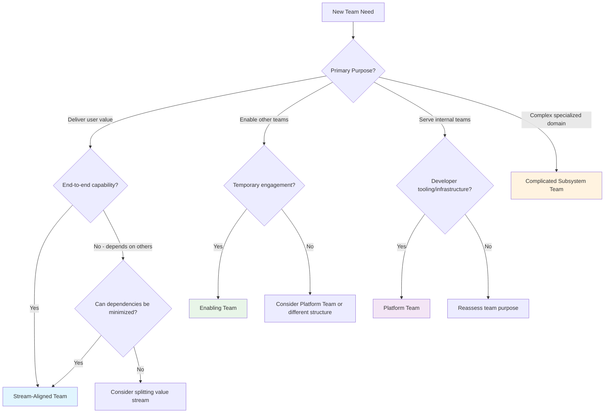

# Team Topology Assessment Framework

This assessment framework helps Staff Engineers evaluate and optimize team structures using Team Topologies principles. Use these tools to diagnose organizational health and identify improvement opportunities.

## Quick Team Type Assessment

Use this flowchart to identify the appropriate team type for a given team or proposed team:

## Comprehensive Team Health Assessment

### Stream-Aligned Team Health Check

Rate each item from 1 (Poor) to 5 (Excellent):

#### Value Stream Clarity (Weight: 25%)
- [ ] Team has clear understanding of their users and user needs (1-5)
- [ ] Team can articulate how their work creates business value (1-5)  
- [ ] Team has direct access to user feedback and data (1-5)
- [ ] Team measures success through user and business outcomes (1-5)

**Score: ___/20 → Weighted Score: ___/5**

#### Technical Capability (Weight: 30%)
- [ ] Team has all skills needed for their value stream (1-5)
- [ ] Team can build, test, deploy, and operate their services (1-5)
- [ ] Team can resolve production issues without external dependencies (1-5)
- [ ] Team's technical decisions align with broader architecture (1-5)

**Score: ___/20 → Weighted Score: ___/6**

#### Autonomy & Flow (Weight: 25%)
- [ ] Team can deploy to production without coordinating with other teams (1-5)
- [ ] Team has minimal waiting time for external dependencies (1-5)
- [ ] Team can make most technical decisions independently (1-5)
- [ ] Team's work batch sizes are appropriately small (1-5)

**Score: ___/20 → Weighted Score: ___/5**

#### Cognitive Load Management (Weight: 20%)  
- [ ] Team's workload is appropriate for their capacity (1-5)
- [ ] Team focuses on their core domain without excessive context switching (1-5)
- [ ] Team has adequate time for learning and improvement (1-5)
- [ ] Team is not overwhelmed by tool and process complexity (1-5)

**Score: ___/20 → Weighted Score: ___/4**

**Overall Stream Team Health: ___/20**

### Platform Team Health Check

Rate each item from 1 (Poor) to 5 (Excellent):

#### Customer Focus (Weight: 30%)
- [ ] Team treats other engineering teams as customers, not users (1-5)
- [ ] Team regularly collects feedback from stream teams (1-5)
- [ ] Team measures success by stream team adoption and satisfaction (1-5)
- [ ] Team understands and prioritizes stream team pain points (1-5)

**Score: ___/20 → Weighted Score: ___/6**

#### Product Excellence (Weight: 25%)
- [ ] Platform provides self-service capabilities (1-5)
- [ ] Platform has clear APIs and documentation (1-5)
- [ ] Platform maintains backwards compatibility (1-5)
- [ ] Platform has appropriate reliability and performance (1-5)

**Score: ___/20 → Weighted Score: ___/5**

#### Developer Experience (Weight: 25%)
- [ ] Platform reduces cognitive load for stream teams (1-5)
- [ ] Platform accelerates stream team delivery (1-5)
- [ ] Platform is easy to onboard and use (1-5)
- [ ] Platform provides helpful error messages and debugging tools (1-5)

**Score: ___/20 → Weighted Score: ___/5**

#### Strategic Alignment (Weight: 20%)
- [ ] Platform roadmap aligns with organizational strategy (1-5)
- [ ] Platform evolution balances standardization with flexibility (1-5)
- [ ] Platform investment is appropriate for organizational scale (1-5)
- [ ] Platform enables rather than constrains innovation (1-5)

**Score: ___/20 → Weighted Score: ___/4**

**Overall Platform Team Health: ___/20**

### Enabling Team Health Check

Rate each item from 1 (Poor) to 5 (Excellent):

#### Knowledge Transfer Excellence (Weight: 35%)
- [ ] Team has strong teaching and coaching skills (1-5)
- [ ] Team creates lasting capability in other teams (1-5)
- [ ] Team's engagements have clear success criteria (1-5)
- [ ] Team measures success by other teams' capability growth (1-5)

**Score: ___/20 → Weighted Score: ___/7**

#### Expertise Depth (Weight: 25%)
- [ ] Team has deep expertise in their specialized area (1-5)
- [ ] Team stays current with industry best practices (1-5)
- [ ] Team can solve complex problems others cannot (1-5)
- [ ] Team's expertise is recognized across the organization (1-5)

**Score: ___/20 → Weighted Score: ___/5**

#### Engagement Model (Weight: 25%)
- [ ] Team has clear engagement processes and boundaries (1-5)
- [ ] Team balances multiple concurrent engagements effectively (1-5)
- [ ] Team knows when to end engagements (1-5)
- [ ] Team avoids becoming a permanent dependency (1-5)

**Score: ___/20 → Weighted Score: ___/5**

#### Organizational Impact (Weight: 15%)
- [ ] Team addresses systemic rather than just local problems (1-5)
- [ ] Team's work has multiplier effects across the organization (1-5)
- [ ] Team identifies and fills capability gaps proactively (1-5)

**Score: ___/15 → Weighted Score: ___/3**

**Overall Enabling Team Health: ___/20**

## Team Interaction Assessment

### Current State Mapping

For each pair of teams that interact, identify the current interaction mode:

| Team A | Team B | Current Mode | Desired Mode | Health (1-5) | Actions Needed |
|--------|---------|--------------|--------------|--------------|----------------|
| | | Collaboration/X-as-a-Service/Facilitating | | | |
| | | | | | |
| | | | | | |

### Interaction Mode Health Indicators

#### Collaboration Mode Health
- [ ] High trust and psychological safety between teams
- [ ] Regular, effective communication channels established
- [ ] Shared goals and success metrics
- [ ] Joint problem-solving and decision-making
- [ ] Acceptable cognitive load from high communication

#### X-as-a-Service Mode Health  
- [ ] Clear, well-documented APIs and contracts
- [ ] Minimal communication needed for routine interactions
- [ ] Service provider meets agreed SLAs consistently
- [ ] Consumer team can use service independently
- [ ] Appropriate escalation paths for issues

#### Facilitating Mode Health
- [ ] Clear engagement model and success criteria
- [ ] Knowledge transfer is effective and measurable
- [ ] Temporary nature of engagement is respected
- [ ] Capability building rather than just problem-solving
- [ ] Clear exit strategy when capability is established

## Cognitive Load Assessment

### Individual Team Assessment

For each team, assess their cognitive load across three dimensions:

#### Intrinsic Load (Domain Complexity)
Rate the inherent complexity of the team's primary domain:
- [ ] Business domain complexity (1-5)
- [ ] Technical domain complexity (1-5)
- [ ] User needs complexity (1-5)
- [ ] Regulatory/compliance complexity (1-5)

**Intrinsic Load Score: ___/20**

#### Extraneous Load (Unnecessary Complexity)
Rate sources of unnecessary cognitive burden:
- [ ] Tool complexity and proliferation (1-5) 
- [ ] Process overhead and bureaucracy (1-5)
- [ ] Context switching between unrelated domains (1-5)
- [ ] Poor documentation and knowledge management (1-5)

**Extraneous Load Score: ___/20** (Lower is better)

#### Germane Load (Capability Building)
Rate investment in building long-term capabilities:
- [ ] Time available for learning and skill development (1-5)
- [ ] Knowledge sharing and documentation practices (1-5)
- [ ] Investment in automation and tooling (1-5)
- [ ] Reflection and continuous improvement activities (1-5)

**Germane Load Score: ___/20**

### Team Capacity Assessment

| Team | Team Size | Intrinsic Load | Extraneous Load | Germane Load | Load Balance |
|------|-----------|----------------|-----------------|--------------|--------------|
| | | ___/20 | ___/20 | ___/20 | Healthy/At Risk/Overloaded |
| | | | | | |

**Interpretation:**
- **Healthy:** Intrinsic + Extraneous ≤ 12, Germane ≥ 12
- **At Risk:** Intrinsic + Extraneous 13-16, Germane 8-11  
- **Overloaded:** Intrinsic + Extraneous ≥ 17, Germane ≤ 7

## Organizational Design Maturity Assessment

### Conway's Law Alignment

Rate how well your team structure supports your desired architecture:

#### Architecture-Team Alignment (Weight: 40%)
- [ ] Service boundaries match team boundaries (1-5)
- [ ] Team communication patterns support desired system design (1-5)
- [ ] Dependencies between systems match dependencies between teams (1-5)
- [ ] Team ownership model supports system reliability needs (1-5)

**Score: ___/20 → Weighted Score: ___/8**

#### Organizational Evolution Capability (Weight: 30%)
- [ ] Organization can restructure teams as architecture evolves (1-5)
- [ ] Teams can split or merge based on changing needs (1-5)
- [ ] New team types can be introduced when needed (1-5)
- [ ] Team interaction modes can evolve appropriately (1-5)

**Score: ___/20 → Weighted Score: ___/6**

#### Information Flow Optimization (Weight: 30%)
- [ ] Information flows efficiently to where decisions are made (1-5)
- [ ] Teams have appropriate autonomy for their scope (1-5)
- [ ] Communication overhead is minimized (1-5)
- [ ] Knowledge sharing happens effectively across teams (1-5)

**Score: ___/20 → Weighted Score: ___/6**

**Overall Organizational Design Maturity: ___/20**

## Action Planning Template

### Priority Issues Identified

| Issue | Impact (1-5) | Effort (1-5) | Priority | Target Team(s) | Timeline |
|-------|--------------|--------------|----------|----------------|----------|
| | | | High/Medium/Low | | |
| | | | | | |

### Improvement Roadmap

#### Phase 1: Quick Wins (0-3 months)
- [ ] Action item 1
- [ ] Action item 2  
- [ ] Action item 3

#### Phase 2: Structural Changes (3-9 months)
- [ ] Action item 1
- [ ] Action item 2
- [ ] Action item 3

#### Phase 3: Cultural Evolution (6-18 months)  
- [ ] Action item 1
- [ ] Action item 2
- [ ] Action item 3

### Success Metrics

Define specific, measurable outcomes for your team topology improvements:

#### Delivery Metrics
- Lead time: From idea to production
- Deployment frequency: How often teams can deploy
- Change failure rate: Percentage of deployments causing issues
- Recovery time: Time to resolve production issues

#### Team Health Metrics
- Team satisfaction and engagement scores
- Knowledge sharing and learning indicators  
- Cognitive load and workload sustainability
- Inter-team collaboration effectiveness

#### Business Outcome Metrics
- Feature adoption and user engagement
- Business value delivery velocity
- Innovation and experimentation rate
- Technical debt and maintenance overhead

## Regular Assessment Schedule

### Monthly Team Health Checks
- Individual team health scores
- Interaction mode effectiveness review
- Cognitive load monitoring

### Quarterly Organizational Review
- Overall team topology assessment
- Conway's Law alignment evaluation
- Structural improvement planning

### Annual Strategic Assessment  
- Organizational design maturity evaluation
- Long-term evolution planning
- Success metrics and outcome review

This assessment framework provides the data needed to make informed decisions about team structure and evolution. Regular use helps ensure your organization continues to optimize for flow, learning, and business outcomes.

## Further Reading

- Skelton, Matthew, and Manuel Pais. *Team Topologies: Organizing Business and Technology Teams for Fast Flow*. 2019.
- Forsgren, Nicole, Jez Humble, and Gene Kim. *Accelerate: The Science of Lean Software and DevOps*. 2018.
- Conway, Melvin E. "How Do Committees Invent?" *Datamation* 14, no. 4 (1968): 28-31.