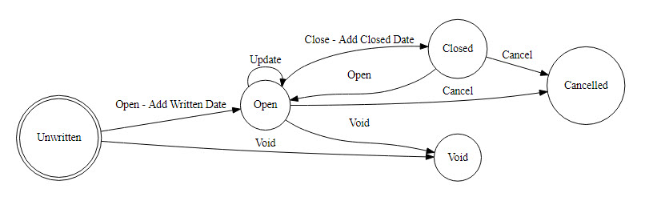

# State Design Pattern

date: "2018-01-03"
description: The State Design Pattern is used to model changes in the status or state of an object by delegating rules for such changes to individual objects representing each possible state.

---

Imagine you're managing a complex system – perhaps an insurance policy management system. This system handles everything from initial quote generation to final claim processing. As the policy moves through different phases—unwritten, open, closed, cancelled, and void—the rules governing its behavior change drastically. Simply adding `if` and `switch` statements to handle these state transitions would quickly lead to a sprawling, unmaintainable codebase. This is where the State Design Pattern shines, offering a cleaner, more manageable solution.



**Why is this important?** Failure to properly manage state transitions can lead to significant problems: incorrect data, inconsistent behavior, and ultimately, a system that doesn't meet business requirements. Imagine a scenario where a policy mistakenly gets marked as ‘closed’ during a claim processing step – this could result in a significant financial loss.

You can generate diagrams like this one from text using online tools like WebGraphViz ([https://ardalis.com/simple-flowcharts-and-state-diagrams-with-webgraphviz](https://ardalis.com/simple-flowcharts-and-state-diagrams-with-webgraphviz)). The diagram represents a _finite state machine_, a fundamental concept in computer science.

**Understanding Finite State Machines**

Within a finite state machine, each state represents a distinct condition or situation. Transitions between states are triggered by specific events or inputs. This allows you to model complex behavior in a clear and organized way. The diagram above illustrates the typical states of an insurance policy – the core concept of the State pattern.

**Key Terminology**

- **Node:** Represents a particular state within the machine (e.g., 'Open', 'Closed').
- **Edge:** Represents a transition between two states (e.g., a policy transitioning from 'Open' to 'Closed').
- **State Machine:** The overall system that manages the state transitions.

**Deep Dive: Core Concepts**

The State Design Pattern essentially encapsulates each state into its own object. This object is responsible for handling the specific actions and events associated with that state.

Let's consider a simplified view. We have a `Policy` object. This object _doesn’t_ directly handle state transitions. Instead, it holds a reference to a `State` object, which is responsible for determining what actions can be performed and executing those actions.

**UML and Sequence Diagrams**

The diagrams presented illustrate the key aspects of the pattern:

- **UML Diagram (Left):** This diagram provides a visual representation of the state machine.
- **Sequence Diagram (Right):** This diagram shows the interaction between the `Policy` object and the `State` object during a state transition.

Notice how the `Policy` object exposes a `State` property. This property is used to change the policy's state. The `State` object, in turn, delegates the action to the appropriate method based on the current state.

**C# Example (Illustrative)**

Let's explore a concrete C# implementation to solidify the concepts. This example uses an `InsurancePolicy` as the context object, with states representing stages in the policy lifecycle: 'Unwritten', 'Open', 'Closed', 'Cancelled', and 'Void'. While the provided example only demonstrates a very simplified concept, it highlights how the pattern works.

```java
public interface IPolicyState
{
    void Open(DateTime? writtenDate = null);
    void Void();
    void Update();
    void Close(DateTime closedDate);
    void Cancel();
}
```

The `Policy` class implements this interface (as do all of the individual state subtypes) and delegates all calls to its State property.

```java
public partial class Policy : IPolicyState
{
    private Policy()
    {
        _cancelledState = new CancelledState(this);
        _closedState = new ClosedState(this);
        _openState = new OpenState(this);
        _unwrittenState = new UnwrittenState(this);
        _voidState = new VoidState(this);
        State = _unwrittenState;
    }

    public Policy(string policyNumber) : this()
    {
        Number = policyNumber;
    }

    public int Id { get; set; }
    public string Number { get; set; }
    public DateTime? DateOpened { get; private set; }
    public DateTime? DateClosed { get; private set; }

    private readonly IPolicyStateCommands _cancelledState;
    private readonly IPolicyStateCommands _closedState;
    private readonly IPolicyStateCommands _openState;
    private readonly IPolicyStateCommands _unwrittenState;
    private readonly IPolicyStateCommands _voidState;
    public IPolicyStateCommands State { get; private set; }

    public void Cancel()
    {
        State.Cancel();
    }

    public void Close(DateTime closedDate)
    {
        State.Close(closedDate);
    }

    public void Open(DateTime? writtenDate = null)
    {
        State.Open(writtenDate);
    }

    public void Update()
    {
        State.Update();
    }

    public void Void()
    {
        State.Void();
    }
}
```

The `UnwrittenState` class, represents the initial state of a policy and the operations that can be performed from this state. Note the use of inner classes to encapsulate the state-specific logic. This approach keeps the `Policy` class cleaner and focused on its core responsibilities.

```java
public partial class Policy
{
    public class UnwrittenState : IPolicyStateCommands
    {
        private readonly Policy _policy;

        public UnwrittenState(Policy policy)
        {
            _policy = policy;
        }
        public void Cancel() => throw new InvalidOperationException("Cannot cancel a policy before it's been Opened.");

        public void Close(DateTime closedDate) => throw new InvalidOperationException("Cannot close a policy before it's been Opened.");

        public void Open(DateTime? writtenDate = null)
        {
            _policy.State = _policy._openState;
            _policy.DateOpened = writtenDate;
        }

        public void Update() => throw new InvalidOperationException("Cannot update a policy before it's been Opened.");

        public void Void()
        {
            _policy.State = _policy._voidState;
        }

        public List<string> ListValidOperations()
        {
            return new List<string> { "Open", "Void" };
        }

        }
    }
```

**When to Use – Strategic Considerations**

The State Design Pattern is a strong choice when:

- Your object has a complex state lifecycle with multiple, distinct states.
- The rules governing state transitions are intricate, involving numerous conditions and actions.
- You want to avoid a massive `if/switch` statement, making your code more maintainable and readable.

**Advantages: Clarity & Maintainability**

- **Reduced Conditional Complexity:** Eliminates complex `if/switch` statements.
- **Improved Maintainability:** Easier to add or modify state transitions.
- **Code Reusability:** State-specific logic is encapsulated within state objects.

**Disadvantages: Potential Overhead**

- **Increased Code Volume:** More classes and methods are required.
- **Potential for Over-Engineering:** Don't use the pattern simply because you _can_; consider the complexity versus the benefit.

In conclusion, the State Design Pattern offers a powerful solution for managing complex state transitions. However, it's crucial to carefully assess whether it’s the right tool for the job, considering the potential trade-offs between code complexity and maintainability.

```

```
