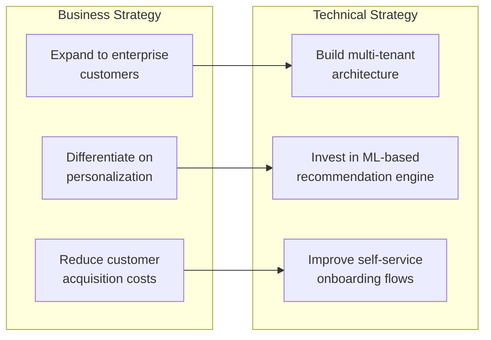
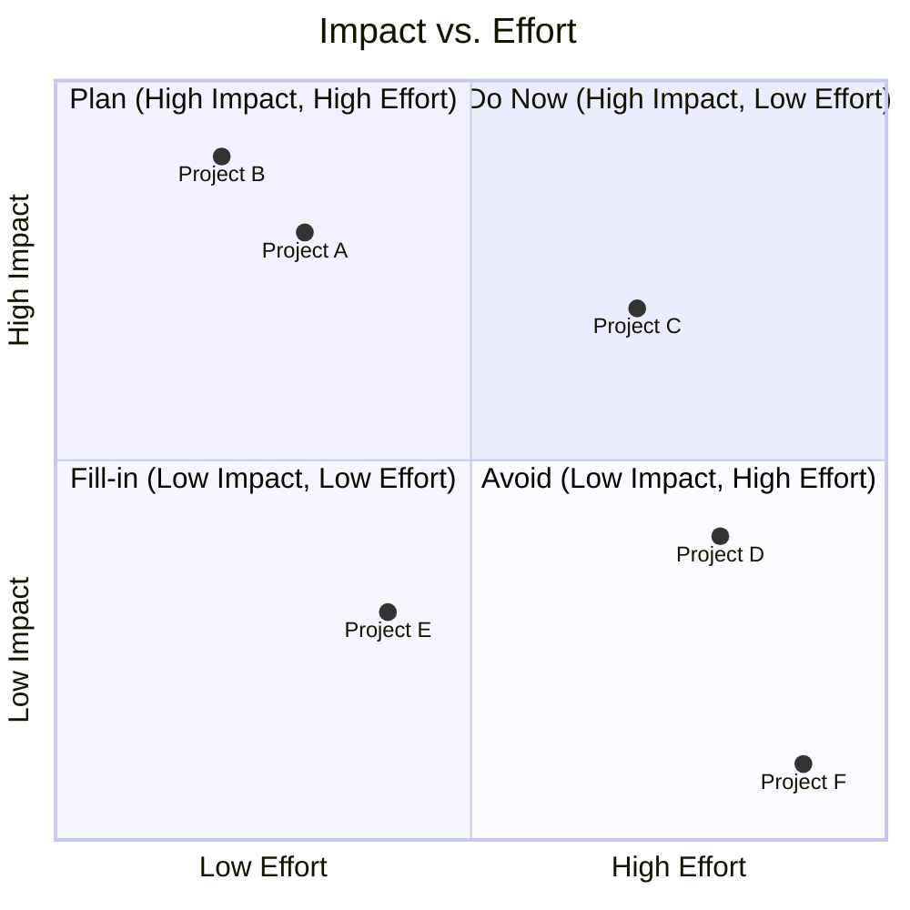
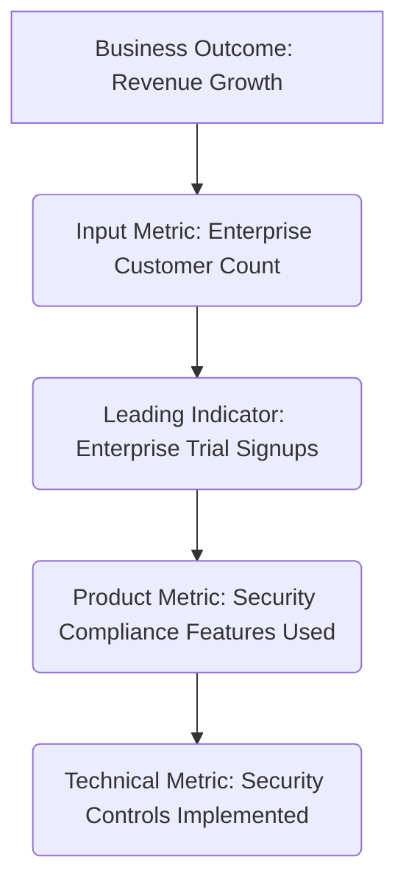

# Aligning Technology to Business Strategy: From Coder to Strategist

## The Scenario

A team of talented engineers has just shipped a technically impressive feature: they've migrated the system's search functionality to an advanced ElasticSearch cluster with sophisticated machine learning capabilities. The performance metrics are excellent, the code is clean, and the implementation was on schedule. But three months later, the business impact is negligible. The feature isn't moving any key business metrics. The VP of Product asks uncomfortable questions: "Why did we invest three months in this? How does better search relevance support our strategy of expanding into the enterprise market? What business problem were we trying to solve?"

This scenario illustrates a common disconnect between technical work and business strategy. Technical excellence without strategic alignment is a wasted opportunity. As a Staff Engineer, your role extends beyond writing great code—you must ensure that technical decisions advance the company's strategic objectives. This requires understanding the business at a deep level and becoming a translator between technical possibilities and business outcomes.

## Understanding Business Strategy

Before you can align technology to business strategy, you need to understand what business strategy actually is. At its core, business strategy answers these questions:

### 1. Where Will We Play?

What markets, customer segments, and product categories is the company targeting?

**Examples:**

- "We focus on enterprise customers in the financial services industry"
- "We're expanding from SMB to mid-market customers"
- "We're entering the European market this year"

### 2. How Will We Win?

What competitive advantages will the company leverage to succeed?

**Examples:**

- "We compete on superior user experience and design"
- "Our advantage is integrating with customers' existing workflows"
- "We provide enterprise-grade security at SMB-friendly prices"

### 3. What Capabilities Must We Have?

What organizational strengths are needed to execute the strategy?

**Examples:**

- "We need world-class reliability for enterprise customers"
- "We need rapid product iteration to outpace competitors"
- "We need deep domain expertise in healthcare regulations"

### 4. What Management Systems Are Required?

What processes and metrics will drive execution?

**Examples:**

- "We measure success by revenue growth and customer acquisition cost"
- "We prioritize features based on enterprise customer adoption"
- "We make decisions based on long-term platform health, not quarterly results"

## Finding Your Company's Strategy

Strategy often isn't presented in a neat document labeled "Our Strategy." You'll need to gather it from multiple sources:

### 1. Official Documents

- Annual company objectives or OKRs
- Investor presentations (for public companies)
- Executive all-hands presentations
- Company mission and vision statements

### 2. Signals from Leadership

- How leaders allocate resources
- What gets celebrated and rewarded
- Which metrics are highlighted in dashboards
- How trade-offs are made when conflicts arise

### 3. Market Positioning

- How the company describes itself to customers
- Which competitors the company compares itself to
- Pricing strategies and target customers
- Marketing messages and sales pitches

## The Alignment Gap

Even when strategy is clear, there are common reasons for misalignment between technology and business:

### 1. Translation Problems

The business strategy isn't translated into technical implications. Example: A strategic goal of "expand into enterprise" doesn't automatically tell engineers they need to build SSO, audit logging, and access controls.

### 2. Competing Values

Technical and business stakeholders optimize for different things. Example: Engineers value elegant architecture and clean abstractions, while business leaders value time-to-market and differentiated features.

### 3. Temporal Disconnects

Technical and business planning operate on different time horizons. Example: Engineering plans for long-term platform investments while the business focuses on quarterly revenue targets.

### 4. Different Languages

Technical and business stakeholders use different terminology. Example: Engineers discuss "service mesh" and "eventual consistency" while business leaders talk about "customer conversion" and "market penetration."

## Becoming a Strategic Translator

As a Staff Engineer, you are uniquely positioned to bridge these gaps. Here's how to develop and apply this skill:

### 1. Learn the Business Fundamentals

Develop a deep understanding of your company's business model by starting with how the company makes money, understanding the fundamental revenue streams and business model mechanics that drive organizational success. This foundation leads naturally to identifying the key costs and revenue drivers that most significantly impact financial performance and strategic decision-making. Build this knowledge with a clear picture of who the customers are and what they value, as customer insights directly influence product and technical priorities. Finally, understand who the competitors are and how your company differentiates itself, as this competitive context shapes the strategic importance of technical capabilities and architectural decisions.

### 2. Connect Technical Decisions to Business Outcomes

Transform your technical decision-making process by systematically asking four critical questions for any significant technical choice. Begin by identifying which strategic objective this decision supports, ensuring that every major technical investment directly aligns with declared business priorities. Continue by determining how you will measure its business impact, establishing concrete metrics that connect technical implementation to measurable business outcomes. Consider what business risks this decision mitigates, as risk reduction often provides substantial business value even when it's not immediately visible. Finally, explore what business opportunities this decision enables, as the most strategic technical choices create new possibilities for revenue growth, market expansion, or competitive advantage.

### 3. Use Tiered Metrics

Track the connection between technical and business outcomes:

- **Level 1: Technical metrics** (latency, throughput, uptime)
- **Level 2: Product metrics** (engagement, conversion, retention)
- **Level 3: Business metrics** (revenue, growth, profitability)

Be able to tell the story of how improvements in Level 1 drive improvements in Levels 2 and 3.

### 4. Speak Multiple Languages

Learn to translate between technical and business concepts:

- Technical: "We need to refactor our monolith into microservices"
- Translation: "We need to restructure our system to allow faster feature delivery and better reliability, which directly supports our strategy of rapid innovation and enterprise-grade reliability"

### 5. Involve Business Stakeholders Early

Don't wait until technical decisions are made to get business input:

- Include product leaders in architectural discussions
- Invite executives to technical reviews
- Share technical roadmaps with business context

## Tools for Strategic Alignment

### 1. Strategy Translation Canvas

Create a visual mapping between business strategy and technical initiatives:

### 2. Strategic Scoring Model

Evaluate technical initiatives based on strategic alignment:

| Initiative          | Growth | Retention | Efficiency | Strategic Score |
| ------------------- | ------ | --------- | ---------- | --------------- |
| Service mesh        | 1      | 3         | 4          | 8               |
| ML recommendations  | 5      | 4         | 2          | 11              |
| CI/CD improvements  | 3      | 2         | 5          | 10              |
| New mobile features | 5      | 5         | 1          | 11              |

### 3. Tech-Biz Impact Matrix

Map technical work to business impact and technical effort:

### 4. North Star Framework

Connect daily technical work to the ultimate business outcome:

## Real-World Examples of Technical-Business Alignment

### Example 1: E-commerce Platform

**Business Strategy:** Compete on superior customer experience and rapid delivery

**Technical Implications:**

- Prioritize frontend performance optimizations
- Invest in continuous delivery infrastructure
- Focus on mobile-first design
- Build robust inventory and logistics integrations

**Alignment Mechanism:** Weekly reviews of performance metrics tied directly to conversion rates and cart abandonment statistics

### Example 2: B2B SaaS Provider

**Business Strategy:** Move upmarket to serve larger enterprise clients

**Technical Implications:**

- Build multi-tenant architecture with enhanced security
- Develop granular permission systems
- Create audit logging and compliance reporting
- Support enterprise authentication standards
- Design for scale and reliability

**Alignment Mechanism:** Quarterly architectural review board with enterprise customer advisory panel

### Example 3: Consumer App

**Business Strategy:** Grow through viral user acquisition

**Technical Implications:**

- Optimize onboarding flow for speed and simplicity
- Build seamless sharing capabilities
- Create social graph infrastructure
- Design for low friction and instant gratification
- Implement analytics for growth metrics

**Alignment Mechanism:** Growth team includes engineers who measure technical changes against user acquisition metrics

## When Technical and Business Priorities Seem to Conflict

Sometimes, there appears to be a tension between technical and business needs. These situations require careful navigation:

### 1. Technical Debt vs. Feature Velocity

**The Tension:** Business wants new features quickly; engineering wants to pay down technical debt.

**The Resolution:** Quantify the business impact of technical debt in terms of slowing velocity or increasing risk. Propose a balanced approach that delivers business value while incrementally improving the technical foundation.

### 2. Quality vs. Time-to-Market

**The Tension:** Business wants to launch quickly; engineering wants comprehensive testing.

**The Resolution:** Propose a phased rollout approach that allows for both early market entry and quality assurance. Define "minimum viable quality" based on business risk tolerance and customer expectations.

### 3. Short-term Results vs. Long-term Platform Health

**The Tension:** Business is focused on quarterly targets; engineering is concerned with long-term sustainability.

**The Resolution:** Create a portfolio approach to investments with explicit allocations for both short-term optimizations and long-term platform work. Connect platform investments to future business capabilities.

## Developing Your Strategic Toolkit as a Staff Engineer

As you grow in your role, focus on developing these strategic capabilities:

### 1. Business Literacy

- Read your company's annual reports or investor presentations
- Attend sales calls and customer meetings
- Study the basics of your industry and market
- Learn key business metrics and how they're calculated

### 2. Cross-Functional Collaboration

- Build relationships with product, sales, and marketing leaders
- Participate in go-to-market planning
- Contribute to product strategy discussions
- Share technical context with business stakeholders

### 3. Strategic Communication

- Practice explaining technical concepts in business terms
- Create visualizations that connect technical work to business outcomes
- Tell compelling stories about how technology enables strategy
- Learn to build and present business cases

### 4. Long-term Thinking

- Develop multi-year technical visions aligned to business strategy
- Anticipate industry and technology trends
- Identify strategic technical differentiators
- Balance immediate needs with future capabilities

By mastering these skills, you transform from an executor of technical tasks to a shaper of technical strategy—and ultimately, a valuable contributor to business strategy itself.

## Common Pitfalls & How to Avoid Them

- **Technical Myopia:** Focusing solely on technology without considering its strategic impact. _Solution:_ Regularly conduct strategic reviews to evaluate tech decisions against business objectives.
- **Isolated Decision-Making:** Making engineering choices in a silo. _Solution:_ Foster a culture of collaboration across departments with shared tools and clear communication channels.
- **Short-Term Thinking:** Prioritizing quick fixes over long-term strategic alignment. _Solution:_ Implement a strategic roadmap that outlines long-term technology investments aligned with business goals.

## A Practical Exercise: The Strategy Alignment Relay

- **Objective:** To demonstrate the importance of aligning technology decisions with business strategies.
- **Setup:** Divide participants into small teams, assigning each a department role (e.g., engineering, marketing, sales).
- **Execution:** Give each team a business objective (e.g., “Increase Customer Retention”). The engineering team proposes a tech solution, then consults with the other departments to refine it based on their strategic insights.
- **Debrief:** Each team presents their refined proposal, articulating how it aligns with the business strategy. The group discusses the challenges and the importance of cross-functional collaboration.

## Cross-Reference Navigation

### Prerequisites for This Chapter

- **[Technical Vision](../leadership/technical-vision.md)** - Understanding how to communicate technical strategy provides foundation for business alignment
- **[Strategic Thinking](../execution/strategic-thinking.md)** - Strategic thinking frameworks are essential for technology-business alignment

### Related Concepts

- **[Product-Engineering Collaboration](product-engineering-collaboration.md)** - Close collaboration with product teams is crucial for effective technology-business alignment
- **[Engineering Metrics & Business Alignment](engineering-metrics-business-alignment.md)** - Measuring and demonstrating how engineering work drives business outcomes
- **[Business Case Development](business-case.md)** - Building compelling cases for technology investments aligned with business strategy
- **[Cost Optimization](cost-optimization.md)** - Balancing technology investments with business financial objectives

### Apply These Concepts

- **[Staff Engineer Competency Assessment](../../appendix/tools/staff-engineer-competency-assessment.md)** - Evaluate your business collaboration and strategic alignment capabilities
- **[Development Tracking System](../../appendix/tools/development-tracking-system.md)** - Track your progress in developing business-technology alignment skills

### Next Steps in Your Learning Journey

1. **[Product-Engineering Collaboration](product-engineering-collaboration.md)** - Learn specific techniques for working effectively with product teams
2. **[Pitching to Executives](pitching-to-executives.md)** - Develop skills for communicating technology strategy to business leadership
3. **[Strategic Thinking](../execution/strategic-thinking.md)** - Deepen your strategic thinking capabilities for long-term alignment

## Further Reading

- _The Lean Startup_ by Eric Ries
- _Competing on Analytics_ by Thomas H. Davenport and Jeanne G. Harris
- _Engineering Management for Startups_ by Bret Taylor
