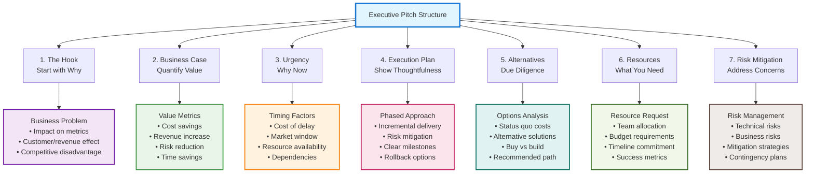

# How to Pitch Engineering Projects to Executives: Selling Your Vision

## The Scenario

A Staff Engineer has identified a critical opportunity to rearchitect a core system. The current architecture is reaching its limits, causing increasing incidents and slowing down development. A comprehensive refactoring would enable faster feature development, improved reliability, and support the next three years of growth. The engineer has a solid technical plan but needs executive approval and resources. Their first attempt at pitching the project—a 20-slide deep dive into the technical architecture—is met with blank stares and polite dismissal. "This sounds like an engineering nice-to-have. Let's focus on customer-facing features for now."

This scenario highlights a common challenge for technical leaders: translating technical necessity into business value that executives can understand and support. As a Staff Engineer, your ability to successfully pitch technical initiatives to executives can be the difference between a critical project moving forward or being indefinitely deferred. This isn't about manipulation or politics—it's about effective communication across the technical-business divide.

## Understanding Your Audience: The Executive Mindset

Executives think differently than engineers. To pitch effectively, you need to understand their perspective:

### 1. Focus on Outcomes, Not Activities

Executives focus intensively on business results, market position, and competitive advantage rather than the technical elegance, implementation details, or development journey that engineers naturally emphasize. This fundamental difference in perspective means that successful pitches must translate technical capabilities into measurable business outcomes that directly impact organizational success.

### 2. Resource Allocation Mindset

Every executive pitch occurs within a context of scarce resources and competing priorities, where executives constantly evaluate whether any given initiative represents the best use of limited time, budget, and personnel. They're simultaneously balancing multiple competing initiatives across the entire business, from product development to marketing campaigns to operational improvements. Your technical project must clearly demonstrate why it deserves resources over these other business-critical investments.

### 3. Risk Management Perspective

Executive thinking is deeply shaped by risk management concerns, particularly around business continuity, reputation damage, and missed market opportunities that could affect organizational viability. They require concrete assurance about implementation risk, detailed transition plans that minimize business disruption, and clear fallback options that protect the organization if technical initiatives encounter unexpected challenges.

### 4. Time Horizon Differences

Executives operate primarily within quarterly and fiscal year planning cycles that align with board reporting, investor communications, and business performance evaluation, while engineers naturally think in terms of sprints and technical milestones that reflect development velocity and implementation progress. Successful technical pitches bridge this temporal gap by demonstrating both short-term wins that provide immediate business value and long-term strategic alignment that supports multi-year organizational objectives.

### 5. Vocabulary Differences

The communication challenge extends beyond concepts to language itself, where executives speak fluently in terms of ROI, market share, customer acquisition, and competitive advantage that directly relate to business performance, while engineers communicate through concepts like refactoring, technical debt, architecture, and scalability that describe system capabilities. Your role as a Staff Engineer requires becoming bilingual, translating between these vocabularies so that technical necessity becomes comprehensible business opportunity.

## The Anatomy of a Compelling Executive Pitch

A successful executive pitch follows a proven structure that aligns technical necessity with business value. This framework transforms complex technical projects into compelling business investments:

### 1. The Hook: Start with Why

Begin with a clear, compelling business reason for the project that aligns with executive priorities.

**Weak:** "Our monolith has become unwieldy and needs to be broken into microservices."

**Strong:** "Our ability to deliver new features is declining by 20% each quarter due to our current architecture. This project will restore our delivery velocity, enabling us to meet our commitment of releasing the enterprise features that represent a $2M revenue opportunity this fiscal year."

### 2. The Business Case: Quantify the Value

Express the value in terms executives care about, with clear metrics whenever possible.

**Weak:** "This will reduce technical debt."

**Strong:** "This initiative will deliver:

- 40% reduction in production incidents (improving our enterprise SLA compliance)
- 50% faster feature development (enabling 4 additional major features this year)
- 30% reduction in infrastructure costs ($400K annual savings)
- Ability to scale to 10x our current user base (supporting our expansion goals)"

### 3. The Urgency: Why Now

Explain why this needs to happen now rather than later.

**Weak:** "We should do this sometime this year."

**Strong:** "Every month we delay costs us:

- $50K in preventable incidents
- $30K in excess infrastructure costs
- One engineering week per feature in additional development time
- Additionally, starting now allows us to complete the transition before our peak season in Q4, minimizing business risk."

### 4. The Plan: Show Thoughtful Execution

Demonstrate that you've thought through the implementation carefully, focusing on risk mitigation and incremental delivery.

**Weak:** "We'll need 6 months to rebuild the system."

**Strong:** "We've designed a phased approach with clear milestones:

- Phase 1 (4 weeks): Extract authentication services with zero customer impact
- Phase 2 (6 weeks): Migrate payment processing with canary testing to ensure reliability
- Phase 3 (8 weeks): Refactor core workflow with parallel systems to enable safe rollback
- Each phase delivers standalone business value and can be evaluated before proceeding."

### 5. The Alternatives: Show Due Diligence

Acknowledge alternatives you've considered, demonstrating that your recommendation is the result of careful analysis.

**Weak:** [No mention of alternatives]

**Strong:** "We evaluated three approaches:

1. **Minimal patch (rejected):** Quick but fails to address root causes and limits future growth
2. **Partial refactor (recommended):** Balanced approach with incremental benefits and manageable risk
3. **Complete rewrite (rejected):** Most comprehensive but highest risk and longest time to value"

### 6. The Ask: Be Specific

Close with a clear, specific request.

**Weak:** "We need support for this project."

**Strong:** "To move forward, we need:

1. Two engineers dedicated to this initiative for 4 months
2. Executive sponsorship from you in the prioritization process
3. Agreement on the success metrics we'll use to evaluate progress
4. Decision by November 15th to meet our Q1 delivery timeline"

## Presentation Strategies for Technical Leaders

### 1. The Executive Summary Approach

Executives are busy and may have limited time. Structure your pitch to accommodate this:

- **First 2 minutes:** Core business case that stands alone
- **Next 5 minutes:** Implementation strategy and risk mitigation
- **Final portion:** Supporting details and technical validation

This ensures that even if your time is cut short, your core message lands.

### 2. The Narrative Structure

Humans respond to stories. Structure your pitch as a narrative:

- **Setting:** The current business context and challenge
- **Conflict:** The growing pain points and risks of inaction
- **Resolution:** How your proposed solution transforms the situation
- **Future:** The new capabilities and opportunities that will result

### 3. The Visualization Strategy

Reduce cognitive load with visual representations:

- **Before/After Diagrams:** Show the current vs. future state
- **Impact Graphs:** Visualize trends with and without the project
- **Simple Architecture Diagrams:** Use business-friendly visualizations
- **Timeline:** Show phased implementation with business milestones

### 4. The Objection Anticipation Technique

Preemptively address likely concerns:

- "You might be wondering about the risk of disruption..."
- "A question you may have is how this affects our Q2 commitments..."
- "Let me address the resource allocation concern directly..."

## Tailoring Your Pitch to Different Executive Roles

### For the CEO

- **Focus on:** Market position, competitive advantage, company vision
- **Connect to:** Revenue growth, market share, strategic differentiation
- **Example:** "This architecture enables the flexibility we need to outpace Competitor X's feature release cadence, who's currently launching new capabilities 2x faster than us."

### For the CFO

- **Focus on:** Financial implications, resource efficiency
- **Connect to:** Cost savings, ROI, resource optimization
- **Example:** "The $400K investment will yield $1.2M in combined cost savings and incremental revenue within 18 months, representing a 3x ROI."

### For the CTO/CIO

- **Focus on:** Technical strategy, platform capabilities
- **Connect to:** Technology roadmap, technical risk, future flexibility
- **Example:** "This foundation supports all five key initiatives in our 2023 technology roadmap, particularly the API marketplace strategy."

### For the CPO (Chief Product Officer)

- **Focus on:** Product capabilities, customer experience
- **Connect to:** Feature velocity, customer satisfaction, competitive features
- **Example:** "This will enable the personalization engine the product team has prioritized for Q3, which our top 5 enterprise customers have requested."

## Handling Tough Questions and Pushback

### 1. The "Why Can't We Just Patch It?" Question

**Response Strategy:** Explain the economics of technical debt and declining returns on patches.

**Example:** "We've been patching for 18 months. Each patch now takes 3x longer to implement and lasts half as long before new issues emerge. We've reached the point where patching actually costs more than fixing the root cause."

### 2. The "Can't We Do This While Building Features?" Question

**Response Strategy:** Be honest about capacity and quality trade-offs.

**Example:** "We've analyzed this approach carefully. Doing both simultaneously would extend the project from 4 months to 9 months, increase the risk of production issues by 40%, and reduce feature quality. A focused effort actually delivers both objectives faster."

### 3. The "What's the Minimum We Can Do?" Question

**Response Strategy:** Have a pre-planned minimal viable option.

**Example:** "If resources are constrained, we can implement Phase 1 only, which addresses 60% of the incidents for 30% of the total cost. However, this would only be a 6-month solution before we need to address Phases 2 and 3."

### 4. The "How Do We Know This Will Work?" Question

**Response Strategy:** Provide evidence and de-risking strategies.

**Example:** "We've validated this approach with a proof-of-concept for the most critical component. Additionally, our phased approach allows us to verify success at each stage before continuing, and we've designed rollback capabilities for every change."

## Building Executive Relationships Beyond the Pitch

A successful pitch rarely happens in isolation. Build relationships with executives before you need their support:

### 1. Create Visibility Into Technical Challenges

- Share periodic updates on system health and technical metrics
- Translate technical monitoring into business impact
- Educate on emerging technical trends relevant to the business

### 2. Demonstrate Business Acumen

- Participate in strategic planning sessions
- Connect your technical work to business outcomes
- Show interest in business metrics and challenges

### 3. Build Trust Through Small Wins

- Deliver consistently on smaller commitments
- Provide transparent status updates, especially about challenges
- Demonstrate good judgment in technical decisions

### 4. Establish Yourself as a Strategic Partner

- Bring business-relevant insights from the technical domain
- Propose solutions to business problems, not just technical ones
- Think beyond your immediate team to company-wide impact

## Learning From Pitch Outcomes

Whether your pitch succeeds or fails, there are valuable lessons:

### If Your Pitch Is Approved

- Document the promised outcomes and timeline
- Establish regular check-ins with executive sponsors
- Create a communication plan for progress and challenges
- Deliver early wins to build confidence

### If Your Pitch Is Rejected

- Seek to understand the specific concerns
- Ask what would make the proposal more compelling
- Consider if a smaller scope might be more approachable
- Plan how to gather data that would strengthen your case

Remember that executive pitches are often iterative. A "no" today can become a "yes" tomorrow with the right approach, timing, and evidence. By mastering the art of pitching to executives, you transform from a technical implementer to a business leader capable of driving strategic technical direction.

## Common Pitfalls to Avoid

- **Over-Technical Explanations:** Instead of describing the architecture, describe what the architecture _enables_ for the business.
- **Ignoring Business Impact:** Don't just state the technical improvement; state the resulting business outcome (e.g., cost savings, revenue unlocked, risk reduced).
- **Lack of Executive Sponsorship:** Engage with a potential executive sponsor _before_ the pitch to build alignment and get feedback.

---

## Prerequisites and Related Learning

### **Prerequisites for This Chapter**

- **[Strategic Thinking](../thinking/strategic-thinking.md)** - Strategic frameworks help you connect technical projects to business value and competitive advantage
- **[Influencing Without Authority](../leadership/influencing-without-authority.md)** - Tactical empathy and persuasion principles are essential for executive communication
- **[Building Business Cases](business-case.md)** - Quantitative business case development provides the foundation for executive-level proposals

### **Related Concepts**

- **[Revenue vs Risk Decision-Making](revenue-vs-risk.md)** - Apply executive thinking to business-technical tradeoffs and investment decisions
- **[Aligning Technology to Business Strategy](aligning-technology.md)** - Position technical projects within broader strategic business initiatives
- **[Technical Vision](../leadership/technical-vision.md)** - Translate technical vision into compelling business value propositions
- **[Presentation & Persuasion Skills](../leadership/presentation-persuasion-skills.md)** - Apply advanced presentation techniques to executive communication
- **[Working Across Boundaries](../leadership/working-across-boundaries.md)** - Navigate organizational dynamics when proposing cross-functional technical initiatives

### **Apply Executive Communication**

- **[Staff Engineer Competency Assessment](../../appendix/tools/staff-engineer-competency-assessment.md)** - Evaluate your business partnership and executive communication capabilities
- **[Engineering Metrics & Business Alignment](engineering-metrics-business-alignment.md)** - Use business-focused metrics to strengthen your executive presentations

### **Next Steps in Your Learning Journey**

1. **[Aligning Technology to Business Strategy](aligning-technology.md)** - Deepen your ability to position technical work within strategic business context
2. **[Product-Engineering Collaboration](product-engineering-collaboration.md)** - Build partnerships that strengthen your business case development and stakeholder support
3. **[Cost Optimization & FinOps](cost-optimization.md)** - Add financial optimization expertise to your executive communication toolkit
4. **[Engineering Ethics](../ethics/index.md)** - Navigate ethical considerations when balancing technical recommendations with business pressures

### **Learning Path Recommendations**

**For Technical Individual Contributors**: Start with **Business Case Development** and **Strategic Thinking** before attempting complex executive communication scenarios.

**For Team Leads**: Focus on **Revenue vs Risk Frameworks** and **Cross-Functional Collaboration** to build credibility for larger organizational proposals.

**For Business-Focused Staff Engineers**: Master **Executive Stakeholder Management** and **Strategic Technology Communication** to become effective technical partners to senior leadership.

---

## Further Reading

- _The Lean Startup_ by Eric Ries
- _Presentation Zen_ by Garr Reynolds
- _Made to Stick_ by Chip Heath & Dan Heath
