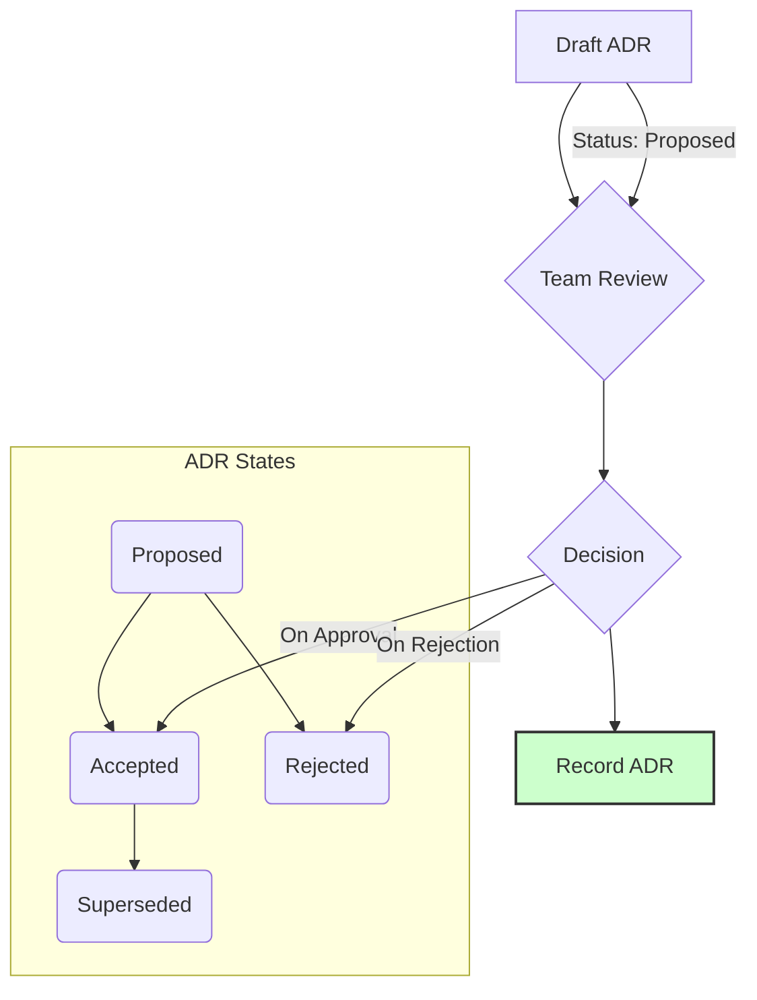

# Architecture Decision Records: Writing Down the "Why"

## The Scenario

A team has been working on a microservice architecture for two years. The original architects have moved on, and new team members have different opinions about how things should be structured. During a technical discussion, someone asks, "Why are we using MongoDB for this service when most of our other services use PostgreSQL?" No one knows the answer. The team falls into endless debates about database choices, service boundaries, and communication patterns. Without understanding the original context and constraints, they risk making inconsistent decisions or undoing past work that solved important problems.

This scenario illustrates the need for Architecture Decision Records (ADRs). ADRs document the context, constraints, and reasoning behind significant technical decisions. They aren't just documentation—they're a tool for thoughtful decision-making and knowledge preservation. As a Staff Engineer, establishing and maintaining ADRs is one of the most valuable practices you can introduce to your team.

## What Is an Architecture Decision Record?

An ADR is a short document that captures:

- A significant architectural decision
- The context in which it was made
- The consequences of the decision
- The alternatives that were considered

ADRs are:

- **Lightweight:** Short enough to actually be written and read
- **Immutable:** Once written, they aren't changed (but can be superseded)
- **Collective:** Maintained as a set that evolves over time
- **Practical:** Focused on real decisions, not theoretical ideals

## Why ADRs Matter

### 1. Knowledge Preservation

- **Onboard new team members faster:** Provide context beyond "what" to include "why"
- **Prevent knowledge loss:** Reduce dependency on tribal knowledge
- **Maintain architectural integrity:** Ensure consistent decision-making over time

### 2. Better Decision-Making

- **Force clarity of thought:** The act of writing exposes fuzzy thinking
- **Encourage thorough analysis:** Consider alternatives systematically
- **Build consensus:** Provide a structure for team alignment

### 3. Reduced Re-litigation

- **Prevent decision oscillation:** Avoid revisiting the same questions repeatedly
- **Focus energy on new decisions:** Know which battles have already been fought
- **Make deliberate changes:** When revisiting decisions, understand what's changed since the original

## The ADR Template

A good ADR should be concise (typically 1-2 pages) and follow a consistent structure. Here's a proven template:

```markdown
# ADR-0001: Use PostgreSQL for User Management Service

## Status

Accepted (2023-05-15)

## Context

The User Management Service needs a database to store user profiles, credentials,
and permission information. We anticipate eventually storing millions of user
records with complex permission relationships. We need ACID transactions for
critical operations like user creation and permission changes.

## Decision

We will use PostgreSQL as the primary database for the User Management Service.

## Consequences

### Positive

- Strong transactional guarantees for critical user operations
- Rich query capabilities for complex permission queries
- Team has extensive PostgreSQL experience
- Consistent with our other services that manage structured data

### Negative

- Higher operational complexity than simpler databases
- Requires more careful schema design up-front

## Alternatives Considered

### MongoDB

- Pro: Flexible schema for evolving user attributes
- Pro: Simpler horizontal scaling
- Con: Weaker transaction support
- Con: Less suitable for relational data like permissions

### DynamoDB

- Pro: Fully managed with minimal operational overhead
- Pro: Excellent scaling characteristics
- Con: Limited query patterns
- Con: Team has limited experience
```

## Implementing ADRs in Your Team

### 1. Start Small and Focused

Begin with a manageable scope:

- **Document recent decisions first:** They're fresh in memory
- **Focus on consequential decisions:** Not every technical choice needs an ADR
- **Build momentum with quick wins:** Short, valuable ADRs encourage adoption

### 2. Establish the Process

Create a clear workflow for ADRs:



- **Draft:** Author proposes the ADR
- **Review:** Team discusses and provides feedback
- **Decide:** Final decision is made (by consensus or designated decision-maker)
- **Record:** ADR is finalized and added to the repository

### 3. Make ADRs Discoverable

Ensure ADRs are easy to find and reference:

- **Store with code:** Keep ADRs in the repository they apply to
- **Use consistent numbering:** `ADR-NNNN` with sequential numbers
- **Maintain an index:** List all ADRs with brief descriptions
- **Link to ADRs:** Reference them in code, PRs, and discussions

### 4. Define the Scope of Architecture Decisions

Be clear about what warrants an ADR:

- **Structural choices:** Service boundaries, communication patterns
- **Technology selections:** Frameworks, databases, languages
- **Cross-cutting concerns:** Authentication, logging, monitoring
- **Standards and patterns:** Coding conventions, design patterns

## ADR Best Practices

### 1. Focus on Significant Decisions

Not every technical choice needs an ADR. Focus on decisions that:

- Have long-term implications
- Affect multiple components or teams
- Would be expensive to change later
- Represent meaningful trade-offs

### 2. Capture Context, Not Just Conclusions

The "why" is more important than the "what":

- **Record constraints:** Business requirements, deadlines, team expertise
- **Note assumptions:** Expected scale, performance needs, security requirements
- **Acknowledge timing:** "In Q1 2023, with our current scale, this was the right choice"

### 3. Be Honest About Trade-offs

Good ADRs acknowledge the downsides of the chosen approach:

- **Document known limitations:** What won't work well with this decision?
- **Identify risks:** What could go wrong?
- **Specify mitigations:** How will you address the downsides?

### 4. Keep ADRs Evergreen

ADRs should evolve with your system:

- **Use status markers:** Proposed, Accepted, Deprecated, Superseded
- **Create new ADRs:** Don't modify old ones; create new ones that reference them
- **Review periodically:** Are past decisions still valid?

## Real-World ADR Patterns

### 1. The Superseding ADR

When circumstances change, create a new ADR that references the old one:

```markdown
# ADR-0025: Switch from MongoDB to PostgreSQL for Analytics Service

## Status

Accepted (2023-10-12)

## Context

In ADR-0008, we chose MongoDB for the Analytics Service due to its schema
flexibility and our uncertain reporting requirements. Since then:

1. Our reporting needs have stabilized with clear schema requirements
2. We've experienced performance issues with complex aggregation queries
3. We now need to join analytics data with relational data from other services

## Decision

We will migrate the Analytics Service from MongoDB to PostgreSQL.

## Consequences

...
```

### 2. The Experimental ADR

For uncertain decisions, specify evaluation criteria and timeframes:

```markdown
# ADR-0017: Trial GraphQL for Mobile API (Experimental)

## Status

Accepted (2023-08-01), to be evaluated after 3 months

## Context

Our mobile apps need to fetch data from multiple backend services. The current
REST APIs require multiple roundtrips and often return more data than needed.

## Decision

We will implement a GraphQL API for our mobile clients on an experimental basis.

## Evaluation Criteria

After 3 months, we will evaluate:

1. Developer productivity (measured by feature delivery time)
2. Network efficiency (measured by payload size and request count)
3. Server performance (measured by CPU and memory usage)
4. Learning curve (qualitative assessment from mobile and backend teams)

If successful by these metrics, we will expand GraphQL to other client APIs.
```

### 3. The Decision Framework ADR

Some ADRs establish patterns for future decisions:

```markdown
# ADR-0032: Service Ownership Model

## Status

Accepted (2023-11-05)

## Context

As we scale from 5 to 20+ services, we need a consistent model for service
ownership to ensure accountability and quality.

## Decision

We will adopt a "you build it, you run it" ownership model where:

1. Each service has a designated owner team
2. The owner team is responsible for:
   - Development
   - Testing
   - Deployment
   - Monitoring
   - Incident response
3. Changes from non-owners require owner approval

## Consequences

...
```

## The Staff Engineer's Role in ADRs

As a Staff Engineer, you have unique responsibilities around ADRs:

### 1. Architect the ADR Process

- Design an ADR template that works for your team
- Establish criteria for what decisions need ADRs
- Create tooling to make ADRs accessible (e.g., index generator, search)

### 2. Model Good ADR Writing

- Write clear, thoughtful ADRs for your own decisions
- Provide feedback on others' ADRs
- Help team members articulate their technical reasoning

### 3. Champion the Practice

- Advocate for ADRs in planning and design discussions
- Reference ADRs in technical discussions
- Recognize and celebrate good ADRs

### 4. Maintain the Decision History

- Periodically review older ADRs for continued relevance
- Update the status of superseded decisions
- Ensure the collection of ADRs tells a coherent story of the system's evolution

By establishing ADRs as a regular practice, you create a living history of your architecture that builds institutional memory, promotes thoughtful decision-making, and allows your team to move forward with confidence rather than constantly revisiting the past.

## Common Pitfalls & How to Avoid Them

- **Overly Technical Language:** Avoid jargon and focus on business-level explanations. ADRs should be accessible to all stakeholders.
- **Insufficient Detail:** Don't just state the decision; describe the context, constraints, and trade-offs.
- **Ignoring Updates:** ADRs evolve with the system. Regularly review and update them to reflect new information and changing priorities.
- **Treating ADRs as a Burden:** Encourage the team to view ADRs as a valuable tool that promotes collaboration and reduces risk, not as a bureaucratic hurdle.

## A Practical Exercise: The "Design Dilemma"

- **Objective:** To demonstrate the value of structured decision-making through a collaborative design exercise.
- **Process:** Divide participants into small groups. Task each group with designing a simple online store. As a group, they must create an ADR for the most critical architectural decision (e.g., database choice).
- **Debrief:** Discuss the value of documenting decisions, the benefits of collaborative decision-making, and the potential pitfalls of making assumptions.

## Prerequisites

- **[Decision-Making Frameworks](../execution/decision-making-frameworks.md)** - Understanding systematic decision-making approaches supports effective ADR creation

## Related Technical Concepts

- **[Technical Architecture](technical-architecture.md)** - ADRs document architectural decisions and trade-offs in system design
- **[Strategic Thinking](../thinking/strategic-thinking.md)** - ADRs bridge technical decisions with strategic technical direction

## Further Reading

- _Designing Data-Intensive Applications_ by Martin Kleppmann
- _The Staff Engineer's Path_ by Tanya Reilly
