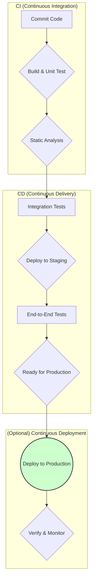

# Continuous Integration & Continuous Delivery: The Engine of Velocity

## The Scenario

A team is struggling with deployments. They happen once every two weeks after a stressful "integration week" where multiple engineers' changes are combined, tested, and fixed. Deployments frequently fail, requiring rollbacks. When they do succeed, they often introduce bugs that weren't caught in testing. The process is so painful that engineers avoid making risky changes, slowing innovation.

This team is missing one of the most powerful enablers of modern software development: a robust CI/CD pipeline. Continuous Integration and Continuous Delivery fundamentally change how software is built, tested, and released. As a Staff Engineer, establishing effective CI/CD practices is one of the highest-leverage investments you can make in your team's productivity and product quality.

## The CI/CD Continuum

CI/CD is not a single practice but a continuum of automation and process improvements:

### Continuous Integration

The practice of frequently merging code changes into a shared mainline (e.g., the main branch), with automated verification of each change:

* **Core Practices:**
  * Developers merge changes at least daily
  * Each merge triggers automated builds and tests
  * Failed builds are fixed immediately as the top priority
  * The main branch is always in a deployable state

### Continuous Delivery

The extension of CI to ensure software can be released to production at any time:

* **Core Practices:**
  * All changes automatically progress through a deployment pipeline
  * Testing includes integration, system, and acceptance tests
  * Deployment to production is a business decision, not a technical hurdle
  * Release processes are fully automated

### Continuous Deployment

The final evolution, where every change that passes all tests is automatically deployed to production:

* **Core Practices:**
  * Zero manual intervention in the deployment process
  * Production verification and monitoring of deployments
  * Ability to detect and rapidly roll back problematic changes
  * Feature flags to control feature activation separately from deployment

Most organizations operate somewhere on this continuum, with different parts of their systems at different levels of automation and process maturity.

## The Benefits of Effective CI/CD

### 1. Reduced Risk Through Smaller Changes

* **Without CI/CD:** Large, infrequent deployments with many changes and high risk
* **With CI/CD:** Small, frequent deployments with fewer changes and lower risk per deployment
* **Impact:** Easier to identify and fix issues, less stressful releases

### 2. Faster Feedback Loops

* **Without CI/CD:** Developers wait days or weeks to learn if their changes work in production
* **With CI/CD:** Feedback in minutes or hours
* **Impact:** Quicker learning, less context switching, more innovation

### 3. Higher Quality Through Automated Validation

* **Without CI/CD:** Manual testing can't cover all scenarios consistently
* **With CI/CD:** Comprehensive automated testing provides consistent validation
* **Impact:** Fewer bugs reach production, more confidence in changes

### 4. Increased Developer Productivity

* **Without CI/CD:** Engineers spend time on manual integration, testing, and deployment
* **With CI/CD:** These tasks are automated, freeing engineers for creative work
* **Impact:** More time for feature development and innovation

## Designing an Effective CI/CD Pipeline

A well-designed pipeline balances thoroughness with speed. It should provide maximum confidence with minimum wait time.

### 1. The Build Stage

* **Purpose:** Verify that the code compiles and basic sanity checks pass
* **Key Components:**
  * Dependency resolution and vulnerability scanning
  * Compilation and static code analysis
  * Unit tests with high code coverage
* **Optimization Goal:** Under 10 minutes (ideally under 5)

### 2. The Test Stage

* **Purpose:** Verify functionality, performance, and security
* **Key Components:**
  * Integration tests (services working together)
  * End-to-end tests (complete user workflows)
  * Performance tests (under expected load)
  * Security scans (SAST, DAST, dependency scanning)
* **Optimization Goal:** Under 30 minutes

### 3. The Deploy Stage

* **Purpose:** Deploy to environments in a consistent, repeatable way
* **Key Components:**
  * Infrastructure as Code for environment consistency
  * Automated deployment to test/staging environments
  * Smoke tests after deployment
  * Approval gates for production (in Continuous Delivery)
* **Optimization Goal:** Under 15 minutes per environment

### 4. The Verification Stage

* **Purpose:** Verify the deployment's health in production
* **Key Components:**
  * Canary deployments or blue/green switching
  * Automated rollback triggers on error conditions
  * Monitoring of key business and technical metrics
  * Progressive feature flag enablement
* **Optimization Goal:** Rapid detection of issues (under 5 minutes)

## Common Patterns for CI/CD Success

### 1. Trunk-Based Development

* Keep branches short-lived (less than a day when possible)
* Merge to main frequently rather than maintaining long feature branches
* Use feature flags to hide incomplete work in production

### 2. Test Pyramid Strategy

* Many unit tests (fast, focused, stable)
* Fewer integration tests (slower, broader coverage)
* Few end-to-end tests (slowest, most comprehensive)

### 3. Infrastructure as Code

* All environments defined in code (no manual configuration)
* Production-like environments for testing
* Ephemeral environments for feature branches

### 4. Observability-Driven Deployments

* Define key metrics that indicate deployment health
* Automate deployment verification based on these metrics
* Implement gradual rollouts with automated rollbacks

## The Staff Engineer's Guide to CI/CD Transformation

### 1. Assess Your Current State

* **Deployment Frequency:** How often do you deploy to production?
* **Lead Time for Changes:** How long from code committed to code deployed?
* **Mean Time to Recover:** How long to recover from failures?
* **Change Failure Rate:** What percentage of deployments cause incidents?

These four DORA metrics provide a baseline for improvement.

### 2. Target High-Value Improvements

* **If deployments are risky:** Focus on automated testing
* **If integration is painful:** Improve CI practices and branch strategies
* **If deployments are manual:** Automate the deployment process
* **If recovery is slow:** Implement better monitoring and rollback mechanisms

### 3. Build Support Through Small Wins

* Start with the most painful part of the process
* Demonstrate value quickly with measurable improvements
* Use successful projects to build momentum

### 4. Invest in the Right Tooling

* Choose tools that integrate well with your existing stack
* Prioritize developer experience and feedback speed
* Consider managed services for non-core infrastructure

### 5. Address Cultural Factors

* CI/CD requires changes in behavior and mindset
* Foster a blameless culture for deployment failures
* Recognize and reward improvements in process and automation

## The Future of CI/CD: Where It's Heading

As you build your CI/CD capabilities, keep an eye on emerging trends:

* **GitOps:** Git as the single source of truth for both code and infrastructure
* **Progressive Delivery:** More sophisticated deployment strategies beyond canary releases
* **Pipeline as Code:** Defining CI/CD pipelines in code alongside applications
* **AI-Assisted Testing:** Using AI to generate tests and identify high-risk areas
* **Developer Experience Platforms:** Internal platforms that abstract away CI/CD complexity

By investing in robust CI/CD practices, you don't just improve your team's efficiency—you fundamentally change how software is built. You enable a culture of experimentation, quality, and rapid feedback that is the hallmark of high-performing software organizations.
