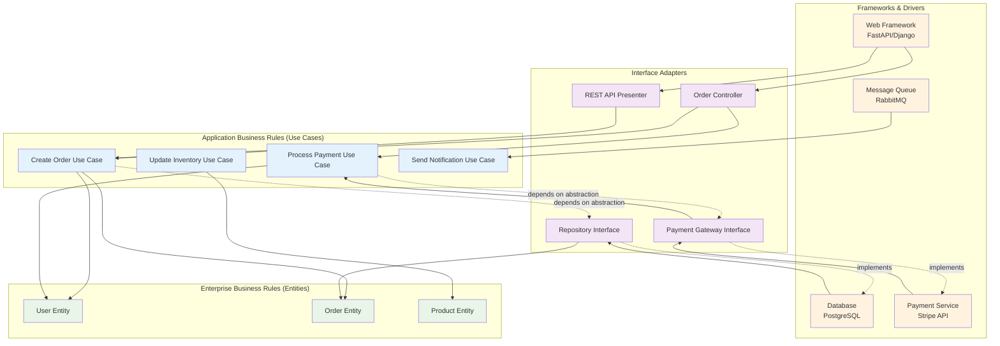

# Clean Architecture: Building Systems That Stand the Test of Time

> *"The goal of software architecture is to minimize the human resources required to build and maintain the required system."* - Robert C. Martin

Imagine walking into a codebase that's been evolving for five years. The original team has moved on, requirements have shifted dramatically, and you need to add a major new feature. In one scenario, you spend weeks just understanding how everything connects, fear making changes because they might break something unexpected, and end up building workarounds on top of workarounds. In another scenario, the architecture is so clear that you understand the system in hours, can make changes confidently, and add features by extending well-defined patterns.

**The difference? Clean Architecture combined with software craftsmanship.**

Robert C. Martin's architectural philosophy extends far beyond organizing code layers—it's a comprehensive approach to professional software development that encompasses clean code practices, agile values, and architectural thinking. When we talk about Clean Architecture, we're really talking about a unified philosophy that treats software development as a discipline requiring both technical skill and professional responsibility.

Think about the best codebase you've ever worked with. Was it just well-organized architecturally? Probably not. The code itself was likely expressive and clear. The development practices probably felt smooth and predictable. The team probably collaborated effectively and delivered value consistently. That's because great software isn't just about good architecture—it's about integrating architectural thinking with craftsmanship at every level, from individual functions to system-wide design.

As a Staff Engineer, you're not just an architecture designer—you're a craftsperson responsible for the entire software development ecosystem. Your role is to understand how clean code practices, agile principles, and architectural patterns work together to create environments where teams can build valuable software reliably and sustainably. This means thinking beyond just system design to consider how coding practices, team dynamics, and architectural decisions all reinforce each other.

## The Professional Foundation: Why Craftsmanship Matters

Before diving into architectural patterns, let's establish something crucial: architecture doesn't matter if the code implementing it is a mess. You can design the most elegant layered system in the world, but if functions are poorly named, classes are tightly coupled, and tests are fragmented or missing, your beautiful architecture becomes a liability rather than an asset.

Here's what I've learned from watching teams struggle with "clean architecture" implementations: the teams that succeed don't just understand dependency inversion—they also write functions that do one thing well, choose meaningful names, and structure their code so it reads like well-written prose. The teams that struggle get caught up in architectural patterns while their actual code remains difficult to understand and modify.

**Clean Architecture is most powerful when it's built on a foundation of clean code practices.** Think of it as a hierarchy of craftsmanship: clean functions enable clean classes, clean classes enable clean components, and clean components enable clean architecture. Each level reinforces and amplifies the benefits of the others.

This integration is especially important for staff engineers because you're often responsible for both setting architectural direction and ensuring teams have the practices to implement that architecture successfully. You can't just design the system—you need to foster the culture and skills that make excellent implementation possible.

## The Craftsmanship Foundation: Clean Code at Scale

Let's start with something practical that affects every line of code your team writes. Clean Architecture works best when it's built on solid craftsmanship fundamentals—the kind of practices that make code a joy to work with rather than a frustrating puzzle to decode.

**Meaningful Names That Tell Stories**

When you're working within clean architectural boundaries, your naming becomes even more important because it helps people understand not just what something does, but which architectural layer it belongs to and how it fits into the larger system design. Consider these two approaches to naming a service class:

Instead of `DataManager` or `UserHandler`, you might name it `UserRegistrationUseCase`. That name immediately tells you it's an application layer component (use case) that handles a specific business operation (user registration). When someone sees this class name, they know exactly where it fits in the architecture and what its responsibilities should be.

The same principle applies throughout your architecture. Repository implementations might be named `PostgreSQLUserRepository` rather than just `UserRepository`, making it clear this is an adapter layer component with a specific infrastructure concern. Domain entities might use business language directly: `SubscriptionRenewal` rather than `SubscriptionService`.

**Functions That Do One Thing Well**

Clean Architecture's layer separation becomes much more effective when individual functions within each layer are focused and clear. A use case method that tries to validate input, execute business logic, handle errors, and format output all in one function creates the same kind of coupling problems that Clean Architecture is trying to solve at the system level.

Think of function design as micro-architecture. Just as architectural layers have single responsibilities, functions should have single purposes. When you see a method named `processUserData`, you're looking at a function that probably violates both clean code and clean architecture principles. A better approach might separate this into `validateUserInput`, `executeUserRegistration`, and `formatRegistrationResponse` methods, each clearly focused on its specific responsibility within the architectural layer.

**Tests as Architectural Documentation**

Here's something many teams miss: in a Clean Architecture system, your tests should reflect your architectural boundaries. Unit tests for domain entities should never need to mock databases or web frameworks. Integration tests should clearly demonstrate how layers collaborate. This isn't just good testing practice—it's architectural validation.

When tests are hard to write, it usually means your architecture has coupling problems. When tests are confusing to read, it often means your naming and design aren't as clear as they could be. Clean code practices and clean architecture practices validate each other through the feedback loop of test-driven development.

## The Fundamental Insight: Dependency Direction Matters

Here's a question that reveals everything about your architecture: *When you need to change your database from PostgreSQL to MongoDB, how many files do you need to modify?*

If the answer is "dozens" or "I have no idea," you're experiencing what happens when dependencies point in the wrong direction. Your business logic—the core of what your application actually does—has become entangled with technical implementation details. Every database query, every web framework call, every external API integration creates another thread in a web of dependencies that makes change expensive and risky.

**Clean Architecture flips this relationship on its head.** Instead of your business logic depending on technical infrastructure, the infrastructure depends on and serves your business logic. It's like the difference between a house built around its plumbing versus a house where the plumbing can be updated without tearing down walls.

The rule is elegantly simple: **dependencies should only point inward toward the business rules.** Your business logic should never import anything from the outer technical layers. This isn't just a nice principle—it's a practical strategy that pays compound dividends as your system evolves.


**The key insight**: Your business logic (Entities and Use Cases) should never import anything from the outer layers. The web framework might change from Express to FastAPI, the database might evolve from PostgreSQL to MongoDB, but your core business logic remains stable and unaffected.

## The Four Layers of Clean Architecture

Understanding each layer's purpose and boundaries is crucial for applying Clean Architecture effectively:

### Entities: The Heart of Your Business

**In plain English**: These are the objects and rules that would exist even if you weren't building software.

Let's do a thought experiment. Imagine you're building e-commerce software, but suddenly all computers disappear. Your business would still exist, right? You'd still have products to sell, customers who want to buy them, and orders to fulfill. You might go back to paper catalogs and handwritten orders, but the fundamental concepts—Product, Customer, Order, Inventory—would remain exactly the same.

**That's what Entities capture: the timeless essence of your business domain.**

These aren't just database tables with getters and setters. Entities are rich, intelligent objects that know how to protect themselves and enforce the rules that make your business work. Think of them as the guardians of business truth.

Consider a Product entity in an e-commerce system. It's not just a container for a name and price—it's a business concept that understands crucial rules:

> *A product cannot have a negative price*
>
> *Discontinued products can't be ordered but existing orders remain valid*  
>
> *Product pricing follows business rules that vary by customer segment*

What makes Entities powerful is their independence. They don't care if you store data in PostgreSQL or MongoDB. They don't know if users interact through a web browser or mobile app. They don't worry about whether payments go through Stripe or PayPal. **They exist in pure business logic, untainted by technical concerns.**

This independence is their superpower. When your database schema changes, your Entities stay stable. When you switch payment processors, your Order entity doesn't need to change. When you redesign your UI, your Customer entity keeps enforcing the same business rules it always has.

**Example Entity (Product in an e-commerce system)**:
```python
class Product:
    def __init__(self, sku: str, name: str, price: Money):
        if price.amount <= 0:
            raise ValueError("Product price must be positive")
        self._sku = sku
        self._name = name
        self._price = price
        self._active = True
    
    def deactivate(self):
        """Business rule: Products can be deactivated but not deleted"""
        self._active = False
    
    def change_price(self, new_price: Money):
        """Business rule: Price changes require validation"""
        if new_price.amount <= 0:
            raise ValueError("Price must be positive")
        self._price = new_price
```

Notice how this Entity knows nothing about databases, web requests, or JSON serialization. It only knows about the business rules for products.

**Your role as a Staff Engineer** is to help teams identify the true business entities (not just database tables) and ensure they remain pure of infrastructure concerns.

### Use Cases: Application-Specific Business Logic

**In plain English**: These are the specific ways users interact with your business entities to accomplish goals.

Think of the difference between a recipe and a cooking technique. Knowing how to sauté vegetables (an entity-level skill) is valuable, but it doesn't tell you how to make chicken stir-fry (a specific use case that orchestrates multiple techniques to achieve a particular outcome).

**Use Cases are your application's recipes.** While Entities represent timeless business concepts, Use Cases represent the specific workflows that make your application unique. Every e-commerce system has Products and Orders (entities), but your particular process for "Customer places order with automatic discount calculation and inventory verification" is distinctly yours.

Here's what makes Use Cases special: **they're the conductors of your business orchestra.** A single Use Case might coordinate multiple Entities, validate business rules, trigger side effects, and handle error scenarios—all while remaining completely independent of technical implementation details.

Consider the complexity hidden in something as simple as "place an order":

> **Validate customer eligibility** → Check if customer account is active and in good standing
>
> **Verify product availability** → Ensure requested items are in stock and still active
>
> **Apply business rules** → Calculate discounts, taxes, shipping based on customer tier and location  
>
> **Reserve inventory** → Hold items during payment processing
>
> **Process payment** → Handle payment authorization and capture
>
> **Fulfill order** → Trigger picking, packing, and shipping workflows
>
> **Handle failures gracefully** → Roll back inventory, cancel reservations, notify customer

The beauty of Use Cases is that they capture this complexity in a way that's both business-focused and technically testable. You can verify that the entire "place order" workflow behaves correctly without touching a database, calling a payment API, or sending an email. Everything works through clearly defined abstractions.

**Example Use Case (Place Order)**:
```python
class PlaceOrderUseCase:
    def __init__(self, order_repository: OrderRepository, 
                 inventory_service: InventoryService,
                 payment_processor: PaymentProcessor):
        self._order_repo = order_repository
        self._inventory = inventory_service
        self._payment = payment_processor
    
    def execute(self, request: PlaceOrderRequest) -> PlaceOrderResponse:
        # Validate inventory availability
        if not self._inventory.is_available(request.product_sku, request.quantity):
            raise InsufficientInventoryError()
        
        # Create order entity with business rules
        order = Order.create(
            customer_id=request.customer_id,
            product_sku=request.product_sku,
            quantity=request.quantity,
            discount=request.applied_discount
        )
        
        # Process payment through abstraction
        payment_result = self._payment.process_payment(
            amount=order.total_amount,
            customer_id=request.customer_id
        )
        
        if payment_result.successful:
            order.confirm_payment(payment_result.transaction_id)
            self._order_repo.save(order)
            self._inventory.reserve(request.product_sku, request.quantity)
            return PlaceOrderResponse.success(order.id)
        else:
            return PlaceOrderResponse.failure(payment_result.error_message)
```

Notice how the Use Case coordinates multiple entities and services, but it depends only on abstractions (interfaces), not concrete implementations.

**Your role as a Staff Engineer** is to help teams design use cases that are focused, testable, and independent of infrastructure decisions.

### Interface Adapters: Translation Between Layers

**In plain English**: These are the translators that convert data between your business logic and the outside world.

The business logic speaks in terms of domain concepts—Orders, Products, Customers. The outside world speaks in terms of HTTP requests, database rows, JSON payloads. Interface Adapters handle the translation between these two languages.

This layer includes:
- **Controllers**: Convert web requests into use case inputs and use case outputs into web responses
- **Repositories**: Translate between domain entities and database persistence
- **Gateways**: Communicate with external services while presenting domain-appropriate interfaces

**Example Repository Adapter**:
```python
class PostgreSQLOrderRepository(OrderRepository):
    def __init__(self, db_connection):
        self._db = db_connection
    
    def save(self, order: Order) -> None:
        # Translate domain object to database representation
        order_data = {
            'id': order.id,
            'customer_id': order.customer_id,
            'total_amount': order.total_amount.amount,
            'currency': order.total_amount.currency,
            'status': order.status.value,
            'created_at': order.created_at
        }
        
        items_data = [
            {
                'order_id': order.id,
                'product_sku': item.product_sku,
                'quantity': item.quantity,
                'unit_price': item.unit_price.amount
            }
            for item in order.items
        ]
        
        with self._db.transaction():
            self._db.insert('orders', order_data)
            self._db.insert_many('order_items', items_data)
    
    def find_by_id(self, order_id: str) -> Optional[Order]:
        # Translate database representation to domain object
        order_row = self._db.query_one(
            'SELECT * FROM orders WHERE id = %s', [order_id]
        )
        
        if not order_row:
            return None
            
        items_rows = self._db.query(
            'SELECT * FROM order_items WHERE order_id = %s', [order_id]
        )
        
        return Order.restore(
            id=order_row['id'],
            customer_id=order_row['customer_id'],
            items=[OrderItem.from_db(row) for row in items_rows],
            status=OrderStatus(order_row['status']),
            created_at=order_row['created_at']
        )
```

**Your role as a Staff Engineer** is to ensure adapters provide clean boundaries between layers and handle translation responsibilities without leaking infrastructure concerns into business logic.

### Frameworks & Drivers: The Replaceable Infrastructure

**In plain English**: These are the tools and frameworks that handle the technical details of running your application.

This is where your web framework lives, your database runs, and your external API clients operate. It's the most volatile layer—the one most likely to change as technology evolves. By keeping this layer separate and making everything else depend on abstractions, you can swap out infrastructure components without affecting your business logic.

The key principle: **Your application uses these tools; it doesn't depend on them.**

## Dependency Inversion: The Key to Flexibility

The most powerful aspect of Clean Architecture is how it applies the Dependency Inversion Principle. Instead of high-level modules depending on low-level modules, both depend on abstractions.

### **The Clean Architecture Dependency Rule Visualization**

Understanding the flow of dependencies is crucial for implementing Clean Architecture effectively. The golden rule: dependencies can only point inward, toward the business rules.



**Key Architectural Insights:**

**The Dependency Rule**: Dependencies point inward only. Use cases depend on entities, but entities never depend on use cases. Controllers depend on use cases, but use cases don't depend on controllers.

**Dependency Inversion at Boundaries**: When use cases need infrastructure (databases, external APIs), they depend on interfaces defined in the application layer. Infrastructure components implement these interfaces, creating the inversion.

**Protection of Business Rules**: Your core business logic (entities and use cases) remain completely independent of frameworks, databases, and external services. This means:
- You can test business logic without databases or web servers
- You can change databases without touching business rules  
- You can replace web frameworks without affecting use cases
- You can modify external integrations without changing core logic

**Stable vs. Volatile**: The inner layers are stable (they change less frequently), while outer layers are volatile (they change more often). Dependencies point toward stability.

### Traditional Approach (Dependencies pointing outward)
```python
# BAD: Business logic depends on infrastructure
class OrderService:
    def create_order(self, customer_id: str, items: List[Item]):
        # Direct dependency on PostgreSQL
        conn = psycopg2.connect("postgresql://...")
        cursor = conn.cursor()
        
        # Business logic mixed with database concerns
        cursor.execute(
            "INSERT INTO orders (customer_id, created_at) VALUES (%s, %s)",
            (customer_id, datetime.now())
        )
        
        # Direct dependency on external payment API
        response = requests.post("https://payments.api.com/charge", {
            "customer_id": customer_id,
            "amount": sum(item.price for item in items)
        })
        
        if response.status_code != 200:
            raise PaymentError("Payment failed")
```

**Problems with this approach:**
- Can't test without a real database and payment API
- Can't change database or payment provider without changing business logic
- Business logic is scattered across infrastructure concerns

### Clean Architecture Approach (Dependencies pointing inward)
```python
# GOOD: Business logic depends only on abstractions
class OrderService:
    def __init__(self, 
                 order_repository: OrderRepository,
                 payment_processor: PaymentProcessor):
        self._orders = order_repository
        self._payments = payment_processor
    
    def create_order(self, customer_id: str, items: List[Item]) -> Order:
        order = Order.create(customer_id, items)
        
        payment_result = self._payments.process_payment(
            customer_id=customer_id,
            amount=order.total_amount
        )
        
        if payment_result.successful:
            order.confirm_payment(payment_result.transaction_id)
            self._orders.save(order)
            return order
        else:
            raise PaymentError(payment_result.error_message)

# Abstractions defined by the business logic
class OrderRepository(ABC):
    @abstractmethod
    def save(self, order: Order) -> None:
        pass

class PaymentProcessor(ABC):
    @abstractmethod
    def process_payment(self, customer_id: str, amount: Money) -> PaymentResult:
        pass
```

**Benefits of this approach:**
- Business logic can be tested with mock implementations
- Infrastructure can be changed without affecting business logic
- Dependencies are explicit and manageable
- Code is organized by business concerns, not technical concerns

## Clean Architecture in Practice: Implementation Patterns

### Organizing Code Structure

A typical Clean Architecture project structure might look like:

```
src/
├── domain/                 # Entities (Enterprise Business Rules)
│   ├── entities/
│   │   ├── order.py
│   │   ├── product.py
│   │   └── customer.py
│   └── value_objects/
│       ├── money.py
│       └── address.py
├── application/           # Use Cases (Application Business Rules)
│   ├── use_cases/
│   │   ├── place_order.py
│   │   ├── update_inventory.py
│   │   └── process_return.py
│   └── interfaces/       # Abstractions for outer layers
│       ├── repositories/
│       └── services/
├── infrastructure/       # Interface Adapters & Frameworks
│   ├── web/             # Web controllers and routing
│   ├── persistence/     # Database repositories
│   ├── external/        # External service clients
│   └── config/          # Configuration and dependency injection
└── main.py             # Application entry point and wiring
```

### Dependency Injection and Wiring

Clean Architecture requires careful management of dependencies. Here's how to wire everything together:

```python
# main.py - Application composition root
def create_app():
    # Infrastructure layer
    db_connection = create_database_connection()
    payment_client = PaymentAPIClient(api_key=config.payment_api_key)
    
    # Interface adapters
    order_repository = PostgreSQLOrderRepository(db_connection)
    payment_processor = ExternalPaymentProcessor(payment_client)
    
    # Use cases
    place_order_use_case = PlaceOrderUseCase(
        order_repository=order_repository,
        payment_processor=payment_processor
    )
    
    # Web layer
    order_controller = OrderController(place_order_use_case)
    
    # Framework setup
    app = FastAPI()
    app.include_router(order_controller.router)
    
    return app
```

### Testing Strategy for Clean Architecture

Clean Architecture makes testing straightforward by isolating business logic:

```python
# Testing entities - Pure unit tests
def test_order_calculates_total_correctly():
    items = [
        OrderItem(product_sku="SKU001", quantity=2, unit_price=Money(10.00)),
        OrderItem(product_sku="SKU002", quantity=1, unit_price=Money(15.00))
    ]
    
    order = Order.create(customer_id="CUST001", items=items)
    
    assert order.total_amount == Money(35.00)

# Testing use cases - Integration tests with mocks
def test_place_order_success():
    # Arrange
    mock_repository = Mock(spec=OrderRepository)
    mock_payment = Mock(spec=PaymentProcessor)
    mock_payment.process_payment.return_value = PaymentResult.success("TXN123")
    
    use_case = PlaceOrderUseCase(
        order_repository=mock_repository,
        payment_processor=mock_payment
    )
    
    request = PlaceOrderRequest(
        customer_id="CUST001",
        items=[OrderItemRequest(sku="SKU001", quantity=2)]
    )
    
    # Act
    result = use_case.execute(request)
    
    # Assert
    assert result.success
    mock_repository.save.assert_called_once()
    mock_payment.process_payment.assert_called_once()
```

## Architecture for Learning: Embracing Uncertainty and Change

Here's something most architecture discussions miss: we're not just building software to implement known requirements—we're building software to help us learn what we should build next. This is where Clean Architecture becomes a powerful enabler of the Build-Measure-Learn cycle from Lean Startup methodology.

**Architecture as an Experiment Platform**

Think about your architecture as infrastructure for experimentation. Clean Architecture's dependency inversion makes it remarkably easy to swap out implementations and test different approaches without disrupting your core business logic. Want to try a different payment processor? Swap the adapter. Need to experiment with a new database for performance? Replace the repository implementation. Considering a different user authentication approach? Change the infrastructure layer.

This experimental capability becomes crucial when you're working in uncertain environments or exploring new business opportunities. Traditional tightly-coupled architectures make experiments expensive because changing one thing affects everything else. Clean Architecture makes experiments cheap because you can change implementation details without touching business rules.

**Validated Learning Through Architecture**

Here's a practical example of how architectural thinking supports validated learning: imagine you're building a new feature where you're not sure how users will interact with it. Instead of over-engineering the perfect solution upfront, you can use Clean Architecture to build the minimum viable version that teaches you what you need to know.

Your domain entities capture what you know about the business rules. Your use cases represent your current understanding of user workflows. But your adapters and infrastructure can start simple—maybe just storing data in JSON files or using a simple in-memory cache. As you learn from user behavior, you can evolve the infrastructure without changing the business logic that captured your validated learnings.

This approach lets you move fast early when uncertainty is high, then invest in more sophisticated infrastructure as patterns become clear and scale requirements emerge. The key insight is that Clean Architecture supports this evolution by protecting your learned business logic from implementation churn.

**Metrics and Measurement Built Into Architecture**

If you're going to use architecture to enable learning, you need to bake measurement into the design. Clean Architecture makes this natural because you can add measurement concerns as cross-cutting adapters without polluting your business logic.

Want to measure how often users abandon their shopping carts at different steps? Add an event publishing adapter to your checkout use case. Need to track performance characteristics of different database implementations? Add timing decorators to your repository interfaces. Interested in understanding which business rules are triggered most frequently? Add instrumentation adapters to your domain services.

The beauty of this approach is that measurement becomes a first-class architectural concern rather than an afterthought, and you can evolve your measurement strategy as you learn what metrics matter most for your specific context.

## Common Clean Architecture Anti-Patterns

### The Anemic Domain Model
**Problem**: Entities that only contain data with no behavior, pushing all logic into use cases or services.

**Example**:
```python
# BAD: Anemic entity
class Order:
    def __init__(self, customer_id: str, items: List[OrderItem]):
        self.customer_id = customer_id
        self.items = items
        self.total = 0.0  # Just a data holder

# Business logic scattered in services
class OrderService:
    def calculate_total(self, order: Order) -> float:
        return sum(item.price * item.quantity for item in order.items)
    
    def apply_discount(self, order: Order, discount_percent: float):
        order.total = self.calculate_total(order) * (1 - discount_percent/100)
```

**Solution**: Put behavior where it belongs—in the entities.
```python
# GOOD: Rich domain model
class Order:
    def __init__(self, customer_id: str, items: List[OrderItem]):
        self._customer_id = customer_id
        self._items = items
        self._discount = None
    
    @property
    def total_amount(self) -> Money:
        subtotal = sum(item.total_price for item in self._items)
        if self._discount:
            return subtotal.apply_discount(self._discount)
        return subtotal
    
    def apply_discount(self, discount: Discount):
        if not discount.is_valid_for(self):
            raise InvalidDiscountError()
        self._discount = discount
```

### Layer Leakage
**Problem**: Inner layers importing or depending on outer layers.

**Example**:
```python
# BAD: Use case depending on web framework
from flask import request  # Outer layer import in inner layer

class PlaceOrderUseCase:
    def execute(self):
        # Directly accessing web request in business logic
        customer_id = request.json['customer_id']
        items = request.json['items']
```

**Solution**: Pass data through explicit interfaces.
```python
# GOOD: Clean boundaries with explicit data structures
class PlaceOrderRequest:
    def __init__(self, customer_id: str, items: List[OrderItemRequest]):
        self.customer_id = customer_id
        self.items = items

class PlaceOrderUseCase:
    def execute(self, request: PlaceOrderRequest) -> PlaceOrderResponse:
        # Business logic only deals with domain concepts
        pass
```

### Overengineering with Abstractions
**Problem**: Creating interfaces for everything, even when flexibility isn't needed.

**Example**:
```python
# BAD: Unnecessary abstraction for simple calculations
class TaxCalculatorInterface(ABC):
    @abstractmethod
    def calculate(self, amount: Money, tax_rate: float) -> Money:
        pass

class SimpleTaxCalculator(TaxCalculatorInterface):
    def calculate(self, amount: Money, tax_rate: float) -> Money:
        return amount * tax_rate
```

**Solution**: Only abstract what might actually change.
```python
# GOOD: Simple behavior stays simple
class Order:
    def calculate_tax(self, tax_rate: float) -> Money:
        return self.subtotal * tax_rate
```

## Evolutionary Architecture: Clean Architecture's Role in System Evolution

Clean Architecture provides the foundation for evolutionary architecture—systems that can adapt and grow over time without major rewrites.

### Enabling Technology Migration

Because business logic is isolated from infrastructure concerns, you can migrate technologies incrementally:

**Database Migration Example**:
1. Start with PostgreSQL implementation
2. Create MongoDB implementation of the same repository interface
3. Switch implementations through configuration
4. Gradually migrate data while both systems run in parallel
5. Remove old implementation when migration is complete

**Framework Migration Example**:
1. Business logic remains unchanged
2. Create new controllers in the target framework
3. Route traffic gradually from old to new endpoints
4. Remove old framework when migration is complete

### Supporting Feature Evolution

Clean Architecture supports feature evolution by making dependencies explicit and boundaries clear:

**Adding New Capabilities**:
- New use cases can be added without changing existing ones
- New entities can be introduced with minimal impact
- Interface adapters can be extended to support new external systems

**Modifying Existing Behavior**:
- Business rule changes are isolated to specific entities or use cases
- Infrastructure changes don't ripple into business logic
- Testing ensures changes don't break existing functionality

## Clean Architecture Assessment Framework

Use this checklist to evaluate Clean Architecture implementation:

### Dependency Flow
- [ ] Inner layers never import from outer layers
- [ ] Business logic depends only on abstractions for external concerns
- [ ] Infrastructure components implement interfaces defined by business logic
- [ ] Dependencies are injected rather than created directly

### Layer Separation
- [ ] Entities contain core business rules and behavior
- [ ] Use cases orchestrate entities to fulfill user scenarios
- [ ] Interface adapters handle translation between layers
- [ ] Frameworks and drivers are isolated in the outer layer

### Testability
- [ ] Entities can be tested without any infrastructure
- [ ] Use cases can be tested with mock implementations
- [ ] Business logic tests run fast and don't require databases or external services
- [ ] Integration tests cover adapter layer interactions

### Maintainability
- [ ] Business rules are centralized in entities and use cases
- [ ] Code is organized by business concerns, not technical concerns
- [ ] Changes in infrastructure don't require changes to business logic
- [ ] New features can be added without modifying existing use cases

## Key Takeaways

1. **Dependency direction determines flexibility**: Make sure dependencies point inward toward business logic, not outward toward infrastructure
2. **Separation of concerns enables evolution**: Clear boundaries between layers allow parts of the system to evolve independently
3. **Abstraction enables testing**: Depending on interfaces rather than concrete implementations makes comprehensive testing possible
4. **Business logic should be pure**: Keep infrastructure concerns out of entities and use cases to maintain clarity and testability
5. **Don't overengineer**: Apply Clean Architecture principles where they add value, but don't create unnecessary complexity
6. **Focus on long-term maintainability**: The investment in Clean Architecture pays off as systems grow and evolve over time

Clean Architecture is ultimately about managing complexity and change over time. As a Staff Engineer, your role is to guide teams in applying these principles thoughtfully—not as rigid rules, but as tools for building systems that can adapt and thrive as business needs evolve.

## Further Reading

- Martin, Robert C. *Clean Architecture: A Craftsman's Guide to Software Structure and Design*. 2017.
- Martin, Robert C. *Clean Code: A Handbook of Agile Software Craftsmanship*. 2008.
- Evans, Eric. *Domain-Driven Design: Tackling Complexity in the Heart of Software*. 2003.
- Freeman, Steve, and Nat Pryce. *Growing Object-Oriented Software, Guided by Tests*. 2009.
- Fowler, Martin. *Patterns of Enterprise Application Architecture*. 2002.
- Vernon, Vaughn. *Implementing Domain-Driven Design*. 2013.