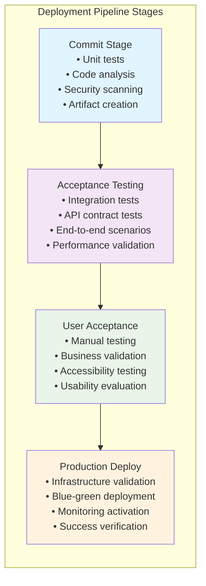
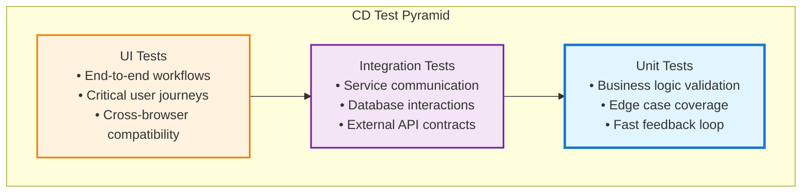

# Continuous Delivery: Engineering Excellence at Scale

> _"Continuous Delivery is the ability to get changes of all types—including new features, configuration changes, bug fixes and experiments—into production, or into the hands of users, safely and quickly in a sustainable way."_ - Jez Humble and Dave Farley

Picture two different software teams working on similar products, and imagine you're a new hire trying to understand how things work:

---

### **Team A: The Monthly Marathon**

It's Monday morning, and the team lead announces: "Okay everyone, we're in feature freeze mode. No more changes until the release goes out." For the next three weeks, you watch an elaborate dance unfold:

- **Week 1**: Integration testing reveals conflicts between features that were developed separately
- **Week 2**: User acceptance testing uncovers usability issues that require design changes
- **Week 3**: Performance testing shows the new features slow down the application
- **Weekend**: A marathon deployment session where everyone holds their breath

When problems arise in production (and they do), diagnosing them feels like archaeology. Was it the new payment flow? The updated search algorithm? The database migration? The configuration change? Nobody's quite sure because 47 different changes went out together.

Rolling back isn't really an option—it would mean losing six weeks of work across multiple features. So the team "rolls forward" with hot fixes, crossing their fingers that each patch doesn't introduce new problems.

---

### **Team B: The Daily Rhythm**

It's Monday morning, and someone says: "I'm going to deploy that bug fix from Friday." You watch them click a button, and five minutes later, the fix is live in production. By lunch, two more small improvements have been deployed. By end of day, the team has shipped six different changes—each one small, focused, and validated automatically.

When an issue pops up Tuesday morning, the team immediately knows it was related to the authentication change deployed at 2:47 PM yesterday—because that was the only change deployed in that timeframe. Rolling back takes 30 seconds. Problem solved.

---

**The difference between these teams isn't talent, tools, or budget—it's philosophy.** Team A treats deployment as a risky event to be minimized. Team B treats deployment as a routine capability to be optimized. This fundamental shift changes everything about how software gets built.

Continuous Delivery (CD) represents one of the most significant advances in software engineering practices of the past decade. Developed by Jez Humble and Dave Farley, it transforms how organizations think about software delivery from an event-driven, risky process to a routine, reliable capability.

As a Staff Engineer, you're uniquely positioned to drive CD adoption across your organization. You understand both the technical practices required and the organizational changes needed to implement CD successfully. Your role is to demonstrate that CD isn't just about deployment frequency—it's about reducing risk, improving quality, and enabling business agility.

## The Foundation: Why Continuous Delivery Matters

Let's start with a question that gets to the heart of why CD matters: **What's the cost of being wrong?**

In traditional batch release cycles, being wrong is expensive. If you spend six weeks building a feature that users don't want, you've wasted six weeks. If you introduce a bug that breaks payments, it affects six weeks worth of changes. If you make an architectural decision that doesn't scale, you're stuck with it until the next release cycle.

**Continuous Delivery fundamentally changes the economics of being wrong.** When you can deploy changes in minutes instead of weeks, the cost of mistakes plummets and the value of experimentation soars.

---

### **The Risk Redistribution Revolution**

Here's a mental model that changed how I think about deployment risk:

**Traditional approach** = Carrying 1,000 pounds up a flight of stairs all at once

- Huge effort required
- High chance of failure
- Catastrophic consequences if you drop it
- Difficult to recover from problems

**Continuous Delivery approach** = Carrying 10 pounds up the stairs 100 times

- Each trip is manageable
- Low individual risk
- Easy to recover if you stumble
- You get stronger with each iteration

When you deploy 47 changes together and something breaks, you're playing detective with 47 suspects. When you deploy one change and something breaks, you've found your culprit.

---

### **The Feedback Acceleration Engine**

Imagine you're a product manager who just had a brilliant idea for improving user onboarding. In a traditional release cycle, here's your timeline:

```
Week 1-2: Requirements and design
Week 3-6: Development
Week 7-8: Testing and QA
Week 9-10: Deployment and monitoring
Week 11: First user feedback
```

**By week 11, three months later, you've forgotten why you thought this was a good idea.** The market has shifted. User needs have evolved. Your brilliant idea is now solving yesterday's problem.

With Continuous Delivery:

```
Day 1: Idea and quick prototype
Day 2: Deploy to 5% of users
Day 3: Analyze results and iterate
Day 4: Deploy improved version to 25% of users
Week 2: Full rollout or pivot based on real data
```

**The difference isn't just speed—it's intelligence.** CD enables you to make decisions based on actual user behavior rather than educated guesses.

---

### **The Innovation Liberation Effect**

Here's a paradox that surprised me: **the teams that deploy most frequently are often the most risk-averse.** They're not cowboys who push code without thinking—they're engineers who've made deployment so safe and routine that they can afford to experiment.

When deployment is risky and rare, every change must be justified, planned, and approved. Innovation dies in committee meetings and approval processes.

When deployment is safe and frequent, you can try ideas quickly, measure their impact, and either double down or move on. **The cost of experimentation approaches zero, so the rate of innovation approaches infinity.**

This is why companies like Amazon, Google, and Netflix can innovate so rapidly. It's not that they're smarter or have better ideas—it's that their deployment practices allow them to test more ideas more quickly than their competitors.

## The Deployment Pipeline: Your CD Foundation

The deployment pipeline is the backbone of Continuous Delivery—an automated process that takes every code change from version control to production-ready state.



### Commit Stage: Fast Feedback Foundation

The commit stage provides the fastest possible feedback about code changes. It should complete in under 10 minutes and include:

**Unit Testing**: Verify individual components work correctly

```python
# Example: Comprehensive unit test suite
class TestOrderCalculation:
    def test_order_total_with_tax(self):
        order = Order()
        order.add_item("WIDGET-001", quantity=2, price=Money(25.00))
        order.add_item("WIDGET-002", quantity=1, price=Money(50.00))

        total = order.calculate_total(tax_rate=0.08)

        assert total == Money(108.00)  # (50 + 50) * 1.08

    def test_discount_application(self):
        order = Order()
        order.add_item("PREMIUM-001", quantity=1, price=Money(100.00))

        order.apply_discount(PercentageDiscount(20))
        total = order.calculate_total(tax_rate=0.08)

        assert total == Money(86.40)  # (100 * 0.8) * 1.08

# Commit stage pipeline configuration
stages:
  - name: commit
    script:
      - pytest tests/unit/ --maxfail=1
      - flake8 src/ --max-line-length=88
      - mypy src/ --strict
      - safety check  # Security vulnerability scanning
    success_criteria:
      - all_tests_pass: true
      - code_coverage: >= 80%
      - security_issues: 0
```

**Static Analysis**: Catch issues before they reach other stages

```yaml
# Code quality gates in CI pipeline
quality_gates:
  code_coverage:
    threshold: 80%
    fail_on_decrease: true

  complexity:
    max_cyclomatic_complexity: 10
    max_function_length: 50

  security:
    block_hardcoded_secrets: true
    require_dependency_scanning: true

  style:
    enforce_formatting: true
    require_type_hints: true
```

### Acceptance Testing Stage: Integration Confidence

This stage validates that components work together correctly and that the system meets business requirements:

**Integration Testing**: Verify system components collaborate correctly

```python
# Example: Integration test with real database
@pytest.mark.integration
class TestOrderIntegration:
    def test_complete_order_workflow(self, db_session):
        # Arrange: Set up test data
        customer = create_test_customer(db_session)
        product = create_test_product(db_session, sku="WIDGET-001", price=Money(50.00))

        # Act: Execute the workflow
        order_service = OrderService(db_session)
        order = order_service.create_order(
            customer_id=customer.id,
            items=[OrderItemRequest(sku="WIDGET-001", quantity=2)]
        )

        payment_result = order_service.process_payment(order.id, payment_method="TEST_CARD")

        # Assert: Verify complete workflow
        assert payment_result.success
        assert order.status == OrderStatus.CONFIRMED
        assert product.available_quantity == 98  # Started with 100, ordered 2
```

**Contract Testing**: Ensure API compatibility across services

```python
# Consumer contract test
def test_payment_service_contract():
    """Verify payment service provides expected API contract"""
    contract = PaymentServiceContract()

    # Test expected successful payment response
    payment_request = {
        "amount": 100.00,
        "currency": "USD",
        "customer_id": "CUST-001",
        "payment_method": "CARD-001"
    }

    expected_response_schema = {
        "transaction_id": str,
        "status": str,  # "SUCCESS" or "FAILED"
        "amount_charged": float,
        "fees": float,
        "timestamp": str
    }

    response = contract.process_payment(payment_request)
    assert_matches_schema(response, expected_response_schema)
    assert response["status"] in ["SUCCESS", "FAILED"]
```

### User Acceptance Stage: Business Validation

This stage validates that the system delivers business value and meets user needs:

**Automated User Journey Testing**:

```python
# Example: Selenium-based user journey test
class TestCheckoutUserJourney:
    def test_complete_purchase_flow(self, browser):
        # Login as test user
        login_page = LoginPage(browser)
        login_page.login("test.user@example.com", "test_password")

        # Add items to cart
        product_page = ProductPage(browser)
        product_page.navigate_to("WIDGET-001")
        product_page.add_to_cart(quantity=2)

        # Complete checkout
        cart_page = CartPage(browser)
        cart_page.proceed_to_checkout()

        checkout_page = CheckoutPage(browser)
        checkout_page.enter_shipping_address({
            "street": "123 Test St",
            "city": "Test City",
            "state": "CA",
            "zip": "90210"
        })
        checkout_page.select_payment_method("VISA_4111")

        confirmation_page = checkout_page.complete_purchase()

        # Verify successful completion
        assert confirmation_page.shows_order_confirmation()
        assert confirmation_page.order_total() == "$108.00"
```

### Production Deployment: Safe, Automated Release

The final stage deploys to production with safety mechanisms and monitoring:

**Blue-Green Deployment Implementation**:

```python
# Blue-green deployment orchestration
class BlueGreenDeployment:
    def __init__(self, infrastructure_client):
        self.infra = infrastructure_client

    def deploy(self, new_version: str) -> DeploymentResult:
        # Determine current and target environments
        current_env = self.infra.get_active_environment()  # "blue" or "green"
        target_env = "green" if current_env == "blue" else "blue"

        try:
            # Deploy to inactive environment
            self.infra.deploy_to_environment(target_env, new_version)

            # Run smoke tests against new deployment
            smoke_test_results = self.run_smoke_tests(target_env)
            if not smoke_test_results.all_passed:
                raise DeploymentError(f"Smoke tests failed: {smoke_test_results.failures}")

            # Switch traffic to new environment
            self.infra.switch_traffic_to(target_env)

            # Monitor for issues
            health_check = self.monitor_deployment_health(duration_minutes=10)
            if not health_check.healthy:
                # Automatic rollback on health issues
                self.infra.switch_traffic_to(current_env)
                raise DeploymentError(f"Health check failed: {health_check.issues}")

            return DeploymentResult.success(
                previous_environment=current_env,
                new_environment=target_env,
                version=new_version
            )

        except Exception as e:
            # Ensure we're in a known good state
            self.infra.switch_traffic_to(current_env)
            return DeploymentResult.failure(error=str(e))
```

## Advanced CD Patterns and Techniques

### Feature Flags: Decoupling Deploy from Release

Feature flags separate code deployment from feature release, enabling safer rollouts and faster feedback:

```python
class FeatureFlagManager:
    def __init__(self, flag_service: FeatureFlagService):
        self.flags = flag_service

    def is_enabled(self, flag_name: str, context: dict = None) -> bool:
        """Check if feature is enabled for current context"""
        return self.flags.evaluate_flag(flag_name, context or {})

    def gradual_rollout(self, flag_name: str, percentage: int) -> bool:
        """Enable feature for percentage of users"""
        return self.flags.percentage_rollout(flag_name, percentage)

# Usage in application code
class OrderService:
    def __init__(self, feature_flags: FeatureFlagManager):
        self.flags = feature_flags

    def create_order(self, request: CreateOrderRequest) -> Order:
        if self.flags.is_enabled("enhanced_order_validation", {"user_id": request.customer_id}):
            # New enhanced validation logic
            return self.create_order_with_enhanced_validation(request)
        else:
            # Existing validation logic
            return self.create_order_legacy(request)
```

**Feature Flag Rollout Strategy**:

```python
# Gradual feature rollout configuration
rollout_strategy = {
    "enhanced_order_validation": {
        "phase_1": {"percentage": 5, "duration_days": 2},    # Canary
        "phase_2": {"percentage": 25, "duration_days": 3},   # Early adopters
        "phase_3": {"percentage": 75, "duration_days": 2},   # Majority
        "phase_4": {"percentage": 100, "duration_days": 0}   # Full rollout
    }
}
```

### Canary Releases: Risk Mitigation Through Gradual Exposure

Canary releases expose new versions to a small subset of users before full deployment:

```python
class CanaryDeploymentController:
    def __init__(self, load_balancer, monitoring):
        self.lb = load_balancer
        self.monitoring = monitoring

    def execute_canary_deployment(self, new_version: str) -> CanaryResult:
        """Execute canary deployment with automated promotion/rollback"""

        # Phase 1: Deploy canary (5% traffic)
        self.lb.route_traffic_percentage(new_version, percentage=5)

        canary_health = self.monitor_canary_health(duration_minutes=15)
        if not canary_health.healthy:
            self.rollback_canary()
            return CanaryResult.failed(reason=canary_health.issues)

        # Phase 2: Increase to 25% traffic
        self.lb.route_traffic_percentage(new_version, percentage=25)

        expanded_health = self.monitor_canary_health(duration_minutes=30)
        if not expanded_health.healthy:
            self.rollback_canary()
            return CanaryResult.failed(reason=expanded_health.issues)

        # Phase 3: Full promotion
        self.lb.route_traffic_percentage(new_version, percentage=100)

        return CanaryResult.success()

    def monitor_canary_health(self, duration_minutes: int) -> HealthStatus:
        """Monitor canary deployment health metrics"""
        metrics = self.monitoring.get_metrics_for_duration(duration_minutes)

        # Define health criteria
        healthy = all([
            metrics.error_rate < 0.01,           # Less than 1% errors
            metrics.p95_latency < 500,           # P95 latency under 500ms
            metrics.throughput_change < 0.1,     # Throughput change under 10%
            metrics.memory_usage < 0.85          # Memory usage under 85%
        ])

        return HealthStatus(
            healthy=healthy,
            metrics=metrics,
            issues=self._identify_issues(metrics) if not healthy else []
        )
```

### Database Migrations in CD

Database changes require special consideration in CD environments:

**Backward-Compatible Migration Strategy**:

```python
# Migration 1: Add new column (backward compatible)
def upgrade_add_phone_column():
    op.add_column('users', sa.Column('phone_number', sa.String(20), nullable=True))

def downgrade_remove_phone_column():
    op.drop_column('users', 'phone_number')

# Migration 2: Populate new column (backward compatible)
def upgrade_populate_phone_data():
    # Gradually populate phone numbers from existing data or external sources
    users_without_phone = User.query.filter(User.phone_number.is_(None)).limit(1000)
    for user in users_without_phone:
        user.phone_number = extract_phone_from_profile(user.profile_data)

def downgrade_clear_phone_data():
    User.query.update({User.phone_number: None})

# Migration 3: Make column non-nullable (after all data populated)
def upgrade_make_phone_required():
    # Only after all existing users have phone numbers
    op.alter_column('users', 'phone_number', nullable=False)

def downgrade_make_phone_optional():
    op.alter_column('users', 'phone_number', nullable=True)
```

**Zero-Downtime Schema Changes**:

```python
class DatabaseMigrationManager:
    def __init__(self, db_connection):
        self.db = db_connection

    def execute_zero_downtime_column_rename(self, table: str, old_column: str, new_column: str):
        """Rename column without downtime using expand-contract pattern"""

        # Phase 1: Add new column
        self.db.execute(f"ALTER TABLE {table} ADD COLUMN {new_column} VARCHAR(255)")

        # Phase 2: Dual-write to both columns
        # (This happens in application code during deployment)

        # Phase 3: Backfill data from old to new column
        self.db.execute(f"UPDATE {table} SET {new_column} = {old_column} WHERE {new_column} IS NULL")

        # Phase 4: Switch reads to new column
        # (This happens in application code during next deployment)

        # Phase 5: Drop old column
        # (This happens in a subsequent migration after confirming success)
        self.db.execute(f"ALTER TABLE {table} DROP COLUMN {old_column}")
```

## Testing Strategy for Continuous Delivery

CD requires a comprehensive, fast, and reliable testing strategy:

### The Test Pyramid for CD



**Test Distribution Strategy**:

- **70% Unit Tests**: Fast, reliable, comprehensive coverage of business logic
- **20% Integration Tests**: Verify component interactions and system behavior
- **10% UI Tests**: Validate critical user workflows and system integration

### Test Optimization for Speed and Reliability

**Parallel Test Execution**:

```python
# pytest configuration for parallel execution
pytest.ini:
[tool:pytest]
addopts = -n auto --maxfail=1 --tb=short
testpaths = tests
python_files = test_*.py
python_classes = Test*
python_functions = test_*

# Test grouping for optimal parallelization
class TestOrderProcessingFast:
    """Fast unit tests that can run in parallel"""
    def test_order_calculation_logic(self): pass
    def test_discount_application(self): pass
    def test_tax_calculation(self): pass

@pytest.mark.integration
@pytest.mark.slow
class TestOrderProcessingIntegration:
    """Slower integration tests"""
    def test_complete_order_workflow(self): pass
    def test_payment_integration(self): pass
```

**Flaky Test Management**:

```python
class FlakyTestDetector:
    def __init__(self):
        self.test_results = []

    def record_test_result(self, test_name: str, result: TestResult):
        self.test_results.append({
            'test': test_name,
            'result': result.status,
            'duration': result.duration,
            'timestamp': datetime.now()
        })

    def identify_flaky_tests(self, days: int = 7) -> List[str]:
        """Identify tests with inconsistent results"""
        recent_results = self.get_recent_results(days)

        flaky_tests = []
        for test_name in set(r['test'] for r in recent_results):
            test_results = [r for r in recent_results if r['test'] == test_name]

            if len(test_results) >= 5:  # Need minimum sample size
                pass_rate = sum(1 for r in test_results if r['result'] == 'PASS') / len(test_results)

                # Flag tests that pass between 10% and 90% of the time
                if 0.1 <= pass_rate <= 0.9:
                    flaky_tests.append(test_name)

        return flaky_tests

    def quarantine_flaky_test(self, test_name: str):
        """Remove flaky test from critical path while fixing"""
        # Add pytest marker to skip in CI but still track
        with open('pytest_quarantine.ini', 'a') as f:
            f.write(f"markers = quarantine: {test_name} - investigating flakiness\n")
```

## Infrastructure as Code for CD

CD requires reliable, reproducible infrastructure that can be version controlled and tested:

**Infrastructure Definition**:

```yaml
# Terraform configuration for CD infrastructure
resource "aws_ecs_cluster" "app_cluster" {
  name = "production-app-cluster"

  setting {
    name  = "containerInsights"
    value = "enabled"
  }
}

resource "aws_ecs_service" "app_service" {
  name            = "app-service"
  cluster         = aws_ecs_cluster.app_cluster.id
  task_definition = aws_ecs_task_definition.app_task.arn
  desired_count   = var.app_instance_count

  deployment_configuration {
    maximum_percent         = 200
    minimum_healthy_percent = 100
  }

  load_balancer {
    target_group_arn = aws_lb_target_group.app_tg.arn
    container_name   = "app"
    container_port   = 8000
  }
}

# Auto-scaling configuration
resource "aws_appautoscaling_target" "app_scale_target" {
  service_namespace  = "ecs"
  resource_id        = "service/${aws_ecs_cluster.app_cluster.name}/${aws_ecs_service.app_service.name}"
  scalable_dimension = "ecs:service:DesiredCount"
  min_capacity       = 2
  max_capacity       = 10
}
```

**Infrastructure Testing**:

```python
# Infrastructure validation tests
class TestInfrastructureConfiguration:
    def test_load_balancer_health_checks(self):
        """Verify load balancer correctly identifies healthy instances"""
        lb_client = boto3.client('elbv2')
        target_groups = lb_client.describe_target_groups()

        for tg in target_groups['TargetGroups']:
            health = lb_client.describe_target_health(TargetGroupArn=tg['TargetGroupArn'])

            # Ensure health check configuration is correct
            assert tg['HealthCheckPath'] == '/health'
            assert tg['HealthCheckIntervalSeconds'] <= 30
            assert tg['HealthyThresholdCount'] == 2
            assert tg['UnhealthyThresholdCount'] == 3

    def test_auto_scaling_configuration(self):
        """Verify auto-scaling responds appropriately to load"""
        asg_client = boto3.client('application-autoscaling')

        # Simulate high CPU load
        self.simulate_high_cpu_load()

        # Wait for scaling to trigger
        time.sleep(300)  # 5 minutes

        # Verify instances scaled up
        current_capacity = self.get_current_capacity()
        assert current_capacity > self.initial_capacity
```

## Monitoring and Observability for CD

CD requires comprehensive monitoring to ensure deployments succeed and systems remain healthy:

### Deployment Monitoring

```python
class DeploymentMonitor:
    def __init__(self, metrics_client, alert_manager):
        self.metrics = metrics_client
        self.alerts = alert_manager

    def monitor_deployment_health(self, deployment_id: str, duration_minutes: int) -> HealthReport:
        """Monitor key metrics during deployment window"""

        baseline_metrics = self.get_baseline_metrics()

        start_time = datetime.now()
        end_time = start_time + timedelta(minutes=duration_minutes)

        health_issues = []

        while datetime.now() < end_time:
            current_metrics = self.get_current_metrics()

            # Check error rate
            if current_metrics.error_rate > baseline_metrics.error_rate * 2:
                health_issues.append(f"Error rate spike: {current_metrics.error_rate}")

            # Check response time
            if current_metrics.p95_latency > baseline_metrics.p95_latency * 1.5:
                health_issues.append(f"Latency spike: {current_metrics.p95_latency}ms")

            # Check throughput
            throughput_drop = (baseline_metrics.throughput - current_metrics.throughput) / baseline_metrics.throughput
            if throughput_drop > 0.2:
                health_issues.append(f"Throughput drop: {throughput_drop:.1%}")

            time.sleep(30)  # Check every 30 seconds

        return HealthReport(
            deployment_id=deployment_id,
            healthy=len(health_issues) == 0,
            issues=health_issues,
            metrics_summary=current_metrics
        )
```

### Business Metrics Tracking

```python
class BusinessMetricsMonitor:
    def track_feature_impact(self, feature_flag: str, metrics_window: timedelta) -> FeatureImpact:
        """Track business impact of feature rollout"""

        # Get users with feature enabled vs. disabled
        feature_enabled_users = self.get_users_with_feature(feature_flag, enabled=True)
        feature_disabled_users = self.get_users_with_feature(feature_flag, enabled=False)

        # Compare key business metrics
        enabled_metrics = self.get_user_metrics(feature_enabled_users, metrics_window)
        disabled_metrics = self.get_user_metrics(feature_disabled_users, metrics_window)

        return FeatureImpact(
            conversion_rate_change=self.calculate_percentage_change(
                disabled_metrics.conversion_rate, enabled_metrics.conversion_rate
            ),
            revenue_per_user_change=self.calculate_percentage_change(
                disabled_metrics.revenue_per_user, enabled_metrics.revenue_per_user
            ),
            user_engagement_change=self.calculate_percentage_change(
                disabled_metrics.session_duration, enabled_metrics.session_duration
            ),
            sample_sizes={
                'enabled': len(feature_enabled_users),
                'disabled': len(feature_disabled_users)
            }
        )
```

## Organizational Practices for CD Success

CD is as much about culture and organization as it is about technology:

### Building a CD Culture

**Shared Responsibility Model**:

```python
# Team charter for CD responsibilities
class CDTeamCharter:
    shared_responsibilities = [
        "All team members can deploy to production safely",
        "Quality is built in, not tested in later",
        "Fast feedback is prioritized over comprehensive documentation",
        "Broken builds are addressed immediately by whoever can fix fastest",
        "Monitoring and alerting are part of feature development"
    ]

    individual_responsibilities = {
        "developers": [
            "Write comprehensive unit tests for new code",
            "Ensure backward compatibility in database changes",
            "Monitor deployment success after releases"
        ],
        "qa_engineers": [
            "Automate acceptance criteria as executable tests",
            "Maintain and improve test suite reliability",
            "Partner with developers on testability"
        ],
        "operations": [
            "Maintain deployment pipeline reliability",
            "Provide self-service infrastructure capabilities",
            "Ensure monitoring and alerting coverage"
        ]
    }
```

**Continuous Learning and Improvement**:

```python
class CDMetricsRetrospective:
    def __init__(self, metrics_collector):
        self.metrics = metrics_collector

    def monthly_cd_health_check(self) -> CDHealthReport:
        """Generate monthly report on CD health and improvement opportunities"""

        deployment_metrics = self.metrics.get_deployment_metrics(days=30)
        quality_metrics = self.metrics.get_quality_metrics(days=30)

        return CDHealthReport(
            # DORA metrics
            deployment_frequency=deployment_metrics.frequency_per_day,
            lead_time=deployment_metrics.commit_to_production_time,
            change_failure_rate=deployment_metrics.rollback_rate,
            recovery_time=deployment_metrics.mean_time_to_recovery,

            # Quality metrics
            test_suite_execution_time=quality_metrics.test_duration,
            test_reliability=quality_metrics.flaky_test_percentage,
            pipeline_success_rate=quality_metrics.pipeline_success_rate,

            # Improvement recommendations
            recommendations=self.generate_improvement_recommendations(
                deployment_metrics, quality_metrics
            )
        )
```

## CD Maturity Assessment Framework

Use this framework to evaluate your organization's CD maturity:

### Level 1: Basic Automation

- [ ] Automated build process triggered by code commits
- [ ] Automated unit test execution in build pipeline
- [ ] Basic deployment automation to staging environment
- [ ] Manual approval process for production deployments

### Level 2: Comprehensive Pipeline

- [ ] Multi-stage deployment pipeline with quality gates
- [ ] Automated integration and acceptance testing
- [ ] Infrastructure as code for consistent environments
- [ ] Automated deployment to production with manual trigger

### Level 3: Advanced CD Practices

- [ ] Fully automated deployment pipeline to production
- [ ] Feature flags for decoupling deploy from release
- [ ] Blue-green or canary deployment strategies
- [ ] Comprehensive monitoring and automated rollback

### Level 4: Optimized Flow

- [ ] High deployment frequency (multiple times per day)
- [ ] Fast feedback loops (pipeline completion under 30 minutes)
- [ ] Low change failure rate (under 15%)
- [ ] Fast recovery from failures (under 1 hour)

### Level 5: Continuous Innovation

- [ ] Experimentation and A/B testing integrated into deployment
- [ ] Business metrics tracked for every deployment
- [ ] Cross-team sharing of CD practices and improvements
- [ ] CD practices drive business agility and competitive advantage

## Common CD Anti-Patterns and Solutions

### The Manual Quality Gate

- **Problem**: Manual testing or approval steps that slow down the pipeline
- **Example**: Requiring manual UAT sign-off for every deployment
- **Solution**: Automate quality checks and use feature flags for risk mitigation

### The Monolithic Pipeline

- **Problem**: Single pipeline that builds and deploys everything together  
- **Example**: One pipeline for frontend, backend, database, and infrastructure
- **Solution**: Separate pipelines for independently deployable components

### The Environment Snowflake

- **Problem**: Environments that differ in configuration, making deployments unpredictable
- **Example**: Staging environment with different database version than production
- **Solution**: Infrastructure as code and environment parity enforcement

### The Big Bang Feature

- **Problem**: Large features that require coordinated releases across multiple systems
- **Example**: Complete checkout flow redesign deployed all at once
- **Solution**: Feature flags, incremental rollout, and backward compatibility

## Key Takeaways

1. **Risk reduction through small batches**: Frequent small deployments are safer than infrequent large ones
2. **Automation enables confidence**: Comprehensive automated testing and deployment processes reduce human error and enable fast feedback
3. **Monitoring is essential**: You can't have continuous delivery without continuous monitoring and quick failure recovery
4. **Culture matters as much as technology**: CD requires organizational commitment to shared responsibility and continuous improvement
5. **Start where you are**: Begin with basic automation and incrementally improve rather than trying to implement everything at once
6. **Measure and improve**: Use DORA metrics and other indicators to continuously improve your CD practices

Continuous Delivery transforms software development from a risky, batch-oriented process to a routine, reliable capability. As a Staff Engineer, your role is to champion these practices, demonstrate their value through implementation, and help your organization build the technical and cultural capabilities that enable true business agility.

## Cross-Reference Navigation

### Prerequisites for This Chapter

- **[DevOps & Automation Engineering](devops.md)** - Understanding DevOps principles provides the cultural foundation for continuous delivery practices
- **[Advanced Testing Strategies](advanced-testing-strategies.md)** - Comprehensive testing practices are essential for reliable continuous delivery pipelines

### Related Concepts

- **[DevOps & Automation Engineering](devops.md)** - DevOps culture and practices complement continuous delivery implementation
- **[Site Reliability Engineering](site-reliability-engineering.md)** - SRE practices support CD with reliability engineering and error budget management
- **[Advanced Testing Strategies](advanced-testing-strategies.md)** - Testing strategies must align with CD pipeline requirements and feedback loops
- **[Engineering Metrics & Business Alignment](../business/engineering-metrics-business-alignment.md)** - DORA metrics and CD effectiveness measurement connect to business value

### Apply These Concepts

- **[Staff Engineer Competency Assessment](../../appendix/tools/staff-engineer-competency-assessment.md)** - Evaluate your technical delivery and automation engineering capabilities
- **[Team Health Diagnostic](../../appendix/tools/team-health-diagnostic.md)** - Assess team readiness for continuous delivery practices and culture

### Next Steps in Your Learning Journey

1. **[DevOps & Automation Engineering](devops.md)** - Master the cultural and organizational aspects of DevOps that enable CD success
2. **[Site Reliability Engineering](site-reliability-engineering.md)** - Learn reliability engineering practices that complement continuous delivery
3. **[Change Management for Technical Transformations](../execution/change-management-technical-transformations.md)** - Understand how to drive CD adoption across engineering organizations

## Further Reading

- Humble, Jez, and David Farley. _Continuous Delivery: Reliable Software Releases through Build, Test, and Deployment Automation_. 2010.
- Forsgren, Nicole, Jez Humble, and Gene Kim. _Accelerate: The Science of Lean Software and DevOps_. 2018.
- Kim, Gene, Jez Humble, Patrick Debois, and John Willis. _The DevOps Handbook: How to Create World-Class Agility, Reliability, and Security in Technology Organizations_. 2016.
- Bass, Len, Ingo Weber, and Liming Zhu. _DevOps: A Software Architect's Perspective_. 2015.
- Chen, Lianping. _Continuous Delivery: Huge Benefits, but Challenges Too_. IEEE Software 32, no. 2 (2015): 50-54.
