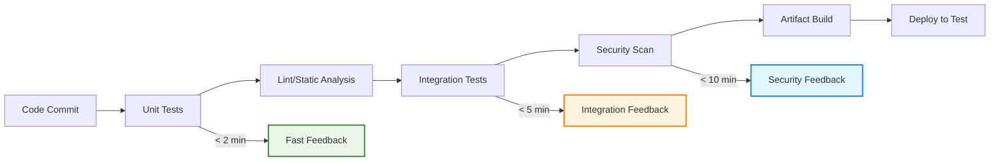
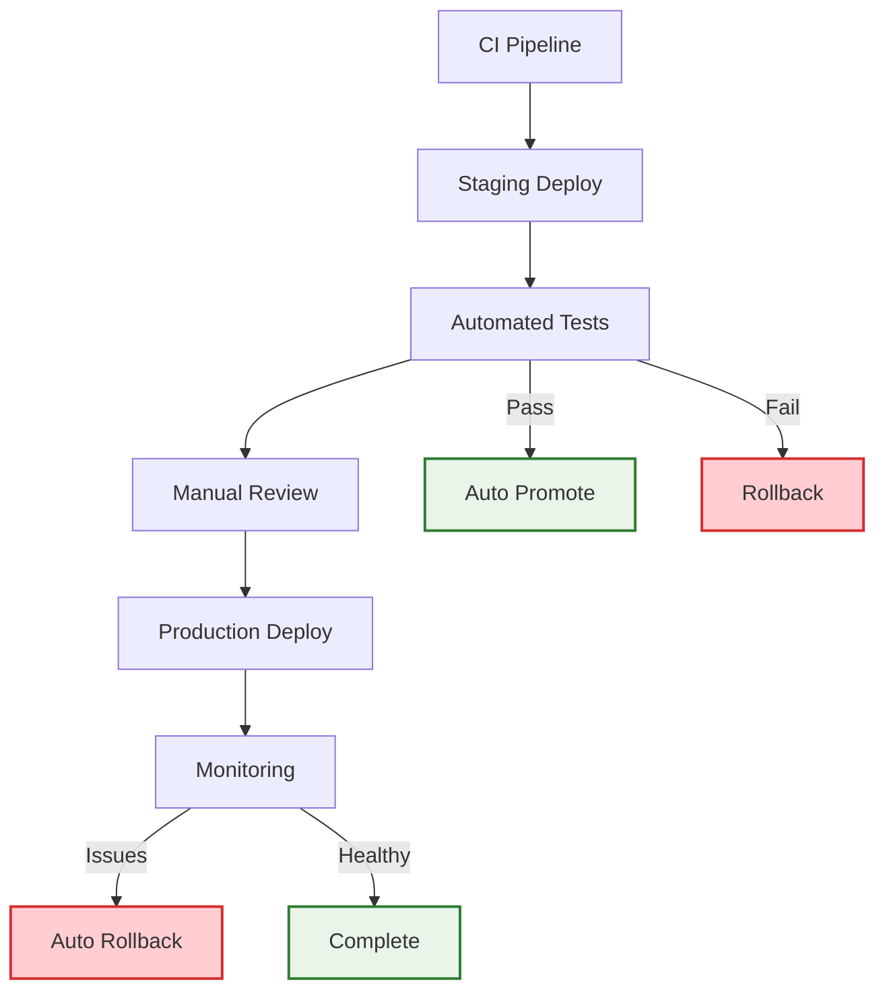
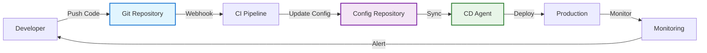

# Continuous Integration & Continuous Delivery (CI/CD)

!!! quote "Deployment Excellence"
    *"The goal is not to move fast and break things. The goal is to move fast with stable infrastructure."*

    **— Jez Humble, Continuous Delivery**

Continuous Integration and Continuous Delivery represent the backbone of modern software engineering practices. As a staff engineer, your ability to design and implement robust CI/CD pipelines directly impacts your organization's ability to deliver value to customers quickly, safely, and reliably.

## The Strategic Value of CI/CD

CI/CD isn't just about automation—it's about creating feedback loops that enable rapid learning and adaptation while maintaining system stability. Your pipeline design decisions affect every aspect of software delivery, from individual developer productivity to organizational competitive advantage.

### Business Impact Metrics

Effective CI/CD systems improve key business metrics:

**Lead Time**: Time from code commit to production deployment
**Deployment Frequency**: How often you deploy to production
**Mean Time to Recovery**: How quickly you can recover from incidents
**Change Failure Rate**: Percentage of deployments that cause production issues

These metrics, known as DORA metrics, correlate strongly with organizational performance and business outcomes.

## Continuous Integration Foundations

### The CI Contract

Every team member commits to the CI social contract:

- **Commit Frequently**: Integrate changes at least daily
- **Maintain Green Builds**: Never commit on a broken build
- **Fix Broken Builds Immediately**: Broken builds get highest priority
- **Keep Builds Fast**: Feedback within 10 minutes or less

### CI Pipeline Architecture

Design CI pipelines that provide fast feedback and comprehensive validation:

### Test Strategy in CI

Implement the test pyramid to balance speed and confidence:

**Unit Tests (70%)**:
- Fast execution (< 1 second each)
- High coverage of business logic
- No external dependencies

**Integration Tests (20%)**:
- Test component interactions
- Include database and API tests
- Moderate execution time (< 30 seconds each)

**End-to-End Tests (10%)**:
- Critical user journey validation
- Full system testing
- Acceptable for longer execution times

## Continuous Delivery Principles

### Deployment Pipeline Design

Create deployment pipelines that enforce quality gates while enabling rapid delivery:

### Environment Promotion Strategy

Design environment progression that builds confidence:

**Development**: Individual developer environments
**Integration**: Automated testing of integrated changes
**Staging**: Production-like environment for final validation
**Production**: Live customer-facing environment

Each environment should be as similar to production as possible while serving its specific validation purpose.

### Feature Flags and Dark Launches

Use feature flags to decouple deployment from release:

**Benefits:**
- Deploy code without activating features
- Gradual rollouts to subsets of users
- Instant rollback without deployment
- A/B testing and experimentation

**Implementation Patterns:**
- **Kill Switches**: Instant feature disable capability
- **Percentage Rollouts**: Gradual user activation
- **User Targeting**: Specific user groups or criteria
- **Canary Releases**: Test with small user percentage

## Advanced CI/CD Patterns

### Trunk-Based Development

Maintain a single branch where all developers integrate:

**Practices:**
- All changes merge to main/trunk branch
- Short-lived feature branches (< 1 day)
- Feature flags for incomplete features
- Continuous integration on every commit

**Benefits:**
- Reduced merge conflicts
- Faster integration of changes
- Simplified branching model
- Enhanced collaboration

### GitOps Deployment Model

Use Git as the single source of truth for infrastructure and application configuration:

**Advantages:**
- Declarative infrastructure management
- Full audit trail of changes
- Easy rollback to previous configurations
- Enhanced security through pull-based deployments

### Blue-Green Deployments

Maintain two identical production environments for zero-downtime deployments:

**Process:**
1. Deploy new version to inactive environment (Green)
2. Run comprehensive validation tests
3. Switch traffic from active (Blue) to Green
4. Keep Blue environment for quick rollback

**Use Cases:**
- Critical applications requiring zero downtime
- Complex applications with long startup times
- Situations requiring comprehensive pre-production validation

## Pipeline as Code

### Infrastructure as Code Integration

Treat your CI/CD pipeline configuration as code:

**Benefits:**
- Version control for pipeline changes
- Reproducible pipeline environments
- Code review for pipeline modifications
- Automated pipeline testing

**Tools and Approaches:**
- **Jenkins**: Jenkinsfile with pipeline definition
- **GitHub Actions**: YAML-based workflow configuration
- **GitLab CI**: .gitlab-ci.yml pipeline configuration
- **Azure DevOps**: YAML pipelines with templates

### Pipeline Testing Strategies

Test your CI/CD pipelines just like application code:

**Unit Testing**: Test individual pipeline components
**Integration Testing**: Validate pipeline stage interactions
**Contract Testing**: Verify pipeline inputs and outputs
**Security Testing**: Validate pipeline security configurations

## Security in CI/CD

### DevSecOps Integration

Build security into every stage of your CI/CD pipeline:

**Code Analysis**: Static application security testing (SAST)
**Dependency Scanning**: Identify vulnerable dependencies
**Container Scanning**: Scan container images for vulnerabilities
**Infrastructure Testing**: Validate security configurations
**Runtime Protection**: Monitor production for security issues

### Secrets Management

Secure handling of sensitive information in CI/CD:

**Principles:**
- Never store secrets in code or configuration files
- Use dedicated secret management systems
- Rotate secrets regularly
- Audit secret access and usage

**Implementation:**
- **Vault Systems**: HashiCorp Vault, AWS Secrets Manager
- **CI/CD Integration**: Native secret handling in pipeline tools
- **Environment Isolation**: Different secrets for different environments
- **Just-in-Time Access**: Temporary secret access for deployments

## Monitoring and Observability

### Pipeline Observability

Monitor your CI/CD pipeline performance and reliability:

**Metrics to Track:**
- Build success/failure rates
- Build duration trends
- Test execution times
- Deployment frequency and success rates

**Alerting Strategies:**
- Immediate alerts for build failures
- Trend-based alerts for performance degradation
- Deployment success/failure notifications
- Security scan failure alerts

### Production Deployment Monitoring

Validate deployment success through automated monitoring:

**Health Checks**: Automated validation of service health
**Performance Monitoring**: Track key performance indicators
**Error Rate Monitoring**: Monitor application error rates
**User Experience Validation**: Synthetic transaction testing

## Cross-Reference Navigation

**Technical Foundation:**
- **[Site Reliability Engineering](site-reliability-engineering.md)** - Operating principles that complement CI/CD practices
- **[DevOps Culture](devops.md)** - Cultural practices that enable effective CI/CD
- **[Advanced Testing Strategies](advanced-testing-strategies.md)** - Testing approaches for CI/CD pipelines

**Organizational Integration:**
- **[Team Topologies](../teamwork/organizational-design.md)** - Aligning CI/CD with team structure
- **[Change Management](../execution/change-management-technical-transformations.md)** - Leading CI/CD adoption across organizations

**Quality and Security:**
- **[Technical Debt Management](technical-debt-management-framework.md)** - Using CI/CD to manage and reduce technical debt
- **[Engineering Excellence](engineering-excellence.md)** - Quality practices that integrate with CI/CD

## Further Reading

This chapter draws on insights from foundational DevOps and continuous delivery texts:

*   **Humble, Jez, and David Farley. *Continuous Delivery: Reliable Software Releases through Build, Test, and Deployment Automation*.** The definitive guide to continuous delivery practices and principles.
*   **Kim, Gene, Jez Humble, Patrick Debois, and John Willis. *The DevOps Handbook*.** Comprehensive guide to DevOps practices including CI/CD implementation.
*   **Forsgren, Nicole, Jez Humble, and Gene Kim. *Accelerate: The Science of Lean Software and DevOps*.** Research-based insights on what drives high performance in software delivery.
*   **Davis, Cornelia. *Cloud Native Patterns*.** Modern deployment patterns for cloud-native applications and CI/CD.