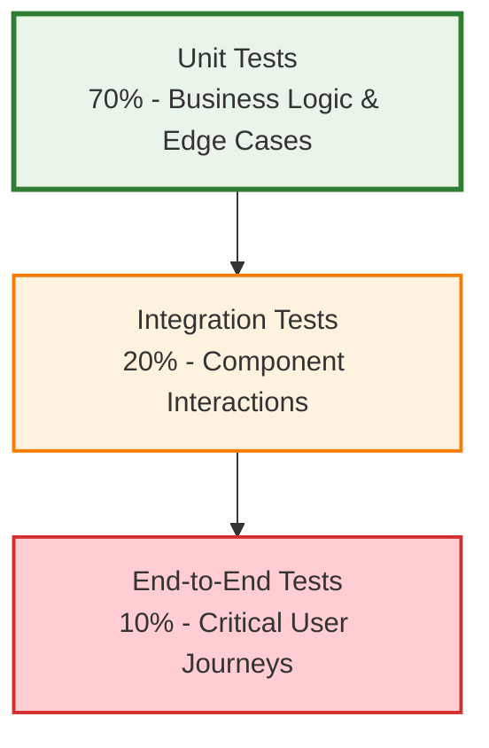

# Engineering Excellence

!!! quote "Excellence Mindset"
    *"Excellence is never an accident. It is always the result of high intention, sincere effort, and intelligent execution; it represents the wise choice of many alternatives."*

    **— Aristotle**

Engineering excellence isn't about perfection—it's about systematically building practices, culture, and capabilities that consistently deliver high-quality software. As a staff engineer, you're responsible for establishing and maintaining the standards that enable your organization to build reliable, maintainable, and valuable software systems.

## Defining Engineering Excellence

### The Excellence Framework

Engineering excellence operates across multiple dimensions simultaneously:

```mermaid
graph TD
    EE[Engineering Excellence] --> TQ[Technical Quality]
    EE --> PE[Process Effectiveness]
    EE --> TC[Team Capabilities]
    EE --> CI[Continuous Improvement]

    TQ --> CR[Code Reviews]
    TQ --> TE[Testing Excellence]
    TQ --> AR[Architecture Quality]
    TQ --> SEC[Security Practices]

    PE --> CI_CD[CI/CD Pipeline]
    PE --> DM[Deployment Management]
    PE --> IM[Incident Management]
    PE --> DOC[Documentation]

    TC --> SK[Skill Development]
    TC --> COL[Collaboration]
    TC --> MEN[Mentorship]
    TC --> KS[Knowledge Sharing]

    CI --> MET[Metrics & Measurement]
    CI --> FB[Feedback Loops]
    CI --> EXP[Experimentation]
    CI --> LEA[Learning Culture]

    style EE fill:#e1f5fe,stroke:#1976d2,stroke-width:3px
    style TQ fill:#e8f5e8,stroke:#2e7d32,stroke-width:2px
    style PE fill:#fff3e0,stroke:#f57c00,stroke-width:2px
    style TC fill:#f3e5f5,stroke:#7b1fa2,stroke-width:2px
    style CI fill:#fce4ec,stroke:#c2185b,stroke-width:2px
```

### Quality vs. Speed Balance

Excellence means optimizing for long-term velocity through sustainable practices rather than pursuing short-term gains that create future constraints. While short-term focused teams deliver features quickly but accumulate technical debt, and long-term focused teams build sustainable practices that accelerate future development, the excellence approach strategically invests in practices that increase both quality and speed simultaneously, creating a virtuous cycle of continuous improvement.

## Technical Quality Practices

### Code Quality Standards

Establish consistent standards that make code easier to understand and maintain through four foundational practices. Maintain consistent code style with unified formatting, naming conventions, and organization patterns that reduce cognitive load for all team members. Implement effective complexity management by keeping functions and classes focused and understandable, ensuring each component has a single, clear responsibility. Create meaningful documentation with comments that explain the reasoning behind decisions rather than merely describing what the code does. Finally, build comprehensive error handling and recovery strategies that gracefully manage unexpected situations and provide clear feedback for debugging and monitoring.

### Code Review Excellence

Transform code reviews from gatekeeping to collaborative improvement:

**Review Criteria:**
- Correctness: Does the code do what it's supposed to do?
- Maintainability: Will future developers understand and modify this easily?
- Performance: Are there obvious performance issues?
- Security: Does this introduce security vulnerabilities?

**Review Culture:**
- Focus on learning and improvement, not fault-finding
- Provide specific, actionable feedback
- Explain the reasoning behind suggestions
- Recognize good code and practices

### Testing Strategy

Build comprehensive testing that provides confidence while enabling rapid change:

**Test Pyramid Implementation:**

**Quality Gates:**
- All code changes must have appropriate tests
- Tests must pass before merging
- Code coverage thresholds for critical paths
- Performance regression testing for key scenarios

### Architecture Excellence

Build systems that can evolve and scale with business needs:

**Design Principles**: Follow SOLID principles and separation of concerns
**Documentation**: Maintain current architectural decision records (ADRs)
**Dependency Management**: Minimize coupling and manage dependencies carefully
**Performance**: Design for appropriate performance characteristics from the start

## Process Excellence

### Continuous Integration & Deployment Excellence

Build deployment pipelines that enable rapid, reliable releases through systematic implementation of proven practices and integrated toolchains.

-   :material-timer-outline: **Fast CI Feedback**

    ---

    **Sub-10 Minute Validation Cycles**

    Design build pipelines that provide developer feedback within 10 minutes through parallelized testing, incremental builds, and smart test selection to maintain rapid development velocity.

-   :material-test-tube: **Comprehensive Testing Integration**

    ---

    **Automated Quality Gates**

    Integrate unit, integration, and security tests directly into CI pipelines, ensuring quality validation happens automatically without manual intervention or process delays.

-   :material-shield-check: **Security & Compliance Scanning**

    ---

    **Shift-Left Security Practices**

    Embed vulnerability scanning, dependency analysis, and compliance checks into development workflows, catching security issues before they reach production environments.

-   :material-package-variant: **Artifact Management**

    ---

    **Versioned Build Artifacts**

    Generate immutable, versioned artifacts with complete traceability from source code to deployment, enabling reliable rollbacks and deployment auditing.

-   :material-rocket-launch: **Automated Deployment**

    ---

    **Production-Ready Releases**

    Implement automated deployment to staging environments with production parity, including rollback capabilities and health monitoring for confident releases.

-   :material-flag: **Controlled Feature Rollouts**

    ---

    **Progressive Delivery**

    Use feature flags and progressive deployment strategies to control feature exposure, enabling safe experimentation and rapid rollback capabilities.

### Incident Management

Handle production issues with systematic learning and improvement:

**Response Process:**
1. **Immediate Response**: Restore service quickly and safely
2. **Investigation**: Understand root causes thoroughly
3. **Communication**: Keep stakeholders informed throughout
4. **Learning**: Conduct blameless post-mortems
5. **Improvement**: Implement preventive measures

**Blameless Post-Mortems:**
- Focus on system improvements, not individual blame
- Document timeline, impact, and root causes
- Identify action items with owners and timelines
- Share learnings across the organization

### Documentation Excellence Framework

Create documentation ecosystems that serve their intended purpose effectively while remaining current and discoverable through systematic approaches to information architecture.

-   :material-sitemap: **Architecture Documentation**

    ---

    **System Design & Decisions**

    Document high-level system architecture, key design decisions, and trade-offs with decision records (ADRs) that explain the context and reasoning behind architectural choices.

-   :material-api: **API Documentation**

    ---

    **Interface Specifications & Examples**

    Provide comprehensive API documentation with clear specifications, usage examples, and integration guides that enable effective service consumption and development.

-   :material-monitor: **Operational Documentation**

    ---

    **Deployment & Troubleshooting Guides**

    Maintain up-to-date deployment procedures, monitoring setup, troubleshooting runbooks, and incident response guides for operational reliability and knowledge sharing.

-   :material-code-braces: **Developer Documentation**

    ---

    **Setup & Contribution Guidelines**

    Create clear onboarding documentation covering development environment setup, contribution processes, coding standards, and team-specific practices for effective collaboration.

**Documentation Excellence Principles:**

Effective documentation requires systematic attention to currency, audience, and discoverability. Keep documentation current through automated processes where possible, integrating updates into development workflows to prevent information drift. Write for your intended audience's knowledge level, using appropriate technical depth and context that serves both newcomers and experienced team members. Include concrete examples and practical guidance that demonstrate real usage patterns rather than theoretical concepts. Finally, ensure documentation is easily discoverable and searchable through consistent organization, clear navigation, and effective tagging or categorization systems.

### Engineering Excellence Toolchain

Build comprehensive toolchains that support quality, security, and reliability throughout the development lifecycle with integrated automation and feedback loops.

-   :material-code-tags: **Static Analysis & Code Quality**

    ---

    **SonarQube, ESLint, Pylint, RuboCop**

    Automated code quality analysis without execution, detecting bugs, security vulnerabilities, code smells, and maintainability issues before code review and deployment.

-   :material-test-tube: **Testing Frameworks & Automation**

    ---

    **Jest, Pytest, JUnit, Cypress, Playwright**

    Comprehensive testing from unit to end-to-end, ensuring code reliability, supporting confident refactoring, and enabling fast feedback loops for development teams.

-   :material-rocket-launch: **CI/CD Platforms & Orchestration**

    ---

    **GitHub Actions, Jenkins, GitLab CI, CircleCI**

    Automated build, test, and deployment pipelines that enable rapid, reliable software delivery with integrated quality gates and deployment strategies.

-   :material-monitor: **Observability & Performance**

    ---

    **Prometheus, Grafana, DataDog, New Relic**

    Comprehensive monitoring, alerting, and performance analysis for production systems, user experience tracking, and operational insights.

-   :material-security: **Security & Vulnerability Management**

    ---

    **Snyk, OWASP ZAP, Bandit, Semgrep**

    Integrated security scanning and vulnerability detection throughout development workflows, from dependency analysis to runtime security validation.

-   :material-database: **Infrastructure & Data Management**

    ---

    **Terraform, Ansible, Liquibase, Flyway**

    Infrastructure as code and database schema management tools for consistent, version-controlled system provisioning and data layer evolution.

## Team Excellence

### Skill Development

Invest in continuous learning and capability building:

**Technical Skills:**
- Encourage experimentation with new technologies
- Provide time and resources for learning
- Support conference attendance and training
- Create internal tech talks and learning sessions

**Soft Skills:**
- Communication and presentation skills
- Leadership and influence techniques
- Problem-solving and critical thinking
- Collaboration and conflict resolution

### Knowledge Sharing

Build practices that spread knowledge throughout the organization:

**Formal Sharing:**
- Regular tech talks and lightning talks
- Documentation and wiki maintenance
- Code review as teaching opportunity
- Mentorship programs

**Informal Sharing:**
- Pair programming and mob programming
- Cross-team collaboration
- Lunch and learns
- Community of practice groups

### Psychological Safety

Create environments where people can take risks and learn from failures:

**Safety Indicators:**
- People admit mistakes without fear of punishment
- Team members ask questions freely
- Dissenting opinions are welcomed and explored
- Failures are treated as learning opportunities

**Building Safety:**
- Model vulnerability by admitting your own mistakes
- Respond to failures with curiosity, not blame
- Celebrate learning and improvement efforts
- Ensure everyone has a voice in team discussions

## Measurement and Improvement

### Engineering Metrics

Track metrics that drive improvement rather than just measurement, focusing on indicators that provide actionable insights for team effectiveness and system health.

-   :material-rocket-launch: **DORA Metrics**

    ---

    Industry-standard metrics for software delivery performance

    **Lead Time** - Time from code commit to production

    **Deployment Frequency** - How often you deploy to production

    **Mean Time to Recovery** - How quickly you recover from incidents

    **Change Failure Rate** - Percentage of deployments causing problems

-   :material-shield-check: **Quality Metrics**

    ---

    Indicators of system and code health over time

    **Code Coverage** - Percentage of code covered by tests

    **Technical Debt** - Time spent on maintenance vs. new features

    **Bug Rates** - Production defects per release or time period

    **Customer Satisfaction** - User experience and feedback metrics

### Continuous Improvement

Build systematic approaches to getting better over time:

**Improvement Processes:**
- Regular retrospectives focused on actionable improvements
- Experimentation with new practices and tools
- Learning from other teams and industry practices
- Investment in tools and automation

**Culture of Improvement:**

Building a culture of continuous improvement requires embedding improvement thinking into daily work practices. Every team member takes responsibility for identifying improvement opportunities, recognizing that innovation and optimization insights can come from anyone regardless of seniority. The culture values small, incremental improvements over dramatic overhauls, understanding that sustainable change happens through consistent, manageable steps. Failed experiments become valuable learning opportunities rather than sources of blame, creating psychological safety for innovation. When successes occur, they're shared and celebrated across the organization, reinforcing the behaviors and approaches that drive excellence while building collective ownership of continuous improvement.

### Excellence Assessment

Regular evaluation of engineering excellence across dimensions:

!!! question "Engineering Excellence Self-Assessment"
    **Rate your team/organization (1=Needs Work, 5=Excellent):**

    === "Technical Quality"
        - [ ] Code review process catches issues effectively
        - [ ] Test coverage provides confidence for changes
        - [ ] Architecture supports business requirements
        - [ ] Security practices are integrated throughout development

    === "Process Effectiveness"
        - [ ] CI/CD pipeline enables rapid, reliable deployments
        - [ ] Incident response is systematic and learning-focused
        - [ ] Documentation serves its intended purposes
        - [ ] Planning and estimation processes work well

    === "Team Capabilities"
        - [ ] Team members are growing their skills continuously
        - [ ] Knowledge sharing happens regularly and effectively
        - [ ] Psychological safety enables risk-taking and learning
        - [ ] Collaboration across teams is productive

    === "Continuous Improvement"
        - [ ] Metrics drive decision-making and improvement
        - [ ] Regular retrospectives lead to meaningful changes
        - [ ] Experimentation with new practices is encouraged
        - [ ] Learning from failures improves future outcomes

## Implementation Strategy

### Excellence Roadmap

Build engineering excellence incrementally:

**Phase 1: Foundations (Months 1-3)**
- Establish code review standards
- Implement basic CI/CD pipeline
- Set up monitoring and alerting
- Create documentation standards

**Phase 2: Quality Systems (Months 4-6)**
- Comprehensive testing strategy
- Security integration
- Incident management process
- Metrics collection and analysis

**Phase 3: Cultural Integration (Months 7-12)**
- Learning and development programs
- Knowledge sharing practices
- Continuous improvement processes
- Excellence becomes part of team identity

### Change Management

Lead excellence initiatives effectively:

**Start Small**: Begin with practices that provide immediate value
**Build Consensus**: Get team buy-in through demonstration and education
**Measure Progress**: Show improvement through concrete metrics
**Celebrate Wins**: Recognize and celebrate improvements and achievements

## Cross-Reference Navigation

**Technical Foundations:**
- **[Technical Debt Management](technical-debt-management-framework.md)** - Systematic approach to managing technical debt
- **[Advanced Testing Strategies](advanced-testing-strategies.md)** - Comprehensive testing approaches
- **[CI/CD](continuous-integration-continuous-delivery.md)** - Automated deployment excellence

**Team and Culture:**
- **[Psychological Safety](../teamwork/cultural-transformation-psychological-safety.md)** - Building safe, high-performing teams
- **[Advanced Mentorship](../leadership/advanced-mentorship-career-development.md)** - Developing team capabilities
- **[Team Formation](../teamwork/team-formation.md)** - Building effective engineering teams

**Business Integration:**
- **[Engineering Metrics & Business Alignment](../business/engineering-metrics-business-alignment.md)** - Connecting excellence to business outcomes
- **[Strategic Thinking](../execution/strategic-thinking.md)** - Long-term excellence planning

## Further Reading

This chapter draws on software engineering excellence research and practice:

*   **Forsgren, Nicole, Jez Humble, and Gene Kim. *Accelerate: The Science of Lean Software and DevOps*.** Research-based approach to high-performing teams.
*   **Kim, Gene, Jez Humble, Patrick Debois, and John Willis. *The DevOps Handbook*.** Practical guide to building excellent engineering practices.
*   **Martin, Robert C. *Clean Code: A Handbook of Agile Software Craftsmanship*.** Principles and practices for writing excellent code.
*   **Edmondson, Amy. *The Fearless Organization*.** Building psychological safety for learning and innovation.
*   **Reinertsen, Donald G. *The Principles of Product Development Flow*.** Systems thinking approach to development excellence.