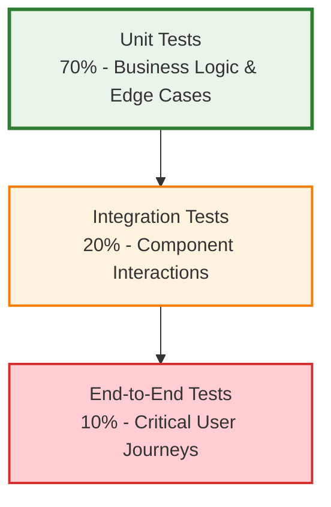

# Engineering Excellence

!!! quote "Excellence Mindset"
    *"Excellence is never an accident. It is always the result of high intention, sincere effort, and intelligent execution; it represents the wise choice of many alternatives."*

    **— Aristotle**

Engineering excellence isn't about perfection—it's about systematically building practices, culture, and capabilities that consistently deliver high-quality software. As a staff engineer, you're responsible for establishing and maintaining the standards that enable your organization to build reliable, maintainable, and valuable software systems.

## Defining Engineering Excellence

### The Excellence Framework

Engineering excellence operates across multiple dimensions simultaneously:

```mermaid
graph TD
    EE[Engineering Excellence] --> TQ[Technical Quality]
    EE --> PE[Process Effectiveness]
    EE --> TC[Team Capabilities]
    EE --> CI[Continuous Improvement]

    TQ --> CR[Code Reviews]
    TQ --> TE[Testing Excellence]
    TQ --> AR[Architecture Quality]
    TQ --> SEC[Security Practices]

    PE --> CI_CD[CI/CD Pipeline]
    PE --> DM[Deployment Management]
    PE --> IM[Incident Management]
    PE --> DOC[Documentation]

    TC --> SK[Skill Development]
    TC --> COL[Collaboration]
    TC --> MEN[Mentorship]
    TC --> KS[Knowledge Sharing]

    CI --> MET[Metrics & Measurement]
    CI --> FB[Feedback Loops]
    CI --> EXP[Experimentation]
    CI --> LEA[Learning Culture]

    style EE fill:#e1f5fe,stroke:#1976d2,stroke-width:3px
    style TQ fill:#e8f5e8,stroke:#2e7d32,stroke-width:2px
    style PE fill:#fff3e0,stroke:#f57c00,stroke-width:2px
    style TC fill:#f3e5f5,stroke:#7b1fa2,stroke-width:2px
    style CI fill:#fce4ec,stroke:#c2185b,stroke-width:2px
```

### Quality vs. Speed Balance

Excellence means optimizing for long-term velocity through sustainable practices:

**Short-term Focus**: Deliver features quickly, accumulate technical debt
**Long-term Focus**: Build sustainable practices that accelerate future development
**Excellence Approach**: Invest in practices that increase both quality and speed

## Technical Quality Practices

### Code Quality Standards

Establish consistent standards that make code easier to understand and maintain:

**Code Style**: Consistent formatting, naming conventions, and organization
**Complexity Management**: Keep functions and classes focused and understandable
**Documentation**: Clear comments explaining why, not just what
**Error Handling**: Comprehensive error handling and recovery strategies

### Code Review Excellence

Transform code reviews from gatekeeping to collaborative improvement:

**Review Criteria:**
- Correctness: Does the code do what it's supposed to do?
- Maintainability: Will future developers understand and modify this easily?
- Performance: Are there obvious performance issues?
- Security: Does this introduce security vulnerabilities?

**Review Culture:**
- Focus on learning and improvement, not fault-finding
- Provide specific, actionable feedback
- Explain the reasoning behind suggestions
- Recognize good code and practices

### Testing Strategy

Build comprehensive testing that provides confidence while enabling rapid change:

**Test Pyramid Implementation:**

**Quality Gates:**
- All code changes must have appropriate tests
- Tests must pass before merging
- Code coverage thresholds for critical paths
- Performance regression testing for key scenarios

### Architecture Excellence

Build systems that can evolve and scale with business needs:

**Design Principles**: Follow SOLID principles and separation of concerns
**Documentation**: Maintain current architectural decision records (ADRs)
**Dependency Management**: Minimize coupling and manage dependencies carefully
**Performance**: Design for appropriate performance characteristics from the start

## Process Excellence

### Continuous Integration & Deployment

Build deployment pipelines that enable rapid, reliable releases:

**CI Best Practices:**
- Fast feedback loops (< 10 minutes for basic validation)
- Comprehensive automated testing
- Security scanning integrated into pipeline
- Artifact generation and versioning

**CD Excellence:**
- Automated deployment to staging environments
- Production deployment with rollback capabilities
- Feature flags for controlled rollouts
- Monitoring and alerting for deployment health

### Incident Management

Handle production issues with systematic learning and improvement:

**Response Process:**
1. **Immediate Response**: Restore service quickly and safely
2. **Investigation**: Understand root causes thoroughly
3. **Communication**: Keep stakeholders informed throughout
4. **Learning**: Conduct blameless post-mortems
5. **Improvement**: Implement preventive measures

**Blameless Post-Mortems:**
- Focus on system improvements, not individual blame
- Document timeline, impact, and root causes
- Identify action items with owners and timelines
- Share learnings across the organization

### Documentation Excellence

Create documentation that serves its intended purpose effectively:

**Documentation Types:**
- **Architecture**: High-level system design and decisions
- **API**: Interface specifications and usage examples
- **Operational**: Deployment, monitoring, and troubleshooting guides
- **Developer**: Setup, contribution, and development guidelines

**Documentation Principles:**
- Keep it current through automated processes where possible
- Write for your intended audience's knowledge level
- Include examples and practical guidance
- Make it easily discoverable and searchable

## Team Excellence

### Skill Development

Invest in continuous learning and capability building:

**Technical Skills:**
- Encourage experimentation with new technologies
- Provide time and resources for learning
- Support conference attendance and training
- Create internal tech talks and learning sessions

**Soft Skills:**
- Communication and presentation skills
- Leadership and influence techniques
- Problem-solving and critical thinking
- Collaboration and conflict resolution

### Knowledge Sharing

Build practices that spread knowledge throughout the organization:

**Formal Sharing:**
- Regular tech talks and lightning talks
- Documentation and wiki maintenance
- Code review as teaching opportunity
- Mentorship programs

**Informal Sharing:**
- Pair programming and mob programming
- Cross-team collaboration
- Lunch and learns
- Community of practice groups

### Psychological Safety

Create environments where people can take risks and learn from failures:

**Safety Indicators:**
- People admit mistakes without fear of punishment
- Team members ask questions freely
- Dissenting opinions are welcomed and explored
- Failures are treated as learning opportunities

**Building Safety:**
- Model vulnerability by admitting your own mistakes
- Respond to failures with curiosity, not blame
- Celebrate learning and improvement efforts
- Ensure everyone has a voice in team discussions

## Measurement and Improvement

### Engineering Metrics

Track metrics that drive improvement rather than just measurement:

**DORA Metrics:**
- **Lead Time**: Time from code commit to production
- **Deployment Frequency**: How often you deploy to production
- **Mean Time to Recovery**: How quickly you recover from incidents
- **Change Failure Rate**: Percentage of deployments causing problems

**Quality Metrics:**
- **Code Coverage**: Percentage of code covered by tests
- **Technical Debt**: Time spent on maintenance vs. new features
- **Bug Rates**: Production defects per release or time period
- **Customer Satisfaction**: User experience and feedback metrics

### Continuous Improvement

Build systematic approaches to getting better over time:

**Improvement Processes:**
- Regular retrospectives focused on actionable improvements
- Experimentation with new practices and tools
- Learning from other teams and industry practices
- Investment in tools and automation

**Culture of Improvement:**
- Everyone is responsible for identifying improvement opportunities
- Small, incremental improvements are valued
- Failed experiments are learning opportunities
- Success is shared and celebrated

### Excellence Assessment

Regular evaluation of engineering excellence across dimensions:

!!! question "Engineering Excellence Self-Assessment"
    **Rate your team/organization (1=Needs Work, 5=Excellent):**

    === "Technical Quality"
        - [ ] Code review process catches issues effectively
        - [ ] Test coverage provides confidence for changes
        - [ ] Architecture supports business requirements
        - [ ] Security practices are integrated throughout development

    === "Process Effectiveness"
        - [ ] CI/CD pipeline enables rapid, reliable deployments
        - [ ] Incident response is systematic and learning-focused
        - [ ] Documentation serves its intended purposes
        - [ ] Planning and estimation processes work well

    === "Team Capabilities"
        - [ ] Team members are growing their skills continuously
        - [ ] Knowledge sharing happens regularly and effectively
        - [ ] Psychological safety enables risk-taking and learning
        - [ ] Collaboration across teams is productive

    === "Continuous Improvement"
        - [ ] Metrics drive decision-making and improvement
        - [ ] Regular retrospectives lead to meaningful changes
        - [ ] Experimentation with new practices is encouraged
        - [ ] Learning from failures improves future outcomes

## Implementation Strategy

### Excellence Roadmap

Build engineering excellence incrementally:

**Phase 1: Foundations (Months 1-3)**
- Establish code review standards
- Implement basic CI/CD pipeline
- Set up monitoring and alerting
- Create documentation standards

**Phase 2: Quality Systems (Months 4-6)**
- Comprehensive testing strategy
- Security integration
- Incident management process
- Metrics collection and analysis

**Phase 3: Cultural Integration (Months 7-12)**
- Learning and development programs
- Knowledge sharing practices
- Continuous improvement processes
- Excellence becomes part of team identity

### Change Management

Lead excellence initiatives effectively:

**Start Small**: Begin with practices that provide immediate value
**Build Consensus**: Get team buy-in through demonstration and education
**Measure Progress**: Show improvement through concrete metrics
**Celebrate Wins**: Recognize and celebrate improvements and achievements

## Cross-Reference Navigation

**Technical Foundations:**
- **[Technical Debt Management](technical-debt-management-framework.md)** - Systematic approach to managing technical debt
- **[Advanced Testing Strategies](advanced-testing-strategies.md)** - Comprehensive testing approaches
- **[CI/CD](continuous-integration-continuous-delivery.md)** - Automated deployment excellence

**Team and Culture:**
- **[Psychological Safety](../teamwork/cultural-transformation-psychological-safety.md)** - Building safe, high-performing teams
- **[Advanced Mentorship](../leadership/advanced-mentorship-career-development.md)** - Developing team capabilities
- **[Team Formation](../teamwork/team-formation.md)** - Building effective engineering teams

**Business Integration:**
- **[Engineering Metrics & Business Alignment](../business/engineering-metrics-business-alignment.md)** - Connecting excellence to business outcomes
- **[Strategic Thinking](../execution/strategic-thinking.md)** - Long-term excellence planning

## Further Reading

This chapter draws on software engineering excellence research and practice:

*   **Forsgren, Nicole, Jez Humble, and Gene Kim. *Accelerate: The Science of Lean Software and DevOps*.** Research-based approach to high-performing teams.
*   **Kim, Gene, Jez Humble, Patrick Debois, and John Willis. *The DevOps Handbook*.** Practical guide to building excellent engineering practices.
*   **Martin, Robert C. *Clean Code: A Handbook of Agile Software Craftsmanship*.** Principles and practices for writing excellent code.
*   **Edmondson, Amy. *The Fearless Organization*.** Building psychological safety for learning and innovation.
*   **Reinertsen, Donald G. *The Principles of Product Development Flow*.** Systems thinking approach to development excellence.