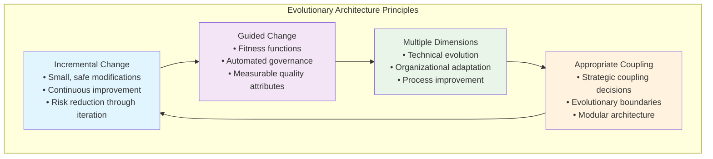

# Evolutionary Architecture: Building Systems That Adapt and Thrive

> *"An evolutionary architecture supports guided, incremental change along multiple dimensions."* - Neal Ford, Rebecca Parsons, and Patrick Kua

Picture this: You're reviewing the architecture of a system that launched three years ago as a simple product catalog. Today, it handles real-time inventory updates, personalized recommendations, complex pricing rules, multi-region deployment, and integration with dozens of external partners. The original architects did everything "right"—clean code, good test coverage, solid design patterns—but nobody anticipated this level of growth and complexity.

**Now imagine two different outcomes for this system:**

**Scenario A**: The architecture has become brittle. Each new feature requires extensive changes across multiple components. Deploy times have grown from minutes to hours. The team spends more time working around existing constraints than building new capabilities. Talk of a "rewrite" grows louder each quarter.

**Scenario B**: The architecture has evolved gracefully. New features plug into well-defined extension points. The system scales horizontally with minimal friction. Components can be replaced or upgraded independently. The architecture feels like it's growing more capable, not more constrained.

**The difference? Scenario B was designed for evolution from the beginning.**

Evolutionary Architecture is the practice of building systems that can adapt to changing requirements over time without requiring major rewrites or architectural overhauls. Developed by ThoughtWorks architects Neal Ford, Rebecca Parsons, and Patrick Kua, it provides a framework for creating architectures that improve and adapt rather than decay and constrain.

As a Staff Engineer, you're responsible for making architectural decisions that will serve your organization not just today, but through years of growth, changing requirements, and technological evolution. Evolutionary Architecture gives you tools to build systems that get better with age rather than worse.

## The Fundamental Principles of Evolutionary Architecture

Traditional architecture assumes we can predict the future and design systems accordingly. Evolutionary Architecture assumes we cannot predict the future and designs systems to adapt accordingly.



### Incremental Change: Evolution Over Revolution

**In plain English**: Make small, frequent improvements rather than large, risky overhauls.

The software industry is littered with failed "big bang" architecture migrations and rewrites. Teams spend months or years building a new system in parallel, only to discover that requirements have changed, the new system doesn't handle edge cases, or the migration is too risky to complete.

**Evolutionary Architecture takes the opposite approach**: make small, frequent changes that move the system toward a better state. Each change should be:

**Safe**: Low risk of breaking existing functionality
**Measurable**: You can verify that the change improves the system
**Reversible**: You can undo the change if it doesn't work as expected
**Incremental**: Each step builds on the previous ones toward a larger goal

**Example: Microservices Migration**

Instead of rewriting a monolith as microservices all at once:

1. **Extract one bounded context** as a separate service
2. **Establish communication patterns** between the services
3. **Monitor and measure** the impact on performance and reliability
4. **Learn and adjust** the approach based on real-world feedback
5. **Repeat** with the next bounded context, applying lessons learned

This approach reduces risk, enables learning, and maintains system functionality throughout the transition.

### Guided Change: Automated Quality Assurance

**In plain English**: Use automated tools to ensure changes improve rather than degrade system quality.

Evolution without guidance leads to entropy—systems that change randomly rather than improving systematically. Guided evolution uses "fitness functions" to automatically verify that changes move the architecture in the desired direction.

**Fitness functions are automated tests that verify architectural characteristics**:

**Performance Fitness Functions**:
```python
def test_api_response_time_fitness():
    """Ensure API responses remain under acceptable thresholds"""
    response = requests.get('/api/products')
    assert response.elapsed.total_seconds() < 0.5, "API response too slow"

def test_database_query_performance():
    """Prevent N+1 queries and other performance anti-patterns"""
    with QueryCounter() as counter:
        products = Product.objects.all()[:10]
        for product in products:
            _ = product.category.name  # Should not trigger additional queries
    
    assert counter.count <= 2, f"Too many queries: {counter.count}"
```

**Security Fitness Functions**:
```python
def test_no_hardcoded_secrets():
    """Ensure secrets aren't committed to source code"""
    secret_patterns = [
        r'password\s*=\s*["\'][^"\']+["\']',
        r'api_key\s*=\s*["\'][^"\']+["\']',
        r'secret\s*=\s*["\'][^"\']+["\']'
    ]
    
    violations = scan_codebase_for_patterns(secret_patterns)
    assert len(violations) == 0, f"Found hardcoded secrets: {violations}"

def test_dependency_vulnerabilities():
    """Ensure dependencies don't have known vulnerabilities"""
    vulnerabilities = security_scan_dependencies()
    critical_vulns = [v for v in vulnerabilities if v.severity == 'CRITICAL']
    assert len(critical_vulns) == 0, f"Critical vulnerabilities: {critical_vulns}"
```

**Modularity Fitness Functions**:
```python
def test_dependency_direction():
    """Ensure dependencies flow in the correct direction"""
    violations = analyze_dependency_violations([
        "domain -> infrastructure",  # Domain should not depend on infrastructure
        "use_cases -> controllers",   # Use cases should not depend on controllers
    ])
    assert len(violations) == 0, f"Dependency violations: {violations}"
```

### Multiple Dimensions of Evolution

**In plain English**: Systems evolve in many ways simultaneously—technical, organizational, and procedural.

Most architecture discussions focus solely on technical concerns: databases, frameworks, deployment patterns. But real systems evolve across multiple interconnected dimensions:

**Technical Dimension**:
- Code structure and modularity
- Data schemas and storage solutions
- Integration patterns and API design
- Performance and scalability characteristics

**Organizational Dimension** (Conway's Law in action):
- Team structure and communication patterns
- Skill development and knowledge distribution
- Decision-making processes and governance
- Ownership and responsibility models

**Process Dimension**:
- Development workflows and deployment practices
- Testing strategies and quality assurance
- Monitoring and incident response procedures
- Requirements gathering and user feedback loops

**Example: Microservices Adoption as Multi-Dimensional Evolution**

**Technical Evolution**:
- Extract services with well-defined boundaries
- Implement service discovery and load balancing
- Establish data consistency patterns across services
- Build observability and distributed tracing

**Organizational Evolution**:
- Align team boundaries with service boundaries
- Develop expertise in distributed systems patterns
- Establish service ownership and on-call responsibilities
- Create cross-team communication and coordination practices

**Process Evolution**:
- Implement independent deployment pipelines for services
- Establish service-level SLAs and monitoring
- Create processes for handling distributed transactions
- Develop incident response for multi-service failures

### Appropriate Coupling: Strategic Architecture Decisions

**In plain English**: Make conscious decisions about what should be tightly coupled and what should be loosely coupled.

Coupling often gets treated as universally bad, but that's an oversimplification. **The goal isn't to eliminate coupling—it's to ensure coupling decisions serve evolutionary goals.**

**High Coupling Can Be Appropriate When**:
- Components that always change together (high cohesion)
- Performance-critical code paths that benefit from tight integration
- Core business logic that represents stable, well-understood domains
- Components with identical lifecycle and deployment patterns

**Low Coupling Is Essential When**:
- Components owned by different teams or organizations
- Functionality that evolves at different rates
- Integration points with external systems
- Experimental or frequently changing features

**Strategic Coupling Decisions**:

```python
# HIGH COUPLING: Order and OrderItem are tightly related
class Order:
    def __init__(self, customer_id: str):
        self.customer_id = customer_id
        self.items: List[OrderItem] = []  # Tight coupling with OrderItem
        
    def add_item(self, product_sku: str, quantity: int, price: Money):
        # Business logic that always changes together
        item = OrderItem(product_sku, quantity, price)
        self.items.append(item)
        
    @property
    def total_amount(self) -> Money:
        return sum(item.total_price for item in self.items)

# LOW COUPLING: Order service uses abstractions for external concerns
class OrderService:
    def __init__(self, 
                 inventory: InventoryService,  # Interface, not implementation
                 payment: PaymentProcessor,    # Can be swapped out
                 notifications: NotificationService):  # Different evolution rate
        self._inventory = inventory
        self._payment = payment  
        self._notifications = notifications
```

## Implementing Evolutionary Architecture: Practical Patterns

### The Strangler Fig Pattern: Gradual System Replacement

Named after the strangler fig plant that gradually replaces the tree it grows on, this pattern enables incremental replacement of legacy systems.

**How It Works**:
1. **Intercept calls** to the legacy system
2. **Route new functionality** to the new system
3. **Gradually migrate** existing functionality from old to new
4. **Remove legacy components** when they're no longer needed

**Implementation Example**:
```python
class OrderServiceProxy:
    """Strangler Fig proxy that gradually routes traffic to new system"""
    
    def __init__(self, legacy_service: LegacyOrderService, 
                 new_service: ModernOrderService):
        self._legacy = legacy_service
        self._new = new_service
        
    def create_order(self, request: CreateOrderRequest) -> Order:
        # Feature flag determines routing
        if feature_flag_enabled('new_order_service', request.customer_id):
            return self._new.create_order(request)
        else:
            return self._legacy.create_order(request)
    
    def get_order(self, order_id: str) -> Order:
        # Route based on where the order was created
        if self._is_new_order(order_id):
            return self._new.get_order(order_id)
        else:
            return self._legacy.get_order(order_id)
```

### Branch by Abstraction: Safe Refactoring

This pattern enables large-scale refactoring by introducing abstractions that allow new and old implementations to coexist.

**Process**:
1. **Create abstraction** for the component being changed
2. **Implement abstraction** with existing code
3. **Switch clients** to use abstraction
4. **Create new implementation** behind the same abstraction
5. **Gradually switch** from old to new implementation
6. **Remove old implementation** when no longer needed

### Parallel Change (Expand-Contract): Schema Evolution

When evolving data schemas or APIs, use the expand-contract pattern to avoid breaking changes:

**Expand Phase**: Add new fields/endpoints alongside existing ones
```python
# API supports both old and new field names
class UserProfileResponse:
    def __init__(self, user: User):
        self.id = user.id
        self.name = user.name
        self.email = user.email
        
        # Support both old and new field names during transition
        self.phone_number = user.phone  # New field name
        self.phone = user.phone         # Old field name (deprecated)
```

**Contract Phase**: Remove old fields/endpoints after clients have migrated
```python
# After all clients use new field names, remove old ones
class UserProfileResponse:
    def __init__(self, user: User):
        self.id = user.id
        self.name = user.name
        self.email = user.email
        self.phone_number = user.phone  # Only new field name
```

## Fitness Functions: The Automated Architecture Governance

Fitness functions are the key innovation of Evolutionary Architecture—they provide automated feedback about whether changes improve or degrade architectural characteristics.

### Categories of Fitness Functions

**Static Analysis Fitness Functions**: Analyze code without executing it
```python
def test_architectural_boundaries():
    """Ensure layers don't violate dependency rules"""
    violations = []
    
    # Check that domain layer doesn't import from infrastructure
    domain_files = get_files_in_package('domain')
    for file in domain_files:
        imports = get_imports(file)
        infrastructure_imports = [i for i in imports if i.startswith('infrastructure')]
        if infrastructure_imports:
            violations.append(f"{file} imports {infrastructure_imports}")
    
    assert len(violations) == 0, f"Architecture violations: {violations}"
```

**Dynamic Analysis Fitness Functions**: Analyze running systems
```python
def test_response_time_distribution():
    """Ensure response times follow expected distribution"""
    response_times = collect_response_times_for_last_hour()
    
    p95_response_time = percentile(response_times, 95)
    assert p95_response_time < 500, f"P95 response time too high: {p95_response_time}ms"
    
    # Ensure we don't have too many slow outliers
    slow_requests = len([t for t in response_times if t > 1000])
    total_requests = len(response_times)
    slow_percentage = (slow_requests / total_requests) * 100
    
    assert slow_percentage < 1, f"Too many slow requests: {slow_percentage}%"
```

**Deployment Fitness Functions**: Verify system behavior in production
```python
def test_zero_downtime_deployment():
    """Ensure deployments don't cause service interruption"""
    start_time = time.time()
    
    # Trigger deployment
    deploy_new_version()
    
    # Monitor service availability during deployment
    errors = []
    while deployment_in_progress():
        response = requests.get('/health')
        if response.status_code != 200:
            errors.append(f"Health check failed at {time.time()}")
        time.sleep(1)
    
    assert len(errors) == 0, f"Service interruption during deployment: {errors}"
```

### Implementing Fitness Function Monitoring

```python
class ArchitectureFitnessMonitor:
    def __init__(self):
        self.functions = []
        
    def register_fitness_function(self, func: Callable, frequency: str):
        self.functions.append({
            'function': func,
            'frequency': frequency,  # 'on_commit', 'hourly', 'daily'
            'last_run': None,
            'failures': []
        })
    
    def run_commit_triggered_functions(self):
        """Run fitness functions on every commit"""
        for func_info in self.functions:
            if func_info['frequency'] == 'on_commit':
                try:
                    func_info['function']()
                    func_info['last_run'] = datetime.now()
                except Exception as e:
                    func_info['failures'].append(e)
                    raise FitnessFunctionFailure(f"Fitness function failed: {e}")
    
    def run_scheduled_functions(self):
        """Run periodic fitness functions"""
        for func_info in self.functions:
            if self._should_run_function(func_info):
                try:
                    func_info['function']()
                    func_info['last_run'] = datetime.now()
                except Exception as e:
                    func_info['failures'].append(e)
                    self._alert_fitness_function_failure(func_info, e)
```

## Evolutionary Data Architecture

Data is often the biggest constraint on architectural evolution. Here's how to design data systems that can evolve:

### Schema Evolution Strategies

**Additive Changes**: Always safe, maintain backward compatibility
```sql
-- Safe: Adding new optional columns
ALTER TABLE users ADD COLUMN phone_number VARCHAR(20);
ALTER TABLE users ADD COLUMN created_at TIMESTAMP DEFAULT CURRENT_TIMESTAMP;
```

**Transformative Changes**: Use expand-contract pattern
```python
# Phase 1: Expand - support both old and new formats
class User:
    @property 
    def full_name(self) -> str:
        # New format: separate first/last names
        if self.first_name and self.last_name:
            return f"{self.first_name} {self.last_name}"
        # Old format: single name field
        elif self.name:
            return self.name
        else:
            return ""

# Phase 2: Migrate data from old to new format
def migrate_user_names():
    users_with_old_format = User.objects.filter(
        first_name__isnull=True, 
        name__isnull=False
    )
    
    for user in users_with_old_format:
        parts = user.name.split(' ', 1)
        user.first_name = parts[0]
        user.last_name = parts[1] if len(parts) > 1 else ''
        user.save()

# Phase 3: Contract - remove old field
# ALTER TABLE users DROP COLUMN name;
```

### Event Sourcing for Evolutionary Data

Event sourcing provides natural evolution capabilities by storing events rather than current state:

```python
class OrderEventStore:
    def save_event(self, event: OrderEvent):
        # Events are append-only and immutable
        self.event_store.append(event)
    
    def get_order(self, order_id: str) -> Order:
        events = self.event_store.get_events_for_order(order_id)
        return self._replay_events(events)
    
    def _replay_events(self, events: List[OrderEvent]) -> Order:
        # Replay events through current business logic
        # This allows business logic to evolve while preserving history
        order = None
        for event in events:
            order = self._apply_event(order, event)
        return order
```

**Benefits for Evolution**:
- Business logic can evolve without losing historical data
- New projections can be created from existing events
- System behavior can be replayed with new logic
- Audit trail and debugging capabilities improve over time

## Organizational Evolution: Conway's Law as Design Tool

Since system architecture reflects organizational structure, evolving architecture often requires evolving organization:

### Team Topologies and Evolutionary Architecture

**Stream-Aligned Teams**: Evolve to own entire value streams
```python
# Team evolution: From feature teams to stream-aligned teams
# Before: Separate frontend, backend, and database teams
# After: Cross-functional teams owning complete user journeys

class CheckoutStreamTeam:
    responsibilities = [
        "Shopping cart functionality",
        "Payment processing integration", 
        "Order confirmation and tracking",
        "Checkout performance and reliability"
    ]
    
    capabilities = [
        "Frontend development (React, mobile)",
        "Backend services (Python, APIs)",
        "Database design and optimization",
        "Infrastructure and deployment"
    ]
```

**Platform Teams**: Evolve to reduce cognitive load for stream teams
```python
class DeveloperPlatformTeam:
    services_provided = [
        "Deployment pipelines and infrastructure",
        "Monitoring and observability tools",
        "Authentication and authorization services", 
        "Shared libraries and development tools"
    ]
    
    def reduce_stream_team_toil(self):
        # Platform evolution focuses on eliminating repetitive work
        return [
            "Self-service deployment",
            "Automated testing infrastructure",
            "Standard monitoring dashboards",
            "Shared component libraries"
        ]
```

### Knowledge Evolution and Documentation

**Architecture Decision Records (ADRs)**: Document evolution over time
```markdown
# ADR-015: Adopt Event-Driven Architecture for Order Processing

## Status
Accepted

## Context
Current synchronous order processing creates tight coupling between services 
and makes it difficult to add new functionality without impacting existing flows.

## Decision
We will adopt event-driven architecture for order processing, using Apache Kafka 
as the event streaming platform.

## Consequences
**Positive:**
- Loose coupling between order processing components
- Easy to add new order processing steps without changing existing code
- Better resilience through asynchronous processing

**Negative:**
- Increased complexity in debugging distributed workflows
- Need to handle eventual consistency scenarios
- Team needs to develop event streaming expertise

## Fitness Functions
- All order events must be processable within 30 seconds
- Event ordering must be maintained within partition
- No more than 0.1% message loss acceptable
```

## Measuring Evolutionary Success

How do you know if your evolutionary architecture is working? Track these key indicators:

### Technical Health Metrics

**Time to Implement New Features**:
```python
def measure_feature_implementation_time():
    """Track how long features take from conception to production"""
    return {
        'average_days_to_production': calculate_average_feature_time(),
        'trend': calculate_time_trend_over_last_year(),
        'complexity_adjusted': adjust_for_feature_complexity()
    }
```

**Deployment Frequency and Success Rate**:
```python  
def measure_deployment_health():
    """Track deployment velocity and reliability"""
    deployments = get_deployments_last_30_days()
    return {
        'frequency_per_day': len(deployments) / 30,
        'success_rate': calculate_success_rate(deployments),
        'rollback_rate': calculate_rollback_rate(deployments),
        'time_to_recovery': calculate_mean_time_to_recovery()
    }
```

### Architectural Quality Metrics

**Coupling and Cohesion Analysis**:
```python
def measure_architectural_quality():
    """Analyze code structure for evolutionary characteristics"""
    return {
        'cyclomatic_complexity': analyze_code_complexity(),
        'dependency_violations': count_architecture_violations(),
        'test_coverage': calculate_test_coverage(),
        'duplication_percentage': measure_code_duplication()
    }
```

**Technology Diversity and Obsolescence**:
```python
def measure_technology_health():
    """Track technology choices and currency"""
    return {
        'outdated_dependencies': count_outdated_dependencies(),
        'security_vulnerabilities': scan_for_vulnerabilities(),
        'technology_diversity_index': calculate_technology_spread(),
        'migration_debt': estimate_migration_effort_for_obsolete_tech()
    }
```

## Evolutionary Architecture Anti-Patterns

### The Big Bang Evolution
**Problem**: Attempting massive architectural changes all at once
**Example**: Rewriting entire monolith as microservices in one project
**Solution**: Use strangler fig or branch by abstraction for incremental change

### The Gold Plating Trap  
**Problem**: Over-engineering for hypothetical future requirements
**Example**: Building complex plugin systems for simple applications
**Solution**: YAGNI principle—add complexity only when you need it

### The Fitness Function Overload
**Problem**: Creating too many fitness functions that become maintenance burden
**Example**: 100+ fitness functions that constantly fail for minor issues
**Solution**: Focus on fitness functions that protect key architectural characteristics

### The Conway's Law Ignorance
**Problem**: Trying to evolve architecture without evolving organization
**Example**: Adopting microservices while maintaining monolithic team structure
**Solution**: Align team structure with desired system structure

## Key Takeaways

1. **Evolution beats revolution**: Incremental changes are safer and more sustainable than big bang rewrites
2. **Automation enables evolution**: Fitness functions provide automated feedback about architectural health
3. **Multiple dimensions matter**: Technical, organizational, and process evolution must happen together
4. **Appropriate coupling is strategic**: Make conscious decisions about what should be coupled and what should be decoupled
5. **Measure what matters**: Track metrics that indicate evolutionary health, not just current functionality
6. **Organization shapes architecture**: Use Conway's Law as a design tool, not just an observation

Evolutionary Architecture recognizes that change is the only constant in software systems. By designing for evolution from the beginning, you create systems that improve over time rather than decay. As a Staff Engineer, your role is to champion these practices and help your organization build architectures that thrive in the face of uncertainty and change.

## Further Reading

- Ford, Neal, Rebecca Parsons, and Patrick Kua. *Building Evolutionary Architectures: Support Constant Change*. 2017.
- Martin, Robert C. *Clean Architecture: A Craftsman's Guide to Software Structure and Design*. 2017.
- Fowler, Martin. *Refactoring: Improving the Design of Existing Code*. 2019.
- Hohpe, Gregor, and Bobby Woolf. *Enterprise Integration Patterns: Designing, Building, and Deploying Messaging Solutions*. 2003.
- Evans, Eric. *Domain-Driven Design: Tackling Complexity in the Heart of Software*. 2003.
- Skelton, Matthew, and Manuel Pais. *Team Topologies: Organizing Business and Technology Teams for Fast Flow*. 2019.