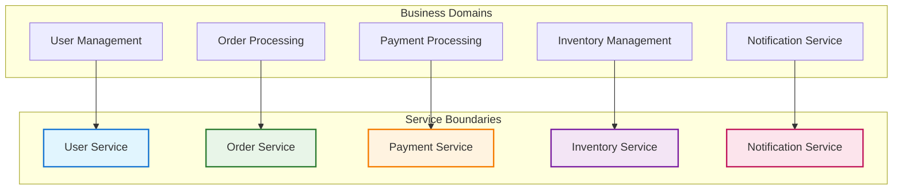
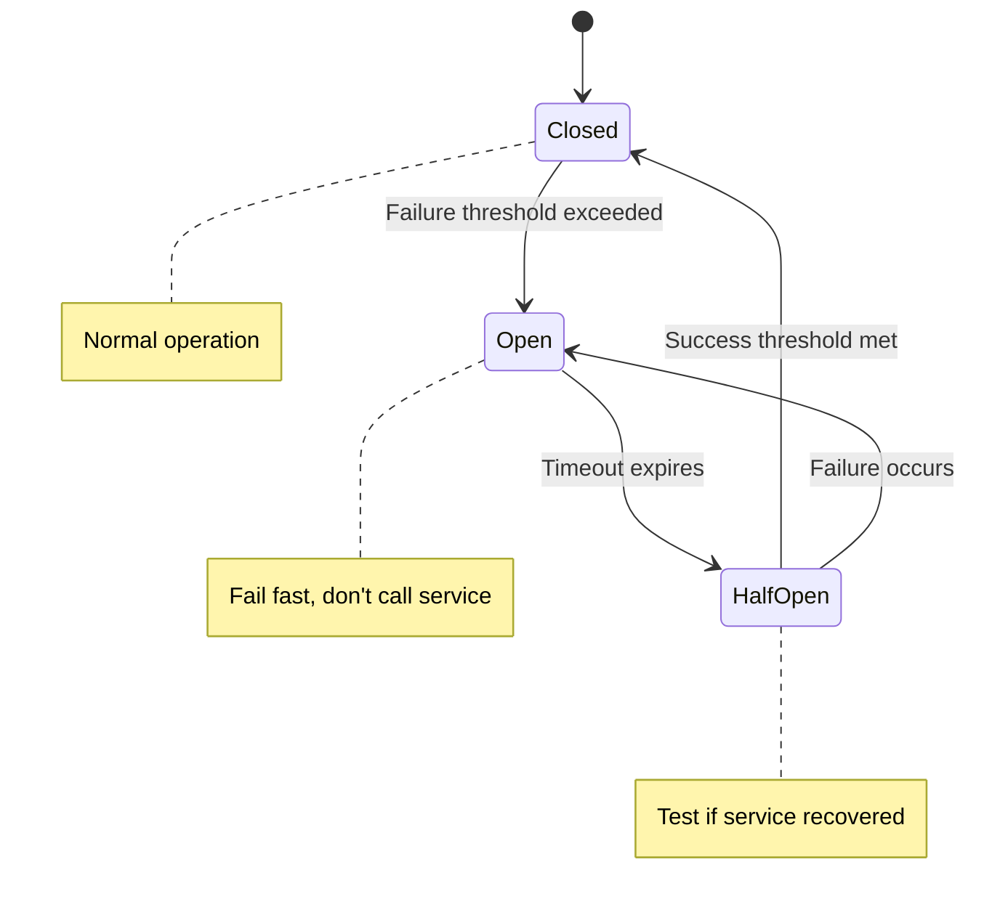
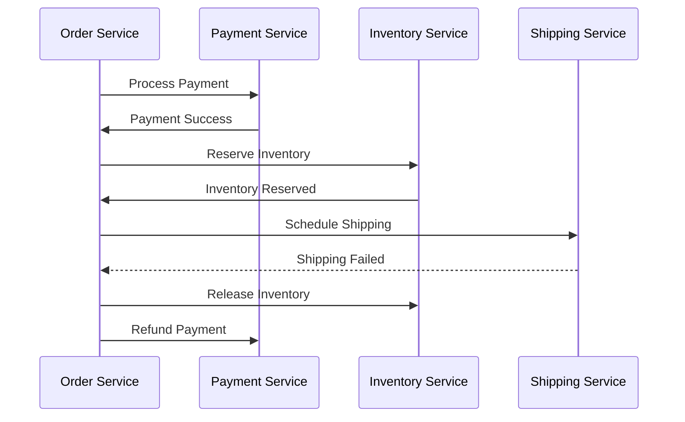

# Microservices Architecture

!!! quote "Microservices Excellence"
    *"Microservices are not a silver bullet. They solve certain problems while introducing others."*

    **— Sam Newman, Building Microservices**

Microservices architecture represents a distributed approach to system design where applications are composed of small, independently deployable services. For staff engineers, understanding when and how to implement microservices is crucial for building systems that can scale both technically and organizationally.

## Microservices Adoption Decision Framework

The decision between microservices and monolithic architecture should be based on systematic evaluation of organizational and technical factors rather than following industry trends or architectural preferences.

### Architecture Decision Matrix

| Factor | Monolithic Advantage | Microservices Advantage | Decision Threshold |
|--------|---------------------|-------------------------|-------------------|
| **Team Size** | <10 engineers - simpler coordination | >15 engineers - independent team scaling | Team growth trajectory and coordination overhead |
| **Domain Complexity** | Single bounded context - unified model | Multiple distinct domains - domain independence | Business model complexity and domain boundaries |
| **Deployment Frequency** | Weekly/monthly releases - batch efficiency | Multiple daily deployments - continuous delivery | Release velocity requirements and deployment risk tolerance |
| **Operational Maturity** | Basic monitoring sufficient - simpler operations | Advanced DevOps capabilities - distributed system expertise | Current operational sophistication and learning capacity |
| **Technology Diversity** | Consistent tech stack - reduced complexity | Multiple optimal technologies - best-fit solutions | Innovation requirements and technology constraints |
| **Data Consistency** | ACID transactions - strong consistency | Eventual consistency patterns - scalability | Business requirements for consistency vs availability |

### Implementation Readiness Assessment

Evaluate your organization's readiness for microservices through these critical capability areas:

-   :material-account-group: **Team Structure & Conway's Law**

    ---

    **Organizational Alignment**

    Team boundaries should align with desired service boundaries. Microservices work best when teams can own services end-to-end including development, testing, deployment, and operations. Cross-functional teams with business domain expertise enable effective service ownership and reduce coordination overhead.

-   :material-rocket-launch: **DevOps Maturity & Operations**

    ---

    **Deployment & Monitoring Excellence**

    Strong CI/CD pipelines, comprehensive observability, automated testing, and incident response capabilities are prerequisites for microservices success. The ability to deploy, monitor, and debug multiple services independently determines operational sustainability.

-   :material-network: **Service Design & Domain Boundaries**

    ---

    **Business Domain Understanding**

    Well-defined bounded contexts and clear service boundaries prevent distributed monolith antipatterns. Domain-driven design principles help identify appropriate service granularity and minimize cross-service dependencies that create operational complexity.

-   :material-database: **Data Management Strategy**

    ---

    **Database Independence**

    Each service should own its data and expose capabilities through well-defined APIs. Shared databases create tight coupling that eliminates many microservices benefits. Plan data migration strategies and consistency patterns before service extraction.

### Anti-Patterns: When NOT to Use Microservices

Avoid microservices when your organization exhibits these characteristics that indicate monolithic approaches provide better outcomes:

**Small Teams (< 10 engineers)**: The operational overhead outweighs benefits when teams lack sufficient scale to support distributed system complexity and service ownership responsibilities.

**Simple Business Domains**: Monolithic applications work effectively for straightforward business logic without complex domain boundaries or significantly different scaling requirements across functional areas.

**Shared Database Dependencies**: If services must share databases due to technical constraints or organizational limitations, you cannot achieve true service independence and should maintain monolithic data management.

**High Coordination Requirements**: Services that frequently change together or require tight coordination indicate incorrect service boundaries and suggest monolithic development approaches would be more efficient.

## Core Microservices Principles

### Business Capability Alignment

Design services around business capabilities, not technical layers:

### Data Ownership

Each service owns its data and doesn't directly access other services' data:

**Database per Service**: Each service has its own database
**API-Only Communication**: Services interact only through well-defined APIs
**Eventual Consistency**: Accept that data across services may be temporarily inconsistent
**Saga Pattern**: Manage distributed transactions through coordination

### Decentralized Governance

Allow teams to make technology choices appropriate for their services:

**Technology Diversity**: Teams choose languages, frameworks, and databases
**Standards vs. Autonomy**: Balance consistency with team autonomy
**Shared Libraries**: Minimize shared dependencies that create coupling
**Contract Testing**: Ensure API compatibility without centralized governance

## Service Design Patterns

### API Gateway Pattern

Provide a single entry point for client applications:

**Responsibilities:**
- Request routing to appropriate services
- Authentication and authorization
- Rate limiting and throttling
- Request/response transformation
- Monitoring and analytics

**Implementation Options:**
- **Cloud-managed**: AWS API Gateway, Google Cloud Endpoints
- **Self-hosted**: Kong, Zuul, Istio Gateway
- **Service mesh**: Integrated with service mesh solutions

### Service Discovery

Enable services to find and communicate with each other:

**Client-Side Discovery**: Clients query service registry and load balance
**Server-Side Discovery**: Load balancer queries service registry
**Service Mesh**: Infrastructure handles service discovery and communication

### Circuit Breaker Pattern

Prevent cascading failures in distributed systems:

**Implementation:**
- Monitor service call success/failure rates
- Open circuit when failure threshold is exceeded
- Periodically test if failed service has recovered

### Bulkhead Pattern

Isolate critical resources to prevent system-wide failures:

**Resource Isolation**: Separate thread pools, connection pools, or service instances
**Failure Containment**: Limit the blast radius of failures
**Priority Handling**: Ensure critical operations aren't affected by non-critical load

## Data Management in Microservices

### Database per Service

Each service owns its data completely, creating clear boundaries that enable independent evolution while introducing distributed data management complexity. This fundamental principle of microservices architecture creates both significant advantages and technical challenges that teams must carefully consider.

| Aspect | Benefits | Challenges |
| :--- | :--- | :--- |
| **Data Evolution** | Services can evolve their data models independently without affecting other services | Cross-service queries become complex, requiring careful API design |
| **System Coupling** | No accidental coupling through shared databases, enabling true service independence | Maintaining data consistency across services requires sophisticated patterns |
| **Technology Choice** | Technology diversity (SQL, NoSQL, specialized stores) allows optimization per use case | Distributed transaction management adds operational complexity |

### Event-Driven Data Synchronization

Use events to maintain consistency across services:

**Event Sourcing**: Store events rather than current state
**Event Streaming**: Use platforms like Kafka for event distribution
**Materialized Views**: Create read-optimized views from events
**Compensation Actions**: Handle failures through compensating transactions

### Saga Pattern

Manage distributed transactions across multiple services:

**Choreography**: Services coordinate through events
**Orchestration**: Central coordinator manages transaction flow

## Communication Patterns

### Synchronous Communication

Use HTTP/REST or gRPC for request-response interactions:

**When to Use:**
- Real-time user interactions
- Simple CRUD operations
- When immediate response is required

**Best Practices:**
- Implement timeouts and retries
- Use circuit breakers for resilience
- Design idempotent operations

### Asynchronous Communication

Use message queues or event streams for fire-and-forget operations:

**Message Queues**: Point-to-point communication (SQS, RabbitMQ)
**Event Streams**: Publish-subscribe communication (Kafka, EventBridge)
**Benefits**: Better resilience, loose coupling, improved performance

### API Versioning

Handle API evolution without breaking existing clients:

**URL Versioning**: `/v1/users`, `/v2/users`
**Header Versioning**: `Accept: application/vnd.api+json;version=1`
**Content Negotiation**: Use media types to specify versions
**Backward Compatibility**: Maintain older versions during transitions

## Operational Considerations

### Monitoring and Observability

Distributed systems require sophisticated monitoring:

**Distributed Tracing**: Track requests across multiple services (Jaeger, Zipkin)
**Centralized Logging**: Aggregate logs from all services (ELK stack, Splunk)
**Service Metrics**: Monitor service-specific health and performance
**Business Metrics**: Track business KPIs across the system

### Deployment Strategies

Deploy services independently while maintaining system stability:

**Blue-Green Deployment**: Switch traffic between two identical environments
**Canary Releases**: Gradually roll out changes to a subset of users
**Rolling Updates**: Replace instances gradually
**Feature Flags**: Control feature availability without deployment

### Testing Strategies

Test microservices at multiple levels:

**Unit Testing**: Test individual service components
**Integration Testing**: Test service interactions
**Contract Testing**: Verify API contracts between services (Pact)
**End-to-End Testing**: Test critical user journeys across services

## Security in Microservices

### Service-to-Service Authentication

Secure communication between services:

**Mutual TLS**: Encrypt and authenticate service communication
**JWT Tokens**: Stateless authentication tokens
**Service Mesh Security**: Infrastructure-level security (Istio, Linkerd)
**Zero Trust**: Verify every service interaction

### API Security

Protect external APIs from unauthorized access:

**OAuth 2.0**: Delegated authorization framework
**Rate Limiting**: Prevent abuse and ensure fair usage
**Input Validation**: Validate all inputs at service boundaries
**API Keys**: Simple authentication for trusted clients

## Migration Strategies

### Strangler Fig Pattern

Gradually replace monolithic systems:

1. **Identify Boundaries**: Find natural seams in the monolith
2. **Extract Services**: Create new services for specific capabilities
3. **Route Traffic**: Gradually redirect traffic to new services
4. **Retire Old Code**: Remove replaced monolith functionality

### Database Decomposition

Split monolithic databases safely:

**Shared Database Stage**: Services share database but with separate schemas
**Database per Service**: Gradually separate databases
**Data Synchronization**: Use events to keep data consistent during transition

## Cross-Reference Navigation

**Foundational Architecture:**
- **[Software Architecture](software-architecture.md)** - Core architectural principles
- **[Technical Architecture](technical-architecture.md)** - Strategic architecture planning
- **[Clean Architecture](clean-architecture.md)** - Service-level architecture patterns

**Operational Excellence:**
- **[Site Reliability Engineering](site-reliability-engineering.md)** - Operating distributed systems
- **[CI/CD](continuous-integration-continuous-delivery.md)** - Deployment strategies for microservices
- **[DevOps](devops.md)** - Cultural practices for microservices success

**Organizational Design:**
- **[Team Topologies](../teamwork/organizational-design.md)** - Aligning teams with microservices
- **[Conway's Law](../teamwork/organizational-design.md)** - How organization structure affects architecture

## Further Reading

This chapter draws on microservices experts and practitioners:

*   **Newman, Sam. *Building Microservices: Designing Fine-Grained Systems*.** Comprehensive guide to microservices design and implementation.
*   **Richardson, Chris. *Microservices Patterns: With Examples in Java*.** Practical patterns for microservices architecture.
*   **Dehghani, Zhamak. *Data Mesh: Delivering Data-Driven Value at Scale*.** Modern approaches to data architecture in distributed systems.
*   **Burns, Brendan, and Dave Beda. *Kubernetes: Up and Running*.** Container orchestration for microservices deployment.
*   **Kleppmann, Martin. *Designing Data-Intensive Applications*.** Fundamental principles for distributed data systems.