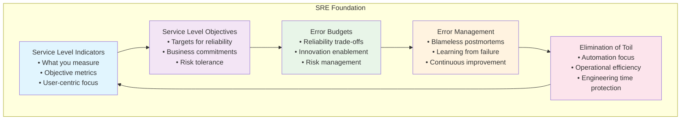

# Site Reliability Engineering: Building Systems That Scale and Endure

> *"Hope is not a strategy."* - Traditional SRE saying

Picture this: It's 2 AM, and you're jolted awake by your phone. The production system is down. Users can't access the service. Revenue is hemorrhaging by the minute. As you fumble for your laptop, you realize this is the third outage this month, and each time it's a different root cause—a cascade failure from overloaded databases, a memory leak that went undetected, a configuration change that seemed safe in staging but catastrophic in production.

Sound familiar? You're experiencing the symptoms of systems built without reliability principles.

**Site Reliability Engineering (SRE) isn't just about keeping the lights on—it's about building systems that are inherently reliable, observable, and manageable at scale.** Developed at Google and battle-tested across the industry's most demanding environments, SRE provides a framework for turning reliability from an afterthought into a core engineering practice.

As a Staff Engineer, you're uniquely positioned to champion SRE principles across your organization. You understand both the technical depth required and the organizational change needed to implement these practices effectively. Your role is to bridge the gap between "move fast and break things" and "never break anything"—finding the sweet spot where teams can innovate rapidly while maintaining the reliability users expect.

## The Fundamental Principles of Site Reliability Engineering

Imagine you're an engineer at a fast-growing startup. Six months ago, you had a simple monolith serving a few thousand users. Today, you're managing a distributed system with millions of requests per hour, and every outage makes headlines. The old approach of "hope it works and fix it when it breaks" no longer scales.

**This is where SRE transforms everything.** Instead of reactive firefighting, SRE provides a systematic approach to reliability that actually gets better as your system grows more complex. It's built on five interconnected principles that work together like gears in a precision machine:

Think of these principles as a reliability flywheel. **Service Level Indicators** tell you what's actually happening to users. **Service Level Objectives** set your reliability targets. **Error Budgets** give you permission to take calculated risks. **Error Management** helps you learn from failures instead of just surviving them. And **Elimination of Toil** frees up your team to work on improvements instead of just keeping the lights on.

The magic happens when these principles work together. Better SLIs lead to more realistic SLOs, which create more useful error budgets, which enable better risk-taking and learning, which reduces toil and creates time for even better monitoring. It's a virtuous cycle that gets stronger over time.

### Service Level Indicators: The North Star of Reliability

**In plain English**: SLIs are the specific metrics that matter most to your users' experience.

Here's a story that might sound familiar. Last week, your monitoring dashboard was green across the board—CPU at 45%, memory at 60%, disk space plenty available. Everything looked perfect. Then your phone started buzzing with user complaints. "I can't log in!" "Search is taking forever!" "My payment failed!" 

**This disconnect happens because most teams measure what's convenient, not what's critical.** Your servers might be humming along beautifully while your users are having a terrible experience. Service Level Indicators fix this by forcing you to see your system through your users' eyes.

Think of SLIs as the vital signs of user experience. Just like a doctor doesn't just check if your heart is beating—they measure heart rate, blood pressure, and oxygen levels—you need to measure the specific aspects of your system that determine whether users succeed or struggle.

The best SLIs share three crucial characteristics:

> **User-centric focus**: They measure what users experience, not what servers experience
>
> **"Percentage of login attempts that complete successfully within 2 seconds"** tells you something meaningful about user frustration.
>
> **"Average database CPU utilization"** tells you something about server health but nothing about user success.

> **Objective measurement**: They come from real data, not opinions or manual checks
>
> When your payment system reports a 99.5% success rate, that's based on actual transaction logs, not a feeling that "payments seem to be working fine."

> **Clear actionability**: When the number gets worse, you know what to investigate
>
> If login success rate drops from 99% to 95%, you can immediately start investigating authentication services, database performance, or network issues. If "overall system health" drops, where do you even start?

Here's what makes this practical for Staff Engineers: **you don't need dozens of SLIs—you need the right handful.** Work with your product teams to identify the 3-5 user actions that define success for your service. Then build measurement around those specific experiences. Everything else is supporting data.

### Service Level Objectives: Setting the Reliability Bar

**In plain English**: SLOs are your promise to users about how reliable your service will be.

Picture this scenario: Your CEO walks into a planning meeting and declares, "We need 100% uptime. Users should never experience any problems." The room goes quiet. Everyone knows this sounds great, but something feels off. After all, even AWS has outages, right?

**This is the perfectionism trap that SLOs help you escape.** The uncomfortable truth is that perfect reliability isn't just impossible—it's often the wrong goal entirely. Your users don't need perfection; they need appropriate, predictable reliability for their specific use case.

Consider these different scenarios:

**A social media app** where someone can't post a photo for 30 seconds? Mildly annoying, but they'll probably try again.

**A financial trading system** that's unavailable for 30 seconds during market hours? Potentially millions of dollars in losses and serious regulatory issues.

**An internal HR tool** used by 20 employees once a week? Different reliability expectations than a consumer app used by millions.

The power of SLOs is that they make these trade-offs explicit instead of leaving them as vague aspirations. Instead of arguing about whether the system should be "more reliable," you can have concrete conversations:

- *"Should we target 99.9% or 99.95% availability for the payment API?"*
- *"Is 200ms acceptable for our 95th percentile response time, or do we need 100ms?"*
- *"Can we tolerate 50 errors per million requests, or do we need to get that down to 10?"*

Here's where it gets really powerful: **SLOs become a shared language between engineering and business teams.** Your product manager understands that achieving 99.99% availability costs significantly more engineering time than 99.9%. Your business stakeholders can make informed decisions about reliability investments versus new features.

As a Staff Engineer, your superpower is facilitating these conversations. Help your teams choose SLOs that stretch them without breaking them—targets that are ambitious enough to drive improvement but realistic enough to achieve consistently.

### Error Budgets: The Innovation Enablement Framework

**In plain English**: Error budgets give you permission to fail—within limits.

Here's a scenario every engineering team faces: Product wants to ship a new feature quickly. Engineering wants to add more tests, improve monitoring, and do a gradual rollout. The conversation devolves into "move fast" versus "be careful," with no framework for making the trade-off.

**Error budgets solve this problem by making risk concrete and manageable.** If your SLO allows for 99.9% uptime, you have a budget for 43.2 minutes of downtime per month. As long as you're within budget, you can take risks—ship features faster, try new technologies, make architectural changes. When you're approaching your budget, you slow down and focus on reliability.

This transforms the relationship between development velocity and system reliability from adversarial to collaborative:

**When you have error budget remaining:**
- Deploy more frequently
- Experiment with new features
- Try performance optimizations
- Make architectural improvements

**When you're approaching your error budget:**
- Slow down feature development
- Focus on reliability improvements
- Increase testing and review rigor
- Postpone risky changes

The beauty of error budgets is that they make reliability a shared responsibility between development and operations, with clear incentives aligned around business objectives.

**Your role as a Staff Engineer** is to help teams implement error budget policies that encourage both innovation and reliability, and to model how these trade-offs should be made in practice.

### Blameless Postmortems: Learning from Failure

**In plain English**: When things go wrong, focus on fixing the system, not fixing blame.

Traditional incident response goes something like this: system fails, everyone scrambles to restore service, then management asks "Who caused this?" and "How do we make sure it never happens again?" The result is a culture of fear where people hide mistakes, avoid taking risks, and focus on covering themselves rather than improving systems.

**Blameless postmortems flip this script entirely.** They start with the assumption that the people involved in the incident are competent, well-intentioned professionals who made reasonable decisions given the information and constraints they had. The goal isn't to assign blame—it's to understand why the system failed and how to make it more resilient.

This doesn't mean accepting poor performance or avoiding accountability. It means recognizing that **complex systems fail in complex ways**, and that sustainable reliability comes from improving systems, not punishing people.

A great postmortem answers these questions:
- **What happened?** A clear timeline of events
- **Why did it happen?** Root cause analysis, often revealing multiple contributing factors
- **What can we learn?** Insights about system behavior, monitoring gaps, or process improvements
- **What will we do differently?** Specific, actionable improvements with owners and timelines

**Your role as a Staff Engineer** is to model blameless culture in your incident response and postmortems, helping teams learn from failures and build more resilient systems.

### Elimination of Toil: Protecting Engineering Time

**In plain English**: Automate the repetitive work so engineers can focus on engineering.

Every engineering team has that one person who spends half their time restarting services, manually deploying releases, or responding to the same alerts over and over. They're busy, they're stressed, and they feel essential—but they're trapped in a cycle of reactive work that prevents them from making lasting improvements.

**SRE calls this "toil"—work that is manual, repetitive, automatable, tactical, and devoid of enduring value.** The goal isn't to eliminate all operational work (some operational tasks require human judgment and are genuinely valuable), but to systematically reduce toil so that engineering time is spent on engineering problems.

The most effective approach to toil reduction is methodical:

**Measure it**: Track how much time is spent on different types of operational work.
**Prioritize it**: Focus on the toil that consumes the most time or causes the most pain.
**Automate it**: Build tools, scripts, and systems that eliminate manual intervention.
**Monitor it**: Ensure automation is working and continues to reduce toil over time.

The compound effect of toil reduction is remarkable. Every hour of manual work you automate away gives you an hour back every time that task would have been performed. Teams that systematically eliminate toil find themselves with more time for architecture improvements, better testing, and proactive reliability work.

**Your role as a Staff Engineer** is to help teams identify their highest-impact toil, advocate for time to automate it, and ensure that toil reduction becomes a sustainable practice rather than a one-time effort.

## SRE Applied: Practical Implementation for Staff Engineers

### Implementing SLIs and SLOs in Practice

**Start with user journeys, not system metrics.** Work with product teams to map out the critical user flows—login, search, purchase, data sync—and identify the SLIs that matter most for each flow.

Here's a practical example from an e-commerce platform:

**User Journey**: Product Purchase
**Key SLIs**:
- Availability: Percentage of purchase attempts that receive a response
- Latency: 95th percentile response time for purchase API
- Quality: Percentage of successful purchases that are correctly processed

**SLO Example**:
- 99.9% of purchase attempts receive a response within 10 seconds
- 99% of purchase attempts complete successfully
- 99.95% of successful purchases are correctly processed (charged, inventory updated, confirmation sent)

Notice how these SLIs directly map to user experience outcomes, not internal system health metrics.

### Error Budget Implementation

Create clear policies that guide decision-making when error budgets are consumed:

**Error Budget Policy Framework**:

**Budget Status: Green (0-50% consumed)**
- Normal development velocity
- Regular feature releases
- Standard change review process
- Acceptable risk tolerance

**Budget Status: Yellow (50-80% consumed)**
- Increased change review rigor
- Focus on reliability improvements
- Defer non-critical features
- Enhanced monitoring and alerting

**Budget Status: Red (80%+ consumed)**
- Feature freeze except critical bug fixes
- All-hands focus on reliability
- Mandatory architectural review for changes
- Postmortem required for any further budget consumption

### Building an Effective On-Call Culture

On-call shouldn't be a punishment—it should be a feedback mechanism that drives system improvements. Here's how to build sustainable on-call practices:

**Rotation Structure**:
- Primary and secondary on-call engineers
- Reasonable rotation frequency (typically 1-2 weeks)
- Clear escalation paths and expectations
- Time zone coverage that matches user needs

**Alert Quality**:
- Every alert should be actionable
- False positive rate below 5%
- Clear runbooks for common issues
- Automated resolution where possible

**Compensation and Recovery**:
- Compensate engineers for on-call work
- Provide time off after significant incidents
- Limit on-call load to sustainable levels
- Regular review of on-call burden distribution

## Observability: The Eyes and Ears of Reliable Systems

Observability goes beyond traditional monitoring—it's about building systems that can explain their own behavior, especially when they're misbehaving in novel ways.

### The Three Pillars of Observability

**Metrics**: Aggregated numeric data over time
- System health dashboards
- SLI/SLO tracking
- Resource utilization trends
- Business metrics correlation

**Logs**: Structured records of discrete events
- Request traces and debugging information
- Error details and stack traces
- Audit trails and compliance records
- Correlation identifiers across services

**Traces**: Request flow through distributed systems
- End-to-end latency analysis
- Dependency mapping and bottleneck identification
- Error propagation paths
- Performance optimization insights

### Implementing Effective Observability

**Start with Service Level Indicators**: Build dashboards that show user-facing metrics first, system metrics second.

**Implement Structured Logging**: Use consistent log formats with correlation IDs that enable efficient querying and analysis.

**Deploy Distributed Tracing**: Instrument critical user flows so you can follow requests across service boundaries.

**Create Actionable Alerts**: Every alert should answer "What's wrong?" "Why should I care?" and "What should I do about it?"

## Capacity Planning and Performance Engineering

Reliable systems don't just work—they work under load, during peak usage, and as they scale.

### Capacity Planning Framework

**Baseline Measurement**: Understand current usage patterns and resource consumption
- Peak traffic patterns and seasonal variations
- Resource utilization trends and bottlenecks
- User growth projections and business forecasts

**Load Testing Strategy**: Validate system behavior under stress
- Gradual load increase to find breaking points
- Spike testing for traffic surges
- Chaos testing for component failures
- Real-world scenario simulation

**Scalability Analysis**: Plan for growth before you need it
- Horizontal vs. vertical scaling trade-offs
- Database scaling strategies and data partitioning
- CDN and caching optimization
- Auto-scaling configuration and testing

### Performance Engineering Practices

**Establish Performance Budgets**: Define acceptable performance targets for new features and changes
- Page load time limits for frontend features
- API response time requirements
- Resource usage constraints for background jobs
- Database query performance thresholds

**Continuous Performance Monitoring**: Catch regressions before they reach production
- Automated performance testing in CI/CD pipelines
- Performance regression detection and alerting
- Resource usage trend analysis
- User experience monitoring (Core Web Vitals, real user monitoring)

## Incident Response and Crisis Management

When systems fail—and they will—your response determines whether failure becomes catastrophe or learning opportunity.

### Incident Command System for Technical Incidents

**Role Definition**:
- **Incident Commander**: Coordinates response, makes high-level decisions, communicates with stakeholders
- **Subject Matter Experts**: Investigate technical issues, implement fixes, provide domain knowledge
- **Communications Lead**: Manages internal and external communications, updates status pages

**Response Phases**:

**Detection and Assessment (0-15 minutes)**:
- Acknowledge alerts and assemble response team
- Assess impact and determine severity level
- Establish communications channels and notification protocols

**Mitigation and Investigation (15 minutes - 4 hours)**:
- Implement immediate mitigations to restore service
- Investigate root cause while maintaining service stability
- Document timeline and decisions for postmortem analysis

**Recovery and Resolution (4+ hours)**:
- Implement permanent fixes and verify stability
- Conduct initial postmortem discussion
- Plan follow-up improvements and prevention measures

### Crisis Communication Framework

**Internal Communications**:
- Regular status updates with specific timelines
- Clear escalation criteria and stakeholder notification
- Decision documentation and rationale
- Resource needs and coordination requests

**External Communications**:
- Timely, accurate status page updates
- Customer notification through appropriate channels
- Transparent communication about impact and resolution timeline
- Follow-up communications with lessons learned

## Disaster Recovery and Business Continuity

Reliable systems survive not just component failures, but entire data center outages, regional disasters, and black swan events.

### Disaster Recovery Planning

**Recovery Time Objective (RTO)**: How long can the service be unavailable?
- Acceptable downtime for different service tiers
- Business impact analysis and prioritization
- Recovery procedure time estimation and optimization

**Recovery Point Objective (RPO)**: How much data loss is acceptable?
- Backup frequency and retention policies
- Data replication strategies and consistency requirements
- Transaction recovery and data integrity verification

**Business Continuity Strategy**:
- Multi-region architecture and failover procedures
- Data backup and restoration testing
- Vendor dependencies and alternative arrangements
- Communication plans and stakeholder coordination

### Testing and Validation

**Disaster Recovery Testing**: Regular exercises to validate recovery procedures
- Scheduled failover tests and performance validation
- Data restoration verification and integrity checking
- Communication protocol testing and stakeholder engagement
- Documentation updates based on testing results

**Game Day Exercises**: Simulate realistic failure scenarios
- Cross-team coordination under pressure
- Decision-making with incomplete information
- Communication effectiveness during crisis
- Learning and improvement identification

## SRE Implementation Strategy for Organizations

### Starting Small: SRE Adoption Framework

**Phase 1: Foundation (Months 1-3)**
- Establish SLI/SLO practices for critical services
- Implement basic observability and alerting
- Begin error budget tracking and reporting
- Introduce blameless postmortem culture

**Phase 2: Expansion (Months 3-9)**
- Extend SRE practices to additional services
- Build automation to reduce toil
- Develop on-call rotations and escalation procedures
- Implement capacity planning and load testing

**Phase 3: Maturity (Months 9-18)**
- Cross-team SRE expertise and knowledge sharing
- Advanced observability and chaos engineering
- Comprehensive disaster recovery and business continuity
- SRE as organizational competency and culture

### Building SRE Teams and Capabilities

**Embedded SRE Model**: SRE engineers work within product teams
- Pros: Close collaboration, deep domain knowledge, rapid feedback
- Cons: Risk of local optimization, inconsistent practices across teams
- Best for: Small organizations, early SRE adoption, specialized services

**Centralized SRE Model**: Dedicated SRE team supports multiple services
- Pros: Consistent practices, shared expertise, efficient resource utilization
- Cons: Potential bottlenecks, less domain-specific knowledge
- Best for: Large organizations, mature SRE practices, platform services

**Hybrid SRE Model**: Combination of embedded and centralized approaches
- Pros: Flexibility, expertise sharing, scalable practices
- Cons: Coordination complexity, role clarity challenges
- Best for: Growing organizations, diverse service portfolio, evolving needs

## Assessment Framework: SRE Maturity Model

Use this framework to evaluate your current SRE practices and identify improvement opportunities:

### Service Reliability Foundation
- [ ] Critical services have defined SLIs based on user experience
- [ ] SLOs are set with business input and technical feasibility
- [ ] Error budgets are calculated and tracked consistently
- [ ] Error budget policies guide engineering decision-making

### Incident Management and Learning
- [ ] Incident response follows established procedures and roles
- [ ] Postmortems are blameless and focus on system improvement
- [ ] Action items from postmortems are tracked and completed
- [ ] Incident trends are analyzed for systemic improvements

### Observability and Monitoring
- [ ] Systems provide comprehensive metrics, logs, and traces
- [ ] Alerts are actionable and have low false positive rates
- [ ] Dashboards show user-facing metrics and system health
- [ ] On-call engineers have effective runbooks and escalation paths

### Automation and Toil Reduction
- [ ] Repetitive operational tasks are identified and measured
- [ ] High-impact toil is systematically automated
- [ ] Engineering time is protected for reliability improvements
- [ ] Automation is maintained and monitored for effectiveness

### Capacity and Performance
- [ ] System capacity is planned and monitored proactively
- [ ] Load testing validates system behavior under stress
- [ ] Performance budgets prevent regressions
- [ ] Scaling strategies are tested and proven effective

### Disaster Recovery and Resilience
- [ ] Recovery objectives (RTO/RPO) are defined and achievable
- [ ] Backup and recovery procedures are tested regularly
- [ ] Multi-region failover capabilities are validated
- [ ] Business continuity plans address realistic failure scenarios

## Key Takeaways

1. **SRE is fundamentally about trade-offs**: Balancing reliability with innovation speed through error budgets and conscious risk management
2. **Observability enables reliability**: You can't improve what you can't measure, and modern systems require comprehensive visibility
3. **Culture matters as much as technology**: Blameless postmortems and toil reduction create conditions for sustainable reliability
4. **Start small and expand systematically**: Begin with critical services and core practices, then extend SRE principles across the organization
5. **Reliability is a business decision**: SLOs must reflect business needs and user expectations, not just technical perfection
6. **Automation is essential for scale**: Manual processes become bottlenecks and failure points as systems grow in complexity

Site Reliability Engineering provides a framework for building systems that users can depend on while maintaining the agility to innovate and grow. As a Staff Engineer, your role is to champion these practices, demonstrate their value through implementation, and build organizational capability that creates lasting competitive advantage.

## Further Reading

- Beyer, Betsy, et al. *Site Reliability Engineering: How Google Runs Production Systems*. 2016.
- Beyer, Betsy, et al. *The Site Reliability Workbook: Practical Ways to Implement SRE*. 2018.
- Blank, Alex. *Seeking SRE: Conversations About Running Production Systems at Scale*. 2018.
- Kleppmann, Martin. *Designing Data-Intensive Applications*. 2017.
- Majors, Charity, et al. *Observability Engineering*. 2022.
- Rosenthal, Casey, and Nora Jones. *Chaos Engineering: System Resiliency in Practice*. 2020.