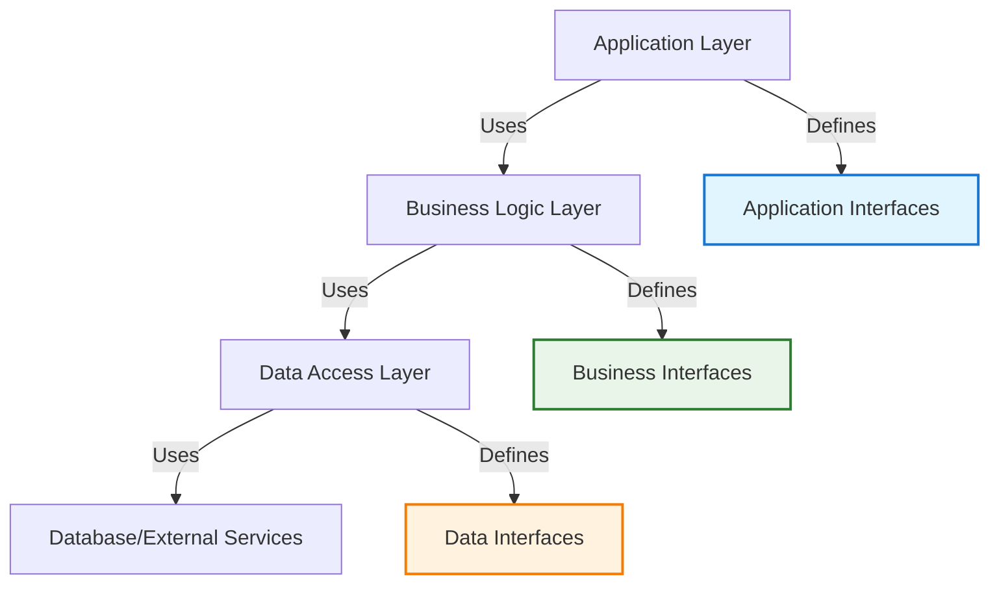

# Software Architecture Fundamentals

!!! quote "Architecture Excellence"
    *"Architecture represents the significant design decisions that shape a system, where significant is measured by cost of change."*

    **— Grady Booch**

Software architecture forms the foundational structure of any significant software system. As a staff engineer, your architectural decisions create the blueprint that determines how easily your system can be built, maintained, and evolved over time.

## Core Architecture Principles

### Separation of Concerns

Divide system complexity into manageable, focused components:

**Single Responsibility**: Each module should have one reason to change
**High Cohesion**: Related functionality should be grouped together
**Loose Coupling**: Components should depend on abstractions, not concrete implementations
**Interface Segregation**: Clients shouldn't depend on interfaces they don't use

### Abstraction and Modularity

Create systems that hide complexity behind well-defined interfaces:



### Dependency Management

Structure dependencies to create maintainable systems:

**Dependency Inversion**: High-level modules shouldn't depend on low-level modules
**Dependency Injection**: Provide dependencies rather than creating them
**Interface-Based Design**: Program to interfaces, not implementations

## Common Architecture Patterns

### Layered Architecture

Organize code into horizontal layers with clear responsibilities:

**Presentation Layer**: User interface and input handling
**Application Layer**: Application-specific business rules and workflows
**Domain Layer**: Core business logic and domain models
**Infrastructure Layer**: Database access, external services, frameworks

**Benefits:**
- Clear separation of concerns
- Familiar pattern for most developers
- Supports different user interfaces

**Trade-offs:**
- Can lead to rigid structures
- Performance overhead from layer traversal
- Risk of anemic domain models

### Model-View-Controller (MVC)

Separate user interface logic from business logic:

**Model**: Data and business logic
**View**: User interface representation
**Controller**: Handles user input and coordinates between Model and View

**Modern Variations:**
- **MVP (Model-View-Presenter)**: View is passive, Presenter handles all UI logic
- **MVVM (Model-View-ViewModel)**: ViewModel provides data binding for the View

### Component-Based Architecture

Build systems from reusable, composable components:

**Component Characteristics:**
- Self-contained with clear interfaces
- Reusable across different contexts
- Independently testable and deployable
- Well-defined responsibilities

**Implementation Examples:**
- React components in frontend systems
- Microservices in distributed systems
- Plugin architectures in desktop applications

### Event-Driven Architecture

Build reactive systems that respond to events:

**Event Sourcing**: Store events as the primary source of truth
**CQRS**: Separate command and query responsibilities
**Message Queues**: Asynchronous communication between components
**Publish-Subscribe**: Loosely coupled event distribution

## Quality Attributes

### Performance

Design for the performance requirements of your system:

**Scalability**: Ability to handle increased load
**Throughput**: Number of transactions per unit time
**Latency**: Time to process individual requests
**Resource Utilization**: Efficient use of CPU, memory, and network

### Reliability

Build systems that continue operating despite failures:

**Fault Tolerance**: Continue operating with degraded functionality
**Error Recovery**: Graceful handling of error conditions
**Redundancy**: Backup systems and failover mechanisms
**Monitoring**: Observability into system health and performance

### Security

Implement security as a fundamental architectural concern:

**Authentication**: Verify user identity
**Authorization**: Control access to resources
**Data Protection**: Encrypt sensitive data
**Secure Communication**: Protect data in transit

### Maintainability

Design systems that can be easily modified and extended:

**Modularity**: Clear boundaries between system components
**Documentation**: Clear description of architectural decisions
**Testing**: Comprehensive test coverage at all levels
**Code Quality**: Consistent style and clear naming

## Architectural Decision Making

### Architecture Decision Records (ADRs)

Document significant architectural decisions:

```
# ADR-001: Database Technology Selection

## Status
Accepted

## Context
We need to choose a database technology for our user management system.
The system requires ACID transactions and will have moderate read/write loads.

## Decision
We will use PostgreSQL for the primary database.

## Consequences
Positive:
- Strong consistency guarantees
- Rich query capabilities
- Mature ecosystem and tooling

Negative:
- Scaling requires more complex sharding strategies
- Learning curve for team members familiar only with NoSQL
```

### Evaluation Criteria

Systematically evaluate architectural alternatives:

**Technical Fit**: Does it solve the technical requirements?
**Team Skills**: Can the team effectively implement and maintain it?
**Performance**: Will it meet performance requirements under load?
**Cost**: What are the total costs of implementation and operation?
**Risk**: What are the technical and business risks?

## Modern Architecture Considerations

### Cloud-Native Architecture

Design for cloud environments and modern deployment practices:

**Twelve-Factor App Principles**: Configuration, dependencies, processes, backing services
**Containerization**: Package applications with their dependencies
**Orchestration**: Automated deployment and scaling with Kubernetes
**Service Mesh**: Infrastructure layer for service-to-service communication

### Distributed Systems Patterns

Handle the complexity of distributed architectures:

**Circuit Breaker**: Prevent cascading failures
**Bulkhead**: Isolate critical resources
**Saga Pattern**: Manage distributed transactions
**Event Sourcing**: Handle distributed state management

### API-First Design

Design systems around well-defined APIs:

**REST**: Representational State Transfer for web APIs
**GraphQL**: Query language for flexible data fetching
**gRPC**: High-performance RPC framework
**OpenAPI**: Specification and tooling for REST APIs

## Cross-Reference Navigation

**Foundational Patterns:**
- **[Clean Architecture](clean-architecture.md)** - Detailed clean architecture implementation
- **[Technical Architecture](technical-architecture.md)** - Strategic architecture planning
- **[Domain-Driven Design Overview](../../appendix/domain-driven-design/ddd-overview.md)** - Business-focused architecture

**Implementation Practices:**
- **[Microservices Architecture](microservices-architecture.md)** - Distributed systems architecture
- **[Engineering Excellence](engineering-excellence.md)** - Quality practices for architecture
- **[CI/CD](continuous-integration-continuous-delivery.md)** - Deployment architecture

**Design Thinking:**
- **[System Design Patterns](../../appendix/design-patterns/index.md)** - Reusable architectural solutions
- **[Strategic Thinking](../execution/strategic-thinking.md)** - Long-term architectural planning

## Further Reading

This chapter draws on fundamental software architecture texts:

*   **Bass, Len, Paul Clements, and Rick Kazman. *Software Architecture in Practice*.** Comprehensive guide to software architecture principles and practices.
*   **Fowler, Martin. *Patterns of Enterprise Application Architecture*.** Classic patterns for enterprise software architecture.
*   **Evans, Eric. *Domain-Driven Design*.** Architectural approaches focused on business domains.
*   **Newman, Sam. *Building Microservices*.** Modern distributed architecture patterns.
*   **Richards, Mark, and Neal Ford. *Fundamentals of Software Architecture*.** Contemporary approach to software architecture.