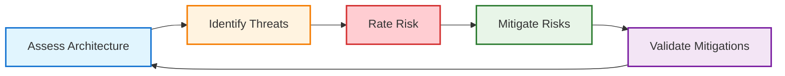
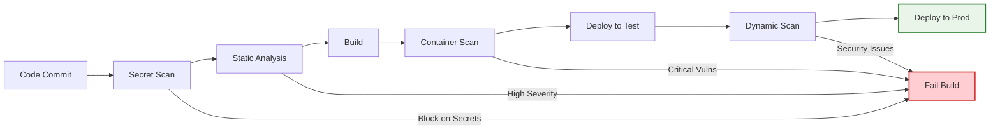

# Software Security

!!! quote "Security Excellence"
    *"Security is not a product, but a process."*

    **— Bruce Schneier**

Software security is a fundamental responsibility for staff engineers, requiring integration of security considerations throughout the entire development lifecycle. Your security decisions and practices protect not just your systems, but your users' data, your organization's reputation, and business continuity.

## Security-First Mindset

### Threat Modeling

Systematic approach to identifying and mitigating security threats:

**STRIDE Framework:**
- **Spoofing**: Impersonating users or systems
- **Tampering**: Unauthorized modification of data or systems
- **Repudiation**: Denying actions or transactions
- **Information Disclosure**: Unauthorized access to sensitive information
- **Denial of Service**: Making systems unavailable
- **Elevation of Privilege**: Gaining unauthorized access levels

**Threat Modeling Process:**

### Defense in Depth

Layer multiple security controls to create resilient systems:

**Network Security**: Firewalls, VPNs, network segmentation
**Application Security**: Input validation, authentication, authorization
**Data Security**: Encryption, access controls, data classification
**Operational Security**: Monitoring, incident response, security procedures

### Security by Design

Integrate security considerations from the beginning of development:

**Secure Architecture**: Design systems with security as a foundational requirement
**Security Requirements**: Define security requirements alongside functional requirements
**Privacy by Design**: Implement privacy protections as default system behavior
**Principle of Least Privilege**: Grant minimum necessary access and permissions

## Core Security Practices

### Authentication and Authorization

Implement robust identity and access management:

**Authentication Methods:**
- Multi-factor authentication (MFA)
- Single sign-on (SSO) integration
- Certificate-based authentication
- Biometric authentication for high-security applications

**Authorization Patterns:**
- Role-based access control (RBAC)
- Attribute-based access control (ABAC)
- OAuth 2.0 and OpenID Connect
- JSON Web Tokens (JWT) for stateless authorization

### Input Validation and Sanitization

Protect against injection attacks and malformed input:

**Validation Strategies:**
- Whitelist validation (preferred over blacklist)
- Input type and format validation
- Length and range checking
- Encoding and escaping user input

**Common Injection Attacks:**
- SQL injection prevention through parameterized queries
- Cross-site scripting (XSS) prevention
- Command injection protection
- LDAP and XML injection mitigation

### Cryptography and Data Protection

Implement strong cryptographic practices:

**Encryption Standards:**
- AES-256 for symmetric encryption
- RSA-2048 or ECDSA for asymmetric encryption
- TLS 1.3 for transport encryption
- Authenticated encryption modes (AES-GCM)

**Key Management:**
- Hardware security modules (HSMs) for key storage
- Regular key rotation procedures
- Secure key distribution mechanisms
- Separation of encryption and signing keys

### Secure Communication

Protect data in transit between systems:

**Transport Layer Security:**
- TLS configuration and cipher suite selection
- Certificate management and validation
- Certificate pinning for mobile applications
- Perfect forward secrecy implementation

**API Security:**
- Rate limiting and throttling
- API key management
- Request signing and validation
- Secure API gateway configuration

## Vulnerability Management

### Security Testing

Integrate security testing throughout development:

**Static Application Security Testing (SAST):**
- Code analysis for security vulnerabilities
- Integration with CI/CD pipelines
- Custom rules for organization-specific risks
- False positive management and tuning

**Dynamic Application Security Testing (DAST):**
- Runtime security testing
- Automated vulnerability scanning
- Penetration testing procedures
- Security regression testing

**Interactive Application Security Testing (IAST):**
- Real-time vulnerability detection
- Code and runtime analysis combination
- Accurate vulnerability identification
- Reduced false positive rates

### Dependency Management

Secure third-party dependencies and libraries:

**Supply Chain Security:**
- Dependency vulnerability scanning
- Software bill of materials (SBOM) generation
- Trusted package repositories
- Dependency update automation with security patches

**Package Security:**
- Package signing and verification
- License compliance checking
- Malicious package detection
- Dependency freshness monitoring

### Security Monitoring and Incident Response

Detect and respond to security incidents:

**Security Information and Event Management (SIEM):**
- Centralized log collection and analysis
- Security event correlation and alerting
- Automated threat detection rules
- Forensic analysis capabilities

**Incident Response Process:**
1. **Preparation**: Establish response procedures and team
2. **Detection**: Identify potential security incidents
3. **Containment**: Limit impact and prevent spread
4. **Eradication**: Remove threat from environment
5. **Recovery**: Restore normal operations
6. **Lessons Learned**: Document and improve processes

## DevSecOps Integration

### Security in CI/CD Pipelines

Automate security checks throughout deployment:

**Pipeline Security Gates:**
- Secret scanning in code repositories
- Security unit tests and integration tests
- Container vulnerability scanning
- Infrastructure as code security validation

**Automated Security Workflows:**

### Container and Cloud Security

Secure containerized and cloud-native applications:

**Container Security:**
- Base image security and regular updates
- Container image scanning and policies
- Runtime security monitoring
- Kubernetes security configurations

**Cloud Security:**
- Identity and access management (IAM) policies
- Network security groups and firewalls
- Encryption at rest and in transit
- Cloud security posture management (CSPM)

### Infrastructure Security

Secure the underlying infrastructure:

**Infrastructure as Code (IaC) Security:**
- Security policy as code
- Automated compliance checking
- Configuration drift detection
- Immutable infrastructure patterns

**Network Security:**
- Zero trust network architecture
- Micro-segmentation strategies
- VPC and subnet configuration
- Network access control lists (NACLs)

## Compliance and Governance

### Regulatory Compliance

Meet industry-specific security requirements:

**Common Frameworks:**
- SOC 2 Type II compliance
- ISO 27001 certification
- PCI DSS for payment processing
- HIPAA for healthcare data
- GDPR for European data protection

### Security Governance

Establish organizational security oversight:

**Security Policies:**
- Acceptable use policies
- Data classification and handling procedures
- Incident response procedures
- Security awareness training requirements

**Security Metrics:**
- Security vulnerability trends
- Mean time to patch vulnerabilities
- Security incident frequency and impact
- Security training completion rates

## Emerging Security Challenges

### AI and Machine Learning Security

Address security challenges in AI systems:

**Model Security:**
- Adversarial attack prevention
- Model poisoning protection
- Data privacy in training sets
- Model explainability and auditability

**AI-Powered Security:**
- Automated threat detection
- Behavioral analysis and anomaly detection
- Security orchestration and response
- Intelligent vulnerability management

### Cloud-Native Security

Secure modern cloud-native architectures:

**Serverless Security:**
- Function-level security controls
- Event-driven security monitoring
- Cold start security considerations
- Serverless-specific vulnerability management

**Service Mesh Security:**
- mTLS between services
- Service-to-service authorization
- Security policy enforcement
- Traffic encryption and inspection

## Cross-Reference Navigation

**Privacy Integration:**
- **[Privacy by Design](../ethics/privacy-by-design.md)** - Privacy-focused security practices
- **[Ethical Frameworks](../ethics/ethical-frameworks.md)** - Ethical considerations in security decisions

**System Design:**
- **[Technical Architecture](technical-architecture.md)** - Security considerations in system architecture
- **[Site Reliability Engineering](site-reliability-engineering.md)** - Security aspects of system reliability

**Development Practices:**
- **[CI/CD](continuous-integration-continuous-delivery.md)** - Security integration in deployment pipelines
- **[Engineering Excellence](engineering-excellence.md)** - Quality practices that include security

## Further Reading

This chapter draws on cybersecurity best practices and research:

*   **Anderson, Ross. *Security Engineering: A Guide to Building Dependable Distributed Systems*.** Comprehensive guide to building secure systems.
*   **McGraw, Gary. *Software Security: Building Security In*.** Integrating security throughout the software development lifecycle.
*   **Shostack, Adam. *Threat Modeling: Designing for Security*.** Practical approach to systematic threat modeling.
*   **OWASP Foundation. *OWASP Top 10*.** Annual list of the most critical web application security risks.
*   **NIST. *Cybersecurity Framework*.** Framework for improving critical infrastructure cybersecurity.