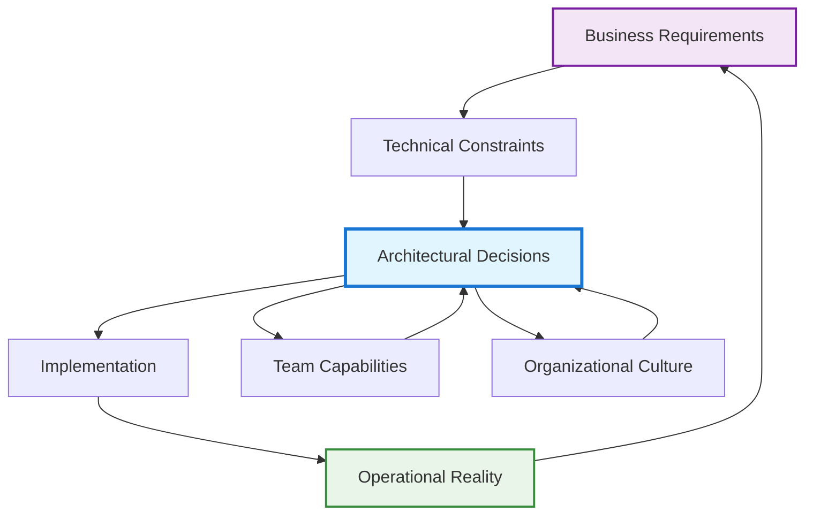
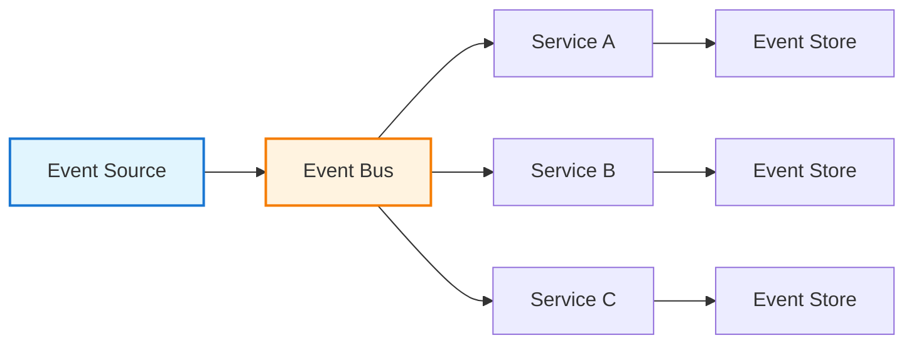

# Technical Architecture & Systems Design

!!! quote "Architecture Excellence"
    *"The architecture of a system is the set of structures needed to reason about the system, which comprise software elements, relations among them, and properties of both."*

    **— SEI Software Architecture Definition**

Technical architecture is the art and science of designing systems that balance competing forces: performance versus cost, flexibility versus simplicity, innovation versus reliability. As a staff engineer, your architectural decisions create the foundation upon which your organization builds its technical capabilities for years to come.

## The Staff Engineer's Architectural Mindset

Architecture isn't just about technology—it's about creating technical solutions that serve business objectives while enabling future growth and adaptation. Staff engineers approach architecture with a unique perspective that combines deep technical expertise with organizational awareness.

### Architecture as Organizational Enabler

Your architectural decisions should amplify your organization's capabilities:

- **Team Autonomy**: Design systems that allow teams to work independently
- **Velocity**: Create architectural patterns that accelerate development
- **Quality**: Build in quality gates and practices at the architectural level
- **Scalability**: Plan for growth in both technical and organizational dimensions

### The Systems Thinking Approach

Effective technical architecture requires seeing the system as a whole, understanding the interactions and feedback loops between components, teams, and business processes.



## Foundational Architecture Principles

### Conway's Law in Practice

*"Organizations which design systems are constrained to produce designs which are copies of the communication structures of these organizations."*

**Practical Application:**
- Design your architecture to match your desired team communication patterns
- If you want autonomous teams, create systems with clear boundaries and minimal coupling
- Use Team Topologies patterns to align architecture with organizational design

### The Principle of Least Astonishment

Your architectural decisions should be predictable and follow established patterns within your organization:

- **Consistency**: Use established patterns and technologies unless there's a compelling reason to deviate
- **Documentation**: Make architectural decisions explicit and discoverable
- **Evolution**: Plan for incremental change rather than revolutionary rebuilding

### Quality Attributes as First-Class Citizens

Define and measure the quality attributes that matter most to your system:

**Performance**: Response time, throughput, resource utilization
**Reliability**: Availability, fault tolerance, disaster recovery
**Security**: Authentication, authorization, data protection
**Scalability**: Horizontal and vertical scaling capabilities
**Maintainability**: Code clarity, testing, deployment automation
**Flexibility**: Ability to adapt to changing requirements

## Architectural Decision Making

### Architecture Decision Records (ADRs)

Document significant architectural decisions to capture context, alternatives considered, and rationale:

**Template Structure:**
```
# ADR-001: [Decision Title]

Date: [YYYY-MM-DD]
Status: [Proposed | Accepted | Deprecated | Superseded]

## Context
What is the issue that we're seeing that is motivating this decision?

## Decision
What is the change that we're proposing or have agreed to implement?

## Consequences
What becomes easier or more difficult to do and any risks introduced?

## Alternatives Considered
What other options were evaluated and why were they not chosen?
```

### The Architecture Review Process

Establish systematic review processes for architectural changes:

1. **Proposal Phase**: Present options with trade-offs clearly articulated
2. **Review Phase**: Gather input from stakeholders and technical experts
3. **Decision Phase**: Make decision with clear rationale
4. **Implementation Phase**: Monitor implementation against architectural intent
5. **Evolution Phase**: Adapt architecture based on operational feedback

## Modern Architecture Patterns

### Microservices Architecture

Design distributed systems that enable organizational scalability:

**When to Choose Microservices:**
- Large, complex domains that can be meaningfully decomposed
- Multiple teams that need to develop and deploy independently
- Different scaling requirements for different parts of the system
- Willingness to accept distributed system complexity

**Design Principles:**
- **Business Capability Alignment**: Services should align with business capabilities
- **Data Ownership**: Each service owns its data and doesn't directly access others' data
- **Failure Isolation**: Design for partial system failure
- **Decentralized Governance**: Teams choose their own technology stacks within guardrails

### Event-Driven Architecture

Build systems that respond to business events in real-time:



**Benefits:**
- Loose coupling between system components
- Natural scalability and performance characteristics
- Rich audit trail of business events
- Flexibility to add new event consumers

### Domain-Driven Design (DDD) Integration

Align technical architecture with business domain understanding:

- **Bounded Contexts**: Define clear boundaries around domain models
- **Ubiquitous Language**: Use domain terminology in code and architecture
- **Aggregate Design**: Design for consistency and transaction boundaries
- **Context Mapping**: Understand relationships between different domains

## Architecture for Scale

### Horizontal Scaling Patterns

Design systems that can scale by adding more instances:

**Stateless Services**: Ensure services don't maintain state between requests
**Load Distribution**: Use load balancers and routing to distribute work
**Data Partitioning**: Shard data across multiple stores for performance
**Caching Strategies**: Implement caching at multiple levels

### Vertical Scaling Considerations

Understand when and how to scale individual components:

- **Performance Profiling**: Identify bottlenecks before scaling
- **Resource Optimization**: Optimize before adding resources
- **Cost Analysis**: Balance performance gains against infrastructure costs

## Architecture Documentation

### The C4 Model

Document architecture at multiple levels of abstraction:

**Level 1: System Context**: How your system fits into the world
**Level 2: Containers**: Major components and their interactions
**Level 3: Components**: Internal structure of containers
**Level 4: Code**: Implementation details (usually not needed)

### Living Documentation

Ensure architectural documentation stays current:

- **Code Generation**: Generate diagrams from code when possible
- **Automated Updates**: Use CI/CD to update documentation
- **Regular Reviews**: Schedule regular architecture documentation reviews
- **Team Ownership**: Make teams responsible for their component documentation

## Technology Selection Framework

### The Technology Radar Approach

Organize technology choices into categories:

**Adopt**: Technologies you're confident in using for new projects
**Trial**: Technologies worth exploring with low-risk projects
**Assess**: Technologies to keep an eye on but not yet ready to trial
**Hold**: Technologies to avoid or phase out

### Evaluation Criteria

Systematically evaluate new technologies:

**Technical Fit**: Does it solve the problem better than existing solutions?
**Team Capability**: Does the team have or can develop the necessary skills?
**Organizational Alignment**: Does it fit with existing technology choices?
**Support & Community**: Is there adequate support and community?
**Long-term Viability**: Will this technology be supported long-term?

## Cross-Reference Navigation

**Foundation Knowledge:**
- **[Clean Architecture](clean-architecture.md)** - Principles for building maintainable software architecture
- **[Evolutionary Architecture](evolutionary-architecture.md)** - Techniques for architecture that can adapt over time
- **[Site Reliability Engineering](site-reliability-engineering.md)** - Operating principles for scalable systems

**Practical Applications:**
- **[Microservices Architecture](microservices-architecture.md)** - Detailed patterns for distributed systems
- **[Architecture Decision Records](adrs.md)** - Templates and processes for documenting decisions
- **[System Design Patterns](../../appendix/design-patterns/index.md)** - Reusable solutions to common problems

**Organizational Integration:**
- **[Team Topologies](../teamwork/organizational-design.md)** - Aligning architecture with team structure
- **[Strategic Thinking](../execution/strategic-thinking.md)** - Connecting architecture to business strategy

## Further Reading

This chapter draws on insights from several foundational architecture texts:

*   **Bass, Len, Paul Clements, and Rick Kazman. *Software Architecture in Practice*.** The definitive guide to software architecture principles and practices.
*   **Brown, Simon. *Software Architecture for Developers*.** A practical approach to software architecture that emphasizes communication and evolution.
*   **Evans, Eric. *Domain-Driven Design: Tackling Complexity in the Heart of Software*.** Essential reading for aligning technical architecture with business domains.
*   **Ford, Neal, Rebecca Parsons, and Patrick Kua. *Building Evolutionary Architectures*.** Techniques for creating architecture that can adapt to changing requirements.
*   **Newman, Sam. *Building Microservices*.** Comprehensive guide to designing, building, and maintaining microservices architectures.
*   **Richards, Mark, and Neal Ford. *Fundamentals of Software Architecture*.** Modern architectural patterns and practices for contemporary systems.