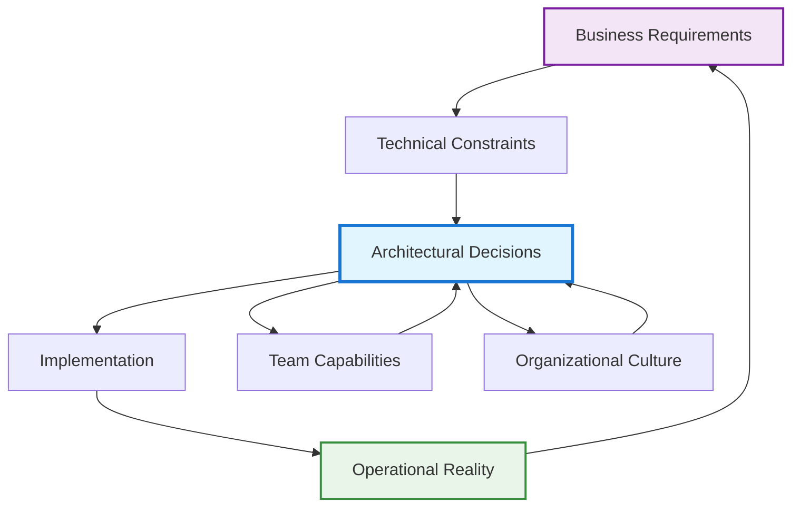
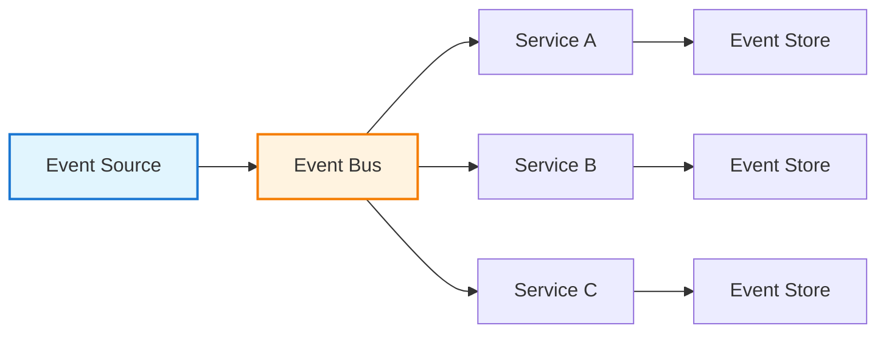

# Technical Architecture & Systems Design

!!! quote "Architecture Excellence"
    *"The architecture of a system is the set of structures needed to reason about the system, which comprise software elements, relations among them, and properties of both."*

    **— SEI Software Architecture Definition**

Technical architecture is the art and science of designing systems that balance competing forces: performance versus cost, flexibility versus simplicity, innovation versus reliability. As a staff engineer, your architectural decisions create the foundation upon which your organization builds its technical capabilities for years to come.

## The Staff Engineer's Architectural Mindset

Architecture isn't just about technology—it's about creating technical solutions that serve business objectives while enabling future growth and adaptation. Staff engineers approach architecture with a unique perspective that combines deep technical expertise with organizational awareness.

### Architecture as Organizational Enabler

Your architectural decisions should amplify your organization's capabilities:

- **Team Autonomy**: Design systems that allow teams to work independently
- **Velocity**: Create architectural patterns that accelerate development
- **Quality**: Build in quality gates and practices at the architectural level
- **Scalability**: Plan for growth in both technical and organizational dimensions

### The Systems Thinking Approach

Effective technical architecture requires seeing the system as a whole, understanding the interactions and feedback loops between components, teams, and business processes.



## Foundational Architecture Principles

### Conway's Law in Practice

*"Organizations which design systems are constrained to produce designs which are copies of the communication structures of these organizations."*

**Practical Application:**
- Design your architecture to match your desired team communication patterns
- If you want autonomous teams, create systems with clear boundaries and minimal coupling
- Use Team Topologies patterns to align architecture with organizational design

### The Principle of Least Astonishment

Your architectural decisions should be predictable and follow established patterns within your organization:

- **Consistency**: Use established patterns and technologies unless there's a compelling reason to deviate
- **Documentation**: Make architectural decisions explicit and discoverable
- **Evolution**: Plan for incremental change rather than revolutionary rebuilding

### Quality Attributes as First-Class Citizens

Define and measure the quality attributes that matter most to your system:

**Performance**: Response time, throughput, resource utilization
**Reliability**: Availability, fault tolerance, disaster recovery
**Security**: Authentication, authorization, data protection
**Scalability**: Horizontal and vertical scaling capabilities
**Maintainability**: Code clarity, testing, deployment automation
**Flexibility**: Ability to adapt to changing requirements

## Architectural Decision Making

### Architecture Decision Records (ADRs)

Document significant architectural decisions to capture context, alternatives considered, and rationale:

**Template Structure:**
```
# ADR-001: [Decision Title]

Date: [YYYY-MM-DD]
Status: [Proposed | Accepted | Deprecated | Superseded]

## Context
What is the issue that we're seeing that is motivating this decision?

## Decision
What is the change that we're proposing or have agreed to implement?

## Consequences
What becomes easier or more difficult to do and any risks introduced?

## Alternatives Considered
What other options were evaluated and why were they not chosen?
```

### The Architecture Review Process

Establish systematic review processes for architectural changes:

1. **Proposal Phase**: Present options with trade-offs clearly articulated
2. **Review Phase**: Gather input from stakeholders and technical experts
3. **Decision Phase**: Make decision with clear rationale
4. **Implementation Phase**: Monitor implementation against architectural intent
5. **Evolution Phase**: Adapt architecture based on operational feedback

## Modern Architecture Patterns

### Microservices Architecture

Design distributed systems that enable organizational scalability:

**When to Choose Microservices:**
- Large, complex domains that can be meaningfully decomposed
- Multiple teams that need to develop and deploy independently
- Different scaling requirements for different parts of the system
- Willingness to accept distributed system complexity

**Design Principles:**

Effective microservices architecture follows four foundational design principles that work together to create truly independent, scalable services. Business capability alignment ensures that services map directly to business functions rather than technical layers, creating natural boundaries that reflect organizational responsibilities. Data ownership establishes clear boundaries where each service owns its data completely and never directly accesses another service's data store, preventing hidden coupling through shared databases. Failure isolation designs systems to gracefully handle partial failures, ensuring that problems in one service don't cascade throughout the entire system. Finally, decentralized governance empowers teams to choose their own technology stacks within established organizational guardrails, enabling optimization for specific use cases while maintaining overall system coherence.

### Event-Driven Architecture

Build systems that respond to business events in real-time:



**Benefits:**

Event-driven architecture delivers significant advantages for complex distributed systems. It creates loose coupling between system components, allowing services to evolve independently without requiring direct knowledge of downstream consumers. The architecture provides natural scalability and performance characteristics since events can be processed asynchronously and distributed across multiple consumers. Event sourcing creates a rich audit trail of business events, enabling sophisticated analytics, debugging, and compliance capabilities. Most importantly, the pattern offers tremendous flexibility to add new event consumers without modifying existing producers, supporting organic system growth and feature development.

### Domain-Driven Design (DDD) Integration

Align technical architecture with business domain understanding:

- **Bounded Contexts**: Define clear boundaries around domain models
- **Ubiquitous Language**: Use domain terminology in code and architecture
- **Aggregate Design**: Design for consistency and transaction boundaries
- **Context Mapping**: Understand relationships between different domains

## Architecture Pattern Decision Framework

Choosing the right architectural pattern requires systematic evaluation of organizational, technical, and business factors. Use this framework to guide architectural decisions based on your specific context and constraints.

### Architecture Pattern Comparison Matrix

| Pattern | Complexity | Scalability | Maintainability | Team Size | Development Speed | Best For |
|---------|------------|-------------|-----------------|-----------|------------------|----------|
| **Monolithic** | Low | Vertical only | High (initially) | 1-10 | Fast (early) | MVP, simple domains, small teams |
| **Modular Monolith** | Medium | Vertical + logical separation | High | 5-20 | Fast | Evolving systems, unclear boundaries |
| **Microservices** | High | Horizontal + vertical | Medium (depends on design) | 15+ | Medium (with tooling) | Complex domains, large teams |
| **Service-Oriented (SOA)** | Medium-High | Service-level | Medium | 10-30 | Medium | Enterprise integration, legacy systems |
| **Event-Driven** | Medium | Excellent | Medium | 10+ | Medium | Real-time requirements, async processing |
| **Serverless** | Low-Medium | Automatic | Medium | Any | Fast | Variable workloads, event-driven tasks |

### Trade-off Analysis Framework

| Consideration | Monolithic Advantage | Distributed Architecture Advantage |
|---------------|---------------------|-----------------------------------|
| **Development Speed** | Simple coordination, single codebase | Parallel team development, technology diversity |
| **Operational Complexity** | Single deployment, simple monitoring | Requires sophisticated DevOps and observability |
| **Data Consistency** | ACID transactions across entire system | Eventual consistency challenges, complex data flows |
| **Performance** | Low latency, no network overhead | Can optimize individual services, cache effectively |
| **Team Autonomy** | Requires coordination for changes | Teams can deploy and iterate independently |
| **Technology Flexibility** | Consistent stack reduces complexity | Teams choose optimal tools for their domain |

## Architecture for Scale

### Scaling Strategy Decision Matrix

Different scaling approaches serve different scenarios and have distinct trade-offs in cost, complexity, and effectiveness.

| Scaling Type | Implementation Effort | Cost Scalability | Complexity | Best For | Limitations |
|--------------|---------------------|------------------|------------|----------|-------------|
| **Horizontal (Scale Out)** | High (requires distributed design) | Linear cost growth | High | Traffic growth, stateless workloads | Coordination overhead, data consistency |
| **Vertical (Scale Up)** | Low (add more resources) | Exponential cost growth | Low | CPU/memory bottlenecks, simple workloads | Hardware limits, single points of failure |
| **Auto Scaling** | Medium (requires metrics/triggers) | Dynamic cost optimization | Medium | Variable workloads, cloud environments | Scaling delays, cost spikes during errors |
| **Load Balancing** | Medium (infrastructure setup) | Linear with instances | Medium | Distributing requests, high availability | Session management, sticky connections |
| **Caching** | Low-Medium (cache layer) | High return on investment | Low-Medium | Read-heavy workloads, expensive computations | Cache invalidation, consistency challenges |
| **Database Sharding** | High (application changes) | Linear with shards | High | Large datasets, write-heavy applications | Cross-shard queries, rebalancing complexity |

### Horizontal Scaling Implementation

Design systems that scale by adding more instances through these proven patterns:

**Stateless Services**: Ensure services don't maintain state between requests, enabling any instance to handle any request without coordination overhead or session affinity requirements.

**Load Distribution**: Implement intelligent load balancers and routing strategies that distribute work evenly across instances while accounting for health checks and capacity differences.

**Data Partitioning**: Strategically shard data across multiple stores based on access patterns and business logic, optimizing for both performance and operational simplicity.

**Caching Strategies**: Deploy caching at multiple architectural levels—application, database, and content delivery—to reduce load on core systems and improve response times.

## Architecture Documentation

### The C4 Model

Document architecture at multiple levels of abstraction:

**Level 1: System Context**: How your system fits into the world
**Level 2: Containers**: Major components and their interactions
**Level 3: Components**: Internal structure of containers
**Level 4: Code**: Implementation details (usually not needed)

### Living Documentation

Ensure architectural documentation stays current:

- **Code Generation**: Generate diagrams from code when possible
- **Automated Updates**: Use CI/CD to update documentation
- **Regular Reviews**: Schedule regular architecture documentation reviews
- **Team Ownership**: Make teams responsible for their component documentation

## Technology Selection Framework

### The Technology Radar Approach

Organize technology choices into categories:

**Adopt**: Technologies you're confident in using for new projects
**Trial**: Technologies worth exploring with low-risk projects
**Assess**: Technologies to keep an eye on but not yet ready to trial
**Hold**: Technologies to avoid or phase out

### Evaluation Criteria

Systematically evaluate new technologies:

**Technical Fit**: Does it solve the problem better than existing solutions?
**Team Capability**: Does the team have or can develop the necessary skills?
**Organizational Alignment**: Does it fit with existing technology choices?
**Support & Community**: Is there adequate support and community?
**Long-term Viability**: Will this technology be supported long-term?

## Cross-Reference Navigation

**Foundation Knowledge:**
- **[Clean Architecture](clean-architecture.md)** - Principles for building maintainable software architecture
- **[Evolutionary Architecture](evolutionary-architecture.md)** - Techniques for architecture that can adapt over time
- **[Site Reliability Engineering](site-reliability-engineering.md)** - Operating principles for scalable systems

**Practical Applications:**
- **[Microservices Architecture](microservices-architecture.md)** - Detailed patterns for distributed systems
- **[Architecture Decision Records](adrs.md)** - Templates and processes for documenting decisions
- **[System Design Patterns](../../appendix/design-patterns/index.md)** - Reusable solutions to common problems

**Organizational Integration:**
- **[Team Topologies](../teamwork/organizational-design.md)** - Aligning architecture with team structure
- **[Strategic Thinking](../execution/strategic-thinking.md)** - Connecting architecture to business strategy

## Further Reading

This chapter draws on insights from several foundational architecture texts:

*   **Bass, Len, Paul Clements, and Rick Kazman. *Software Architecture in Practice*.** The definitive guide to software architecture principles and practices.
*   **Brown, Simon. *Software Architecture for Developers*.** A practical approach to software architecture that emphasizes communication and evolution.
*   **Evans, Eric. *Domain-Driven Design: Tackling Complexity in the Heart of Software*.** Essential reading for aligning technical architecture with business domains.
*   **Ford, Neal, Rebecca Parsons, and Patrick Kua. *Building Evolutionary Architectures*.** Techniques for creating architecture that can adapt to changing requirements.
*   **Newman, Sam. *Building Microservices*.** Comprehensive guide to designing, building, and maintaining microservices architectures.
*   **Richards, Mark, and Neal Ford. *Fundamentals of Software Architecture*.** Modern architectural patterns and practices for contemporary systems.