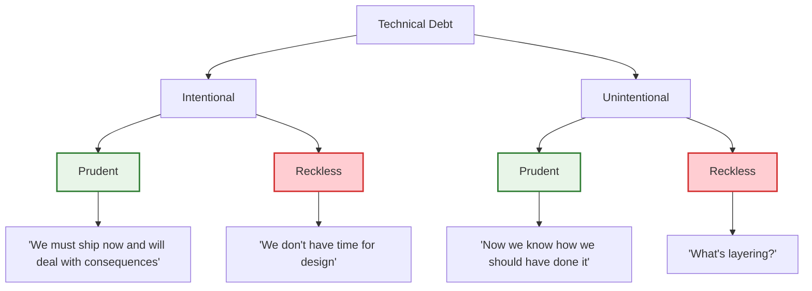
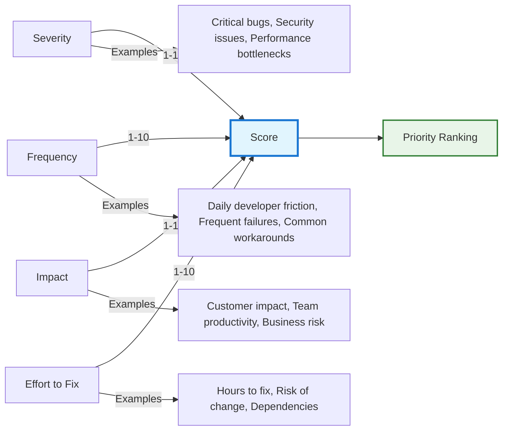
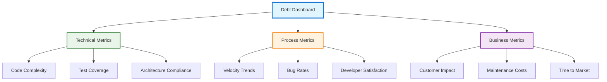

# Technical Debt Management Framework

!!! quote "Technical Debt Excellence"
    *"Technical debt is not necessarily a bad thing, and sometimes it is required to move fast. But like financial debt, the key is to keep it under control."*

    **— Martin Fowler**

Technical debt represents the implied cost of additional rework caused by choosing quick solutions over better approaches. As a staff engineer, your ability to identify, measure, and systematically manage technical debt directly impacts your team's long-term velocity and system maintainability.

## Understanding Technical Debt

### Types of Technical Debt

Technical debt manifests in various forms throughout software systems:

**Code Debt**: Poor code structure, duplication, and complex implementations
**Architecture Debt**: Suboptimal architectural decisions and system design
**Test Debt**: Inadequate test coverage and poor test quality
**Documentation Debt**: Missing or outdated documentation
**Infrastructure Debt**: Outdated tools, frameworks, and deployment practices
**Design Debt**: User experience and interface design shortcuts

### Intentional vs. Unintentional Debt

Understanding the origin of technical debt helps determine appropriate management strategies:

## Debt Identification and Assessment

### Technical Debt Inventory

Systematically catalog technical debt across your systems:

**Code Analysis Tools**: SonarQube, CodeClimate, static analysis tools
**Architecture Reviews**: Regular assessment of system design decisions
**Developer Surveys**: Team feedback on pain points and maintenance challenges
**Incident Analysis**: Root cause analysis revealing systemic issues
**Performance Monitoring**: Identifying performance bottlenecks and scalability issues

### Debt Measurement Framework

Quantify technical debt to enable data-driven decisions:

**Development Velocity Impact**: Time added to feature development
**Maintenance Overhead**: Effort required to maintain existing functionality
**Bug Rate Correlation**: Relationship between debt and defect rates
**Developer Satisfaction**: Team morale and productivity impacts
**Business Risk**: Potential impact on business objectives

### Debt Scoring System

Create consistent scoring to prioritize debt reduction:

## Strategic Debt Management

### Debt Management Policy

Establish organizational guidelines for managing technical debt:

**Acceptable Debt Levels**: Define thresholds for different types of debt
**Debt Creation Guidelines**: When is it appropriate to incur new debt?
**Repayment Commitments**: How much effort should be allocated to debt reduction?
**Review Processes**: Regular assessment and decision-making procedures

### Integration with Development Process

Embed debt management into regular development workflows:

**Definition of Done**: Include debt assessment in completion criteria
**Code Review Standards**: Identify and flag new debt during reviews
**Sprint Planning**: Allocate time for debt reduction in each iteration
**Architecture Reviews**: Assess debt implications of design decisions

### Debt Budgeting

Allocate resources systematically for debt management:

**The 20% Rule**: Dedicate approximately 20% of development capacity to debt reduction
**Debt Sprints**: Periodic sprints focused entirely on debt reduction
**Maintenance Windows**: Regular time blocks for system maintenance and improvement
**Technical Investment Proposals**: Formal proposals for significant debt reduction efforts

## Debt Reduction Strategies

### Refactoring Approaches

Systematically improve code and architecture:

**Strangler Fig Pattern**: Gradually replace legacy systems with new implementations
**Branch by Abstraction**: Introduce abstractions to enable incremental changes
**Parallel Run**: Run old and new implementations simultaneously during transition
**Feature Flagging**: Control rollout of refactored functionality

### Incremental Improvement

Make debt reduction manageable through small, consistent improvements:

**Boy Scout Rule**: Leave code better than you found it
**Red-Green-Refactor**: Include refactoring in test-driven development cycle
**Opportunistic Refactoring**: Improve code when working on related features
**Small Batch Changes**: Break large refactoring efforts into smaller chunks

### Strategic Rebuilds

When to consider larger reconstruction efforts:

**Cost-Benefit Analysis**: Compare rebuild costs with ongoing maintenance costs
**Risk Assessment**: Evaluate risks of continuing with existing system
**Migration Planning**: Systematic approach to replacing legacy systems
**Success Metrics**: Define clear criteria for successful reconstruction

## Team and Cultural Practices

### Building Debt Awareness

Create shared understanding of debt impact across the organization:

**Debt Visualization**: Dashboards and metrics showing debt levels and trends
**Impact Stories**: Share concrete examples of debt impact on productivity and quality
**Developer Education**: Training on debt identification and reduction techniques
**Business Communication**: Translate debt impact into business terms

### Incentive Alignment

Ensure team incentives support debt management:

**Performance Metrics**: Include debt reduction in performance evaluations
**Recognition Programs**: Celebrate debt reduction efforts and achievements
**Time Allocation**: Protect dedicated time for debt reduction work
**Career Development**: Value refactoring and maintenance skills in career progression

### Code Review for Debt Prevention

Use code reviews to prevent accumulation of new debt:

**Review Checklists**: Include debt assessment in review criteria
**Architectural Guidance**: Provide clear architectural principles and patterns
**Knowledge Sharing**: Use reviews as teaching opportunities
**Debt Flagging**: Systematically identify and document new debt

## Measurement and Monitoring

### Debt Metrics and KPIs

Track metrics that indicate debt levels and management effectiveness:

**Technical Metrics:**
- Code complexity measures (cyclomatic complexity, lines of code)
- Test coverage percentages and test quality metrics
- Architecture compliance and dependency analysis
- Security vulnerability and compliance gaps

**Process Metrics:**
- Time to implement features (velocity trends)
- Bug rates and time to resolution
- Developer productivity and satisfaction surveys
- Technical decision review and approval times

**Business Metrics:**
- Customer impact from technical issues
- Cost of maintenance versus new feature development
- Time to market for new capabilities
- System availability and performance

### Debt Monitoring Dashboard

Create visibility into debt levels and trends:

## Tools and Automation

### Debt Detection Tools

Leverage automated tools to identify and track technical debt:

**Static Analysis**: SonarQube, CodeClimate, ESLint, architectural analysis tools
**Dynamic Analysis**: Performance monitoring, runtime analysis, behavior tracking
**Test Analysis**: Coverage analysis, test quality assessment, mutation testing
**Documentation Analysis**: Documentation freshness, completeness analysis

### Automation Strategies

Automate debt detection and management where possible:

**CI/CD Integration**: Automatic debt detection in deployment pipelines
**Automated Reporting**: Regular debt status reports and trend analysis
**Refactoring Tools**: Automated code transformation and improvement tools
**Monitoring Alerts**: Notifications when debt thresholds are exceeded

## Cross-Reference Navigation

- **:material-cog-outline: Quality Practice Foundations**

    **Engineering Excellence Integration**

    Master [Engineering Excellence](engineering-excellence.md) for systematic quality improvement and [Advanced Testing Strategies](advanced-testing-strategies.md) for debt-reducing testing practices

- **:material-sitemap: Architecture & Design Integration**

    **Debt-Resistant System Design**

    Apply [Clean Architecture](clean-architecture.md) patterns to minimize debt accumulation, design with [Software Architecture](software-architecture.md) principles for maintainability, and use [Evolutionary Architecture](evolutionary-architecture.md) for change-resilient systems

- **:material-chart-line: Measurement & Strategy Integration**

    **Business-Aligned Debt Management**

    Connect to [Engineering Metrics](../business/engineering-metrics-business-alignment.md) for effectiveness measurement and [Strategic Thinking](../execution/strategic-thinking.md) for long-term debt planning

- **:material-brush: Code Quality Practices**

    **Daily Debt Prevention**

    Integrate with [Code Hygiene](code-hygiene.md) for preventive practices and [Source Control](source-control.md) for debt-tracking workflows

- **:material-clipboard-check: Assessment & Development**

    **Track Debt Management Maturity**

    Use [Staff Engineer Competency Assessment](../../appendix/tools/staff-engineer-competency-assessment.md) for technical leadership evaluation and [Development Tracking System](../../appendix/tools/development-tracking-system.md) for debt management skill development

- **:material-map-marker-path: Learning Progression**

    **Deepen System Sustainability**

    Progress to [Engineering Excellence](engineering-excellence.md) mastery, [Clean Architecture](clean-architecture.md) implementation, and [Strategic Thinking](../execution/strategic-thinking.md) for comprehensive technical debt strategy

## Further Reading

This chapter draws on software engineering best practices and technical debt research:

*   **Fowler, Martin. *Refactoring: Improving the Design of Existing Code*.** The definitive guide to systematic code improvement and debt reduction.
*   **Feathers, Michael. *Working Effectively with Legacy Code*.** Practical strategies for dealing with existing technical debt.
*   **Martin, Robert C. *Clean Code: A Handbook of Agile Software Craftsmanship*.** Principles for writing maintainable code that minimizes debt.
*   **Tornhill, Adam. *Software Design X-Rays: Fix Technical Debt with Behavioral Code Analysis*.** Data-driven approaches to identifying and prioritizing technical debt.
*   **Kruchten, Philippe, Robert Nord, and Ipek Ozkaya. *Managing Technical Debt: Reducing Friction in Software Development*.** Comprehensive framework for technical debt management in organizations.