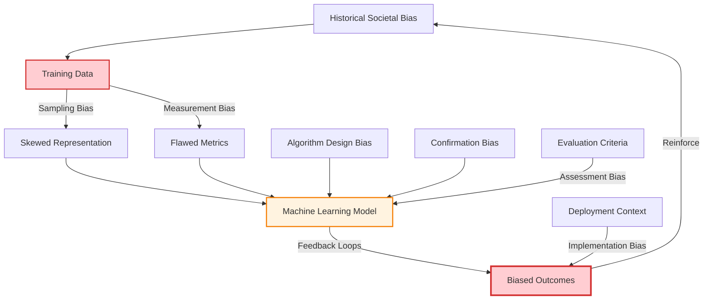
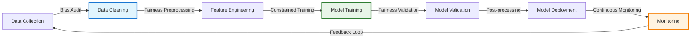

# Bias in AI Systems

!!! quote "Algorithmic Fairness"
    *"Algorithms are opinions embedded in code."*

    **— Cathy O'Neil, Weapons of Math Destruction**

Algorithmic bias represents one of the most critical ethical challenges in modern software engineering. As AI systems increasingly influence hiring, lending, healthcare, and criminal justice decisions, staff engineers must understand how bias enters systems and develop practices to build more fair and equitable algorithms.

## Understanding Algorithmic Bias

### Sources of Bias in AI Systems

Bias can enter AI systems through multiple pathways, often compounding at each stage:

### Types of Algorithmic Bias

**Historical Bias**: Bias present in historical data that reflects past discrimination
**Representation Bias**: Inadequate representation of certain groups in training data
**Measurement Bias**: Systematic errors in how outcomes or features are measured
**Aggregation Bias**: Assuming one model fits all subgroups equally well
**Evaluation Bias**: Using inappropriate benchmarks that favor certain groups
**Deployment Bias**: Applying models in contexts different from their training environment

### Protected Classes and Intersectionality

Consider multiple dimensions of potential bias:

**Traditional Protected Classes**: Race, gender, age, religion, national origin, disability status
**Intersectional Considerations**: Multiple overlapping identities that compound bias effects
**Proxy Variables**: Features that indirectly correlate with protected characteristics
**Emergent Bias**: New forms of discrimination that emerge from algorithmic systems

## Measuring Algorithmic Fairness

### Fairness Definitions

Different mathematical definitions of fairness often conflict with each other:

**Individual Fairness**: Similar individuals should be treated similarly
**Group Fairness**: Statistical parity across different demographic groups
**Counterfactual Fairness**: Decisions would be the same in a counterfactual world without protected attributes
**Procedural Fairness**: The decision-making process itself is fair and transparent

### Fairness Metrics

Quantitative measures for assessing algorithmic fairness:

**Demographic Parity**: Equal positive prediction rates across groups
**Equalized Opportunity**: Equal true positive rates across groups
**Equalized Odds**: Equal true positive and false positive rates across groups
**Calibration**: Predicted probabilities reflect actual outcomes equally across groups

### Bias Detection Techniques

Systematic approaches to identifying bias in AI systems:

**Statistical Analysis**: Compare model performance across demographic groups
**Adversarial Testing**: Use adversarial examples to probe for biased behavior
**Counterfactual Analysis**: Test how predictions change when sensitive attributes are modified
**Intersectional Analysis**: Examine bias across multiple demographic dimensions

## Technical Approaches to Bias Mitigation

### Pre-processing Techniques

Address bias in training data before model training:

**Data Augmentation**: Generate synthetic examples for underrepresented groups
**Re-sampling**: Adjust training data distribution to reduce bias
**Feature Selection**: Remove or transform biased features
**Data Quality Assessment**: Identify and correct systematic data collection issues

### In-processing Techniques

Build fairness constraints directly into model training:

**Fairness Constraints**: Add mathematical constraints to optimization objectives
**Adversarial Training**: Train models to be invariant to protected attributes
**Multi-task Learning**: Learn fairness and accuracy simultaneously
**Regularization**: Add penalty terms for unfair predictions

### Post-processing Techniques

Adjust model outputs to improve fairness:

**Threshold Optimization**: Set different decision thresholds for different groups
**Calibration Techniques**: Adjust predicted probabilities to improve fairness
**Output Modification**: Transform predictions to satisfy fairness criteria
**Ensemble Methods**: Combine multiple models with different fairness-accuracy trade-offs

## Bias in Different AI Application Domains

### Hiring and Recruitment

Address bias in automated hiring systems:

**Resume Screening**: Ensure algorithms don't discriminate based on names, schools, or other proxies
**Interview Scheduling**: Prevent bias in candidate selection for interviews
**Assessment Tools**: Validate that evaluation metrics don't disadvantage certain groups
**Compensation Analysis**: Use algorithms to identify and correct pay gaps

### Healthcare AI

Mitigate bias in medical AI systems:

**Diagnostic Algorithms**: Ensure equal accuracy across different demographic groups
**Treatment Recommendations**: Prevent algorithms from reinforcing healthcare disparities
**Risk Prediction**: Account for social determinants of health in risk models
**Clinical Trial Selection**: Use AI to create more diverse clinical trial populations

### Financial Services

Build fair algorithms for financial decision-making:

**Credit Scoring**: Ensure lending algorithms don't discriminate against protected classes
**Insurance Pricing**: Prevent unfair discrimination in insurance premium calculation
**Fraud Detection**: Avoid false positives that disproportionately affect certain groups
**Investment Algorithms**: Ensure algorithmic trading doesn't create market disparities

### Criminal Justice

Address bias in algorithms used by the justice system:

**Risk Assessment**: Ensure recidivism prediction tools don't exhibit racial bias
**Sentencing Guidelines**: Prevent algorithmic recommendations that perpetuate disparities
**Predictive Policing**: Avoid creating feedback loops that reinforce biased policing
**Parole Decisions**: Ensure fair evaluation of candidates for parole

## Building Responsible AI Teams

### Diverse Teams and Perspectives

Build teams that can identify and address bias:

**Diverse Hiring**: Recruit team members from different backgrounds and experiences
**Inclusive Culture**: Create environments where diverse perspectives are valued
**External Advisors**: Include domain experts and community representatives
**Bias Training**: Educate all team members about bias and fairness issues

### Ethical AI Governance

Establish organizational processes for responsible AI development:

**Ethics Review Boards**: Create formal review processes for AI systems
**Algorithmic Auditing**: Implement regular audits of deployed AI systems
**Stakeholder Engagement**: Include affected communities in development processes
**Transparency Requirements**: Document and communicate AI decision-making processes

### Bias Testing and Validation

Implement systematic testing for bias throughout development:

**Bias Testing Frameworks**: Create automated tests for different types of bias
**Continuous Monitoring**: Monitor deployed systems for emerging bias
**Red Team Exercises**: Actively try to find bias and fairness issues
**User Feedback Systems**: Collect and act on user reports of unfair treatment

## Legal and Regulatory Considerations

### Algorithmic Accountability Laws

Understand evolving legal requirements:

**EU AI Act**: Comprehensive regulation of high-risk AI systems
**US State Laws**: Various state-level algorithmic accountability requirements
**Sector-Specific Regulations**: Industry-specific requirements for fair algorithms
**Employment Law**: Anti-discrimination laws applied to algorithmic hiring

### Compliance Strategies

Develop approaches to meet regulatory requirements:

**Documentation Requirements**: Maintain detailed records of AI system development
**Impact Assessments**: Conduct algorithmic impact assessments for high-risk systems
**Human Oversight**: Ensure meaningful human review of algorithmic decisions
**Right to Explanation**: Provide explanations for algorithmic decisions when required

## Practical Implementation

### Bias Mitigation Pipeline

Integrate bias mitigation throughout the ML pipeline:

### Tools and Frameworks

Leverage existing tools for bias detection and mitigation:

**Open Source Libraries**: Fairlearn, AIF360, What-If Tool, Themis
**Cloud Platform Tools**: AWS Clarify, Google What-If Tool, Azure Fairness
**Academic Tools**: FairTest, FairML, Aequitas
**Custom Solutions**: Build internal tools for organization-specific needs

### Monitoring and Maintenance

Ensure ongoing fairness in deployed systems:

**Performance Monitoring**: Track fairness metrics alongside accuracy metrics
**Data Drift Detection**: Monitor for changes in data distribution that might introduce bias
**Feedback Analysis**: Analyze user feedback for evidence of unfair treatment
**Model Retraining**: Regularly retrain models with updated data and fairness constraints

## Cross-Reference Navigation

**Ethical Foundation:**
- **[Ethical Frameworks](ethical-frameworks.md)** - Broader ethical considerations for technology development
- **[Privacy by Design](privacy-by-design.md)** - Privacy considerations that intersect with fairness
- **[Ethics of Scale](ethics-of-scale.md)** - Ethical challenges in large-scale systems

**Technical Implementation:**
- **[Advanced Testing Strategies](../engineering/advanced-testing-strategies.md)** - Testing methodologies that can be applied to bias testing
- **[Engineering Metrics](../business/engineering-metrics-business-alignment.md)** - Measuring and tracking fairness alongside other engineering metrics

**Organizational Integration:**
- **[Product Engineering Collaboration](../business/product-engineering-collaboration.md)** - Collaborating with product teams on fairness requirements
- **[Cultural Transformation](../teamwork/cultural-transformation-psychological-safety.md)** - Building organizational culture that prioritizes fairness

## Further Reading

This chapter draws on research from algorithmic fairness experts and practitioners:

*   **Barocas, Solon, Moritz Hardt, and Arvind Narayanan. *Fairness and Machine Learning: Limitations and Opportunities*.** Comprehensive academic treatment of fairness in ML.
*   **Benjamin, Ruha. *Race After Technology: Abolitionist Tools for the New Jim Code*.** Critical examination of bias in technological systems.
*   **Eubanks, Virginia. *Automating Inequality: How High-Tech Tools Profile, Police, and Punish the Poor*.** Analysis of algorithmic bias in public services.
*   **Noble, Safiya Umoja. *Algorithms of Oppression: How Search Engines Reinforce Racism*.** Investigation of bias in search algorithms and information systems.
*   **O'Neil, Cathy. *Weapons of Math Destruction: How Big Data Increases Inequality and Threatens Democracy*.** Accessible exploration of how algorithms can perpetuate and amplify bias.