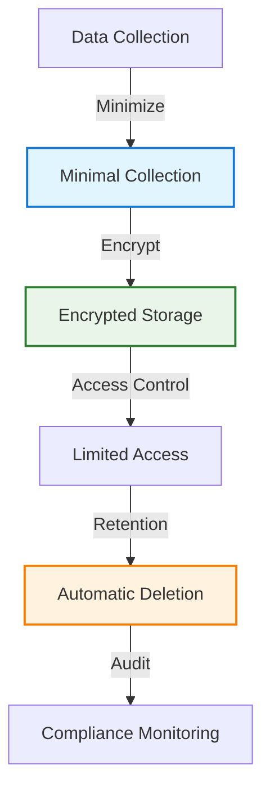

# Privacy by Design

!!! quote "Privacy Excellence"
    *"Privacy by Design calls for privacy to be taken into account throughout the whole engineering process."*

    **— Ann Cavoukian, Privacy by Design**

Privacy by Design represents a foundational approach to engineering that embeds privacy protections directly into system architecture and development processes. As a staff engineer, implementing privacy-first practices isn't just about compliance—it's about building user trust and creating competitive advantage through responsible data handling.

## Core Privacy by Design Principles

### 1. Proactive Not Reactive

Anticipate and prevent privacy invasions before they occur:

- **Threat Modeling**: Identify privacy risks during system design
- **Privacy Impact Assessments**: Evaluate privacy implications of new features
- **Default Settings**: Configure systems for maximum privacy protection
- **Continuous Monitoring**: Implement ongoing privacy compliance validation

### 2. Privacy as the Default Setting

Engineer systems to protect privacy without requiring user action:

### 3. Full Functionality

Achieve business objectives without compromising privacy:

- **Differential Privacy**: Gather insights while protecting individual privacy
- **Homomorphic Encryption**: Process encrypted data without decryption
- **Federated Learning**: Train models without centralizing sensitive data
- **Zero-Knowledge Proofs**: Verify information without revealing it

## Privacy Engineering Practices

### Data Minimization

Collect and process only data necessary for specific purposes:

**Collection Minimization**:
- Define specific use cases before data collection
- Implement purpose limitation controls
- Regular review of data collection practices
- Automatic data collection auditing

**Processing Minimization**:
- Process data at the minimum level required
- Use aggregated data when individual data isn't necessary
- Implement data masking and anonymization
- Establish clear data retention policies

### Consent Management

Build systems that respect user choices about their data:

**Granular Consent**: Allow users to choose specific data uses
**Dynamic Consent**: Enable users to modify consent over time
**Consent Validation**: Verify that consent is freely given and informed
**Withdrawal Mechanisms**: Provide easy ways to revoke consent

### Privacy-Preserving Architecture

Design system architectures that protect privacy by design:

**Data Localization**: Keep data in appropriate geographic regions
**Encryption Everywhere**: Encrypt data in transit, at rest, and in processing
**Access Controls**: Implement principle of least privilege for data access
**Data Segregation**: Separate sensitive data from general application data

## Technical Implementation

### Encryption and Cryptography

Implement strong cryptographic protections:

**End-to-End Encryption**: Protect data throughout its lifecycle
**Key Management**: Secure key generation, storage, and rotation
**Perfect Forward Secrecy**: Ensure past communications remain secure
**Post-Quantum Cryptography**: Prepare for future cryptographic threats

### Anonymization and Pseudonymization

Transform data to protect individual privacy:

**Anonymization Techniques**:
- k-anonymity: Ensure individuals can't be distinguished in groups smaller than k
- l-diversity: Ensure sensitive attributes are well-represented in each group
- t-closeness: Ensure distribution of sensitive attributes is close to overall population

**Pseudonymization Methods**:
- Tokenization: Replace sensitive data with non-sensitive tokens
- Hash Functions: Use cryptographic hashes with salts
- Format-Preserving Encryption: Maintain data format while encrypting

### Privacy-Preserving Analytics

Extract insights while protecting individual privacy:

**Differential Privacy**: Add mathematical noise to protect individual contributions
**Federated Analytics**: Compute insights across distributed data without centralization
**Secure Multi-party Computation**: Enable computation on encrypted data
**Synthetic Data Generation**: Create statistically accurate but non-identifying datasets

## Regulatory Compliance

### GDPR Implementation

Implement technical measures to comply with GDPR requirements:

**Right to Access**: Provide users with copies of their personal data
**Right to Rectification**: Enable users to correct inaccurate data
**Right to Erasure**: Implement data deletion capabilities
**Right to Data Portability**: Export user data in machine-readable formats
**Right to Object**: Honor user objections to data processing

### CCPA and State Privacy Laws

Address evolving US privacy legislation:

**Consumer Rights**: Implement disclosure, deletion, and opt-out rights
**Sensitive Personal Information**: Apply special protections to sensitive categories
**Third-Party Sharing**: Provide transparency about data sharing practices
**Non-Discrimination**: Ensure equal service regardless of privacy choices

### Cross-Border Data Transfers

Handle international data transfers compliantly:

**Adequacy Decisions**: Leverage jurisdictions with adequate protection
**Standard Contractual Clauses**: Use approved transfer mechanisms
**Binding Corporate Rules**: Implement internal transfer frameworks
**Data Localization**: Keep data within specific geographic boundaries

## Privacy Engineering Tools

### Privacy Testing

Implement systematic privacy validation:

**Privacy Unit Tests**: Automated tests for privacy controls
**Privacy Integration Tests**: Validate privacy across system boundaries
**Privacy Regression Tests**: Ensure privacy protections don't degrade
**Privacy Load Tests**: Verify privacy controls under high load

### Monitoring and Auditing

Continuously monitor privacy compliance:

**Data Access Logging**: Track all access to sensitive data
**Consent State Monitoring**: Verify consent compliance in real-time
**Privacy Metric Tracking**: Measure privacy protection effectiveness
**Automated Compliance Reporting**: Generate regulatory compliance reports

### Privacy Development Tools

Integrate privacy into development workflows:

**Privacy Linters**: Automated code review for privacy issues
**Data Flow Analysis**: Understand how data moves through systems
**Privacy Annotations**: Document privacy requirements in code
**Privacy CI/CD**: Integrate privacy checks into deployment pipelines

## Building Privacy-First Culture

### Developer Education

Ensure all team members understand privacy requirements:

**Privacy Training**: Regular education on privacy principles and regulations
**Threat Modeling Training**: Teach privacy-focused threat modeling
**Code Review Standards**: Include privacy considerations in code reviews
**Privacy Champions**: Designate privacy advocates within engineering teams

### Privacy by Design Reviews

Integrate privacy review into development processes:

**Design Reviews**: Include privacy evaluation in system design
**Code Reviews**: Check for privacy compliance during code review
**Security Reviews**: Incorporate privacy assessment into security audits
**Architecture Reviews**: Evaluate privacy implications of architectural decisions

## Cross-Reference Navigation

**Security Integration:**
- **[Supply Chain Security](../engineering/supply-chain-security.md)** - Protecting privacy in external dependencies
- **[Software Security](../engineering/software-security.md)** - Technical security measures that protect privacy

**Ethical Framework:**
- **[Ethical Frameworks](ethical-frameworks.md)** - Broader ethical considerations including privacy
- **[Bias in AI Systems](bias-ai-systems.md)** - Privacy considerations in algorithmic systems

**Business Integration:**
- **[Engineering Metrics](../business/engineering-metrics-business-alignment.md)** - Measuring privacy compliance and effectiveness
- **[Product Engineering Collaboration](../business/product-engineering-collaboration.md)** - Balancing privacy with product requirements

## Further Reading

This chapter draws on privacy engineering research and regulatory guidance:

*   **Cavoukian, Ann. *Privacy by Design: The 7 Foundational Principles*.** The foundational document establishing Privacy by Design principles.
*   **Dennedy, Michelle Finneran, Jonathan Fox, and Thomas Finneran. *The Privacy Engineer's Manifesto*.** Comprehensive guide to privacy engineering practices.
*   **Nissenbaum, Helen. *Privacy in Context: Technology, Policy, and the Integrity of Social Life*.** Academic foundation for contextual privacy frameworks.
*   **Solove, Daniel J. *Understanding Privacy*.** Legal and conceptual framework for understanding privacy rights and protections.
*   **European Union Agency for Cybersecurity. *Privacy Engineering Guidelines*.** Technical guidance for implementing privacy protections in software systems.