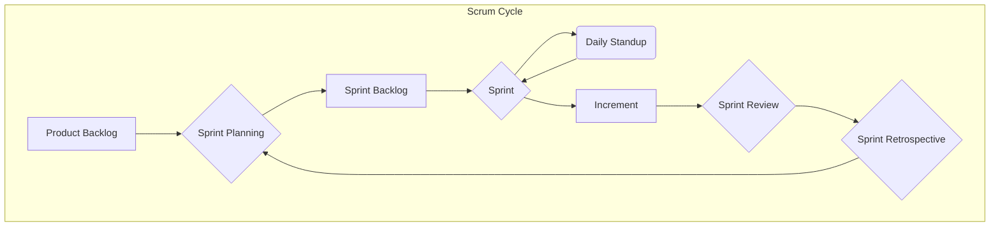
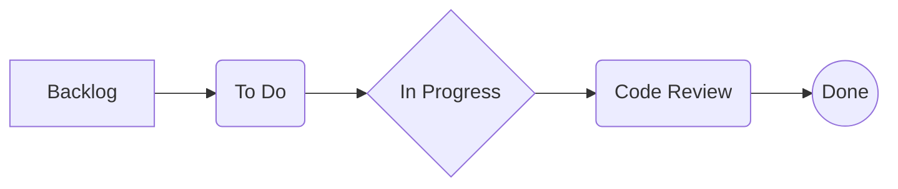

# Agile Essentials: Beyond the Rituals

## The Scenario

A team has been "doing Agile" for over a year. They have daily standups, two-week sprints, and retrospectives. But something isn't working. Delivery is still unpredictable. Features routinely take twice as long as estimated. The product owner is frustrated by lack of progress, and engineers are complaining about constant context switching. The team is following the rituals of Agile, but missing its spirit.

## The Agile Mindset: Beyond Process

Agile is not a methodology; it's a mindset—a set of values and principles that guide decision-making. The Agile Manifesto prioritizes:

- **Individuals and interactions** over processes and tools
- **Working software** over comprehensive documentation
- **Customer collaboration** over contract negotiation
- **Responding to change** over following a plan

As a Staff Engineer, your responsibility isn't to enforce rigid processes but to embody these values and help your team understand why they matter.

## Scrum vs. Kanban: Choosing the Right Tool

The two most common frameworks teams adopt are Scrum and Kanban. Each has strengths suited to different contexts.

### Scrum: For Complex Problem Domains

Scrum provides structure through fixed-length sprints (typically 1-4 weeks), with defined roles (Scrum Master, Product Owner, Development Team) and ceremonies (Sprint Planning, Daily Standup, Sprint Review, Retrospective).

**When to Use Scrum:**

- When work is complex and unpredictable
- When team members are less experienced
- When regular checkpoints with stakeholders are valuable
- When the product direction might shift frequently

**Common Pitfalls:**

- **Cargo Cult Scrum:** Following the ceremonies without understanding their purpose
- **Over-Commitment:** Taking on too much work per sprint, leading to missed commitments
- **Lack of Technical Excellence:** Ignoring code quality and technical debt in pursuit of velocity

### Kanban: For Flow-Based Work

Kanban visualizes work flowing through a system, limits work in progress (WIP), and optimizes for cycle time—how quickly work moves from start to finish.

**When to Use Kanban:**

- When work is more operational or maintenance-focused
- When priorities change frequently
- When team members are highly specialized
- When delivery needs to be continuous rather than batch-based

**Common Pitfalls:**

- **Too Much WIP:** Failing to enforce WIP limits, leading to context switching
- **Lack of Feedback Loops:** Not building in regular reflection and improvement cycles
- **Poor Visibility:** Not making blockers and bottlenecks visible to the whole team

## Key Metrics That Matter

Many teams track velocity (how much work they complete per sprint), but this can lead to gaming the system. More meaningful metrics include:

- **Cycle Time:** How long does it take for a work item to go from start to finish?
- **Lead Time:** How long from when a request is made until it's delivered?
- **Flow Efficiency:** What percentage of time is work actually being worked on vs. sitting idle?
- **Escaped Defects:** How many bugs are found after deployment?

These metrics focus on outcomes and quality rather than raw output.

## Lean Thinking: Eliminating Waste

Agile is built on Lean principles, which focus on maximizing customer value while minimizing waste. The seven wastes in software development:

1. **Partially Done Work:** Code written but not deployed, designs not implemented
2. **Extra Features:** Building more than what users need
3. **Task Switching:** Context switching between multiple projects
4. **Waiting:** Delays for decisions, reviews, or dependencies
5. **Handoffs:** Knowledge loss when work passes between people
6. **Motion:** Inefficient processes requiring extra effort
7. **Defects:** Bugs and quality issues that require rework

As a Staff Engineer, identifying and eliminating these wastes is often more valuable than adding new features.

## Making Agile Work: A Staff Engineer's Guide

As a technical leader, your role is to adapt agile principles to your team's context:

### 1. Focus on Technical Excellence

Agile requires solid engineering practices to work properly:

- Automated testing
- Continuous integration
- Small, frequent deployments
- Clean, maintainable code

Without these foundations, "going faster" just creates technical debt.

### 2. Right-Size Your Work Items

Large work items are the enemy of predictability:

- Break epics into features
- Break features into stories
- Break stories into tasks

The smaller the better—aim for stories that take days, not weeks.

### 3. Embrace Empirical Process Control

Don't guess—measure:

- Track how long different types of work actually take
- Use that data to inform future estimates
- Constantly refine your process based on measurements

### 4. Balance Delivery and Discovery

Effective teams don't just deliver—they discover:

- Allocate time for exploratory work
- Prototype before committing to solutions
- Validate assumptions with minimal viable experiments

## When Agile Fails: Common Anti-patterns

Watch for these warning signs:

- **The Waterfall Sandwich:** Traditional requirements and deployment wrapped in agile terminology
- **The Planning Game:** Detailed estimation sessions that don't improve predictability
- **The Demo Theater:** Showcasing half-finished work that can't be deployed
- **The Retrospective Roundabout:** Discussing the same issues sprint after sprint without addressing root causes

The measure of agility isn't how many ceremonies you perform—it's how quickly you can respond to change while maintaining technical quality. As a Staff Engineer, your role is to ensure the team balances speed and sustainability, embracing agile principles rather than just following agile processes.

## Cross-Reference Navigation

### Prerequisites for This Chapter

- **[Team Formation](../teamwork/team-formation.md)** - Understanding team formation stages is essential before implementing agile practices
- **[Strategic Thinking](strategic-thinking.md)** - Strategic context provides foundation for effective agile planning and prioritization

### Related Concepts

- **[Team Formation](../teamwork/team-formation.md)** - Agile practices work best when teams have strong formation and collaboration patterns
- **[Engineering Metrics & Business Alignment](../business/engineering-metrics-business-alignment.md)** - Measuring engineering effectiveness complements agile delivery metrics
- **[Prioritization Frameworks](prioritization-frameworks.md)** - Product backlog management requires systematic prioritization approaches
- **[Change Management for Technical Transformations](change-management-technical-transformations.md)** - Agile adoption requires organizational change management practices

### Apply These Concepts

- **[Staff Engineer Competency Assessment](../../appendix/tools/staff-engineer-competency-assessment.md)** - Evaluate your execution and delivery leadership capabilities
- **[Team Health Diagnostic](../../appendix/tools/team-health-diagnostic.md)** - Assess team readiness for agile practices and process improvements

### Next Steps in Your Learning Journey

1. **[Team Formation](../teamwork/team-formation.md)** - Learn to build and develop high-performing agile teams
2. **[Prioritization Frameworks](prioritization-frameworks.md)** - Master techniques for effective product backlog and roadmap management
3. **[Engineering Metrics & Business Alignment](../business/engineering-metrics-business-alignment.md)** - Connect agile delivery metrics to business outcomes and value

## A Practical Exercise: The Methodology Match-Up

- **Objective:** To reinforce understanding by applying theory to practical situations.
- **Setup:** Divide participants into small groups. Provide each group with cards describing various project scenarios (e.g., "a greenfield project with high uncertainty," "an operations team managing incoming bug reports," "a project with a fixed deadline and scope").
- **Execution:** Groups must match each scenario to the most appropriate methodology (Scrum, Kanban) and justify their reasoning, discussing the pros and cons.
- **Debrief:** Discuss the different matchups and the nuances of choosing a process that fits the work.

## Further Reading

- _Agile Estimating and Planning_ by Mike Cohn
- _Kanban: Successful Evolutionary Change for Your Technology Business_ by David J. Anderson
- _The Lean Startup_ by Eric Ries
