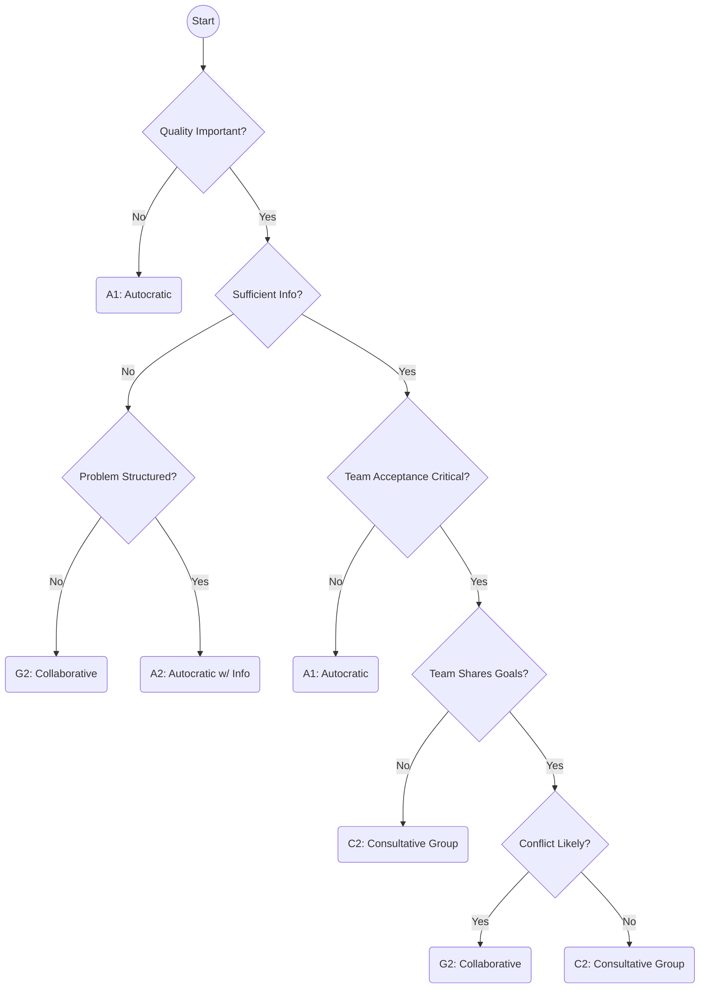
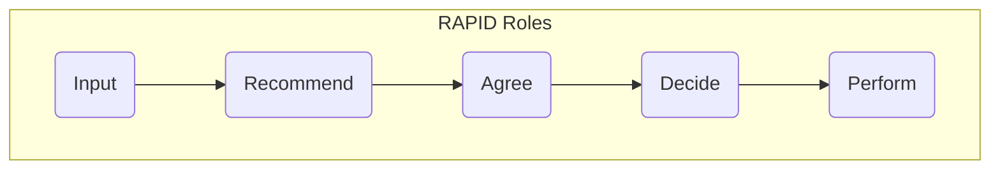
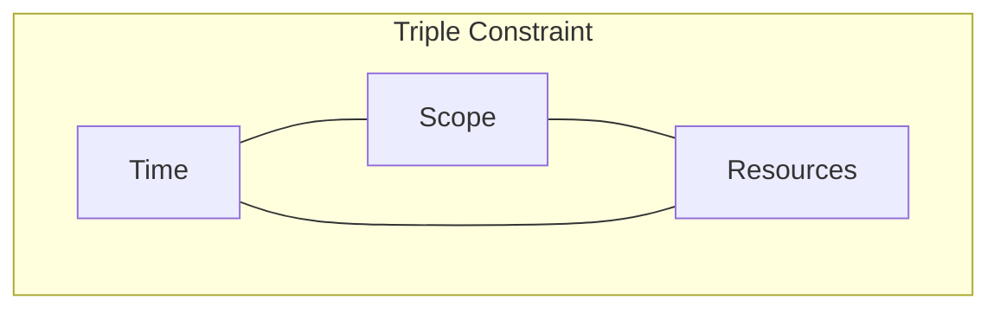
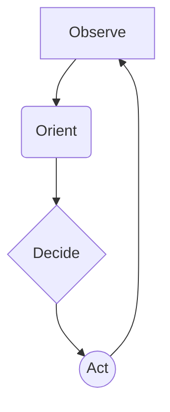

# Decision-Making Frameworks for Engineers

## The Scenario

An engineering team is discussing a critical architecture decision. The conversation has been circular for weeks. Some engineers advocate for a microservices approach, others for a monolith. Technical arguments go back and forth with no resolution. The team is stuck in analysis paralysis. Deadlines approach, but no decision is made.

This is a common scenario in engineering teams. Technical decisions are often complex, with many competing factors and no clear "right" answer. As a Staff Engineer, you need frameworks to guide decision-making—systematic approaches that ensure you're considering the right factors and involving the right people.

## The Vroom-Yetton-Jago Model: Choosing How to Decide

Before deciding what to do, decide how to decide. The Vroom-Yetton-Jago model helps you determine the appropriate decision-making approach based on the nature of the problem.

### Five Decision-Making Styles:

1\. **Autocratic (A1):** You make the decision alone using available information.

- **When to use:** Crisis situations, trivial decisions, or when you're clearly the expert.
- **Example:** Choosing a library for a small, isolated component only you will maintain.

2\. **Autocratic with Information Gathering (A2):** You collect information from team members but make the decision yourself.

- **When to use:** When you need specialized knowledge but the decision impact is limited.
- **Example:** Deciding on a database schema after gathering requirements from users.

3\. **Consultative Individual (C1):** You share the problem with individuals, get their ideas, then decide yourself.

- **When to use:** When team alignment isn't critical, but you need diverse perspectives.
- **Example:** Choosing between two deployment strategies after consulting with DevOps experts.

4\. **Consultative Group (C2):** You share the problem with the team as a group, collect their ideas, then decide yourself.

- **When to use:** When you need both input and discussion, but clarity of decision is paramount.
- **Example:** Architectural decisions that affect multiple teams but must be consistent.

5\. **Collaborative/Consensus (G2):** The team makes the decision together through discussion and agreement.

- **When to use:** When buy-in is critical and the team must implement the solution together.
- **Example:** Choosing coding standards or team processes.

### Decision Tree Questions:

To determine which style to use, ask:

1. Is quality/technical accuracy critical? (If no, lean autocratic)
2. Do I have sufficient information? (If no, move toward consultation)
3. Is the problem structured/understood? (If no, involve more people)
4. Is team acceptance critical for implementation? (If yes, lean collaborative)
5. Would an autocratic decision be accepted? (If no, lean collaborative)
6. Does the team share organizational goals? (If no, be cautious with consensus)
7. Is conflict likely in the preferred solution? (If yes, prepare for consensus challenges)

## RAPID: Clarifying Decision Roles

Developed by Bain & Company, RAPID clarifies who does what in a decision process:

- **R (Recommend):** Who gathers data, analyzes options, and makes the initial recommendation.
- **A (Agree):** Who must agree to the recommendation (often Legal, Security, etc.).
- **P (Perform):** Who will implement the decision.
- **I (Input):** Who provides information and expertise to shape the recommendation.
- **D (Decide):** Who has final decision-making authority.

For complex decisions spanning multiple teams, explicitly mapping these roles prevents confusion and delays.

## The Triple Constraint Model: Navigating Trade-offs

All engineering decisions involve trade-offs between three constraints:

- **Scope:** What features/functionality will be delivered
- **Time:** When it will be delivered
- **Resources:** What people/budget/tools are available

The model states you can control at most two; the third must flex. As a Staff Engineer, you help the team recognize these constraints explicitly:

- "If we must ship by Q3 (fixed time) with the current team (fixed resources), what scope can we reasonably deliver?"
- "If we must deliver these five features (fixed scope) by Q3 (fixed time), what additional resources do we need?"
- "If we must deliver these five features (fixed scope) with the current team (fixed resources), when can we realistically ship?"

## OODA Loops: Iterative Decision-Making

Developed by military strategist John Boyd, OODA stands for Observe, Orient, Decide, Act. It's particularly useful for decisions in rapidly changing environments.

1. **Observe:** Gather data about the current situation without filtering or bias.
2. **Orient:** Analyze the data in context, considering multiple perspectives.
3. **Decide:** Choose a course of action based on the analysis.
4. **Act:** Implement the decision and observe the results.

The key insight is that decision-making is a cycle, not a one-time event. Each action provides new information for observation. Teams that cycle through OODA loops faster gain advantage as they learn and adapt more quickly.

## Applying the Frameworks: The Microservices Decision Revisited

Let's apply these frameworks to our opening scenario:

1. **Choose How to Decide (Vroom-Yetton-Jago):** This is a significant architectural decision requiring buy-in, suggesting a Consultative Group (C2) approach. The Staff Engineer will facilitate input but make the final call.

2. **Clarify Roles (RAPID):**

    - R (Recommend): The Staff Engineer and senior developers
    - A (Agree): Security and DevOps leads
    - P (Perform): The entire development team
    - I (Input): Product managers, other engineering teams
    - D (Decide): The Staff Engineer, with approval from the Engineering Manager

3. **Acknowledge Constraints (Triple Constraint):**

    - "We must ship the first version in 3 months (fixed time) with our current team (fixed resources). Given these constraints, should we start with a monolith for speed and consider decomposing into microservices later?"

4. **Plan to Learn (OODA Loop):**
    - "Whatever approach we choose, let's identify key metrics to observe and set a timeframe for revisiting the decision based on what we learn."

By applying these frameworks, the Staff Engineer transforms a circular debate into a structured decision process. The goal isn't to make perfect decisions—it's to make sound decisions efficiently and learn from them quickly.

## Cross-Reference Navigation

### Prerequisites for This Chapter

- **[Structured Problem-Solving](../thinking/structured-problem-solving.md)** - Problem-solving frameworks provide foundation for systematic decision-making
- **[Cognitive Biases](../thinking/cognitive-biases.md)** - Understanding cognitive biases is essential for objective decision-making

### Related Concepts

- **[Structured Problem-Solving](../thinking/structured-problem-solving.md)** - Problem-solving and decision-making frameworks complement each other in complex situations
- **[Ethical Frameworks](../ethics/ethical-frameworks.md)** - Ethical considerations are often central to complex technical decisions
- **[Prioritization Frameworks](prioritization-frameworks.md)** - Prioritization requires systematic decision-making about resource allocation
- **[Navigating Uncertainty](navigating-uncertainty.md)** - Decision-making frameworks help manage uncertainty and ambiguous situations

### Apply These Concepts

- **[Staff Engineer Competency Assessment](../../appendix/tools/staff-engineer-competency-assessment.md)** - Evaluate your decision-making and critical thinking capabilities
- **[Development Tracking System](../../appendix/tools/development-tracking-system.md)** - Track your progress in developing systematic decision-making skills

### Next Steps in Your Learning Journey

1. **[Navigating Uncertainty](navigating-uncertainty.md)** - Learn to make effective decisions in ambiguous and rapidly changing situations
2. **[Structured Problem-Solving](../thinking/structured-problem-solving.md)** - Master systematic approaches to complex problem analysis
3. **[Strategic Thinking](strategic-thinking.md)** - Develop strategic perspective for high-impact decision-making

## Common Pitfalls & How to Avoid Them

- **Analysis Paralysis:** Spending excessive time gathering data without making a decision. **Mitigation:** Set time limits for each stage of the decision process.
- **Confirmation Bias:** Seeking out information that confirms pre-existing beliefs. **Mitigation:** Actively solicit diverse opinions and challenge your own assumptions.
- **Ignoring Context:** Applying a framework without considering the specific circumstances. **Mitigation:** Regularly review the context and adjust your approach accordingly.
- **Over-Reliance on Frameworks:** Using frameworks rigidly without applying judgment. **Mitigation:** Remember that frameworks are tools, not rules, and adapt them to the situation at hand.

## A Practical Exercise: The Scenario Challenge

- **Objective:** To practice applying decision-making frameworks to a complex problem.
- **Setup:** Divide participants into small teams. Provide each team with an ambiguous scenario requiring a decision (e.g., "A critical bug has been found in a newly released feature, but the team has limited resources to fix it.").
- **Execution:** Ask each team to choose a suitable framework, apply it to the scenario, document their process, and present their recommendation.
- **Debrief:** Facilitate a discussion on the rationale behind their choice, the challenges they encountered, and the lessons learned.

## Further Reading

- _Thinking, Fast and Slow_ by Daniel Kahneman
- _The Staff Engineer's Path_ by Tanya Reilly
