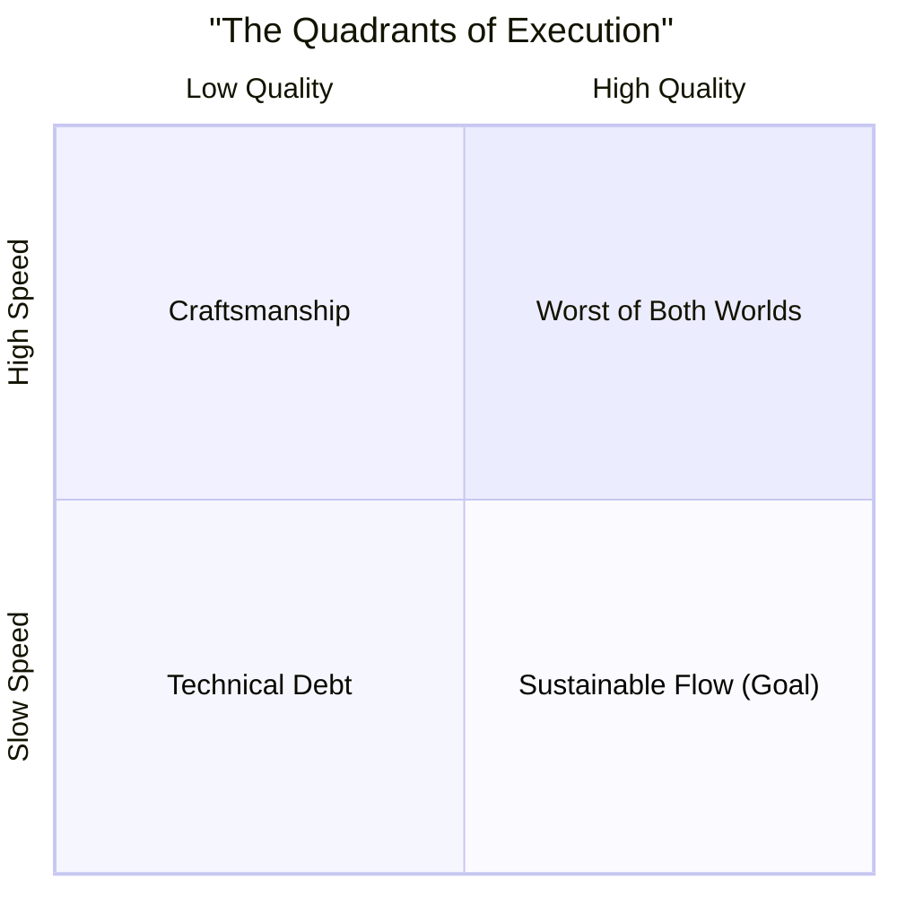

# Balancing Speed vs. Quality: False Dichotomy, Real Trade-offs

## The Scenario

A startup has secured a major potential customer who's requesting several new enterprise features before they'll sign a contract. The deal would double the company's revenue. The sales team is pushing hard: "We need these features in four weeks or we lose the deal." The engineering team estimates it would take three months to build them properly. The VP of Engineering turns to you and asks: "How can we do this faster? What corners can we cut?"

This is the classic speed versus quality dilemma. It's often framed as a simple binary choice: do it fast or do it right. But skilled Staff Engineers know this is a false dichotomy. The real question is more nuanced: How do we optimize for both speed and quality given our specific context and constraints?

## The Quadrants of Execution

Consider these four execution modes:

The goal is not to always be in the "High Quality, High Speed" quadrant—that's not always possible. The goal is to make intentional, strategic choices about where on this spectrum you should operate for a specific project at a specific time, and to be transparent about the implications of those choices.

## Short-Term Speed vs. Long-Term Speed

When discussing speed, we must distinguish between two timeframes:

* **Short-term speed:** How quickly can we ship this specific feature?
* **Long-term speed:** How quickly can we ship features over the next year?

These two types of speed often conflict. Maximizing short-term speed by accumulating technical debt can severely hamper long-term speed. As Martin Fowler puts it: "Technical debt is like borrowing money. You get a feature faster, but you pay interest in the form of slower development later."

The key questions become:
* What is our "interest rate" on this technical debt?
* How long before we can "refinance" (refactor)?
* Is the business benefit worth the technical cost?

## A Decision Framework for Speed-Quality Trade-offs

When facing a speed-quality decision, work through these considerations:

### 1. Clarify the Business Context

* **What's the true deadline?** Sometimes apparent deadlines are flexible.
* **What's the cost of delay?** Is it a firm contract requirement or just desirable?
* **What's the lifespan of the feature?** Is this a core product feature or a one-off?
* **Who will maintain this code?** A feature used by one customer requires different quality standards than your core platform.

### 2. Segment the Work

Not all parts of a project have equal quality requirements:

* **User-facing vs. internal:** Visual polish matters more for user interfaces than internal services.
* **Critical path vs. supporting features:** Authentication needs higher quality than customization options.
* **Core vs. edge cases:** Perfect handling of rare edge cases might be deferrable.

### 3. Define "Good Enough"

For each component, define the minimum acceptable quality in terms of:

* **Correctness:** Must it handle all edge cases or just the common ones?
* **Performance:** What are the minimum acceptable response times?
* **Reliability:** What availability level is required?
* **Maintainability:** How readable and modifiable must the code be?
* **Testability:** What test coverage is necessary?

### 4. Identify Technical Leverage Points

Some quality investments pay immediate speed dividends:

* **Automated testing:** Gives confidence to move faster
* **Clear interfaces:** Enable parallel work
* **Feature flags:** Allow partial or reversible deployments
* **Monitoring:** Early warning for quality issues

### 5. Make Explicit Technical Debt Decisions

When you must compromise quality for speed:

* **Document the debt:** Record what corners were cut and why
* **Quantify the impact:** Estimate the "interest payments" in future development
* **Schedule the repayment:** Plan when you'll address the debt
* **Set quality gates:** Define boundaries the system must not cross (e.g., max response time)

## Strategies for Specific Contexts

### When You Must Optimize for Speed

* **Prototype separately:** Build a quick prototype for the demo while maintaining quality in production code
* **Feature flag aggressively:** Ship incomplete features behind flags
* **Narrow scope ruthlessly:** Deliver the minimal viable feature set
* **Consider temporary solutions:** Build a solution you know you'll replace later
* **Allocate tech debt capacity:** Reserve 20% of future sprints for cleanup

### When You Must Optimize for Quality

* **Invest in automation:** Automated testing, deployment, and monitoring
* **Front-load architecture decisions:** Spend more time on design before coding
* **Pair on critical components:** Two sets of eyes on the most important code
* **Establish quality metrics:** Define and measure what "good" looks like
* **Create feedback loops:** Get real user feedback as early as possible

## Communication Is Key

The most important aspect of managing the speed-quality balance is transparent communication:

* **With business stakeholders:** "If we take shortcut X, we expect impact Y on future development. Are you comfortable with that trade-off?"
* **With the engineering team:** "We're deliberately incurring technical debt here because of business constraint Z. We plan to address it in Q3."
* **With customers:** Set expectations about feature completeness and potential issues.

Great Staff Engineers don't just execute trade-offs; they facilitate informed decisions by making the implications of those trade-offs visible to everyone involved.

## Common Pitfalls & How to Avoid Them

- **Over-prioritizing Speed:** Rushing can lead to buggy releases and frustrated users. Implement critical tests that focus on the most used features first and use a "definition of done" to ensure quality criteria are met.
- **Ignoring Technical Debt:** Constantly building over a shaky foundation is unsustainable. Allocate regular time for code maintenance and treat technical debt like a financial liability that needs to be managed.
- **Lack of Communication:** Teams may not align on what “quality” means. Foster open discussions about quality expectations and trade-offs during planning meetings.

## A Practical Exercise: The Quality vs. Speed Race

- **Objective:** To experience the consequences of focusing too much on speed or quality without balance.
- **Setup:** Split your team into small groups. Each group works on building a simple app or feature. One group is told to prioritize speed above all else; the other is told to prioritize quality.
- **Debrief:** After a set time, discuss the results. The speed-focused group will likely have more features but more bugs. The quality-focused group will have a more robust but incomplete feature. This highlights the need for a balanced approach.

## Further Reading

- *The Phoenix Project* by Gene Kim, Kevin Behr, George Spafford
- *Accelerate* by Nicole Forsgren, Jez Humble, and Gene Kim
- *Continuous Delivery* by Jez Humble and David Farley
