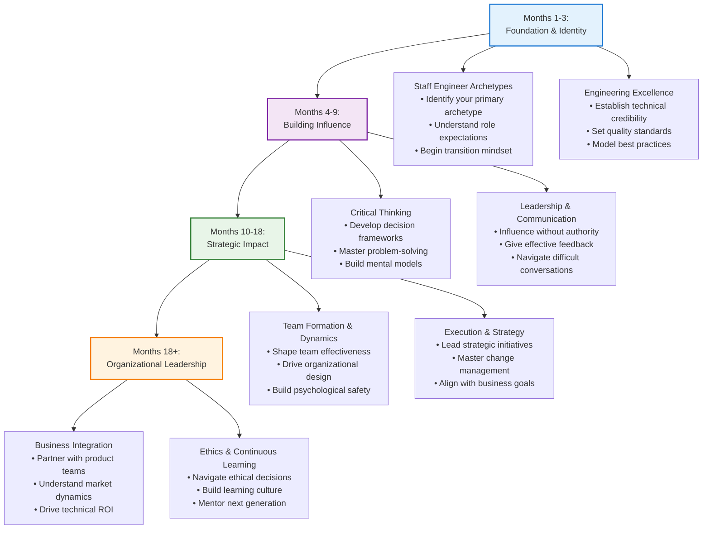

# Setting the Stage: What It Means to Be a Staff Engineer

## The Moment Everything Changes

Picture this: You're six months into your new Staff Engineer role, sitting in a packed conference room with the VP of Engineering, three Directors, and representatives from Product, Design, and DevOps. The company's flagship product is experiencing mysterious performance issues that are costing thousands in lost revenue daily. Everyone is looking at each other, then slowly, all eyes turn to you.

"What's your recommendation?" the VP asks.

This isn't about writing more code. It's not about optimizing a specific algorithm or fixing a particular bug. This is about **leadership in the face of ambiguity**—about taking incomplete information, diverse stakeholder needs, and competing priorities, then charting a path forward that the entire organization can rally behind.

**This is the reality of staff engineering.** 

And if that scenario made your palms a little sweaty, you're in the right place. The transition from Senior to Staff Engineer represents one of the most significant shifts in a technical career—not just in responsibility, but in fundamental identity. You're no longer just building solutions; you're building the people and systems that build solutions.

> This guide is designed as a companion to "The Staff Engineer's Path" by Tanya Reilly, expanding on the concepts with practical frameworks, real-world scenarios, and actionable tools for navigating this critical transition.

## The Leadership Paradox in Technical Roles

The challenge every new staff engineer faces is this: **you must lead without authority, influence without control, and drive change while serving others.** You're expected to shape technical strategy while remaining deeply hands-on. You need to think like an executive while coding like a senior engineer.

This paradox isn't a bug—it's the feature that makes staff engineering both incredibly challenging and uniquely impactful. Your value is no longer measured solely by your individual contributions (lines of code, features shipped) but by your ability to elevate the entire engineering organization.

## The Role of a Staff Engineer: Beyond the Code

At its core, the Staff Engineer role is about operating on a larger canvas. While a Senior Engineer owns the "how" of a specific project or feature, a Staff Engineer is increasingly responsible for the "what" and the "why" across multiple teams or even the entire organization. Your focus shifts from the tactical to the strategic.

Your value is no longer measured solely by your individual contributions (lines of code, features shipped) but by your ability to elevate the entire engineering organization. This happens through four common archetypes:

-   :material-account-supervisor-circle: **The Tech Lead**
    
    ---
    
    **Focus:** Team technical direction and execution
    
    - Guide technical direction of teams
    - Maintain codebase health and architecture
    - Mentor engineers and review designs
    - Ensure alignment and unblock teams

-   :material-sitemap: **The Architect**
    
    ---
    
    **Focus:** System-wide technical strategy
    
    - Shape technical direction across major systems
    - Plan 1-3 years ahead for scalability
    - Create technical strategy and core designs
    - Align architecture with business goals

-   :material-wrench: **The Solver**
    
    ---
    
    **Focus:** Complex problem resolution
    
    - Deep technical expertise for critical issues
    - Handle ambiguous and high-stakes problems
    - Prototype unproven technologies
    - Diagnose complex system issues

-   :material-account-tie: **The Right Hand**
    
    ---
    
    **Focus:** Strategic leadership partnership
    
    - Trusted advisor to senior engineering leaders
    - Drive cross-functional initiatives
    - Organizational improvements and change
    - Technical proxy for leadership discussions

## Scaling Yourself: The Force Multiplier Mindset

The single most important transition to make is from being a top individual contributor to becoming a **force multiplier**. A force multiplier is someone whose presence and actions increase the effectiveness of everyone around them. You are no longer just adding your own output; you are multiplying the output of others.  

!!! success "How to Become a Force Multiplier"
    
    === "Mentoring & Sponsorship"
        You actively invest in the growth of other engineers. You don't just give advice; you create opportunities for them to lead, learn, and grow their own careers.
        
        **Impact:** Individual growth scales team capability
    
    === "Process & Tool Improvement"
        You identify and eliminate friction. This could mean improving the CI/CD pipeline, introducing testing frameworks, or standardizing documentation practices.
        
        **Impact:** Systematic improvements benefit entire organization
    
    === "Strategic Documentation"
        You write documents that clarify ambiguity, align teams, and save hundreds of engineering hours. RFCs, ADRs, and technical strategies.
        
        **Impact:** Clear communication prevents costly misalignment
    
    === "Decision Making"
        You have the context and technical depth to make difficult trade-off decisions that unblock entire teams. You provide clarity and enable forward momentum.
        
        **Impact:** Confident decisions eliminate organizational paralysis

Adopting this mindset is the key to unlocking the true potential of the Staff Engineer role. The rest of this guide is dedicated to giving you the tools to do just that.

## Your Staff Engineering Journey Map

Understanding the staff engineering landscape is just the beginning. The path ahead involves developing competencies across multiple domains, each building on the others to create your unique leadership profile.

!!! abstract "Development Timeline: From Transition to Mastery"
    **Most staff engineers follow a predictable progression over their first 18-24 months in role. Here's your roadmap:**

**Key Insight:** Unlike individual contributor growth (which is mostly linear), staff engineering development is **spiral**—you revisit core themes with increasing sophistication and broader organizational scope.

## Skills Assessment & Development Planning

!!! question "Staff Engineering Readiness Assessment"
    **Rate your current confidence level (1-5) in each area:**
    
    === "Technical Foundation"
        - [ ] **Architectural Thinking**: I can design systems that scale beyond current requirements
        - [ ] **Technical Decision Making**: I make sound trade-offs between competing technical priorities
        - [ ] **Quality Standards**: I establish and maintain high engineering standards across teams
        - [ ] **Technical Communication**: I explain complex technical concepts to diverse audiences
        
    === "Leadership & Influence"
        - [ ] **Influence Without Authority**: I can drive change without formal management power
        - [ ] **Conflict Resolution**: I navigate technical disagreements constructively
        - [ ] **Mentorship**: I accelerate the growth of other engineers
        - [ ] **Vision Articulation**: I can paint compelling pictures of technical futures
        
    === "Business Integration"
        - [ ] **Strategic Alignment**: I connect technical work to business outcomes
        - [ ] **Stakeholder Management**: I work effectively with product, design, and leadership
        - [ ] **Resource Optimization**: I help teams deliver maximum value efficiently
        - [ ] **Risk Assessment**: I identify and communicate technical risks clearly

**Development Priority:** Focus first on areas where you scored 1-2. These are your highest-leverage improvement opportunities.

## Discrete Topics Covered

* [The Tech Lead](tech-lead.md): Learn how to guide the technical direction of a team, maintain code health, and mentor other engineers while balancing leadership with hands-on contribution.
* [The Architect](architect.md): Explore how to shape technical strategy, design scalable systems, and establish governance while maintaining alignment with business goals.
* [The Solver](solver.md): Discover how to tackle the most complex technical challenges, from production firefighting to technical exploration and legacy system navigation.
* [The Right Hand](right-hand.md): Understand how to partner with senior leadership, drive strategic initiatives, and influence across the organization.
* [Becoming a Force Multiplier](force-multiplier.md): Master the strategies for scaling your impact by enabling others to be more effective and productive.

## Cross-Reference Navigation

### Prerequisites for Staff Engineering
- **[Developing Expertise](../learning/developing-expertise.md)** - Strong foundation in continuous learning and skill development is essential
- **[Mental Models](../thinking/mental-models.md)** - Cognitive frameworks that support strategic thinking and complex problem-solving

### Related Concepts  
- **[Strategic Thinking](../execution/strategic-thinking.md)** - Essential capability for all staff engineer archetypes
- **[Technical Vision](../leadership/technical-vision.md)** - Core skill for communicating and implementing technical strategy
- **[Cross-functional Collaboration](../teamwork/cross-functional-collaboration.md)** - Critical for success in staff roles

### Apply These Concepts
- **[Staff Engineer Competency Assessment](../../appendix/tools/staff-engineer-competency-assessment.md)** - Evaluate your readiness across all staff engineering dimensions
- **[Development Tracking System](../../appendix/tools/development-tracking-system.md)** - Track your progression through staff engineering capabilities

### Next Steps in Your Learning Journey
1. **Choose Your Primary Archetype** - Review the five archetypes and identify which resonates most with your interests and strengths
2. **[Staff Engineer Competency Assessment](../../appendix/tools/staff-engineer-competency-assessment.md)** - Establish your baseline capabilities
3. **Begin Targeted Development** - Focus on the specific skills and knowledge areas for your chosen archetype

## Further Reading

To deepen your understanding of the Staff Engineer role and how to succeed in it, consider these influential works:

* **Reilly, Tanya. *The Staff Engineer's Path: A Guide for Individual Contributors Navigating Growth and Change*.** (2022). The definitive guide to the Staff Engineer role and the primary resource this field guide is designed to complement. Reilly provides a comprehensive framework for understanding and excelling in technical leadership positions beyond the management track.

* **Fournier, Camille. *The Manager's Path: A Guide for Tech Leaders Navigating Growth and Change*.** (2017). Provides a roadmap for engineering leadership roles, including the transition from Senior to Staff Engineer.

* **Larson, Will. *Staff Engineer: Leadership Beyond the Management Track*.** (2021). A collection of stories and insights from Staff Engineers across the industry, offering diverse perspectives on the role.

* **Gruver, Gary, et al. *A Practical Approach to Large-Scale Agile Development*.** (2012). Offers insights into leading large-scale technical initiatives and driving organizational change.

* **Brandolini, Alberto. *Introducing EventStorming: An Act of Deliberate Collective Learning*.** (2019). A powerful approach for collaborative exploration of complex domains, useful for Staff Engineers in any archetype.
