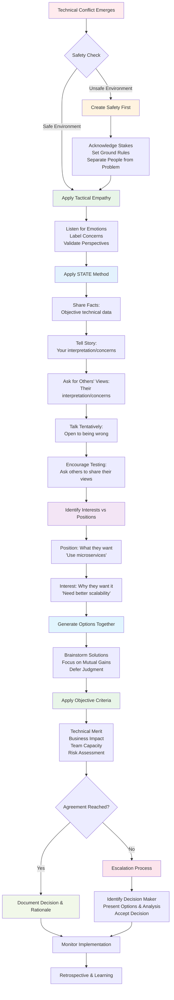

# Advanced Conflict Resolution for Technical Leaders

A comprehensive framework for navigating complex interpersonal and organizational conflicts in engineering environments, integrating proven methodologies from "Crucial Conversations," "Getting to Yes," and "Nonviolent Communication" to transform conflict from destructive force into catalyst for innovation and team growth.

## Introduction: The Conflict Reality

Picture this scenario: Your team is split on a critical architectural decision. Half the engineers favor a microservices approach that promises scalability but requires significant operational complexity. The other half advocates for a modular monolith that's simpler to manage but may limit future growth. The discussion has become heated, with people questioning each other's competence and commitment. Productivity has ground to a halt, and you can sense that relationships are being damaged.

Meanwhile, your product manager is pressuring for a decision "by end of week" because the delay is affecting the roadmap. The VP of Engineering wants to know why such a "straightforward technical decision" is taking so long. Team members are starting to take sides, creating factions that extend beyond this single issue.

Sound familiar? This is conflict in the modern workplace—complex, multi-layered, and often poorly handled. Most technical leaders receive extensive training in system design, programming languages, and project management, but virtually no training in conflict resolution. Yet the ability to navigate conflict effectively often determines whether technical initiatives succeed or fail.

Conflict isn't inherently negative. When handled skillfully, it can surface important information, generate creative solutions, and strengthen team relationships. When handled poorly, it destroys trust, reduces productivity, and drives talented people away from teams and organizations.

This guide provides systematic approaches to conflict resolution that serve the unique needs of technical environments, where decisions often involve complex tradeoffs, multiple stakeholders, and high-stakes outcomes.

## The Crucial Conversations Framework

### Understanding High-Stakes Dialogue

Kerry Patterson and his colleagues identified "crucial conversations" as discussions where stakes are high, emotions run strong, and opinions differ. Technical environments generate these conversations regularly—architecture decisions, code review disagreements, resource allocation conflicts, and performance discussions all qualify as crucial conversations.

**The Anatomy of Crucial Conversations in Technical Contexts**:

**High Stakes**: Technical decisions often have long-term consequences that affect system performance, team productivity, customer experience, and business outcomes. Choosing the wrong database architecture or deployment strategy can create problems that persist for years.

**Strong Emotions**: Despite the stereotype of emotionally detached engineers, technical work generates strong feelings. People care deeply about code quality, system elegance, and technical excellence. When these values are threatened, emotions emerge quickly.

**Differing Opinions**: Technical problems often have multiple valid solutions with different tradeoffs. Reasonable people can disagree about priorities, approaches, and acceptable compromises.

**The Pool of Shared Meaning**:

The goal of crucial conversations isn't to "win" but to create a shared pool of meaning where all perspectives are heard and understood. In technical contexts, this means:

- **Surface All Technical Options**: Ensure all viable approaches are considered, not just the ones advocated by the most senior or vocal team members
- **Explore Tradeoffs Explicitly**: Make the pros and cons of each approach visible to all participants
- **Understand Different Priorities**: Recognize that team members may prioritize different values (performance vs. maintainability, speed vs. quality, innovation vs. stability)
- **Build on Collective Expertise**: Leverage the combined knowledge and experience of the entire team

**The Crucial Conversation Process**:

**Start with Heart**: Before entering a difficult conversation, clarify what you really want to achieve. In technical discussions, this might mean:

- "I want to find the best solution for our users and business"
- "I want to preserve team relationships while making good technical decisions"
- "I want everyone to feel heard and understood, regardless of which approach we choose"

**Stay in Dialogue**: When people feel threatened, they either retreat into silence or become verbally aggressive. Neither serves technical decision-making. Create safety by:

- Acknowledging different perspectives as legitimate
- Separating technical merit from personal worth
- Making it safe to express unpopular or minority opinions
- Focusing on shared goals (user success, system reliability, team effectiveness)

**Explore Others' Paths**: Understand the reasoning behind different technical perspectives:

- What assumptions are driving different recommendations?
- What past experiences influence current preferences?
- What risks or opportunities does each person see most clearly?
- How do different roles and responsibilities affect perspective on the problem?

### Safety and Dialogue in Technical Teams

**Creating Psychological Safety for Technical Discussions**:

Technical conversations can quickly become unsafe when people feel their competence, judgment, or commitment is being questioned. Signs of lost safety include:

- People withdrawing from technical discussions
- Conversations becoming personal rather than focusing on technical merit
- Decisions being made by the loudest voice rather than best reasoning
- Team members privately expressing concerns they won't share in meetings
- Technical discussions becoming win-lose competitions

**Techniques for Restoring Safety**:

**Apologize When Appropriate**: If you've contributed to an unsafe environment, acknowledge it:

- "I realize I was pushing my preferred solution without really listening to other approaches"
- "I think I came across as dismissive of the testing concerns raised earlier"
- "I may have seemed impatient about reaching a decision—let's make sure we explore this properly"

**Contrast to Fix Misunderstandings**: Clarify what you don't mean and what you do mean:

- "I'm not saying your approach is wrong—I'm trying to understand how it handles the scaling requirements"
- "I don't think this is about individual skill levels—I think we're weighing different priorities"
- "This isn't about moving fast vs. moving slow—it's about understanding our tradeoffs"

**Create Mutual Purpose**: Find shared goals that transcend individual preferences:

- "We all want our users to have a great experience with reliable, fast software"
- "We're all committed to building something the team can maintain and evolve over time"
- "We all want to make a decision we can execute effectively with our current resources"

### Managing Technical Disagreements

**The STATE Method for Technical Discussions**:

**Share Facts**: Start with objective, verifiable information rather than opinions or interpretations:

- Performance test results, error rates, resource utilization metrics
- System requirements, constraints, and success criteria
- Timeline pressures, budget limitations, and available expertise
- Historical data about similar decisions and their outcomes

**Tell Stories**: Explain your interpretation of the facts and the reasoning behind your recommendations:

- "Based on these performance tests, I'm concerned that approach A won't scale to our projected load"
- "Given our team's experience with microservices, I think we're underestimating the operational complexity"
- "Looking at our deployment timeline, I don't think we have enough time to implement approach B safely"

**Ask for Others' Paths**: Invite different perspectives and encourage others to share their reasoning:

- "What am I missing about approach B that makes you confident about the timeline?"
- "Help me understand how you're thinking about the scaling requirements"
- "What would need to be true for approach A to work effectively?"

**Talk Tentatively**: Present your views as one perspective rather than absolute truth:

- "It seems to me that..." rather than "The obvious choice is..."
- "I'm beginning to think..." rather than "We have to..."
- "I wonder if..." rather than "We can't..."

**Encourage Testing**: Invite others to disagree, add information, or suggest alternatives:

- "What do you think?"
- "Does this make sense to you?"
- "What would you add or change?"

## Principled Negotiation for Technical Leaders

### The Fisher & Ury Framework

Roger Fisher and William Ury's "Getting to Yes" provides a framework for principled negotiation that's particularly valuable for technical leaders who must balance competing technical requirements, resource constraints, and stakeholder needs.

**The Four Principles Applied to Technical Environments**:

=== "Separate People from Problems"
    **Distinguish technical merit from personal dynamics.** In technical discussions, this means separating the value of ideas from the people who propose them. When teams violate this principle, they dismiss valuable insights based on who suggests them, take technical criticism personally, or make decisions based on politics rather than merit.

    !!! danger "Common Violations"
        - Dismissing ideas because of who suggests them ("That's just John being overly cautious again")
        - Taking technical criticism personally ("You're saying my code is bad")
        - Making technical decisions based on politics rather than merit
        - Allowing past conflicts to influence current technical evaluations

    !!! success "Better Approaches"
        - Focus discussions on system requirements, constraints, and tradeoffs
        - Acknowledge the expertise and good intentions of all team members
        - Separate advocacy for specific solutions from evaluation of solutions
        - Address interpersonal issues separately from technical decision-making

=== "Focus on Interests, Not Positions"
    **Explore underlying needs rather than advocating for specific solutions.** Technical discussions often get stuck when people argue for particular approaches without exploring the requirements those approaches address.

    | Thinking Style | Example | Effectiveness |
    |----------------|---------|---------------|
    | **Position-based** | "We must use React" vs "We absolutely need Vue" | Creates win-lose scenarios |
    | **Interest-based** | "We need a framework that our team can learn quickly, has good community support, and integrates well with our existing toolchain" | Enables creative solutions |

    **Common Technical Interests:**
    - System performance, reliability, and scalability
    - Code maintainability and team productivity
    - Security, compliance, and risk management
    - Cost control and resource efficiency
    - Learning opportunities and career development
    - User experience and business value delivery

=== "Generate Options for Mutual Gain"
    **Create multiple approaches that satisfy different interests simultaneously.** Rather than arguing for one "right" solution, effective technical leaders explore collaborative approaches that address various stakeholder needs.

    **Brainstorming Techniques:**

    | Technique | Application | Outcome |
    |-----------|-------------|----------|
    | **Time-boxed option generation** | Spend 30 minutes generating approaches before evaluation | Prevents premature narrowing |
    | **Build on ideas** | Use "yes, and..." thinking to enhance proposals | Improves solution quality |
    | **Prototype multiple approaches** | Build lightweight prototypes with real data | Evidence-based decisions |
    | **Combine approaches** | Integrate best aspects of different solutions | Innovative hybrid solutions |

    !!! example "Microservices vs Modular Monolith Solution"
        - Start with a modular monolith and identify specific services to extract based on scaling needs
        - Implement microservices patterns within the monolith to enable future extraction
        - Use feature flags to experiment with different service boundaries
        - Create a hybrid approach where some components are services and others remain in the monolith

=== "Use Objective Criteria"
    **Base technical decisions on measurable criteria rather than subjective preferences.** This principle transforms technical discussions from opinion battles into collaborative problem-solving sessions guided by evidence.

    | Criteria Category | Specific Measures | Decision Impact |
    |-------------------|-------------------|------------------|
    | **Performance** | Benchmarks, scalability test results | System capability validation |
    | **Quality** | Maintainability, test coverage, complexity metrics | Long-term sustainability |
    | **Security** | Assessment results, compliance requirements | Risk mitigation verification |
    | **Cost** | Development time, operational expenses, technical debt | Resource optimization |
    | **Team Capability** | Existing skills, learning curve, available resources | Implementation feasibility |
    | **Risk** | Probability and impact of different failure modes | Strategic decision support |

### BATNA Development in Technical Contexts

**Best Alternative to a Negotiated Agreement (BATNA)** helps you understand your options if current negotiations fail. In technical contexts, this means understanding what happens if you can't reach consensus on technical decisions.

**Technical BATNA Examples**:

**Architecture Decision Deadlock**: If the team can't agree on microservices vs. monolith:

- BATNA might be having the technical lead or architect make the final decision
- Alternative BATNA: Start with the simpler approach (monolith) and revisit in 6 months
- Another BATNA: Build a proof of concept for each approach and compare results

**Resource Allocation Conflict**: If teams can't agree on sprint priorities:

- BATNA might be escalating to product management for prioritization
- Alternative BATNA: Time-boxed experiments to gather data for decision-making
- Another BATNA: Parallel development with different teams working different priorities

**Tool Selection Disputes**: If teams prefer different development tools or frameworks:

- BATNA might be standardizing on existing tools to avoid fragmentation
- Alternative BATNA: Pilot programs to evaluate new tools with defined success criteria
- Another BATNA: Different teams using different tools with shared standards for integration

**Strengthening Your BATNA**:

- Develop multiple fallback options rather than just one
- Make your alternatives genuinely viable by investing in their feasibility
- Communicate your BATNA appropriately—it's not a threat, but it provides context for negotiation
- Regularly reassess your BATNA as situations change

## Nonviolent Communication in Technical Settings

### The Marshall Rosenberg Framework

Marshall Rosenberg's Nonviolent Communication (NVC) provides a structured approach to expressing needs and resolving conflicts that's particularly valuable in technical environments where miscommunication can have significant consequences.

**The Four Components Applied to Technical Communication**:

**1. Observation (Without Evaluation)**

Distinguish between observable facts and interpretations or judgments. This is particularly important in technical discussions where opinions are often presented as facts.

**Problematic (Evaluation mixed with observation)**:

- "Your code is poorly written"
- "The system is unreliable"
- "You never consider performance implications"

**Better (Pure observation)**:

- "The function has a cyclomatic complexity of 15 and no unit tests"
- "The system has averaged 3 outages per week for the past month"
- "In the last 3 code reviews, performance optimization wasn't mentioned"

**2. Feelings (Emotional States)**

Technical environments often discourage emotional expression, but feelings provide important information about conflicts and motivations.

**Common feelings in technical conflicts**:

- **Frustration**: When technical constraints prevent desired solutions
- **Anxiety**: About system reliability, security, or scalability
- **Excitement**: About new technologies or innovative approaches
- **Concern**: About technical debt, code quality, or maintainability
- **Appreciation**: For elegant solutions or collaborative problem-solving

**Expressing feelings appropriately**:

- "I'm excited about the possibilities this new framework offers"
- "I'm feeling anxious about the security implications of this approach"
- "I'm frustrated that we keep having to work around this legacy system"

**3. Needs (Universal Human Values)**

Behind every technical preference are underlying needs that drive behavior and decisions. Think about the last time you felt strongly about a particular technical approach. What was really driving that conviction? Was it the elegance of the solution? The security implications? The impact on your daily work experience?

Understanding these deeper motivations transforms technical discussions from debates about competing solutions into collaborative explorations of shared values:

When Sarah advocates passionately for microservices, she might be driven by her **need for autonomy**—the ability to deploy her team's service independently without waiting for other teams. When Marcus pushes back on the same proposal, his **need for security** might be at play—concern about the operational complexity and potential for cascading failures.

**The human needs that show up in technical work** often include:

**Competence and mastery** drive our desire to build excellent systems and exercise our technical skills at the highest level. We want our code to be elegant, our architectures to be sound, and our solutions to demonstrate our professional capabilities.

**Learning and growth** fuel our excitement about new technologies, frameworks, and approaches. The developer pushing for the latest JavaScript framework might be expressing a fundamental need to continue developing professionally and stay current in their field.

**Autonomy and influence** manifest in our desire to have meaningful input on technical decisions that affect our daily work. No one wants to be told exactly how to implement something without understanding the reasoning or having opportunities to contribute their expertise.

**Purpose and meaning** connect our technical work to larger goals—creating value for users, solving important problems, and contributing to something meaningful beyond just writing code.

**Security and stability** appear both technically (reliable systems, proven approaches) and professionally (career stability, avoiding technologies that might become obsolete).

**Efficiency and flow** drive our preference for tools, processes, and architectures that let us work effectively without unnecessary friction or obstacles.

**4. Requests (Specific Actions)**

Convert needs into specific, actionable requests that can be fulfilled or declined.

**Effective technical requests**:

- "Would you be willing to walk me through your performance testing approach?"
- "Could we schedule a 30-minute session to explore the security concerns together?"
- "Would you consider doing a spike to prototype both approaches before we decide?"

**Ineffective requests** (too vague, demanding, or blame-focused):

- "You need to be more careful about code quality"
- "Fix the performance problems"
- "Stop being so negative about new technologies"

### Handling Technical Criticism and Feedback

**Receiving Technical Criticism with NVC**:

When receiving criticism about technical work, use NVC to understand the underlying concerns rather than immediately defending your approach.

**Traditional defensive response to "This code is hard to understand"**:

- Explaining why the code is correct as written
- Pointing out that it works and passes tests
- Noting that the critic doesn't understand the problem domain

**NVC-informed response**:

1. **Observe**: "You're saying the code is hard to understand"
2. **Reflect feelings**: "It sounds like you're concerned about maintainability"
3. **Identify needs**: "Are you needing confidence that future developers can modify this code safely?"
4. **Make requests**: "Would it help if I added more comments explaining the algorithm, or would you prefer a different approach?"

**Giving Technical Feedback with NVC**:

Structure technical feedback to be helpful rather than judgmental:

1. **Observation**: "I notice this function handles five different responsibilities"
2. **Feelings**: "I'm concerned about how this might affect future maintenance"
3. **Needs**: "I'd like our codebase to be easy for new team members to understand"
4. **Request**: "Would you be willing to consider breaking this into separate functions?"

## Tactical Negotiation for Technical Leaders

### The FBI Approach to High-Stakes Technical Conversations

Chris Voss spent years as the FBI's lead international kidnapping negotiator, learning how to find resolution in the most high-pressure situations imaginable. While technical conflicts aren't life-or-death situations, they often feel that way to the people involved, and Voss's tactical approach can be remarkably effective in engineering environments where emotions run high and stakes feel enormous.

**The fundamental insight from hostage negotiation that applies to technical leadership**: people don't make decisions based purely on logic, even in technical contexts. Emotions, prior experiences, and psychological safety all influence how someone responds to technical arguments. The most elegant architectural solution won't get adopted if the people implementing it feel unheard, pressured, or dismissed.

**Tactical Empathy in Technical Discussions**

This isn't about being nice or agreeable—it's about understanding the emotional and psychological dynamics that influence technical decision-making. When someone is strongly advocating for a particular technical approach, they're often motivated by more than just technical merit. They might be worried about being seen as competent, concerned about technical debt they've been dealing with, or excited about learning opportunities.

Tactical empathy means recognizing these underlying emotions and addressing them explicitly before diving into technical details. It might sound like:

_"It sounds like you're really frustrated with how slowly our current deployment process works, and this new approach feels like it could solve some of those daily pain points you've been experiencing. Is that right?"_

This validation doesn't mean you agree with their proposed solution—it means you understand why they care so deeply about finding a solution.

**Labeling Emotions to Defuse Tension**

One of Voss's most powerful techniques is "labeling"—simply naming the emotions you observe in others. This might seem too touchy-feely for technical environments, but it's remarkably effective at defusing tension and creating space for rational discussion.

When a technical discussion gets heated, try labeling what you're observing:

_"It seems like there's some real concern about the operational complexity of this approach."_

_"You sound frustrated that this decision keeps getting delayed."_

_"It feels like there might be some worry about whether this solution will actually solve the performance problems we've been having."_

The key is to use softening language ("it seems like," "it sounds like," "it feels like") rather than direct statements ("you are frustrated"). This gives people space to correct your interpretation while acknowledging their emotional reality.

### **The Technical Conflict Resolution Framework**

Combining insights from Crucial Conversations, tactical empathy, and principled negotiation, this framework provides a systematic approach to resolving technical conflicts:

**Framework Application Guide:**

**Phase 1: Safety & Empathy (Critical Foundation)**

- Check emotional temperature of the room
- If people are defensive, angry, or withdrawn, address safety first
- Use tactical empathy to understand underlying concerns
- Separate technical merit from personal worth

**Phase 2: Structured Information Sharing (STATE Method)**

- Start with objective, verifiable facts
- Share your interpretation tentatively
- Ask for others' perspectives explicitly
- Remain open to changing your mind
- Create space for diverse viewpoints

**Phase 3: Interest-Based Problem Solving**

- Distinguish between positions (what people say they want) and interests (why they want it)
- Focus conversation on shared interests and underlying needs
- Generate multiple options before evaluating any single option
- Use objective criteria to evaluate options fairly

**Phase 4: Decision & Implementation**

- If consensus emerges, document the decision and reasoning
- If consensus doesn't emerge, use clear escalation process
- Monitor implementation and gather feedback
- Learn from the conflict resolution process itself

**Key Success Indicators:**

- All parties feel heard and understood
- Decision is based on merit, not politics or hierarchy
- Team relationships are preserved or strengthened
- Process can be replicated for future conflicts
- Technical solution addresses underlying business needs

**The Power of Calibrated Questions**

Instead of making statements that can trigger defensive responses, Voss uses calibrated questions—open-ended questions that begin with "how" or "what" and give the other person control over the conversation.

In technical contexts, these questions can help people explore their own reasoning and discover gaps or alternatives they hadn't considered:

_"What are we trying to accomplish with this architectural change?"_

_"How would this approach handle the scale we're expecting next year?"_

_"What would need to be true for this solution to work effectively?"_

_"How would the operations team need to prepare for this change?"_

These questions do something powerful: they shift the conversation from advocacy (defending positions) to exploration (examining problems). When people are explaining their thinking rather than defending their conclusions, they're more open to discovering new information or alternative approaches.

**Getting to "That's Right" Instead of "Yes"**

Most technical discussions aim for agreement—getting people to say "yes" to a particular approach. But Voss discovered that "yes" is often meaningless—people might agree just to end the conversation or avoid conflict. The real breakthrough comes when someone says "that's right" because they feel truly understood.

In technical conversations, this means focusing first on understanding the problem deeply before proposing solutions. Instead of jumping to advocate for your preferred architecture, spend time exploring:

_"So if I understand correctly, the core issue is that our current system makes it really difficult to deploy individual services independently, which slows down your team's ability to iterate quickly. And the bigger concern is that as we add more services, this coordination overhead is going to get exponentially worse. Is that right?"_

When someone responds with "exactly" or "that's right," you know you've achieved real understanding. Only then are they likely to be genuinely open to exploring solutions together.

**Strategic Patience in Technical Decision-Making**

Hostage negotiations succeed because negotiators understand that rushing toward resolution often prevents actual resolution. The same principle applies to complex technical decisions. Instead of pushing for quick closure, create space for people to process, explore, and reach conclusions that feel genuine to them.

This might mean breaking complex architectural decisions into smaller conversations, giving people time to research alternatives between meetings, or explicitly saying "we don't need to decide this today—let's make sure we understand the problem well first."

## Advanced Team Dynamics

### Network Organization Principles

Stanley McChrystal's "Team of Teams" provides insights for technical leaders who must coordinate multiple engineering teams working on interconnected systems.

**Traditional Hierarchy vs. Network Organization**:

Picture a large engineering organization where each team operates like an independent silo. The mobile team builds features without understanding what the API team is planning. The platform team makes infrastructure changes that surprise the application teams. The data team optimizes for their use cases without considering the impact on real-time services. Sound familiar?

This traditional approach worked when software systems were simpler and change happened more slowly. But in today's environment of microservices, cloud infrastructure, and continuous deployment, the old hierarchical model creates more problems than it solves:

Information moves slowly up and down the hierarchy, so by the time the mobile team learns about a breaking API change, they've already built features that depend on the old interface. Centralized decision-making means teams wait for architectural decisions while opportunities pass by. Each team optimizes for their local goals without understanding the system-level consequences.

**McChrystal's network organization offers a different model**—one where teams operate with both autonomy and alignment, like special forces units that can coordinate complex operations without micromanagement.

**Shared Consciousness in Engineering Organizations**

Instead of information hoarding, successful technical organizations create radical transparency. Every team understands not just what they're building, but how it connects to everyone else's work.

Imagine walking into any team's space and immediately understanding their current priorities, challenges, and dependencies. Architecture decision records aren't buried in team wikis—they're shared across the entire engineering organization. When the platform team is considering a major infrastructure change, they don't just send an email—they run demos and technical showcases where other teams can ask questions and provide input.

The monitoring dashboards don't just show each team's metrics in isolation—they reveal the connections between systems, so when the API response time increases, everyone can see the downstream impact on user experience. Cross-team retrospectives happen regularly, not just when something goes wrong, but as ongoing opportunities to learn from each other's experiments and failures.

**Empowered Execution with Clear Boundaries**

Network organizations give teams significant authority to make technical decisions, but within frameworks that ensure system-wide coherence. Think of it like jazz musicians improvising—they have freedom to be creative, but they're all playing in the same key and following the same rhythm.

Teams can choose their own technologies, deployment strategies, and development practices, but they operate within shared technical standards. When the payment team needs to optimize their database queries, they don't need permission—but they do need to maintain the API contracts that other teams depend on. When the mobile team wants to experiment with a new crash reporting tool, they can make that decision autonomously as long as it meets the organization's security and privacy standards.

This isn't about eliminating oversight—it's about moving from approval-based to outcome-based accountability. Teams own their results, not just their processes.

**Purpose-Driven Alignment**

The most powerful aspect of network organizations is how they align individual team goals with larger organizational objectives. Instead of optimizing for local metrics that might conflict with system-wide performance, every team understands how their technical work serves users and business outcomes.

The infrastructure team doesn't just focus on uptime—they understand how infrastructure reliability enables faster feature delivery and better user experiences. The security team doesn't just focus on compliance—they understand how security practices enable innovation by creating safe environments for experimentation.

### Managing Cross-Team Technical Conflicts

**Common Inter-Team Technical Conflicts**:

- **API Design Disagreements**: Teams disagree about service interfaces, data formats, or integration patterns
- **Resource Competition**: Multiple teams need the same infrastructure, tooling, or specialized expertise
- **Technical Standards Conflicts**: Different teams prefer different approaches to testing, deployment, monitoring, or development practices
- **Timeline Conflicts**: Dependencies between teams create scheduling conflicts and blame for delays

**Resolution Strategies**:

- **Establish Clear Ownership Boundaries**: Define which team has decision-making authority for different aspects of shared systems
- **Create Cross-Team Working Groups**: Form temporary teams to address specific technical conflicts with representatives from affected teams
- **Use Architecture Review Boards**: Regular forums where cross-team technical decisions are discussed and resolved
- **Implement Gradual Migration Strategies**: When teams can't agree on standards, create migration paths that allow coexistence during transition periods

**Example Resolution Process**:

1. **Identify Stakeholders**: Who is affected by this technical decision?
2. **Surface Underlying Needs**: What is each team trying to accomplish?
3. **Generate Options**: What are different ways to meet everyone's needs?
4. **Define Success Criteria**: How will we measure whether the solution is working?
5. **Create Experimentation Plan**: How can we test approaches with minimal risk?
6. **Establish Decision Timeline**: When will we evaluate results and make a final decision?
7. **Plan Communication**: How will we keep all stakeholders informed of progress and outcomes?

## Cultural Transformation Through Conflict Resolution

### Building Conflict-Resilient Technical Teams

**Characteristics of Teams That Handle Conflict Well**:

- **Psychological Safety**: Team members feel safe to express disagreement, admit mistakes, and ask questions without fear of embarrassment or retribution
- **Focus on Learning**: Conflicts are viewed as opportunities to discover better solutions rather than competitions to be won
- **Shared Standards**: Common understanding of how technical decisions should be made and evaluated
- **Process Over Personality**: Disagreements focus on approaches and outcomes rather than individual competence or character

**Developing Conflict Resolution Capabilities**:

- **Regular Practice**: Use low-stakes technical discussions to practice conflict resolution skills
- **Skill Development**: Provide training in crucial conversations, active listening, and collaborative problem-solving
- **Process Documentation**: Create clear processes for escalating and resolving technical disagreements
- **Cultural Reinforcement**: Celebrate examples of constructive conflict resolution and learning from disagreement

**Conflict Prevention Strategies**:

- **Clear Decision Rights**: Ensure everyone understands who makes which types of technical decisions
- **Transparent Communication**: Share information openly to prevent misunderstandings and speculation
- **Regular Check-ins**: Proactively surface tensions before they become major conflicts
- **Shared Context**: Ensure all team members understand business goals, technical constraints, and user needs

### Creating Learning-Oriented Conflict Culture

**Shift from Blame to Learning**:

Traditional technical culture often treats conflicts as problems to be avoided or competitions to be won. A learning-oriented culture treats conflicts as opportunities to:

- Discover better solutions through diverse perspectives
- Understand system requirements more deeply
- Build stronger team relationships through working through disagreements
- Develop better decision-making processes and criteria

**Implementation Strategies**:

**Post-Conflict Learning Reviews**: After resolving technical disagreements, discuss:

- What did we learn about the problem or potential solutions?
- How could we have surfaced this disagreement earlier?
- What would help us handle similar conflicts more effectively in the future?
- How can we apply these insights to other technical decisions?

**Conflict as Data**: Treat recurring conflicts as signals about organizational or technical problems:

- If teams frequently disagree about API designs, maybe the standards aren't clear enough
- If architecture decisions consistently create controversy, maybe the decision-making process needs improvement
- If certain technical topics always generate conflict, maybe they need more structured exploration

**Celebrate Productive Conflict**: Recognize and reward examples of conflict that leads to better outcomes:

- Teams that surface important technical disagreements early in projects
- Individuals who change their minds based on new evidence or perspectives
- Collaborative problem-solving that generates innovative solutions
- Honest discussions about technical tradeoffs and limitations

The mastery of conflict resolution skills enables technical leaders to transform one of the most challenging aspects of team leadership into a competitive advantage. Teams that can navigate disagreements effectively make better technical decisions, adapt more quickly to changing requirements, and create more innovative solutions through the productive synthesis of diverse perspectives.

Through systematic application of these frameworks, technical leaders build organizations where conflict becomes a catalyst for excellence rather than a source of dysfunction, creating environments where technical innovation flourishes through the constructive engagement of different ideas, perspectives, and approaches.

## Cross-Reference Navigation

### Prerequisites for This Chapter

- **[Psychological Safety & Trust](psychological-safety-trust.md)** - Building trust provides the foundation for productive conflict resolution
- **[Influencing Without Authority](influencing-without-authority.md)** - Understanding influence techniques is essential for navigating disagreements effectively

### Related Concepts

- **[Team Formation](../teamwork/team-formation.md)** - Teams go through storming phases where conflict resolution skills are crucial
- **[Cultural Transformation & Psychological Safety](../teamwork/cultural-transformation-psychological-safety.md)** - Building cultures where productive conflict can flourish
- **[Five Dysfunctions of Teams](../teamwork/five-dysfunctions.md)** - Understanding team pathologies that prevent healthy conflict
- **[Change Management for Technical Transformations](../execution/change-management-technical-transformations.md)** - Managing resistance and conflict during organizational change
- **[Technical Vision](technical-vision.md)** - Aligning teams around shared technical direction reduces conflicts

### Apply These Concepts

- **[Staff Engineer Competency Assessment](../../appendix/tools/staff-engineer-competency-assessment.md)** - Evaluate your conflict resolution and leadership capabilities
- **[Team Health Diagnostic](../../appendix/tools/team-health-diagnostic.md)** - Assess team dynamics and conflict resolution effectiveness
- **[Development Tracking System](../../appendix/tools/development-tracking-system.md)** - Track your progress in developing conflict resolution skills

### Next Steps in Your Learning Journey

1. **[Advanced Mentorship & Career Development](advanced-mentorship-career-development.md)** - Use conflict resolution skills to help others navigate career challenges
2. **[Cultural Transformation & Psychological Safety](../teamwork/cultural-transformation-psychological-safety.md)** - Scale conflict resolution principles across organizations
3. **[Strategic Thinking](../execution/strategic-thinking.md)** - Apply structured thinking to complex organizational conflicts

## Further Reading

**Core Conflict Resolution and Communication**:

- Stone, Douglas, Bruce Patton, and Sheila Heen. _Difficult Conversations: How to Discuss What Matters Most_. 2010. (Foundational text on navigating challenging conversations with skill and empathy)
- Patterson, Kerry, Joseph Grenny, Ron McMillan, and Al Switzler. _Crucial Conversations: Tools for Talking When Stakes Are High_. 2011. (Practical techniques for high-stakes dialogue and conflict resolution)
- Fisher, Roger, William L. Ury, and Bruce Patton. _Getting to Yes: Negotiating Agreement Without Giving In_. 2011. (Classic principled negotiation framework focusing on interests rather than positions)

**Leadership and Team Dynamics**:

- Lencioni, Patrick. _The Five Dysfunctions of a Team: A Leadership Fable_. 2002. (Framework for understanding and addressing team conflicts and dysfunction)
- Edmondson, Amy C. _The Fearless Organization: Creating Psychological Safety for Learning, Innovation, and Growth_. 2018. (Building environments where productive conflict and learning can flourish)
- Brown, Brené. _Dare to Lead: Brave Work, Tough Conversations, Whole Hearts_. 2018. (Vulnerable leadership approaches to difficult conversations and team conflicts)

**Advanced Communication and Influence**:

- Voss, Chris, and Tahl Raz. _Never Split the Difference: Negotiating As If Your Life Depended On It_. 2016. (Tactical empathy and advanced negotiation techniques for complex conflicts)
- Heath, Chip, and Dan Heath. _Switch: How to Change Things When Change Is Hard_. 2010. (Understanding resistance and motivating change during conflicts and transformations)
