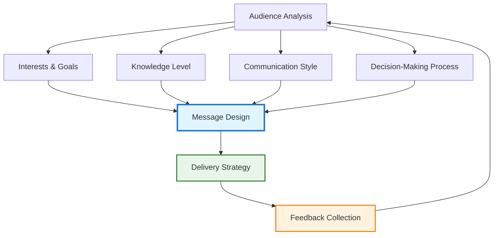

# Communication & Presentation Skills for Technical Leaders

!!! quote "Communication Excellence"
    *"The single biggest problem in communication is the illusion that it has taken place."*

    **— George Bernard Shaw**

As a staff engineer, your technical expertise only becomes organizational impact through effective communication. Your ability to articulate complex technical concepts, influence decisions, and align teams around shared understanding directly determines your success as a technical leader.

## The Staff Engineer's Communication Challenge

Technical leaders face unique communication challenges that require both deep technical knowledge and sophisticated interpersonal skills.

### Multi-Audience Communication

You must communicate effectively across diverse audiences with different backgrounds, interests, and decision-making styles:

**Technical Teams**: Deep, detailed discussions with shared context
**Product Teams**: Business-focused conversations linking technical decisions to user outcomes
**Executive Leadership**: Strategic summaries emphasizing business impact and risk
**Cross-Functional Partners**: Collaborative discussions requiring domain translation

### Technical Translation Skills

Your role often involves translating between different organizational languages:

- **Technical to Business**: Converting technical complexity into business value and risk
- **Business to Technical**: Translating business requirements into technical specifications
- **Strategic to Tactical**: Breaking down high-level vision into actionable technical work
- **Tactical to Strategic**: Synthesizing technical details into strategic insights

## Core Communication Principles

### Clarity Over Cleverness

Prioritize understanding over demonstrating technical sophistication:

**Use Simple Language**: Choose common words over technical jargon when possible
**Define Technical Terms**: When technical language is necessary, provide clear definitions
**Check for Understanding**: Regularly verify that your message is being received correctly
**Provide Examples**: Use concrete examples to illustrate abstract concepts

### Audience-Centric Communication

Tailor your message to your audience's needs, interests, and communication preferences:

### Structure for Impact

Organize your communication to maximize comprehension and retention:

**SCRAP Framework for Technical Communication:**

**S**ituation: Current context and background
**C**omplication: Problems or challenges that need addressing
**R**esolution: Proposed solution or approach
**A**ction: Specific next steps required
**P**rofit: Benefits and expected outcomes

## Presentation Skills for Technical Leaders

### Presentation Structure and Design

Create presentations that engage and inform rather than overwhelm:

**Opening Hook**: Start with a compelling problem statement or surprising insight
**Clear Agenda**: Outline what you'll cover and why it matters
**Logical Flow**: Organize content in a way that builds understanding progressively
**Strong Conclusion**: End with clear recommendations and next steps

### Visual Communication Excellence

Use visuals to enhance rather than replace your verbal message:

**Diagrams and Charts**: Make complex technical relationships visible and understandable
**Live Demos**: Show rather than just tell when demonstrating technical solutions
**Progressive Disclosure**: Reveal information gradually to avoid cognitive overload
**Consistent Design**: Use consistent colors, fonts, and layout to reduce cognitive load

### Managing Technical Q&A Sessions

Handle questions with confidence and authenticity:

**Listen Fully**: Ensure you understand the question before responding
**Acknowledge Limitations**: Say "I don't know" when you don't know, and commit to following up
**Bridge to Key Messages**: Connect answers back to your main points when appropriate
**Manage Time**: Keep responses concise while providing sufficient detail

## Executive Communication Skills

### The Elevator Pitch Framework

Develop concise, compelling summaries of technical initiatives:

**30-Second Version**: Problem, solution, impact
**2-Minute Version**: Add context, alternatives, and timeline
**10-Minute Version**: Include technical details and risk analysis

### Business Case Communication

Frame technical decisions in business terms:

**ROI Analysis**: Quantify benefits and costs when possible
**Risk Assessment**: Clearly articulate technical and business risks
**Competitive Advantage**: Explain how technical decisions create business differentiation
**Resource Requirements**: Be specific about what you need to execute

### Executive Presentation Best Practices

Communicate with senior leadership effectively:

**Start with Outcomes**: Begin with business impact, not technical details
**Use Executive Summaries**: Provide one-slide overviews of complex topics
**Prepare for Interruptions**: Executives often ask questions throughout presentations
**Bring Solutions**: Come with recommendations, not just problems

## Written Communication Excellence

### Technical Writing Principles

Create documentation that serves its intended purpose effectively:

**Audience-Appropriate Detail**: Match depth to reader expertise and needs
**Scannable Format**: Use headers, bullets, and white space for easy navigation
**Action-Oriented Language**: Use active voice and clear calls to action
**Regular Updates**: Keep documentation current and accurate

### Email and Slack Communication

Master asynchronous communication tools:

**Subject Lines**: Write descriptive subject lines that enable quick prioritization
**Executive Summaries**: Lead with key information for busy recipients
**Action Items**: Clearly identify who needs to do what by when
**Thread Management**: Keep conversations focused and easy to follow

### Technical Documentation

Create documentation that enables others to build on your work:

**Architecture Decision Records**: Document why decisions were made, not just what was decided
**Runbooks**: Provide step-by-step guidance for common operational tasks
**Code Comments**: Explain the "why" behind complex technical implementations
**Knowledge Transfer**: Write with future team members in mind

## Difficult Conversations and Conflict Resolution

### Crucial Conversations Framework

Navigate high-stakes technical discussions effectively:

**Start with Heart**: Clarify your own motives and desired outcomes
**Learn to Look**: Watch for safety problems and silence
**Make it Safe**: Ensure all parties feel safe to express their views
**Master Your Stories**: Examine the stories you're telling yourself about the situation
**STATE Your Path**: Share facts, tell your story, ask for others' paths, talk tentatively, encourage testing

### Technical Disagreement Resolution

Handle technical disagreements professionally:

**Focus on Criteria**: Establish shared criteria for evaluating options
**Seek Data**: Base decisions on evidence rather than opinion when possible
**Consider Long-term Impact**: Evaluate decisions based on long-term organizational health
**Find Common Ground**: Identify shared goals and values

## Cross-Cultural Communication

### Working with Distributed Teams

Adapt your communication style for global teams:

**Cultural Awareness**: Understand different communication styles and expectations
**Time Zone Consideration**: Schedule meetings and set response expectations appropriately
**Language Clarity**: Use clear, simple language when English isn't everyone's first language
**Written Follow-up**: Confirm verbal discussions with written summaries

### Building Inclusive Communication

Ensure your communication style includes and engages everyone:

**Multiple Communication Channels**: Use various methods to reach different communication preferences
**Speaking Time Distribution**: Ensure quieter team members have opportunities to contribute
**Cultural Sensitivity**: Be aware of different cultural approaches to hierarchy and direct feedback
**Accessibility**: Consider various accessibility needs in your communication approach

## Building Your Communication Skills

### Practice and Feedback

Continuously improve through deliberate practice:

**Record Yourself**: Video record presentations to identify improvement areas
**Seek Feedback**: Ask trusted colleagues for honest input on your communication style
**Join Speaking Groups**: Consider organizations like Toastmasters for structured practice
**Learn from Others**: Study effective communicators in your organization and industry

### Communication Skill Assessment

Regular self-evaluation using this framework:

!!! question "Communication Skills Self-Assessment"
    **Rate yourself on each skill (1=Needs Development, 5=Excellent):**

    === "Technical Translation"
        - [ ] I can explain complex technical concepts to non-technical audiences
        - [ ] I adapt my technical depth based on audience expertise
        - [ ] I use analogies and examples effectively to clarify technical ideas
        - [ ] I check for understanding rather than assuming comprehension

    === "Presentation Skills"
        - [ ] I structure presentations with clear beginning, middle, and end
        - [ ] I use visual aids that enhance rather than distract from my message
        - [ ] I handle questions confidently and authentically
        - [ ] I maintain audience engagement throughout technical presentations

    === "Written Communication"
        - [ ] My written communication is clear, concise, and actionable
        - [ ] I write documentation that others can follow and build upon
        - [ ] I use appropriate communication channels for different message types
        - [ ] My technical writing serves its intended purpose effectively

## Cross-Reference Navigation

**Communication Foundations:**
- **[Technical Writing for Influence](technical-writing-for-influence.md)** - Advanced writing techniques for technical leaders
- **[Storytelling for Engineers](storytelling-for-engineers.md)** - Using narrative to make technical ideas compelling
- **[Influence Without Authority](influencing-without-authority.md)** - Persuasion techniques for technical leaders

**Leadership Applications:**
- **[Advanced Conflict Resolution](advanced-conflict-resolution.md)** - Apply communication skills to difficult technical disagreements
- **[Technical Vision](technical-vision.md)** - Communicate compelling technical direction
- **[Working Across Boundaries](working-across-boundaries.md)** - Cross-functional communication strategies

**Business Integration:**
- **[Pitching to Executives](../business/pitching-to-executives.md)** - Specialized communication for senior leadership
- **[Product-Engineering Collaboration](../business/product-engineering-collaboration.md)** - Communication in cross-functional partnerships

## Further Reading

This chapter draws on insights from communication and leadership experts:

*   **Heath, Chip, and Dan Heath. *Made to Stick: Why Some Ideas Survive and Others Die*.** Essential principles for creating memorable and persuasive communication.
*   **Patterson, Kerry, Joseph Grenny, Ron McMillan, and Al Switzler. *Crucial Conversations: Tools for Talking When Stakes Are High*.** Framework for handling difficult conversations effectively.
*   **Duarte, Nancy. *slide:ology: The Art and Science of Creating Great Presentations*.** Comprehensive guide to presentation design and delivery.
*   **Scott, Kim. *Radical Candor: Be a Kick-Ass Boss Without Losing Your Humanity*.** Framework for direct, caring feedback and communication.
*   **Young, Scott. *Ultralearning: Master Hard Skills, Outsmart the Competition, and Accelerate Your Career*.** Techniques for rapidly developing communication and other professional skills.