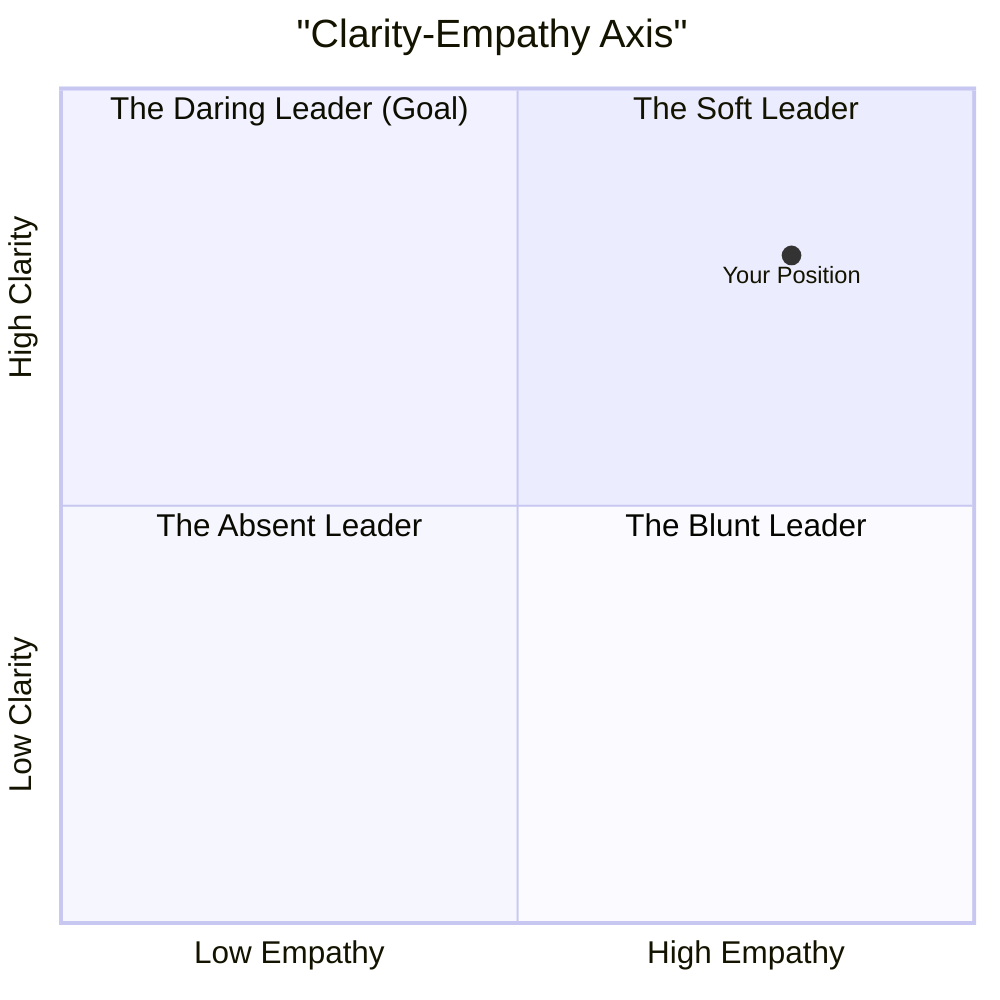

# Delivering Difficult Messages: The Clarity-Empathy Axis

## The Scenario

A skunkworks project your team has been passionately working on for two months has been canceled. A shift in company strategy means the project is no longer funded. You, as the tech lead, have to break the news to the team. They are going to be disappointed, frustrated, and demotivated.

Delivering bad news is one of the hardest things a leader must do. The temptation is to either be overly blunt (and crush morale) or overly soft (and create confusion). The key is to operate at the intersection of two axes: high clarity and high empathy.

## The Four Quadrants of Difficult Conversations

## A Playbook for Daring Delivery

### 1. Prepare: Get the Facts Straight

Before you say anything, get answers to the questions you know the team will ask. Why was it canceled? What happens to the work we did? What are we working on next? Who made the decision? Don't walk into the room without this information.

### 2. Deliver the Headline First

Do not bury the lede. Rip off the band-aid cleanly and quickly.  
* "Team, I have some difficult news to share. The decision has been made to cancel Project Phoenix, effective today."  

### 3. State the "Why" Clearly and Concisely

Provide the strategic context without blame or excessive detail.  
* "As part of the company's new focus on enterprise clients, leadership has decided to reallocate all our resources to the upcoming compliance features. This project no longer aligns with that top-level priority."  

### 4. Acknowledge the Emotional Impact

This is the empathy step. Validate their feelings.  
* "I know this is incredibly disappointing. We've all poured a lot of energy and passion into this, and I am personally gutted. It's okay to be frustrated and upset."  

### 5. Value the Work Done

Frame the effort as a valuable lesson, not a waste.  
* "I want to be clear: the work you did was not a waste. The prototype you built taught us a huge amount about integrating with the new payment gateway, and we will be using those learnings directly in the next project. You all did excellent work."  

### 6. Outline the Path Forward

Provide immediate clarity on what happens next.  
* "We will spend the rest of today documenting our key findings. Tomorrow, we will have a kickoff for our new project, which will be focused on the enterprise compliance work. I have the project brief here. Let's take a break, and then we can talk through any questions you have."

## The Impact of Clear, Compassionate Communication

By being direct, you honor the team's maturity. By being empathetic, you honor their humanity. This approach turns a potentially trust-destroying event into an opportunity to reinforce your leadership and the team's resilience.

## The Anatomy of Difficult Technical Conversations

### Understanding the Three Conversations

Douglas Stone's research from the Harvard Negotiation Project reveals that every difficult conversation is actually three conversations happening simultaneously. For technical leaders, understanding this structure transforms how you approach challenging discussions about architecture decisions, performance issues, or organizational changes.

**The "What Happened?" Conversation**

This is the conversation about facts, interpretations, and blame. In technical contexts, this might sound like: "The deployment failed because the database migration wasn't properly tested" or "The API performance degraded because the caching layer was misconfigured."

The problem with this conversation is that it treats our interpretations as facts. What we think happened isn't necessarily what actually happened, and focusing only on the "facts" often misses the underlying dynamics that created the situation.

Instead of starting with "What happened was..." try starting with "My understanding is..." or "From my perspective..." This acknowledges that you have a viewpoint rather than claiming absolute truth.

**The Feelings Conversation**

This is about the emotions involved—anger, frustration, disappointment, anxiety. Technical environments often try to avoid this conversation entirely, treating emotions as irrelevant to "rational" technical decisions. But emotions drive behavior, and ignoring them doesn't make them disappear.

When Sarah says she's "concerned about the performance implications" of your architectural proposal, she might really mean she's worried about being blamed if the system fails under load. When Marcus "questions the necessity" of the refactoring project, he might be frustrated that his team's current work will be disrupted.

The key insight is that you don't need to agree with someone's emotions, but you do need to acknowledge them. "I can see that you're really concerned about the operational complexity this might introduce" goes much further than "Your concerns are unfounded."

**The Identity Conversation**

This is the conversation about what the situation means about you as a person. Am I competent? Am I valued? Am I making a positive contribution? This conversation often stays internal, but it powerfully influences how people react to technical feedback and proposals.

When someone responds defensively to code review comments, they might be experiencing the identity conversation: "This feedback means I'm not a good programmer." When someone resists architectural changes, they might be thinking: "If this new approach is better, does that mean my previous work was wrong?"

Recognizing the identity conversation helps you frame technical discussions in ways that support rather than threaten people's professional self-image.

**Shifting to a Learning Conversation**

Instead of trying to prove who's right or wrong, shift the conversation toward mutual learning and problem-solving:

"I'm curious about your experience with this kind of architecture. What challenges have you run into that I might not be seeing?"

"Help me understand what's driving your concerns about the migration timeline. What risks are you most worried about?"

"I'm sensing some frustration about the testing approach. What would need to be different for you to feel confident about our quality strategy?"

### The Third Story: Finding Common Ground

One of the most powerful techniques from "Difficult Conversations" is starting with the "third story"—a neutral description of the situation that doesn't assign blame or judgment.

**Instead of:** "Your team's API changes broke our frontend integration, and now we're behind schedule."

**Try:** "We have a situation where the API changes and frontend integration aren't working together as expected, and we need to figure out how to move forward."

The third story acknowledges that there's a problem without making anyone the villain. It invites collaboration rather than defensiveness.

### Building Your Difficult Conversation Skills

**Before the Conversation: The Internal Work**

The most important preparation happens inside your own head. What are you trying to accomplish? Are you trying to punish someone, prove you're right, or actually solve a problem?

Check your assumptions. What story are you telling yourself about why this situation occurred? What might you be missing about the other person's perspective or constraints?

Prepare for their emotions and your own. How might they react? How will you respond if they get defensive, angry, or shut down? What emotions are you bringing into the conversation?

**During the Conversation: The External Work**

Start with inquiry, not advocacy. "Help me understand your thinking about the database choice" works better than "I think we should use PostgreSQL because..."

Listen for the feelings behind the technical positions. When someone says "I don't think this architecture will scale," try to understand what's driving that concern. Are they worried about operational complexity? Performance under load? Team capacity to maintain it?

Share your own feelings and thinking process. "I'm feeling anxious about the timeline because I've seen similar migrations take much longer than expected" is more effective than "This timeline is unrealistic."

**After the Conversation: The Follow-Through**

Difficult conversations don't end when the meeting ends. Follow up on commitments, check in on how people are feeling about decisions, and be willing to revisit conversations if new information emerges.

Most importantly, reflect on what you learned. What assumptions turned out to be wrong? What emotions came up that you weren't expecting? How can you handle similar conversations better in the future?

## Common Pitfalls & How to Avoid Them

- **Vagueness:** Overcome this with a structured, data-driven approach and clear definitions.
- **Ignoring Emotional Responses:** Acknowledge emotions and create a safe space for open communication.
- **Defensive Posturing:** Instead of defending your position, validate the other person’s concerns and focus on finding a mutually acceptable solution.

## Further Reading

- *Crucial Conversations: Tools for Talking When Stakes Are High* by Kerry Patterson et al.
- *Nonviolent Communication: A Language of Life* by Marshall B. Rosenberg
