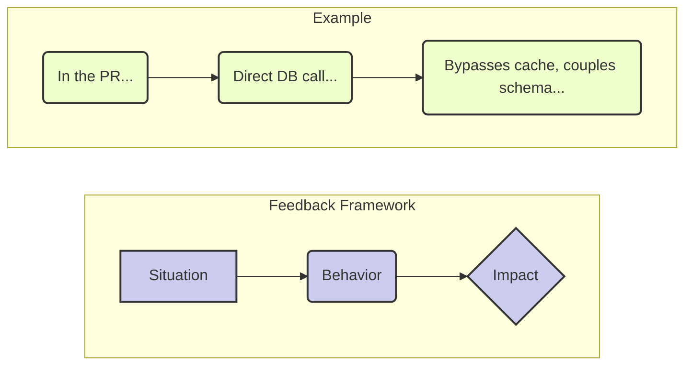

# Giving & Receiving Feedback: The Art of the Assist

## The Scenario

A junior engineer on a team you're mentoring, Alex, submits a pull request. The code works, but it takes a shortcut that violates a core architectural principle you've been trying to establish. It's a classic case of sacrificing long-term maintainability for short-term speed.

* **The Ineffective Response (The "Drive-By"):** Leaving a simple comment like, "This is wrong. Use the new pattern," and blocking the PR. This delivers the information but erodes trust, creates fear, and misses a crucial coaching opportunity. Alex learns *what* to do, but not *why*.  

* **The Effective Response (The Coach):** You treat feedback not as criticism, but as an *assist*—a pass that helps your teammate score. Your goal is to improve both the code and the engineer.

## A Framework for Giving Better Feedback: SBI (Situation-Behavior-Impact)

Separate the person from the problem by focusing on objective facts.

1. **Situation:** State the context. Be specific.  
   * "In the UserAuth pull request you submitted this morning..."  
2. **Behavior:** Describe the specific, observable action. Avoid judgment words like "lazy" or "sloppy."  
   * "...I noticed you connected directly to the primary database to fetch the user's profile."  
3. **Impact:** Explain the concrete effect of the behavior. This is the most critical step.  
   * "...When we do that, we bypass the caching layer, which means under high load, this could add significant latency and potentially bring down the service for everyone. It also couples the authentication service directly to the database schema, which will make our planned database upgrade much harder."

## Putting It Together

_"Hey Alex, I was looking at the UserAuth PR. I noticed you connected directly to the primary database to fetch the user's profile. I wanted to flag this because when we do that, we bypass the caching layer, which could cause significant latency under load. It also couples the service to the database schema, which will complicate our upcoming upgrade. Could we hop on a quick call to walk through how to use the new UserProfileService? It handles all that for you."_

## The Other Side of the Coin: Receiving Feedback

Your influence is directly proportional to how well you receive feedback. If you are defensive, people will simply stop giving it to you, and you will develop career-limiting blind spots.

* **The Scenario:** In a design review for your new project, a peer points out a flaw in your caching strategy. _"I think you have a race condition here that could lead to stale data."_

* **The Defensive Response:** "No, I thought of that. It's handled by the locking mechanism on line 427." (You immediately jump to defending your work, shutting down the conversation).  

* **The Growth Response:**  
  1. **Listen and Clarify:** "That's an interesting point. Can you walk me through the sequence of events you're envisioning?" (Show you're taking it seriously).  
  2. **Acknowledge and Appreciate:** "Ah, I see what you mean. That's a great catch. Thank you for pointing that out." (Validate their contribution, even if you don't agree yet).  
  3. **Engage with Curiosity:** "How would you suggest we mitigate that? I was concerned about the performance overhead of more aggressive locking." (Turn it into a collaborative problem-solving session).

By modeling this behavior, you make it safe for others to challenge your ideas. The ultimate goal of feedback isn't to be right; it's to get it right.

## Common Pitfalls & How to Avoid Them

- **Being Vague**: Feedback like “Do better” lacks direction. 
  - **Solution**: Use the SBI (Situation-Behavior-Impact) model to be specific and actionable.

- **Neglecting Positive Feedback**: Focusing only on negatives discourages growth and damages morale.
  - **Solution**: Make a habit of recognizing achievements and positive contributions during team meetings or one-on-ones.

- **Ignoring Emotions**: Disregarding how feedback is received can lead to defensiveness.
  - **Solution**: Acknowledge the other person's feelings and show empathy. Say, “I understand this might be frustrating, but here’s why it matters.”

## A Practical Exercise: The Feedback Circle

This activity encourages team members to practice giving and receiving feedback in a low-pressure setting.

1. **Form Small Groups**: Gather 3-4 people.
2. **Rotate Roles**: Each person takes a turn as Giver, Receiver, and Observer.
3. **Give Feedback**: The Giver offers feedback to the Receiver using the SBI model.
4. **Observe and Debrief**: The Observer watches the interaction and provides feedback on the feedback itself.

This exercise helps build the muscle for effective feedback exchanges.

## Further Reading

- *Radical Candor* by Kim Scott
- *Thanks for the Feedback* by Douglas Stone and Sheila Heen
