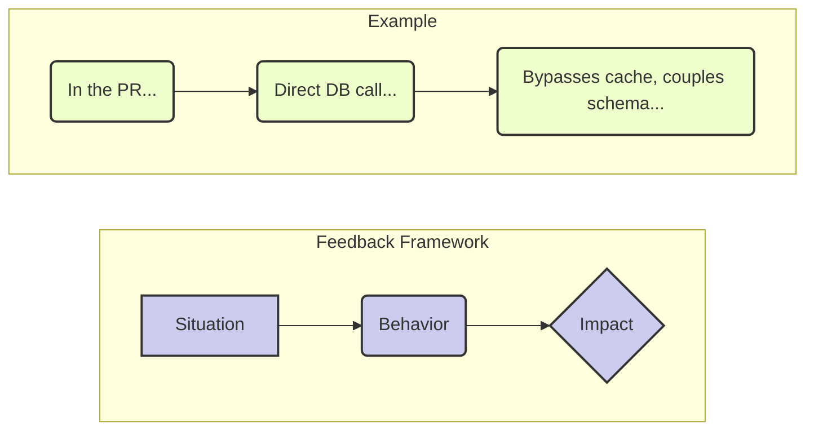

# Giving & Receiving Feedback: The Art of the Assist

## The Scenario

A junior engineer on a team you're mentoring, Alex, submits a pull request. The code works, but it takes a shortcut that violates a core architectural principle you've been trying to establish. It's a classic case of sacrificing long-term maintainability for short-term speed.

* **The Ineffective Response (The "Drive-By"):** Leaving a simple comment like, "This is wrong. Use the new pattern," and blocking the PR. This delivers the information but erodes trust, creates fear, and misses a crucial coaching opportunity. Alex learns *what* to do, but not *why*.  

* **The Effective Response (The Coach):** You treat feedback not as criticism, but as an *assist*—a pass that helps your teammate score. Your goal is to improve both the code and the engineer.

## A Framework for Giving Better Feedback: SBI (Situation-Behavior-Impact)

Separate the person from the problem by focusing on objective facts.

1. **Situation:** State the context. Be specific.  
   * "In the UserAuth pull request you submitted this morning..."  
2. **Behavior:** Describe the specific, observable action. Avoid judgment words like "lazy" or "sloppy."  
   * "...I noticed you connected directly to the primary database to fetch the user's profile."  
3. **Impact:** Explain the concrete effect of the behavior. This is the most critical step.  
   * "...When we do that, we bypass the caching layer, which means under high load, this could add significant latency and potentially bring down the service for everyone. It also couples the authentication service directly to the database schema, which will make our planned database upgrade much harder."

## Putting It Together

_"Hey Alex, I was looking at the UserAuth PR. I noticed you connected directly to the primary database to fetch the user's profile. I wanted to flag this because when we do that, we bypass the caching layer, which could cause significant latency under load. It also couples the service to the database schema, which will complicate our upcoming upgrade. Could we hop on a quick call to walk through how to use the new UserProfileService? It handles all that for you."_

## The Other Side of the Coin: Receiving Feedback

Your influence is directly proportional to how well you receive feedback. If you are defensive, people will simply stop giving it to you, and you will develop career-limiting blind spots.

* **The Scenario:** In a design review for your new project, a peer points out a flaw in your caching strategy. _"I think you have a race condition here that could lead to stale data."_

* **The Defensive Response:** "No, I thought of that. It's handled by the locking mechanism on line 427." (You immediately jump to defending your work, shutting down the conversation).  

* **The Growth Response:**  
  1. **Listen and Clarify:** "That's an interesting point. Can you walk me through the sequence of events you're envisioning?" (Show you're taking it seriously).  
  2. **Acknowledge and Appreciate:** "Ah, I see what you mean. That's a great catch. Thank you for pointing that out." (Validate their contribution, even if you don't agree yet).  
  3. **Engage with Curiosity:** "How would you suggest we mitigate that? I was concerned about the performance overhead of more aggressive locking." (Turn it into a collaborative problem-solving session).

By modeling this behavior, you make it safe for others to challenge your ideas. The ultimate goal of feedback isn't to be right; it's to get it right.

## The Foundation: Listening with Intention

### Beyond Hearing: The Art of Intentional Listening

Most technical discussions fail not because of bad ideas, but because of bad listening. We're so focused on formulating our response, defending our approach, or planning our next argument that we miss the actual content of what others are saying. Intentional listening transforms feedback from a debate into a learning opportunity.

**The Difference Between Reactive and Intentional Listening**

Reactive listening is what most of us do naturally. Someone starts explaining their concern about your architectural proposal, and immediately your mind starts generating counterarguments: "They don't understand the performance requirements." "They haven't considered the operational complexity." "Their suggestion won't scale." 

You're hearing the words, but you're not really listening to understand their perspective—you're listening to respond.

Intentional listening requires a fundamental shift: instead of listening to reply, you listen to understand. Instead of preparing your defense, you're genuinely curious about their viewpoint. Instead of assuming you know where they're going with their feedback, you let them explain their full thinking.

**The SOLER Technique for Technical Discussions**

This classic listening framework adapts well to technical conversations:

**S - Square your shoulders:** Face the person giving feedback physically and mentally. In video calls, this means looking at the camera, not at other screens or code. In code reviews, this means focusing entirely on their comments rather than mentally defending your approach.

**O - Open posture:** Both literal and figurative. Don't cross your arms, don't close your laptop, don't immediately jump to your IDE to show them why they're wrong. Create space for their feedback to be heard.

**L - Lean in:** Show engagement through your body language and your responses. "Tell me more about that concern." "Help me understand what you're seeing." "I want to make sure I'm following your reasoning."

**E - Eye contact:** In person, maintain appropriate eye contact. In video calls, look at the camera when responding. In written feedback, respond thoughtfully to their actual points rather than generic acknowledgments.

**R - Relax:** Receiving feedback about your technical work can trigger defensive responses. Notice when you feel yourself getting tense or preparing arguments, and consciously relax. Take a breath. Remember that feedback is information, not attack.

**Listening for the Three Layers**

Every piece of technical feedback operates on multiple levels simultaneously:

**The Surface Layer: What They're Saying**
This is the literal content: "This function is doing too much" or "I'm concerned about the database performance" or "The error handling seems incomplete."

**The Concern Layer: What They're Worried About**
This is the underlying issue driving their feedback: They're worried about maintainability, or they're concerned about system reliability under load, or they're anxious about debugging problems in production.

**The Values Layer: What They Care About**
This is the deeper principle: They value code clarity, or they prioritize system stability, or they believe strongly in defensive programming practices.

When you listen intentionally, you respond to all three layers: "I hear that you think this function is too complex [surface], and you're concerned it will be hard to maintain as requirements change [concern]. It sounds like you really value keeping functions focused and clear [values]. Let me walk through my thinking and see if we can find an approach that addresses your maintainability concerns while still handling all these edge cases."

**The Power of Reflective Listening in Technical Contexts**

Before responding to technical feedback, practice reflective listening: summarize what you heard to confirm your understanding. This simple practice prevents most feedback conflicts.

"Let me make sure I understand your concern. You're worried that the caching strategy I've designed could lead to data inconsistencies when multiple services are updating user preferences simultaneously, and you think this could create really confusing bugs that would be hard to track down. Is that right?"

This approach does several things: it shows you were actually listening, it gives them a chance to correct any misunderstandings, it often reveals additional context they hadn't shared yet, and it shifts the conversation from debate to collaborative problem-solving.

**Creating Space for Complete Thoughts**

Technical people often interrupt each other, especially when discussing complex topics. We hear the beginning of someone's concern and immediately want to address it. But premature responses often miss the full picture.

Practice the "three-breath rule": when someone finishes what seems like their feedback, count three breaths before responding. Often, they'll add crucial context: "And the other thing I'm worried about..." or "But what really concerns me is..." or "The bigger issue is..."

This patience often reveals that their real concern is different from their initial statement, saving both of you from solving the wrong problem.

## Common Pitfalls & How to Avoid Them

- **Being Vague**: Feedback like “Do better” lacks direction. 
  - **Solution**: Use the SBI (Situation-Behavior-Impact) model to be specific and actionable.

- **Neglecting Positive Feedback**: Focusing only on negatives discourages growth and damages morale.
  - **Solution**: Make a habit of recognizing achievements and positive contributions during team meetings or one-on-ones.

- **Ignoring Emotions**: Disregarding how feedback is received can lead to defensiveness.
  - **Solution**: Acknowledge the other person's feelings and show empathy. Say, “I understand this might be frustrating, but here’s why it matters.”

## A Practical Exercise: The Feedback Circle

This activity encourages team members to practice giving and receiving feedback in a low-pressure setting.

1. **Form Small Groups**: Gather 3-4 people.
2. **Rotate Roles**: Each person takes a turn as Giver, Receiver, and Observer.
3. **Give Feedback**: The Giver offers feedback to the Receiver using the SBI model.
4. **Observe and Debrief**: The Observer watches the interaction and provides feedback on the feedback itself.

This exercise helps build the muscle for effective feedback exchanges.

## Further Reading

- *Radical Candor* by Kim Scott
- *Thanks for the Feedback* by Douglas Stone and Sheila Heen
