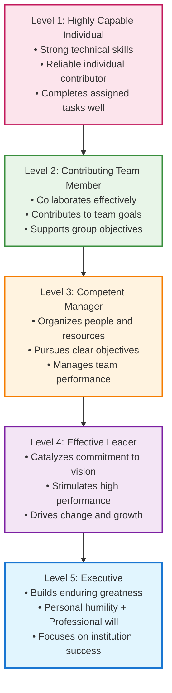

# Leadership, Influence & Communication

> *"Level 5 leaders channel their ego needs away from themselves and into the larger goal of building a great company. It's not that Level 5 leaders have no ego or self-interest. Indeed, they are incredibly ambitious—but their ambition is first and foremost for the institution, not themselves."* - Jim Collins

Staff engineers often find themselves at the crossroads of leadership and execution, where they must influence decisions, drive technical excellence, and align teams without having direct managerial authority. Leadership in this role is not about control—it's about credibility, trust, and impact. True technical leaders shape organizations by fostering collaboration, making sound decisions, and communicating effectively across various levels.

But what does exceptional leadership actually look like? Research by Jim Collins in "Good to Great" identified that the most effective leaders—Level 5 Leaders—combine personal humility with professional will. For staff engineers, this means balancing deep technical expertise with the humility to serve the larger mission of the organization.

## The Level 5 Leadership Hierarchy for Technical Leaders

Understanding where you are on the leadership hierarchy helps you identify your current capabilities and the areas for growth:

### Level 1: Highly Capable Individual (Senior Engineer Excellence)
**Characteristics:**
- Deep technical expertise in your domain
- Delivers high-quality code and solutions consistently
- Self-directed and requires minimal supervision
- Solves complex technical problems independently

**Staff Engineer Application:** This is your foundation. Without technical credibility, higher levels of leadership become impossible in technical organizations.

### Level 2: Contributing Team Member (Collaborative Excellence)
**Characteristics:**  
- Works effectively within team structures
- Contributes individual capabilities toward team objectives
- Supports colleagues and shares knowledge
- Participates constructively in team processes

**Staff Engineer Application:** You actively help your immediate team succeed through collaboration, knowledge sharing, and supporting team goals over individual recognition.

### Level 3: Competent Manager (Organizational Excellence)
**Characteristics:**
- Organizes people and resources toward clear objectives
- Makes tough decisions and manages performance
- Establishes processes and drives execution
- Takes responsibility for team outcomes

**Staff Engineer Application:** Even without formal management authority, you organize technical initiatives, coordinate across teams, and take ownership of complex technical programs.

### Level 4: Effective Leader (Inspirational Excellence)  
**Characteristics:**
- Articulates compelling vision and strategy
- Catalyzes commitment and enthusiasm in others
- Drives organizational change and innovation
- Builds followership through inspiration

**Staff Engineer Application:** You shape technical strategy, influence architectural decisions across the organization, and inspire other engineers to pursue technical excellence.

### Level 5: Executive (Institutional Excellence)
**Characteristics:**
- **Personal Humility:** Modest, self-effacing, understated
- **Professional Will:** Unwavering resolve to do what's best for the organization
- **Ambitious for the Institution:** Success measured by organizational outcomes
- **Builds Enduring Greatness:** Creates systems and culture that outlast individual tenure

**Staff Engineer Application:** You embody the rare combination of deep technical humility with unwavering commitment to organizational technical excellence. Your legacy is measured by the technical capabilities and culture you build, not individual achievements.

## The Paradox of Level 5 Leadership for Staff Engineers

Level 5 Leadership presents a unique paradox for technical professionals:

### Personal Humility in Technical Excellence
- **Credit Attribution:** You give credit to others for technical successes while taking responsibility for failures
- **Continuous Learning:** Despite deep expertise, you maintain beginner's mind and seek to learn from others
- **Service Orientation:** Your technical decisions prioritize organizational needs over personal technical preferences
- **Ego Management:** You suppress the ego-driven need to always be the smartest person in the room

### Professional Will in Technical Decisions
- **Unwavering Standards:** You refuse to compromise on technical excellence, even when it's difficult
- **Difficult Decisions:** You make hard technical choices (like deprecating beloved systems) for long-term organizational health
- **Institutional Focus:** You build technical systems and practices that strengthen the organization beyond your tenure
- **Resolve Under Pressure:** You maintain technical integrity even when facing business pressure or criticism

## Level 5 Leadership Behaviors for Staff Engineers

### The Window and Mirror Principle
**Success (Window):** Look out the window to attribute success to external factors
- "The team executed brilliantly"
- "We had the right technology choices"  
- "The business gave us clear requirements"
- "Other engineers contributed crucial insights"

**Failure (Mirror):** Look in the mirror to take responsibility for failures
- "I didn't communicate the technical risks clearly"
- "My architecture decisions created these problems"
- "I should have identified this issue earlier"
- "I failed to build consensus around the approach"

### Building Successors, Not Dependencies
**Level 5 Behavior:** Develop others to surpass your capabilities
- Mentor engineers to become better than you
- Document your expertise so others can build on it
- Create systems that reduce dependence on your individual knowledge
- Measure success by how well the organization functions without you

**Anti-Pattern:** Making yourself indispensable
- Hoarding technical knowledge
- Building systems only you understand
- Taking credit for team achievements
- Measuring success by how much others need you

### Institutional Ambition in Technical Strategy

**Level 5 Approach:**
- **Long-term Thinking:** Technical decisions prioritize 5-10 year organizational health over short-term convenience
- **System Building:** Create technical processes, standards, and culture that outlast individual tenure
- **Capability Development:** Invest in organizational technical capabilities, not just immediate solutions
- **Legacy Focus:** Ask "What technical foundation will serve this organization long after I'm gone?"

## Level 5 Leadership Applied to Staff Engineer Archetypes

### The Tech Lead (Level 5 Application)
- **Personal Humility:** Give team members credit for architectural insights and technical innovations
- **Professional Will:** Maintain unwavering commitment to technical excellence and team capability development
- **Institutional Focus:** Build team technical practices and knowledge that create lasting competitive advantage

### The Architect (Level 5 Application)
- **Personal Humility:** Acknowledge when your architectural decisions were wrong and learn publicly from mistakes
- **Professional Will:** Make difficult architectural decisions that serve long-term organizational health over short-term convenience
- **Institutional Focus:** Create architectural principles and decision-making processes that guide the organization beyond your involvement

### The Solver (Level 5 Application)  
- **Personal Humility:** Share problem-solving techniques and help others develop similar troubleshooting capabilities
- **Professional Will:** Take on the most difficult technical challenges regardless of personal recognition
- **Institutional Focus:** Build organizational problem-solving capacity and resilience through knowledge transfer

### The Right Hand (Level 5 Application)
- **Personal Humility:** Ensure leaders receive credit for successful technical initiatives while taking responsibility for execution failures
- **Professional Will:** Provide unwavering technical counsel even when it contradicts leadership preferences
- **Institutional Focus:** Build systems and relationships that strengthen organizational technical decision-making

This section explores tactical influence strategies engineers can use to drive outcomes, building on this foundation of Level 5 Leadership principles. You'll learn Chris Voss's Tactical Empathy techniques, Brené Brown's insights on vulnerability in leadership, and Patrick Lencioni's work on team dysfunctions—all approached through the lens of personal humility and professional will.

Additionally, staff engineers must master technical storytelling, using both written and spoken communication to align teams, convince stakeholders, and justify technical decisions. Whether pitching a proposal, resolving conflicts, or guiding a team through change, effective communication becomes a force multiplier when grounded in Level 5 Leadership principles.

## Discrete Topics Covered

* [Technical Vision & Purpose](technical-vision.md): Learn to create compelling technical vision using Simon Sinek's Golden Circle framework—starting with why, then how, then what.
* [Influencing without Authority](influencing-without-authority.md): Learn tactical empathy techniques to persuade and align teams, inspired by former FBI negotiator Chris Voss.
* [Vulnerability in Leadership](vulnerability-leadership.md): Explore how embracing vulnerability, as detailed in Brené Brown's *Dare to Lead*, can build trust and psychological safety.
* [Giving & Receiving Feedback](giving-receiving-feedback.md): Master the art of delivering and receiving constructive feedback using frameworks like Radical Candor and the SBI model.
* [Self-Awareness & Personality Types](self-awareness-personality-types.md): Understand how different personality models (like Myers-Briggs or DiSC) can improve communication and collaboration.
* [Technical Writing for Influence](technical-writing-for-influence.md): Write clear, persuasive technical documents that drive decisions and create alignment.
* [Presentation & Persuasion Skills](presentation-persuasion-skills.md): Develop the skills to present technical concepts effectively and persuade diverse audiences.
* [Working Across Boundaries](working-across-boundaries.md): Learn to manage stakeholders and collaborate effectively across different teams and departments.
* [Asynchronous Communication](async-communication.md): Master the best practices for clear and efficient communication in distributed and hybrid teams.
* [The Power of Influence in Organizations](power-influence-organizations.md): Understand the dynamics of organizational power and how to build influence ethically.
* [Navigating Tough Technical Discussions](navigating-tough-technical-discussions.md): Develop strategies for facilitating productive conversations around contentious technical topics.
* [Storytelling for Engineers](storytelling-for-engineers.md): Learn to use narrative and storytelling to make your technical ideas more compelling and memorable.
* [Psychological Safety & Trust](psychological-safety-trust.md): Discover how to cultivate an environment where team members feel safe to take risks, admit mistakes, and speak up.

## Further Reading

This chapter draws on insights from several key books on leadership, influence, and communication. For a deeper dive, consider exploring:

*   **Collins, Jim. *Good to Great: Why Some Companies Make the Leap... and Others Don't*.** (2001). The definitive research on Level 5 Leadership and the characteristics that separate great organizations from merely good ones. Essential reading for understanding leadership that builds enduring institutional excellence.
*   **Brown, Brené. *Dare to Lead: Brave Work. Tough Conversations. Whole Hearts.*** (2018). A foundational text on the power of vulnerability in leadership, perfectly complementing the personal humility aspect of Level 5 Leadership.
*   **Cialdini, Robert B. *Influence: The Psychology of Persuasion*.** (1984). A classic work on the principles of persuasion and how to apply them ethically.
*   **Reilly, Tanya. *The Staff Engineer's Path: A Guide for Individual Contributors*.** (2022). An essential guide covering many of the topics discussed, with a focus on the Staff Engineer role.
*   **Scott, Kim. *Radical Candor: Be a Kick-Ass Boss Without Losing Your Humanity*.** (2017). Provides a practical framework for giving and receiving effective feedback.
*   **Sinek, Simon. *Leaders Eat Last: Why Some Teams Pull Together and Others Don't*.** (2014). Explores the biology of trust and cooperation, providing the scientific foundation for Level 5 Leadership behaviors.
*   **Sinek, Simon. *Start with Why: How Great Leaders Inspire Everyone to Take Action*.** (2009). Establishes the Golden Circle framework for purpose-driven leadership, essential for institutional focus.
*   **Stone, Douglas, and Sheila Heen. *Thanks for the Feedback: The Science and Art of Receiving Feedback Well*.** (2014). An insightful guide on how to solicit and gracefully handle feedback.
*   **Voss, Chris. *Never Split the Difference: Negotiating As If Your Life Depended On It*.** (2016). The source of the Tactical Empathy techniques discussed for influencing without authority.
