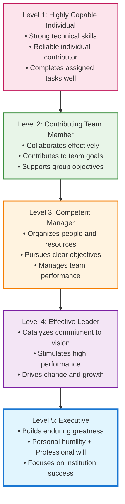
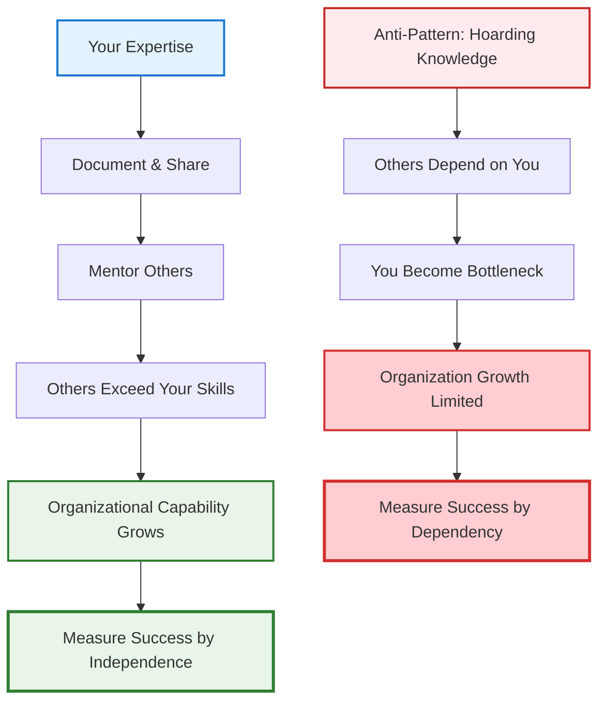

# Leadership, Influence & Communication: The Force Multiplier's Toolkit

!!! quote "Level 5 Leadership Principle"
    *"Level 5 leaders channel their ego needs away from themselves and into the larger goal of building a great company. It's not that Level 5 leaders have no ego or self-interest. Indeed, they are incredibly ambitious—but their ambition is first and foremost for the institution, not themselves."*
    
    **— Jim Collins, Good to Great**

!!! info "Navigation Approach"
    This toolkit contains 12 essential leadership techniques designed for technical influence without authority. Use the framework sections for systematic skill development, or jump to specific tools when facing immediate challenges.

## The Critical Leadership Moment

Picture this: You're in a planning meeting with 12 people from across engineering, product, and design. The conversation is going in circles about a critical architectural decision. Everyone has opinions, but no one has authority to make the final call. Deadlock.

Then someone speaks up—not the loudest person in the room, not the most senior by title, but someone whose technical insight carries weight. They frame the problem differently, acknowledge the valid concerns on all sides, and propose a path forward that gets everyone nodding. The decision gets made, the project moves forward, and people leave feeling heard and aligned.

**That's technical leadership in action.** And notice what it wasn't: it wasn't about having the right title, pulling rank, or being the smartest person in the room.

Staff engineers operate at this intersection of leadership and execution constantly. You must influence decisions, drive technical excellence, and align teams without having direct managerial authority. Your leadership isn't about control—it's about credibility, trust, and impact.

But what separates the truly exceptional technical leaders from everyone else? Research by Jim Collins in "Good to Great" provides a compelling answer: the most effective leaders combine **personal humility** with **professional will**. They're ambitious for their institution's success, not their personal glory. They build lasting capabilities, not just solve immediate problems.

**For staff engineers, this means balancing deep technical expertise with the humility to serve something larger than yourself.**

## The Level 5 Leadership Hierarchy for Technical Leaders

Understanding where you are on the leadership hierarchy helps you identify your current capabilities and the areas for growth:

### Level 1: Highly Capable Individual (Senior Engineer Excellence)
**Characteristics:**
- Deep technical expertise in your domain
- Delivers high-quality code and solutions consistently
- Self-directed and requires minimal supervision
- Solves complex technical problems independently

**Staff Engineer Application:** This is your foundation. Without technical credibility, higher levels of leadership become impossible in technical organizations.

### Level 2: Contributing Team Member (Collaborative Excellence)
**Characteristics:**  
- Works effectively within team structures
- Contributes individual capabilities toward team objectives
- Supports colleagues and shares knowledge
- Participates constructively in team processes

**Staff Engineer Application:** You actively help your immediate team succeed through collaboration, knowledge sharing, and supporting team goals over individual recognition.

### Level 3: Competent Manager (Organizational Excellence)
**Characteristics:**
- Organizes people and resources toward clear objectives
- Makes tough decisions and manages performance
- Establishes processes and drives execution
- Takes responsibility for team outcomes

**Staff Engineer Application:** Even without formal management authority, you organize technical initiatives, coordinate across teams, and take ownership of complex technical programs.

### Level 4: Effective Leader (Inspirational Excellence)  
**Characteristics:**
- Articulates compelling vision and strategy
- Catalyzes commitment and enthusiasm in others
- Drives organizational change and innovation
- Builds followership through inspiration

**Staff Engineer Application:** You shape technical strategy, influence architectural decisions across the organization, and inspire other engineers to pursue technical excellence.

### Level 5: Executive (Institutional Excellence)
**Characteristics:**
- **Personal Humility:** Modest, self-effacing, understated
- **Professional Will:** Unwavering resolve to do what's best for the organization
- **Ambitious for the Institution:** Success measured by organizational outcomes
- **Builds Enduring Greatness:** Creates systems and culture that outlast individual tenure

**Staff Engineer Application:** You embody the rare combination of deep technical humility with unwavering commitment to organizational technical excellence. Your legacy is measured by the technical capabilities and culture you build, not individual achievements.

## The Paradox of Level 5 Leadership for Staff Engineers

Level 5 Leadership presents a unique paradox for technical professionals:

### Personal Humility in Technical Excellence
- **Credit Attribution:** You give credit to others for technical successes while taking responsibility for failures
- **Continuous Learning:** Despite deep expertise, you maintain beginner's mind and seek to learn from others
- **Service Orientation:** Your technical decisions prioritize organizational needs over personal technical preferences
- **Ego Management:** You suppress the ego-driven need to always be the smartest person in the room

### Professional Will in Technical Decisions
- **Unwavering Standards:** You refuse to compromise on technical excellence, even when it's difficult
- **Difficult Decisions:** You make hard technical choices (like deprecating beloved systems) for long-term organizational health
- **Institutional Focus:** You build technical systems and practices that strengthen the organization beyond your tenure
- **Resolve Under Pressure:** You maintain technical integrity even when facing business pressure or criticism

## Level 5 Leadership Behaviors for Staff Engineers

### The Window and Mirror Principle
**Success (Window):** Look out the window to attribute success to external factors
- "The team executed brilliantly"
- "We had the right technology choices"  
- "The business gave us clear requirements"
- "Other engineers contributed crucial insights"

**Failure (Mirror):** Look in the mirror to take responsibility for failures
- "I didn't communicate the technical risks clearly"
- "My architecture decisions created these problems"
- "I should have identified this issue earlier"
- "I failed to build consensus around the approach"

### Level 5 Leadership Self-Assessment

Use this framework to evaluate your current leadership behaviors and identify development opportunities:

!!! question "Personal Humility Assessment"
    **Rate yourself on each behavior (1=Never, 5=Always):**
    
    === "Credit Attribution"
        - [ ] I actively give credit to team members for technical successes
        - [ ] I take responsibility for failures without blaming others
        - [ ] I highlight others' contributions in meetings and documents
        - [ ] I deflect praise and redirect it to the team
        
    === "Continuous Learning"
        - [ ] I admit when I don't know something technical
        - [ ] I ask questions even when it might reveal knowledge gaps
        - [ ] I seek input from junior engineers on their areas of expertise
        - [ ] I change my technical opinions when presented with better evidence

    === "Service Orientation"  
        - [ ] I prioritize organizational needs over my technical preferences
        - [ ] I work on important problems even if they're not interesting to me
        - [ ] I help others succeed even when it doesn't benefit me directly
        - [ ] I make technical decisions based on long-term organizational health

!!! question "Professional Will Assessment"
    **Rate yourself on each behavior (1=Never, 5=Always):**
    
    === "Unwavering Standards"
        - [ ] I refuse to compromise on critical technical quality issues
        - [ ] I speak up when I see concerning technical decisions
        - [ ] I maintain high standards even under business pressure
        - [ ] I advocate for technical investments that others avoid
        
    === "Institutional Focus"
        - [ ] I build systems and processes that outlast my involvement
        - [ ] I document my knowledge so others can build on it
        - [ ] I mentor others to exceed my capabilities
        - [ ] I measure success by organizational technical capability growth

### Building Successors, Not Dependencies

**Level 5 Behavior Pattern:**

**Development Actions:**
- **Knowledge Transfer:** Create documentation, workshops, and mentoring programs
- **Capability Building:** Invest time in developing others' technical skills
- **System Design:** Build processes that work without your direct involvement
- **Success Metrics:** Track how well teams function when you're not involved

### Institutional Ambition in Technical Strategy

**Level 5 Approach:**
- **Long-term Thinking:** Technical decisions prioritize 5-10 year organizational health over short-term convenience
- **System Building:** Create technical processes, standards, and culture that outlast individual tenure
- **Capability Development:** Invest in organizational technical capabilities, not just immediate solutions
- **Legacy Focus:** Ask "What technical foundation will serve this organization long after I'm gone?"

## Level 5 Leadership Applied to Staff Engineer Archetypes

### The Tech Lead (Level 5 Application)
- **Personal Humility:** Give team members credit for architectural insights and technical innovations
- **Professional Will:** Maintain unwavering commitment to technical excellence and team capability development
- **Institutional Focus:** Build team technical practices and knowledge that create lasting competitive advantage

### The Architect (Level 5 Application)
- **Personal Humility:** Acknowledge when your architectural decisions were wrong and learn publicly from mistakes
- **Professional Will:** Make difficult architectural decisions that serve long-term organizational health over short-term convenience
- **Institutional Focus:** Create architectural principles and decision-making processes that guide the organization beyond your involvement

### The Solver (Level 5 Application)  
- **Personal Humility:** Share problem-solving techniques and help others develop similar troubleshooting capabilities
- **Professional Will:** Take on the most difficult technical challenges regardless of personal recognition
- **Institutional Focus:** Build organizational problem-solving capacity and resilience through knowledge transfer

### The Right Hand (Level 5 Application)
- **Personal Humility:** Ensure leaders receive credit for successful technical initiatives while taking responsibility for execution failures
- **Professional Will:** Provide unwavering technical counsel even when it contradicts leadership preferences
- **Institutional Focus:** Build systems and relationships that strengthen organizational technical decision-making

## Implementing Level 5 Leadership: A Practical Workflow

Use this systematic approach to develop and apply Level 5 Leadership principles in your technical leadership role:

!!! success "6-Step Leadership Development Process"
    **Based on E2 Toolkit methodology - Follow these steps systematically:**

    === "Step 1: Assess Current State"
        **Define Your Leadership Challenge**
        
        - Identify a specific leadership situation you're facing
        - Complete the Level 5 Self-Assessment above
        - Determine your current level on the leadership hierarchy
        - Set specific behavioral development goals

    === "Step 2: Choose Your Focus Area"
        **Select Leadership Technique**
        
        - Review the Leadership Techniques & Tools grid below
        - Choose 1-2 techniques that address your specific challenge
        - Read the detailed implementation guide for each technique
        - Plan how you'll apply these in your current context

    === "Step 3: Practice Application"
        **Implement in Low-Risk Scenarios**
        
        - Start with smaller, less critical situations
        - Apply the specific techniques you've studied
        - Observe the results and reactions from others
        - Document what works and what needs adjustment

    === "Step 4: Gather Feedback"  
        **Evaluate Effectiveness**
        
        - Ask trusted colleagues for honest feedback
        - Measure outcomes against your original goals
        - Identify patterns in what's working vs. not working
        - Adjust your approach based on evidence

    === "Step 5: Scale Application"
        **Apply to Larger Challenges**
        
        - Use successful techniques in more significant situations
        - Combine multiple leadership techniques for complex challenges
        - Continue measuring and adjusting based on results
        - Build your personal leadership methodology

    === "Step 6: Build Others"
        **Develop Leadership in Others**
        
        - Share effective techniques with other technical leaders
        - Mentor others in applying these frameworks
        - Create systems and processes that scale your leadership impact
        - Measure success by organizational capability growth

**The rest of this section builds on this Level 5 Leadership foundation**, exploring practical techniques you can use to influence outcomes, drive alignment, and build lasting technical capabilities.

You'll discover how to create compelling technical vision using Simon Sinek's Golden Circle framework—starting with why your technical decisions matter before diving into how and what. You'll learn Chris Voss's tactical empathy techniques for influencing without authority, and Brené Brown's insights on how vulnerability can actually strengthen technical leadership.

We'll explore how to give feedback that drives improvement, navigate difficult technical discussions, and communicate across organizational boundaries. Throughout, the thread connecting everything is Level 5 Leadership: **using your technical expertise and influence to build something bigger than yourself.**

Whether you're pitching a technical proposal, resolving conflicts, or guiding a team through complex changes, these communication and influence skills become force multipliers when grounded in the humility and institutional focus of Level 5 Leadership.

## Leadership Techniques & Tools

### Core Communication Skills

-   :material-bullseye: **Technical Vision & Purpose**
    
    ---
    
    Create compelling technical vision using the Golden Circle framework
    
    [:octicons-arrow-right-24: Build Vision](technical-vision.md)

-   :material-account-voice: **Influencing without Authority**
    
    ---
    
    Tactical empathy techniques from FBI negotiation tactics
    
    [:octicons-arrow-right-24: Learn Influence](influencing-without-authority.md)

-   :material-heart-outline: **Vulnerability in Leadership**
    
    ---
    
    Build trust and psychological safety through authentic leadership
    
    [:octicons-arrow-right-24: Develop Trust](vulnerability-leadership.md)

-   :material-comment-processing: **Giving & Receiving Feedback**
    
    ---
    
    Master Radical Candor and SBI feedback frameworks
    
    [:octicons-arrow-right-24: Master Feedback](giving-receiving-feedback.md)

### Self-Awareness & Communication

-   :material-mirror: **Self-Awareness & Personality Types**
    
    ---
    
    Leverage personality models for better collaboration
    
    [:octicons-arrow-right-24: Build Awareness](self-awareness-personality-types.md)

-   :material-file-document-edit: **Technical Writing for Influence**
    
    ---
    
    Write persuasive documents that drive technical decisions
    
    [:octicons-arrow-right-24: Write Better](technical-writing-for-influence.md)

-   :material-presentation: **Presentation & Persuasion Skills**
    
    ---
    
    Present technical concepts to diverse audiences effectively
    
    [:octicons-arrow-right-24: Present Better](presentation-persuasion-skills.md)

-   :material-book-open-page-variant: **Storytelling for Engineers**
    
    ---
    
    Use narrative to make technical ideas compelling and memorable
    
    [:octicons-arrow-right-24: Tell Stories](storytelling-for-engineers.md)

### Advanced Communication & Influence

-   :material-network: **Working Across Boundaries**
    
    ---
    
    Collaborate effectively across teams and departments
    
    [:octicons-arrow-right-24: Cross Boundaries](working-across-boundaries.md)

-   :material-forum: **Asynchronous Communication**
    
    ---
    
    Master distributed team communication best practices
    
    [:octicons-arrow-right-24: Communicate Async](async-communication.md)

-   :material-trending-up: **Power & Influence in Organizations**
    
    ---
    
    Understand organizational dynamics and build ethical influence
    
    [:octicons-arrow-right-24: Build Influence](power-influence-organizations.md)

-   :material-account-group: **Navigating Tough Technical Discussions**
    
    ---
    
    Facilitate productive conversations on contentious topics
    
    [:octicons-arrow-right-24: Navigate Conflict](navigating-tough-technical-discussions.md)

### Team Environment & Culture

-   :material-shield-check: **Psychological Safety & Trust**
    
    ---
    
    Cultivate environments for risk-taking and open communication
    
    [:octicons-arrow-right-24: Build Safety](psychological-safety-trust.md)

## Cross-Reference Navigation

**Essential Prerequisites:** Understanding these concepts deepens your leadership effectiveness:

- **[Staff Engineer Archetypes](../../intro/index.md)** - Understand how Level 5 Leadership applies to your specific role: Tech Lead, Architect, Solver, or Right Hand
- **[Mental Models for Engineers](../../thinking/mental-models.md)** - System 1/System 2 thinking improves leadership decision-making under pressure
- **[Cognitive Biases](../../thinking/cognitive-biases.md)** - Awareness of biases is crucial for Level 5 Leadership's personal humility requirement

**Immediate Applications:** Apply leadership concepts through these related practices:

- **[Advanced Conflict Resolution](advanced-conflict-resolution.md)** - Level 5 Leadership principles applied to difficult technical disagreements
- **[Team Formation](../../teamwork/team-formation.md)** - Building high-performing teams using Team Topologies and psychological safety principles
- **[Organizational Design](../../teamwork/organizational-design.md)** - Aligning team structures with communication patterns for maximum effectiveness
- **[Strategic Thinking](../../execution/strategic-thinking.md)** - Channel Level 5 institutional focus into long-term organizational strategy

**Business Integration:** Connect technical leadership to organizational outcomes:

- **[Product-Engineering Collaboration](../../business/product-engineering-collaboration.md)** - Use influence skills to align technical and product strategy
- **[Engineering Metrics & Business Alignment](../../business/engineering-metrics-business-alignment.md)** - Apply institutional focus to measurement systems that matter
- **[Pitching to Executives](../../business/pitching-to-executives.md)** - Technical storytelling techniques for leadership communication

**Advanced Development:** Scale your leadership impact across the organization:

- **[Cultural Transformation & Psychological Safety](../../teamwork/cultural-transformation-psychological-safety.md)** - Lead organizational change through Level 5 principles
- **[Advanced Mentorship & Career Development](advanced-mentorship-career-development.md)** - Building others as the ultimate Level 5 Leadership expression
- **[Change Management for Technical Transformations](../../execution/change-management-technical-transformations.md)** - Systematic approach to leading technical and cultural change

!!! tip "Learning Path Recommendations"
    **For New Staff Engineers:** Start with [Staff Engineer Archetypes](../../intro/index.md) → [Mental Models](../../thinking/mental-models.md) → This Chapter → [Team Formation](../../teamwork/team-formation.md)
    
    **For Experienced Technical Leaders:** Focus on [Advanced Conflict Resolution](advanced-conflict-resolution.md) → [Cultural Transformation](../../teamwork/cultural-transformation-psychological-safety.md) → [Change Management](../../execution/change-management-technical-transformations.md)
    
    **For Business Integration:** Combine with [Strategic Thinking](../../execution/strategic-thinking.md) → [Product Collaboration](../../business/product-engineering-collaboration.md) → [Executive Communication](../../business/pitching-to-executives.md)

## Further Reading

This chapter draws on insights from several key books on leadership, influence, and communication. For a deeper dive, consider exploring:

*   **Collins, Jim. *Good to Great: Why Some Companies Make the Leap... and Others Don't*.** (2001). The definitive research on Level 5 Leadership and the characteristics that separate great organizations from merely good ones. Essential reading for understanding leadership that builds enduring institutional excellence.
*   **Brown, Brené. *Dare to Lead: Brave Work. Tough Conversations. Whole Hearts.*** (2018). A foundational text on the power of vulnerability in leadership, perfectly complementing the personal humility aspect of Level 5 Leadership.
*   **Cialdini, Robert B. *Influence: The Psychology of Persuasion*.** (1984). A classic work on the principles of persuasion and how to apply them ethically.
*   **Reilly, Tanya. *The Staff Engineer's Path: A Guide for Individual Contributors*.** (2022). An essential guide covering many of the topics discussed, with a focus on the Staff Engineer role.
*   **Scott, Kim. *Radical Candor: Be a Kick-Ass Boss Without Losing Your Humanity*.** (2017). Provides a practical framework for giving and receiving effective feedback.
*   **Sinek, Simon. *Leaders Eat Last: Why Some Teams Pull Together and Others Don't*.** (2014). Explores the biology of trust and cooperation, providing the scientific foundation for Level 5 Leadership behaviors.
*   **Sinek, Simon. *Start with Why: How Great Leaders Inspire Everyone to Take Action*.** (2009). Establishes the Golden Circle framework for purpose-driven leadership, essential for institutional focus.
*   **Stone, Douglas, and Sheila Heen. *Thanks for the Feedback: The Science and Art of Receiving Feedback Well*.** (2014). An insightful guide on how to solicit and gracefully handle feedback.
*   **Voss, Chris. *Never Split the Difference: Negotiating As If Your Life Depended On It*.** (2016). The source of the Tactical Empathy techniques discussed for influencing without authority.
