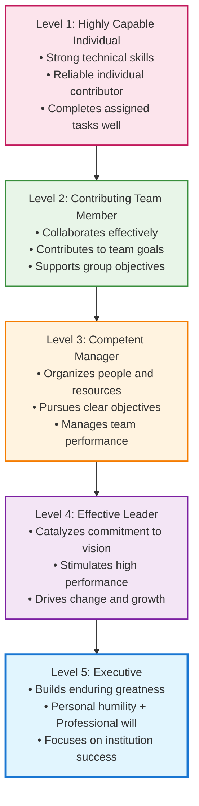
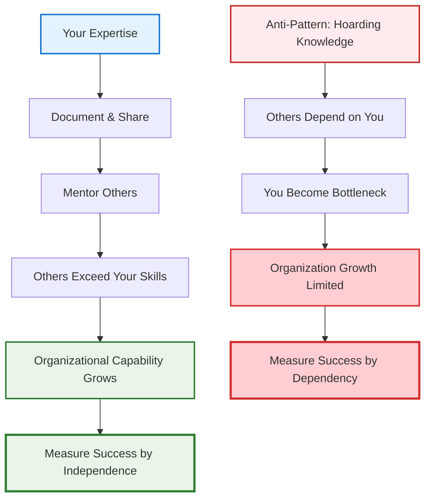

# Leadership, Influence & Communication: The Force Multiplier's Toolkit

!!! quote "Level 5 Leadership Principle"
    *"Level 5 leaders channel their ego needs away from themselves and into the larger goal of building a great company. It's not that Level 5 leaders have no ego or self-interest. Indeed, they are incredibly ambitious—but their ambition is first and foremost for the institution, not themselves."*
    
    **— Jim Collins, Good to Great**

!!! info "Navigation Approach"
    This toolkit contains 12 essential leadership techniques designed for technical influence without authority. Use the framework sections for systematic skill development, or jump to specific tools when facing immediate challenges.

## The Critical Leadership Moment

Picture this: You're in a planning meeting with 12 people from across engineering, product, and design. The conversation is going in circles about a critical architectural decision. Everyone has opinions, but no one has authority to make the final call. Deadlock.

Then someone speaks up—not the loudest person in the room, not the most senior by title, but someone whose technical insight carries weight. They frame the problem differently, acknowledge the valid concerns on all sides, and propose a path forward that gets everyone nodding. The decision gets made, the project moves forward, and people leave feeling heard and aligned.

**That's technical leadership in action.** And notice what it wasn't: it wasn't about having the right title, pulling rank, or being the smartest person in the room.

Staff engineers operate at this intersection of leadership and execution constantly. You must influence decisions, drive technical excellence, and align teams without having direct managerial authority. Your leadership isn't about control—it's about credibility, trust, and impact.

But what separates the truly exceptional technical leaders from everyone else? Research by Jim Collins in "Good to Great" provides a compelling answer: the most effective leaders combine **personal humility** with **professional will**. They're ambitious for their institution's success, not their personal glory. They build lasting capabilities, not just solve immediate problems.

**For staff engineers, this means balancing deep technical expertise with the humility to serve something larger than yourself.**

## The Level 5 Leadership Hierarchy for Technical Leaders

Understanding where you are on the leadership hierarchy helps you identify your current capabilities and the areas for growth:

### Level 1: Highly Capable Individual (Senior Engineer Excellence)
**Characteristics:**
- Deep technical expertise in your domain
- Delivers high-quality code and solutions consistently
- Self-directed and requires minimal supervision
- Solves complex technical problems independently

**Staff Engineer Application:** This is your foundation. Without technical credibility, higher levels of leadership become impossible in technical organizations.

### Level 2: Contributing Team Member (Collaborative Excellence)
**Characteristics:**  
- Works effectively within team structures
- Contributes individual capabilities toward team objectives
- Supports colleagues and shares knowledge
- Participates constructively in team processes

**Staff Engineer Application:** You actively help your immediate team succeed through collaboration, knowledge sharing, and supporting team goals over individual recognition.

### Level 3: Competent Manager (Organizational Excellence)
**Characteristics:**
- Organizes people and resources toward clear objectives
- Makes tough decisions and manages performance
- Establishes processes and drives execution
- Takes responsibility for team outcomes

**Staff Engineer Application:** Even without formal management authority, you organize technical initiatives, coordinate across teams, and take ownership of complex technical programs.

### Level 4: Effective Leader (Inspirational Excellence)  
**Characteristics:**
- Articulates compelling vision and strategy
- Catalyzes commitment and enthusiasm in others
- Drives organizational change and innovation
- Builds followership through inspiration

**Staff Engineer Application:** You shape technical strategy, influence architectural decisions across the organization, and inspire other engineers to pursue technical excellence.

### Level 5: Executive (Institutional Excellence)
**Characteristics:**
- **Personal Humility:** Modest, self-effacing, understated
- **Professional Will:** Unwavering resolve to do what's best for the organization
- **Ambitious for the Institution:** Success measured by organizational outcomes
- **Builds Enduring Greatness:** Creates systems and culture that outlast individual tenure

**Staff Engineer Application:** You embody the rare combination of deep technical humility with unwavering commitment to organizational technical excellence. Your legacy is measured by the technical capabilities and culture you build, not individual achievements.

## The Paradox of Level 5 Leadership for Staff Engineers

Level 5 Leadership presents a unique paradox for technical professionals:

### Personal Humility in Technical Excellence

Level 5 technical leaders embody personal humility through four core behaviors that distinguish them from traditional technical experts. They consistently give credit to others for technical successes while taking full responsibility for failures, demonstrating the "window and mirror" principle in action. Despite possessing deep expertise, they maintain a beginner's mind and actively seek to learn from others, recognizing that wisdom can come from unexpected sources.

Their service orientation becomes evident in how they make technical decisions—consistently prioritizing organizational needs over personal technical preferences, even when it means choosing less interesting technologies or approaches. Perhaps most challenging for highly skilled technical professionals, they deliberately suppress the ego-driven need to always be the smartest person in the room, instead creating space for others to contribute and shine.

### Professional Will in Technical Decisions

While demonstrating personal humility, Level 5 technical leaders simultaneously exhibit unwavering professional will in their commitment to technical excellence and organizational success. They refuse to compromise on critical technical quality issues, even when facing significant pressure or resistance. This manifests in their willingness to make difficult technical decisions—such as deprecating beloved but obsolete systems—when these choices serve the organization's long-term health.

Their institutional focus drives them to build technical systems and practices that will strengthen the organization far beyond their own tenure, viewing their role as custodians of technical capability rather than individual contributors. Under pressure, they maintain technical integrity even when facing business criticism, understanding that short-term appeasement often creates long-term organizational debt that undermines the very success they're trying to achieve.

## Level 5 Leadership Behaviors for Staff Engineers

### The Window and Mirror Principle

Level 5 leaders demonstrate profound humility in how they process both success and failure, using what Jim Collins calls the "Window and Mirror" principle to model accountability and shared ownership.

**Success (Window):** When projects succeed, Level 5 leaders look out the window to attribute success to external factors, acknowledging that "the team executed brilliantly" while recognizing that "we had the right technology choices" and "the business gave us clear requirements." They consistently highlight how "other engineers contributed crucial insights," ensuring that recognition flows to the people who made the outcomes possible rather than claiming credit for themselves.

**Failure (Mirror):** When problems arise, Level 5 leaders look in the mirror to take responsibility, honestly acknowledging that "I didn't communicate the technical risks clearly" or "my architecture decisions created these problems." They demonstrate authentic accountability by reflecting that "I should have identified this issue earlier" and "I failed to build consensus around the approach," using failure as an opportunity to model learning and personal responsibility rather than deflecting blame onto circumstances or team members.

### Level 5 Leadership Assessment Framework

Evaluate your current leadership capabilities across three essential domains, with each area building upon Level 5 Leadership principles of personal humility and professional will. This comprehensive framework helps you identify strengths, development opportunities, and create targeted growth plans for your technical leadership journey.

!!! question "Leadership Assessment by Domain"
    **Rate yourself on each capability (1=Never, 2=Rarely, 3=Sometimes, 4=Often, 5=Always)**

    === "Technical Leadership"
        # :material-cog-outline: Technical Leadership Excellence

        Master the intersection of deep technical expertise with architectural vision and system thinking that enables organizational technical capability.

        ## Architecture & Technical Vision

        **Technical Credibility** forms the foundation of your leadership influence. Strong technical leaders demonstrate mastery through consistent delivery of high-quality solutions while maintaining the humility to acknowledge when they encounter unfamiliar territory. This credibility enables you to guide architectural decisions with confidence while remaining open to alternative approaches when evidence supports them.

        **System Thinking** separates good engineers from great technical leaders. You must see beyond individual components to understand emergent behaviors, interdependencies, and cascading effects of technical decisions. This capability enables you to design solutions that optimize for the whole system rather than local optimizations that create global problems.

        **Architecture Decision-Making** requires balancing multiple competing concerns—performance, maintainability, scalability, team capabilities, and business constraints. Effective technical leaders use structured decision-making frameworks that make their reasoning transparent and enable others to learn from their thought process.

        ### Self-Assessment: Technical Leadership
        - [ ] I consistently deliver high-quality technical solutions that solve real business problems
        - [ ] I can articulate the technical tradeoffs in architectural decisions clearly to both engineers and stakeholders
        - [ ] I design systems that account for interdependencies and avoid creating bottlenecks in other areas
        - [ ] I admit when I encounter unfamiliar technical territory and actively learn from others
        - [ ] I make architectural decisions that balance immediate needs with long-term organizational capability
        - [ ] I can translate complex technical concepts into clear explanations for non-technical audiences
        - [ ] I use structured frameworks for technical decision-making rather than relying solely on intuition
        - [ ] I document my technical reasoning so others can understand and build upon my decisions

        ## Quality Standards & Technical Integrity

        **Professional Will in Technical Standards** means maintaining unwavering commitment to technical excellence even under pressure. This requires courage to speak up about technical debt, advocate for necessary refactoring, and resist quick fixes that create long-term problems. Your professional will demonstrates itself through consistent technical integrity regardless of external pressure.

        **Risk Assessment & Communication** enables you to identify potential technical risks before they become problems and communicate these risks effectively to stakeholders. This involves both technical analysis skills and the communication ability to help others understand the implications of technical decisions without creating unnecessary alarm.

        ### Self-Assessment: Quality Standards
        - [ ] I refuse to compromise on critical technical quality issues even under business pressure
        - [ ] I speak up when I see technical decisions that will create future problems
        - [ ] I advocate for technical investments in maintainability and reliability
        - [ ] I can identify and articulate technical risks before they impact project delivery
        - [ ] I maintain high coding standards and help others understand why these standards matter
        - [ ] I balance business urgency with technical integrity in decision-making
        - [ ] I build technical processes that prevent quality problems rather than just detecting them
        - [ ] I help teams understand the business impact of technical decisions

    === "People Leadership"
        # :material-account-group-outline: People Leadership Excellence

        Develop others through mentorship, create psychological safety for innovation and learning, and build collaborative relationships that enable team excellence.

        ## Team Development & Mentorship

        **Building Others** represents the ultimate expression of Level 5 Leadership—channeling your expertise toward developing capabilities in others rather than simply solving problems yourself. This requires shifting from being the hero who saves the day to being the coach who enables others to become heroes. Effective people leadership means measuring success by the growth and achievements of those around you.

        **Mentorship Excellence** goes beyond occasional advice-giving to systematic capability development in others. This involves understanding individual learning styles, providing appropriate challenges that stretch without overwhelming, and creating structured opportunities for skill development. The best technical mentors help others exceed their own capabilities by providing frameworks for thinking rather than just solutions to specific problems.

        **Creating Psychological Safety** enables teams to take appropriate risks, admit mistakes, and learn from failures without fear of blame or punishment. This foundation is essential for technical innovation and quality improvement, as teams need to feel safe acknowledging when they don't understand something or when they've made mistakes.

        ### Self-Assessment: Team Development
        - [ ] I actively invest time in developing others' technical capabilities
        - [ ] I provide challenges that help team members grow beyond their comfort zones
        - [ ] I create learning opportunities through project assignments and stretch goals
        - [ ] I help others learn problem-solving frameworks rather than just providing solutions
        - [ ] I celebrate team members' achievements and give them credit for technical successes
        - [ ] I adapt my mentoring approach to individual learning styles and needs
        - [ ] I measure my success by the technical growth I enable in others
        - [ ] I build documentation and processes that enable knowledge transfer

        ## Psychological Safety & Collaboration

        **Fostering Open Communication** requires creating environments where team members feel safe expressing technical concerns, proposing alternative approaches, and admitting when they need help. This involves modeling vulnerability by acknowledging your own knowledge gaps and mistakes, which gives others permission to do the same.

        **Conflict Resolution Skills** become essential as you work with diverse teams facing complex technical challenges. The best technical leaders can navigate disagreements about architectural approaches, technology choices, and implementation strategies while maintaining team cohesion and focusing on technical merit rather than personal preferences.

        ### Self-Assessment: Psychological Safety
        - [ ] I create environments where team members feel safe admitting mistakes or knowledge gaps
        - [ ] I model vulnerability by acknowledging when I don't know something or have made errors
        - [ ] I facilitate productive technical discussions even when people disagree strongly
        - [ ] I help teams separate technical decisions from personal preferences or ego
        - [ ] I ensure all team members have opportunities to contribute ideas and influence decisions
        - [ ] I address team conflicts directly while maintaining respect for all parties involved
        - [ ] I encourage appropriate risk-taking and learning from failures
        - [ ] I build team processes that support collaboration rather than individual heroics

    === "Strategic Leadership"
        # :material-chart-line-outline: Strategic Leadership Excellence

        Connect technical decisions to business strategy, influence across organizational boundaries, and create technical vision that enables long-term organizational success.

        ## Organizational Influence & Vision

        **Institutional Focus** means making technical decisions based on what serves the organization's long-term success rather than what's most interesting or beneficial to you personally. This requires understanding business context, stakeholder needs, and organizational constraints while maintaining technical integrity. Strategic leaders build technical capabilities that outlast their individual involvement.

        **Cross-Boundary Collaboration** becomes critical as technical decisions increasingly require coordination across teams, departments, and even external organizations. This involves understanding different stakeholder perspectives, translating between technical and business contexts, and building alignment around shared objectives despite different priorities and constraints.

        **Technical Vision Development** requires synthesis of technical trends, business strategy, and organizational capabilities to create compelling pictures of future technical possibilities. Effective strategic leaders can articulate not just what technical solutions are possible, but why particular approaches serve organizational objectives and how teams can work toward these goals systematically.

        ### Self-Assessment: Organizational Influence
        - [ ] I make technical decisions based on long-term organizational health rather than short-term convenience
        - [ ] I can influence technical decisions across teams and departments without formal authority
        - [ ] I build relationships with stakeholders outside of engineering to understand their technical needs
        - [ ] I translate between technical and business contexts effectively in communications and decisions
        - [ ] I create technical vision that aligns with business strategy and organizational capabilities
        - [ ] I help others understand how their technical work connects to larger organizational objectives
        - [ ] I build systems and processes that serve the organization beyond my direct involvement
        - [ ] I measure success by organizational technical capability growth rather than individual achievements

        ## Business Integration & Strategic Thinking

        **Business Context Awareness** enables you to make technical decisions that support business objectives while maintaining technical integrity. This involves understanding customer needs, market dynamics, competitive landscape, and financial constraints that shape what technical solutions are viable and valuable.

        **Long-term Strategic Planning** requires thinking beyond immediate technical problems to understand how current decisions create or constrain future possibilities. Strategic technical leaders can balance short-term delivery pressure with investments in technical capabilities that will enable future success.

        ### Self-Assessment: Strategic Thinking
        - [ ] I understand how technical decisions impact business outcomes and customer experience
        - [ ] I can evaluate technical investments based on business value and strategic alignment
        - [ ] I balance short-term delivery needs with long-term technical capability development
        - [ ] I stay informed about industry trends and their potential impact on our technical strategy
        - [ ] I can articulate the business case for technical investments and architectural decisions
        - [ ] I help technical teams understand market context and customer needs that influence their work
        - [ ] I participate effectively in strategic planning and technical roadmap development
        - [ ] I build technical strategies that adapt to changing business requirements and market conditions

### Leadership Development Action Plans

Use your assessment results to create targeted development plans. Focus on 1-2 areas where improvement would have the most significant impact on your effectiveness as a technical leader.

!!! success "Development Planning by Leadership Domain"
    **Choose development actions based on your assessment scores and current challenges**

    === "Technical Leadership Development"
        # :material-trending-up: Growing Technical Leadership Impact

        ## For Lower Assessment Scores (1-2)

        **Build Technical Credibility Foundation**

        Start with systematic skill building in your core technical domain while establishing patterns for continuous learning. Focus on delivering high-quality solutions consistently while documenting your technical reasoning to demonstrate thoughtful decision-making. Join technical communities, contribute to open source projects, and seek feedback from senior engineers to accelerate your technical growth.

        **Recommended Actions:**
        - Complete comprehensive technical training in your primary domain
        - Practice explaining complex technical concepts to non-technical stakeholders
        - Document technical decisions using structured frameworks like ADRs (Architecture Decision Records)
        - Seek mentoring from senior technical leaders in your organization

        ## For Moderate Assessment Scores (3-4)

        **Expand Systems Thinking and Architecture Skills**

        Build your ability to see beyond individual components to understand emergent behaviors and system-wide optimization opportunities. Practice architectural decision-making using structured frameworks while learning to balance competing concerns effectively. Develop skills in technical risk assessment and learn to communicate technical tradeoffs clearly to stakeholders.

        **Recommended Actions:**
        - Study system design patterns and architectural principles systematically
        - Lead technical design reviews and practice articulating tradeoffs
        - Take on cross-team technical projects that require coordination and architecture alignment
        - Develop technical roadmaps that balance short-term needs with long-term capabilities

        ## For Higher Assessment Scores (4-5)

        **Become a Technical Force Multiplier**

        Focus on scaling your technical impact through others by building organizational technical capabilities and standards. Create technical vision and strategy that guides teams toward coherent architectural direction while developing other technical leaders through mentoring and knowledge sharing.

        **Recommended Actions:**
        - Establish technical standards and practices that improve organizational capability
        - Mentor multiple technical leaders and measure success by their growth
        - Create technical strategy that aligns with business objectives and market trends
        - Build technical communities of practice within your organization

    === "People Leadership Development"
        # :material-account-heart-outline: Growing People Leadership Impact

        ## For Lower Assessment Scores (1-2)

        **Build Foundation of Trust and Safety**

        Start by developing basic interpersonal skills and learning to create psychological safety in small team settings. Focus on active listening, empathy, and clear communication while practicing vulnerability by admitting when you don't know something or have made mistakes. Build your understanding of individual motivation and learning styles.

        **Recommended Actions:**
        - Practice active listening techniques in team meetings and one-on-one conversations
        - Learn to give constructive feedback using structured frameworks like SBI (Situation-Behavior-Impact)
        - Study team dynamics and psychological safety research (Amy Edmondson's work)
        - Start mentoring one junior engineer to develop your teaching and development skills

        ## For Moderate Assessment Scores (3-4)

        **Develop Advanced Mentorship and Team Building**

        Expand your capability to develop others systematically while learning to facilitate difficult conversations and resolve conflicts constructively. Build skills in team formation, culture development, and creating environments that enable both individual growth and team performance.

        **Recommended Actions:**
        - Develop formal mentorship programs or participate in existing ones
        - Learn conflict resolution techniques and practice facilitating difficult technical discussions
        - Study team formation models (like Tuckman's stages) and apply them to team development
        - Take on leadership roles in cross-functional projects to build collaboration skills

        ## For Higher Assessment Scores (4-5)

        **Scale People Leadership Across Organization**

        Focus on developing leadership capabilities in others while building organizational culture that supports innovation, learning, and psychological safety. Create systems and processes that enable sustainable team performance and develop next-generation technical leaders.

        **Recommended Actions:**
        - Design and lead leadership development programs for technical staff
        - Champion cultural transformation initiatives that improve organizational effectiveness
        - Establish mentoring networks and communities of practice
        - Build succession planning processes that ensure leadership continuity

    === "Strategic Leadership Development"
        # :material-lighthouse-outline: Growing Strategic Leadership Impact

        ## For Lower Assessment Scores (1-2)

        **Build Business Context Understanding**

        Develop basic business acumen and learn to understand how technical decisions impact business outcomes. Focus on building relationships outside of engineering to understand stakeholder needs and constraints while learning to translate between technical and business contexts.

        **Recommended Actions:**
        - Study your organization's business model, market position, and competitive landscape
        - Build relationships with product management, sales, and other non-engineering stakeholders
        - Practice explaining technical concepts and decisions in business terms
        - Participate in business planning meetings to understand strategic context

        ## For Moderate Assessment Scores (3-4)

        **Develop Technical Strategy and Vision**

        Learn to create technical strategy that aligns with business objectives while building influence across organizational boundaries. Develop skills in technical roadmapping, technology evaluation, and long-term capability planning.

        **Recommended Actions:**
        - Lead technical strategy development for your domain or organization
        - Study industry trends and their potential impact on your technical approach
        - Practice technical communication and influence with senior stakeholders
        - Participate in technical due diligence and technology investment decisions

        ## For Higher Assessment Scores (4-5)

        **Drive Organizational Technical Excellence**

        Shape organizational technical direction through vision, strategy, and culture development. Build institutional capabilities that enable sustained technical excellence and competitive advantage.

        **Recommended Actions:**
        - Create organizational technical vision and strategy that guides multiple teams
        - Establish technical governance and standards that scale across the organization
        - Build partnerships with other organizations and contribute to industry technical direction
        - Develop technical leaders who can execute strategy independently

### Building Successors, Not Dependencies

**Level 5 Behavior Pattern:**

**Development Actions:**
- **Knowledge Transfer:** Create documentation, workshops, and mentoring programs
- **Capability Building:** Invest time in developing others' technical skills
- **System Design:** Build processes that work without your direct involvement
- **Success Metrics:** Track how well teams function when you're not involved

### Institutional Ambition in Technical Strategy

**Level 5 Approach:**
- **Long-term Thinking:** Technical decisions prioritize 5-10 year organizational health over short-term convenience
- **System Building:** Create technical processes, standards, and culture that outlast individual tenure
- **Capability Development:** Invest in organizational technical capabilities, not just immediate solutions
- **Legacy Focus:** Ask "What technical foundation will serve this organization long after I'm gone?"

## Level 5 Leadership Applied to Staff Engineer Archetypes

### The Tech Lead (Level 5 Application)
- **Personal Humility:** Give team members credit for architectural insights and technical innovations
- **Professional Will:** Maintain unwavering commitment to technical excellence and team capability development
- **Institutional Focus:** Build team technical practices and knowledge that create lasting competitive advantage

### The Architect (Level 5 Application)
- **Personal Humility:** Acknowledge when your architectural decisions were wrong and learn publicly from mistakes
- **Professional Will:** Make difficult architectural decisions that serve long-term organizational health over short-term convenience
- **Institutional Focus:** Create architectural principles and decision-making processes that guide the organization beyond your involvement

### The Solver (Level 5 Application)  
- **Personal Humility:** Share problem-solving techniques and help others develop similar troubleshooting capabilities
- **Professional Will:** Take on the most difficult technical challenges regardless of personal recognition
- **Institutional Focus:** Build organizational problem-solving capacity and resilience through knowledge transfer

### The Right Hand (Level 5 Application)
- **Personal Humility:** Ensure leaders receive credit for successful technical initiatives while taking responsibility for execution failures
- **Professional Will:** Provide unwavering technical counsel even when it contradicts leadership preferences
- **Institutional Focus:** Build systems and relationships that strengthen organizational technical decision-making

## Implementing Level 5 Leadership: A Practical Workflow

Use this systematic approach to develop and apply Level 5 Leadership principles in your technical leadership role:

!!! success "6-Step Leadership Development Process"
    **Based on E2 Toolkit methodology - Follow these steps systematically:**

    === "Step 1: Assess Current State"
        **Define Your Leadership Challenge**
        
        - Identify a specific leadership situation you're facing
        - Complete the Level 5 Self-Assessment above
        - Determine your current level on the leadership hierarchy
        - Set specific behavioral development goals

    === "Step 2: Choose Your Focus Area"
        **Select Leadership Technique**
        
        - Review the Leadership Techniques & Tools grid below
        - Choose 1-2 techniques that address your specific challenge
        - Read the detailed implementation guide for each technique
        - Plan how you'll apply these in your current context

    === "Step 3: Practice Application"
        **Implement in Low-Risk Scenarios**
        
        - Start with smaller, less critical situations
        - Apply the specific techniques you've studied
        - Observe the results and reactions from others
        - Document what works and what needs adjustment

    === "Step 4: Gather Feedback"  
        **Evaluate Effectiveness**
        
        - Ask trusted colleagues for honest feedback
        - Measure outcomes against your original goals
        - Identify patterns in what's working vs. not working
        - Adjust your approach based on evidence

    === "Step 5: Scale Application"
        **Apply to Larger Challenges**
        
        - Use successful techniques in more significant situations
        - Combine multiple leadership techniques for complex challenges
        - Continue measuring and adjusting based on results
        - Build your personal leadership methodology

    === "Step 6: Build Others"
        **Develop Leadership in Others**
        
        - Share effective techniques with other technical leaders
        - Mentor others in applying these frameworks
        - Create systems and processes that scale your leadership impact
        - Measure success by organizational capability growth

**The rest of this section builds on this Level 5 Leadership foundation**, exploring practical techniques you can use to influence outcomes, drive alignment, and build lasting technical capabilities.

You'll discover how to create compelling technical vision using Simon Sinek's Golden Circle framework—starting with why your technical decisions matter before diving into how and what. You'll learn Chris Voss's tactical empathy techniques for influencing without authority, and Brené Brown's insights on how vulnerability can actually strengthen technical leadership.

We'll explore how to give feedback that drives improvement, navigate difficult technical discussions, and communicate across organizational boundaries. Throughout, the thread connecting everything is Level 5 Leadership: **using your technical expertise and influence to build something bigger than yourself.**

Whether you're pitching a technical proposal, resolving conflicts, or guiding a team through complex changes, these communication and influence skills become force multipliers when grounded in the humility and institutional focus of Level 5 Leadership.

## Leadership Techniques & Tools

### Core Communication Skills

-   :material-bullseye: **Technical Vision & Purpose**
    
    ---
    
    Create compelling technical vision using the Golden Circle framework
    
    [:octicons-arrow-right-24: Build Vision](technical-vision.md)

-   :material-account-voice: **Influencing without Authority**
    
    ---
    
    Tactical empathy techniques from FBI negotiation tactics
    
    [:octicons-arrow-right-24: Learn Influence](influencing-without-authority.md)

-   :material-heart-outline: **Vulnerability in Leadership**
    
    ---
    
    Build trust and psychological safety through authentic leadership
    
    [:octicons-arrow-right-24: Develop Trust](vulnerability-leadership.md)

-   :material-comment-processing: **Giving & Receiving Feedback**
    
    ---
    
    Master Radical Candor and SBI feedback frameworks
    
    [:octicons-arrow-right-24: Master Feedback](giving-receiving-feedback.md)

### Self-Awareness & Communication

-   :material-mirror: **Self-Awareness & Personality Types**
    
    ---
    
    Leverage personality models for better collaboration
    
    [:octicons-arrow-right-24: Build Awareness](self-awareness-personality-types.md)

-   :material-file-document-edit: **Technical Writing for Influence**
    
    ---
    
    Write persuasive documents that drive technical decisions
    
    [:octicons-arrow-right-24: Write Better](technical-writing-for-influence.md)

-   :material-presentation: **Presentation & Persuasion Skills**
    
    ---
    
    Present technical concepts to diverse audiences effectively
    
    [:octicons-arrow-right-24: Present Better](presentation-persuasion-skills.md)

-   :material-book-open-page-variant: **Storytelling for Engineers**
    
    ---
    
    Use narrative to make technical ideas compelling and memorable
    
    [:octicons-arrow-right-24: Tell Stories](storytelling-for-engineers.md)

### Advanced Communication & Influence

-   :material-network: **Working Across Boundaries**
    
    ---
    
    Collaborate effectively across teams and departments
    
    [:octicons-arrow-right-24: Cross Boundaries](working-across-boundaries.md)

-   :material-forum: **Asynchronous Communication**
    
    ---
    
    Master distributed team communication best practices
    
    [:octicons-arrow-right-24: Communicate Async](async-communication.md)

-   :material-trending-up: **Power & Influence in Organizations**
    
    ---
    
    Understand organizational dynamics and build ethical influence
    
    [:octicons-arrow-right-24: Build Influence](power-influence-organizations.md)

-   :material-account-group: **Navigating Tough Technical Discussions**
    
    ---
    
    Facilitate productive conversations on contentious topics
    
    [:octicons-arrow-right-24: Navigate Conflict](navigating-tough-technical-discussions.md)

### Team Environment & Culture

-   :material-shield-check: **Psychological Safety & Trust**
    
    ---
    
    Cultivate environments for risk-taking and open communication
    
    [:octicons-arrow-right-24: Build Safety](psychological-safety-trust.md)

## Cross-Reference Navigation

Level 5 Leadership effectiveness deepens through connected learning across multiple domains. These carefully curated resources align with the three leadership domains and build systematically toward comprehensive technical leadership capability.

-   :material-cog-outline: **Technical Leadership Foundations**

    ---

    **Master the technical credibility and systems thinking that enable leadership influence**

    **[Staff Engineer Archetypes](../intro/index.md)**

    Understand how Level 5 Leadership principles apply to your specific technical role: Tech Lead, Architect, Solver, or Right Hand

    **[Mental Models for Engineers](../thinking/mental-models.md)**

    System 1/System 2 thinking frameworks that improve technical decision-making under pressure and enable clearer architectural reasoning

    **[Engineering Excellence](../engineering/index.md)**

    Technical practices and quality standards that establish the credibility foundation required for technical leadership influence

-   :material-account-group-outline: **People Leadership Development**

    ---

    **Build mentorship capabilities and psychological safety that enable team excellence**

    **[Advanced Conflict Resolution](advanced-conflict-resolution.md)**

    Level 5 Leadership principles applied to navigating difficult technical disagreements while maintaining team relationships

    **[Team Formation](../teamwork/team-formation.md)**

    Building high-performing teams using Team Topologies patterns and psychological safety principles for technical collaboration

    **[Cultural Transformation & Psychological Safety](../teamwork/cultural-transformation-psychological-safety.md)**

    Lead organizational cultural change through Level 5 institutional focus and vulnerability-based leadership

    **[Advanced Mentorship & Career Development](advanced-mentorship-career-development.md)**

    Building others as the ultimate Level 5 Leadership expression—developing technical leaders who exceed your own capabilities

-   :material-chart-line-outline: **Strategic Leadership Integration**

    ---

    **Connect technical vision to business strategy and organizational outcomes**

    **[Strategic Thinking](../execution/strategic-thinking.md)**

    Channel Level 5 institutional focus into long-term organizational strategy that balances technical excellence with business objectives

    **[Product-Engineering Collaboration](../business/product-engineering-collaboration.md)**

    Use influence without authority to align technical architecture decisions with product strategy and customer needs

    **[Engineering Metrics & Business Alignment](../business/engineering-metrics-business-alignment.md)**

    Apply institutional focus to measurement systems that demonstrate engineering impact on business outcomes

    **[Pitching to Executives](../business/pitching-to-executives.md)**

    Technical storytelling techniques for leadership communication that builds business understanding of technical strategy

-   :material-tools: **Cross-Domain Applications**

    ---

    **Integrate technical, people, and strategic leadership through organizational systems**

    **[Organizational Design](../teamwork/organizational-design.md)**

    Design team structures that optimize communication patterns, technical decision-making, and leadership development pathways

    **[Change Management for Technical Transformations](../execution/change-management-technical-transformations.md)**

    Systematic approach to leading technical and cultural change that requires all three leadership domains working together

    **[Cognitive Biases](../thinking/cognitive-biases.md)**

    Awareness of decision-making biases is crucial for Level 5 Leadership's personal humility requirement across all leadership domains

!!! tip "Learning Path Recommendations"
    **For New Staff Engineers:** Start with [Staff Engineer Archetypes](../intro/index.md) → [Mental Models](../thinking/mental-models.md) → This Chapter → [Team Formation](../teamwork/team-formation.md)

    **For Experienced Technical Leaders:** Focus on [Advanced Conflict Resolution](advanced-conflict-resolution.md) → [Cultural Transformation](../teamwork/cultural-transformation-psychological-safety.md) → [Change Management](../execution/change-management-technical-transformations.md)

    **For Business Integration:** Combine with [Strategic Thinking](../execution/strategic-thinking.md) → [Product Collaboration](../business/product-engineering-collaboration.md) → [Executive Communication](../business/pitching-to-executives.md)

## Further Reading

This chapter draws on insights from several key books on leadership, influence, and communication. For a deeper dive, consider exploring:

*   **Collins, Jim. *Good to Great: Why Some Companies Make the Leap... and Others Don't*.** (2001). The definitive research on Level 5 Leadership and the characteristics that separate great organizations from merely good ones. Essential reading for understanding leadership that builds enduring institutional excellence.
*   **Brown, Brené. *Dare to Lead: Brave Work. Tough Conversations. Whole Hearts.*** (2018). A foundational text on the power of vulnerability in leadership, perfectly complementing the personal humility aspect of Level 5 Leadership.
*   **Cialdini, Robert B. *Influence: The Psychology of Persuasion*.** (1984). A classic work on the principles of persuasion and how to apply them ethically.
*   **Reilly, Tanya. *The Staff Engineer's Path: A Guide for Individual Contributors*.** (2022). An essential guide covering many of the topics discussed, with a focus on the Staff Engineer role.
*   **Scott, Kim. *Radical Candor: Be a Kick-Ass Boss Without Losing Your Humanity*.** (2017). Provides a practical framework for giving and receiving effective feedback.
*   **Sinek, Simon. *Leaders Eat Last: Why Some Teams Pull Together and Others Don't*.** (2014). Explores the biology of trust and cooperation, providing the scientific foundation for Level 5 Leadership behaviors.
*   **Sinek, Simon. *Start with Why: How Great Leaders Inspire Everyone to Take Action*.** (2009). Establishes the Golden Circle framework for purpose-driven leadership, essential for institutional focus.
*   **Stone, Douglas, and Sheila Heen. *Thanks for the Feedback: The Science and Art of Receiving Feedback Well*.** (2014). An insightful guide on how to solicit and gracefully handle feedback.
*   **Voss, Chris. *Never Split the Difference: Negotiating As If Your Life Depended On It*.** (2016). The source of the Tactical Empathy techniques discussed for influencing without authority.
