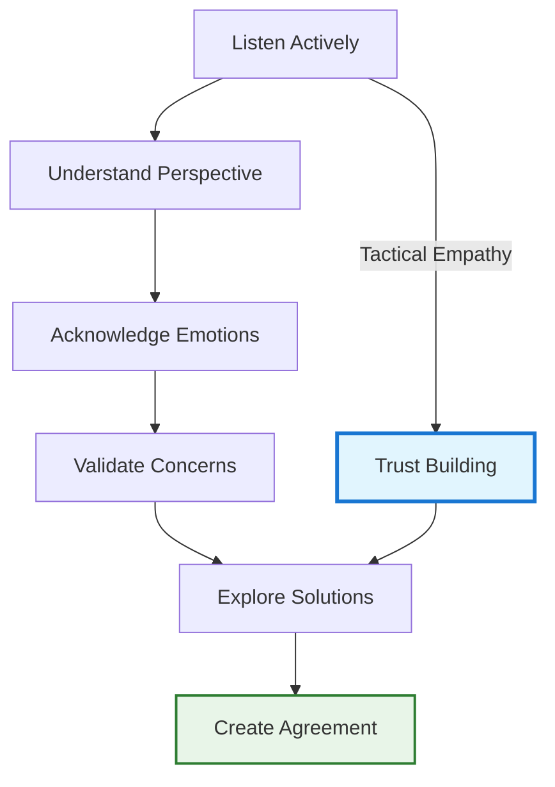
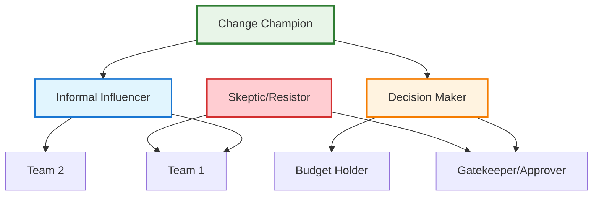

# Influence Without Authority

!!! quote "Influence Excellence"
    *"The art of leadership is saying no, not yes. It is very easy to say yes."*

    **— Tony Blair**

    *"We have two ears and one mouth so that we can listen twice as much as we speak."*

    **— Epictetus**

As a staff engineer, your success depends almost entirely on your ability to influence outcomes without having formal authority over the people whose cooperation you need. This chapter explores tactical empathy techniques from FBI negotiation tactics, behavioral psychology insights, and proven influence strategies that enable technical leaders to drive change through authentic relationship-building and strategic persuasion.

## The Staff Engineer's Influence Challenge

Unlike managers who can rely on hierarchical authority, staff engineers must create influence through credibility, relationships, and strategic persuasion. Your influence comes from your ability to understand others' motivations, align interests, and create compelling cases for action.

### The Authority Gap

Understanding the difference between position power and personal power:

**Position Power (What You Don't Have):**
- Formal reporting relationships
- Budget control
- Hiring and firing authority
- Performance review authority

**Personal Power (What You Can Build):**
- Technical expertise and credibility
- Relationship capital and trust
- Problem-solving capability
- Strategic thinking and vision

### Influence vs. Manipulation

Ethical influence builds long-term relationships and creates mutual value:

**Influence**: Creating alignment through understanding, shared benefit, and authentic persuasion
**Manipulation**: Using deception or coercion to achieve personal gain at others' expense

Influence strategies work because they create genuine value for all parties involved.

## Tactical Empathy: The Foundation of Influence

Based on Chris Voss's FBI negotiation techniques, tactical empathy involves understanding and acknowledging others' emotions and perspectives to build rapport and create collaborative problem-solving opportunities.

### The Empathy Toolkit

**Labeling**: Acknowledge others' emotions to reduce their power and build connection by verbalizing what you observe, using phrases like "It sounds like you're frustrated with the current deployment process," "It seems like you're concerned about the performance implications," or "You appear to be worried about the timeline." This technique validates their emotional experience while reducing the intensity of negative feelings through acknowledgment.

**Mirroring**: Repeat the last 1-3 words someone said to encourage them to elaborate and provide more information. When they say "This architecture change is going to be really complex," you respond with "Really complex?" which prompts them to explain their specific concerns and gives you crucial information to address their underlying issues rather than arguing against surface-level objections.

**Calibrated Questions**: Ask open-ended questions that give the other person control while gathering the information you need to find mutually beneficial solutions. Questions like "How do you see this working?", "What makes this challenging for your team?", and "How can we make this work for everyone?" invite collaboration rather than defensiveness while uncovering the real constraints and requirements you need to understand.

### Building Rapport Through Understanding

Create connection before attempting to influence:



### The Late-Night FM DJ Voice

Use a calm, slow, downward-inflecting voice to create a sense of calm and control:
- Reduces tension in difficult conversations
- Conveys confidence and thoughtfulness
- Encourages others to slow down and think rather than react emotionally

## Cialdini's Six Principles of Persuasion

Robert Cialdini's research identifies six psychological principles that drive human decision-making:

### 1. Reciprocity

People feel obligated to return favors and concessions:

**Technical Applications:**
- Help others solve technical problems before asking for their support
- Share knowledge and expertise freely
- Provide useful code reviews and architectural feedback
- Offer to mentor or train team members

**Strategic Implementation:**
- Keep mental notes of how you've helped others
- Make your contributions visible without being boastful
- Ask for specific reciprocal actions when appropriate

### 2. Commitment and Consistency

People want to be consistent with their previous commitments and self-image:

**Technical Applications:**
- Get people to articulate their own reasons for supporting your proposal
- Ask questions that lead others to conclude what you want them to conclude
- Reference people's past decisions and statements that align with your proposal
- Help people see how your proposal aligns with their stated values

**Example Conversation:**
```
You: "What's most important to you in our architecture decisions?"
Them: "Long-term maintainability and team velocity."
You: "How do you think microservices would impact maintainability and velocity in our context?"
```

### 3. Social Proof

People look to others' behavior to determine appropriate actions:

**Technical Applications:**
- Share examples of how other respected teams have implemented similar solutions
- Highlight industry best practices and standards
- Reference successful case studies from well-known companies
- Show momentum by sharing who has already committed to your approach

**Implementation Strategy:**
- Research similar implementations at respected organizations
- Build coalitions of early adopters before broader pitches
- Use peer recommendations rather than self-promotion
- Share success metrics from pilot implementations

### 4. Authority

People defer to credible experts and authority figures:

**Building Technical Authority:**
- Demonstrate deep expertise through problem-solving
- Share relevant experience and past successes
- Continue learning and staying current with industry trends
- Cite respected authorities and research to support your positions

**Authority Signals:**
- Speaking at conferences or industry events
- Publishing technical articles or blog posts
- Contributing to open-source projects
- Having relevant certifications or advanced degrees

### 5. Liking

People are more easily influenced by people they like:

**Building Likeability as a Technical Leader:**
- Find genuine common ground and shared interests
- Give authentic compliments about others' work
- Show vulnerability by admitting mistakes and knowledge gaps
- Demonstrate that you have others' best interests in mind
- Use appropriate humor to reduce tension

**Similarity and Rapport:**
- Share relevant personal experiences
- Find shared technical interests or backgrounds
- Express genuine appreciation for others' expertise
- Show interest in their challenges and goals

### 6. Scarcity

People value things more when they're scarce or time-limited:

**Technical Applications:**
- Highlight the limited window for architectural decisions
- Emphasize unique opportunities or competitive advantages
- Show what might be lost by not taking action
- Create urgency around technical debt or security issues

**Ethical Implementation:**
- Only use scarcity that is genuinely true
- Focus on opportunity costs rather than artificial deadlines
- Help people understand the real constraints you're operating under

## Advanced Influence Techniques

### The Ben Franklin Effect

Asking someone for a small favor actually makes them more likely to help you again and view you more favorably:

**Technical Application:**
- Ask for advice on technical problems (even when you know the answer)
- Request feedback on proposals or architectural decisions
- Invite others to contribute to technical discussions or decisions
- Ask for small commitments before requesting larger ones

### Foot-in-the-Door Technique

Start with small requests that people are likely to agree to, then gradually increase the size of requests:

**Progressive Commitment Strategy:**
1. Ask for feedback or input (low commitment)
2. Request participation in planning or design (medium commitment)
3. Ask for implementation support (high commitment)
4. Request ongoing maintenance or ownership (very high commitment)

### Door-in-the-Face Technique

Start with a large request that will likely be rejected, then make a smaller, more reasonable request:

**Example:**
```
Initial request: "Can your team completely rebuild the authentication system in the next sprint?"
Real request: "Could you help us identify the authentication bottlenecks and recommend improvements?"
```

## Organizational Influence Strategies

### Stakeholder Mapping and Analysis

Understand the influence network in your organization:



**Influence Strategy by Stakeholder Type:**

**Champions**: Leverage their enthusiasm to influence others
**Decision Makers**: Focus on business impact and risk mitigation
**Informal Influencers**: Build relationships and seek their input
**Skeptics**: Understand their concerns and address them directly
**Gatekeepers**: Ensure they understand the value and urgency

### Coalition Building

Create momentum through strategic alliance building:

**Phase 1: Core Coalition**
- Identify 2-3 key supporters who share your vision
- Get their private commitment before going public
- Align on messaging and approach strategy

**Phase 2: Expansion**
- Leverage core coalition to recruit additional supporters
- Address concerns from fence-sitters
- Neutralize or convert skeptics where possible

**Phase 3: Implementation**
- Use coalition pressure to drive decision-making
- Maintain momentum through visible progress
- Celebrate wins to reinforce commitment

### Creating Compelling Business Cases

Frame technical proposals in terms that resonate with different audiences:

**For Engineering Leaders**: Technical excellence, maintainability, developer productivity
**For Product Leaders**: User experience, feature velocity, competitive advantage
**For Business Leaders**: Cost reduction, revenue opportunity, risk mitigation
**For Executive Teams**: Strategic advantage, organizational capability, market differentiation

## Difficult Conversations and Resistance

### Understanding Resistance

People resist change for predictable reasons:

**Fear**: Concern about negative consequences or loss of status
**Lack of Trust**: Uncertainty about your motives or capabilities
**Different Information**: Operating from different facts or assumptions
**Loss of Control**: Feeling that change is being imposed on them
**Past Bad Experiences**: Previous negative experiences with similar changes

### Overcoming Resistance Strategies

**Address Fears Directly**: Acknowledge concerns and provide realistic assessments
**Build Trust Gradually**: Start with small commitments and deliver consistently
**Share Information**: Ensure everyone is operating from the same facts
**Increase Participation**: Give people control over how change is implemented
**Learn from History**: Understand and address what went wrong in the past

### The HEARD Technique for Difficult Conversations

**H**alt: Stop the conversation if emotions are running high
**E**ngage: Listen actively to understand their perspective
**A**ffirm: Acknowledge their concerns and validate their emotions
**R**espond: Address their concerns with empathy and facts
**D**irect: Guide the conversation toward collaborative problem-solving

## Building Long-term Influence

### Reputation and Credibility

Your influence grows over time through consistent behavior:

**Competence**: Consistently deliver high-quality technical solutions
**Character**: Act with integrity and put organizational interests first
**Caring**: Show genuine concern for others' success and well-being
**Consistency**: Maintain predictable behavior and values across situations

### Knowledge Sharing and Teaching

Build influence by making others more successful:

- Create learning opportunities for your colleagues
- Share your expertise through documentation, presentations, and mentoring
- Give credit generously for others' contributions
- Help others solve problems even when it doesn't directly benefit you

### Strategic Patience

Understand that influence building is a long-term investment:

- Some people need time to warm up to new ideas
- Building trust requires consistent behavior over time
- Small wins create momentum for larger changes
- Relationships are more valuable than individual victories

## Cross-Reference Navigation

**Communication Foundations:**
- **[Communication & Presentation Skills](communication-presentation-skills.md)** - Core communication skills that support influence efforts
- **[Technical Vision](technical-vision.md)** - Using vision to create alignment and influence
- **[Storytelling for Engineers](storytelling-for-engineers.md)** - Narrative techniques that enhance persuasion

**Leadership Applications:**
- **[Advanced Conflict Resolution](advanced-conflict-resolution.md)** - Apply influence techniques to resolve technical disagreements
- **[Working Across Boundaries](working-across-boundaries.md)** - Influence strategies for cross-functional collaboration
- **[Navigating Tough Technical Discussions](navigating-tough-technical-discussions.md)** - Difficult conversation skills for technical contexts

**Organizational Integration:**
- **[Change Management](../execution/change-management-technical-transformations.md)** - Large-scale influence for organizational transformation
- **[Cultural Transformation](../teamwork/cultural-transformation-psychological-safety.md)** - Influence techniques for culture change

## Further Reading

This chapter draws on insights from negotiation experts, behavioral psychologists, and influence researchers:

*   **Voss, Chris, and Tahl Raz. *Never Split the Difference: Negotiating As If Your Life Depended On It*.** FBI negotiation tactics including tactical empathy techniques.
*   **Cialdini, Robert B. *Influence: The Psychology of Persuasion*.** The foundational research on six key principles of persuasion.
*   **Carnegie, Dale. *How to Win Friends and Influence People*.** Timeless principles for building relationships and influencing others.
*   **Cohen, Allan R., and David L. Bradford. *Influence Without Authority*.** Practical strategies for influencing colleagues and stakeholders.
*   **Fisher, Roger, William L. Ury, and Bruce Patton. *Getting to Yes: Negotiating Agreement Without Giving In*.** Principled negotiation techniques for win-win outcomes.