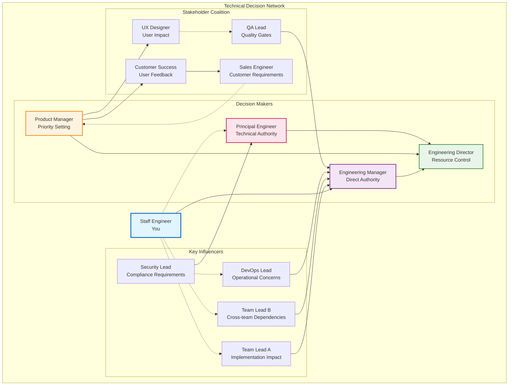

# Influencing Without Authority: The Tactical Empathy Playbook

## The Scenario

You've identified a critical need to refactor a legacy service. It's accumulating tech debt, slowing down feature development, and posing a significant operational risk. However, your Product Manager is focused on a tight feature deadline, and the Director of Engineering is concerned about derailing the quarterly roadmap. Your technical logic is sound, but logic alone isn't winning the argument. You have no authority to command the change. What do you do?

This is the classic Staff Engineer dilemma. The answer isn't to argue harder or write a more detailed technical document. The answer is to stop trying to get them to understand your position and instead, focus entirely on understanding theirs. This is the core of **Tactical Empathy**, a concept from former FBI hostage negotiator Chris Voss. It's not about being "nice" or agreeing with them; it's about understanding the emotions, motivations, and constraints behind their position so you can reframe the problem in a way that leads to your desired outcome.

## Your Toolkit for Influence

### 1. Mirroring: The Art of the Echo

A Mirror is simply repeating the last 1-3 critical words your counterpart has said, framed as a question. It feels awkward at first, but it is a profoundly effective way to build rapport and encourage the other person to elaborate, often revealing their true motivations.

- **Product Manager:** "We absolutely cannot delay the launch of the new billing feature."
- **Your (Bad) Instinct:** "But the legacy service is a huge risk! We have to fix it." (This creates a confrontation: My Goal vs. Your Goal).
- **Your (Tactical) Response:** "The new billing feature...?"
- **Product Manager:** "Yes, the CEO has been asking about it, and marketing has a whole campaign planned. We've committed to this date."
- **Insight Gained:** The PM isn't against your refactor; they are constrained by external commitments and executive pressure. The problem isn't technical, it's political.

### 2. Labeling: Calling Out the Emotion

A Label is a verbal observation of the other person's feelings. It starts with phrases like "It seems like...", "It sounds like...", or "It looks like...". This validates their emotion, defuses negativity, and makes them feel heard.

- **Director of Engineering:** "I'm just not convinced that taking on a multi-month refactor right now is the right priority."
- **Your (Tactical) Response:** "It seems like you're concerned this is an open-ended project that will derail our other commitments."
- **Director of Engineering:** "Exactly. The last 'quick refactor' took six months. We can't afford that kind of slip again. I need predictability."
- **Insight Gained:** The Director's fear isn't the refactor itself, but the _uncertainty_ and _risk of slippage_. A proposal that emphasizes a time-boxed, phased approach with clear milestones will be much more effective than one focused only on the technical benefits.

### 3. Calibrated "How" & "What" Questions: The Illusion of Control

Calibrated questions are open-ended questions that start with "How" or "What." They are non-threatening and empower your counterpart by asking for their help, making them feel in control. They are the opposite of "Why" questions, which can feel accusatory.

- **Avoid:** "Why don't you want to invest in our platform's stability?" (Accusatory)
- **Instead, ask:** "What does a successful Q3 look like for you?" (Uncovers their goals)
- **Then, connect:** "How can we address the stability issues in Service X to ensure we protect the Q3 revenue goals?" (Frames your project as a way to help them achieve _their_ goals).

## Putting It All Together

Start a difficult conversation by preemptively listing every negative assumption your counterpart might have about you. This disarms them completely.

- **You, to the PM and Director:** "I know what you're probably thinking. You're thinking that I'm an engineer who has fallen in love with a technical problem, that I'm disconnected from the business needs, that I'm trying to gold-plate a system at the expense of a critical feature, and that this is going to be another black hole of a project that will be impossible to predict and will put your commitments at risk."

By saying it all first, you neutralize the negative energy. Their internal monologue has been spoken aloud, and now they are open to hearing what you have to say next. You've moved from an adversary to a tuned-in collaborator. This is how you lead without authority.

## The Psychology of Technical Influence

### Understanding the Six Principles of Persuasion

Robert Cialdini's research on the psychology of persuasion reveals six hardwired psychological triggers that drive human decision-making. For staff engineers, understanding these principles transforms influence from an art into a science. You're not manipulating people—you're aligning your technical proposals with how people naturally make decisions.

=== "Reciprocity: Give First"
    **The Rule of Give and Take**

    People feel obligated to return favors. In technical environments, this principle is extraordinarily powerful because knowledge sharing and problem-solving create natural opportunities for reciprocity.

    Instead of starting with what you need from others, start by providing value to them. When Maria from the platform team comes to you with a performance question, don't just answer her immediate question—spend an extra fifteen minutes helping her understand the broader performance patterns in your system. When she later needs to prioritize platform improvements, she'll remember your help.

    !!! tip "Practical Application"
        Before proposing a major architectural change, spend time helping other teams with their technical challenges. Review their code, share your expertise, contribute to their technical discussions. When you later need their support for your initiative, they'll feel naturally inclined to help because you've already invested in their success.

=== "Commitment: Align with Values"
    **The Power of Consistency**

    People want their actions to be consistent with their stated beliefs and previous commitments. This is why getting people to agree to small commitments first makes them more likely to support larger initiatives later.

    During your technical discussions, help people articulate the principles they believe in. "It sounds like code quality is really important to you." "You mentioned that you care about developer experience." "I heard you say that system reliability is a top priority." Once someone has stated these values publicly, they'll feel internal pressure to act consistently with them.

    !!! example "Reframing Technique"
        "Since we all agreed that developer experience is crucial, this refactoring would eliminate the configuration complexity that's been slowing down new team members."

=== "Social Proof: Show Success"
    **The Influence of Others**

    People look to others' behavior to determine what's appropriate, especially in uncertain situations. Technical decisions often involve uncertainty, making social proof particularly powerful.

    Instead of arguing that your technical approach is theoretically superior, demonstrate that other respected engineers or organizations have successfully used similar approaches. "The team at Stripe wrote about how this pattern solved their scaling challenges." "Google's SRE book recommends exactly this kind of error budget approach." "Three other teams in our organization have already adopted this testing pattern with great results."

    !!! note "Choose Your Sources"
        If you're talking to engineers who value academic rigor, reference research papers. If you're talking to product-focused teams, reference successful product companies that have used similar technical approaches.

=== "Authority: Demonstrate Expertise"
    **The Weight of Credible Experience**

    People defer to recognized experts, but authority isn't just about title—it's about demonstrated expertise and credibility. As a staff engineer, you're building authority through your technical contributions, but you need to communicate that authority appropriately.

    This doesn't mean being arrogant or claiming to know everything. Instead, it means clearly communicating your relevant experience and expertise when it's directly applicable to the discussion. "I've implemented this kind of caching strategy at three different companies, and here's what I've learned about the tradeoffs." "Having debugged similar performance issues for the past five years, I can tell you the most common causes."

    !!! warning "Acknowledge Other Expertise"
        Recognize and acknowledge others' authority in their domains. "You understand the business requirements much better than I do." "You have way more experience with our deployment pipeline." This approach actually increases your authority by demonstrating good judgment about expertise boundaries.

=== "Liking: Build Connections"
    **The Power of Genuine Relationship**

    People are more easily influenced by people they like, and people tend to like others who are similar to them, who give them compliments, and who share their goals. In technical environments, this often translates to shared technical values and mutual respect for expertise.

    Build genuine connections by finding common ground in your technical interests, career experiences, or problem-solving approaches. Show genuine interest in others' technical challenges and achievements. "That's a really clever solution to the database sharding problem." "I went through a similar architecture migration at my previous company—it's challenging work."

    !!! success "Authenticity Matters"
        People can detect fake interest from miles away. Actually care about your colleagues' technical challenges and successes. Actually listen to their ideas and build on them. Technical collaboration is most effective when it's built on real professional relationships.

=== "Scarcity: Highlight Constraints"
    **The Urgency of Real Opportunity**

    People value things more when they're scarce or when opportunities are limited. In technical contexts, this might be about timing windows, resource availability, or competitive advantages.

    Rather than creating artificial urgency, help people understand the real constraints and opportunities. "The database migration window happens only twice a year, and if we miss this one, we'll be stuck with the current performance issues through the busy season." "We have budget approved for this infrastructure investment right now, but it might not be available after the next budget cycle."

    !!! danger "Use Sparingly"
        Be careful with this principle—overuse it, and people will start questioning your judgment. Use it only when the scarcity is real and relevant to the technical decisions you're discussing.

## Mapping Your Influence Network: Strategic Relationship Building

Before attempting to influence any significant technical decision, successful staff engineers map the organizational network to understand relationships, power dynamics, and influence patterns. This isn't about office politics—it's about understanding how technical decisions actually get made in complex organizations.



### Network Analysis Framework

=== "Power Mapping"
    **Decision Authority Matrix**

    | Role | Authority Type | Impact Level | Influence Strategy |
    |------|----------------|--------------|--------------------|
    | **Engineering Director** | Ultimate Decision Maker | High | Budget and resource allocation |
    | **Principal Engineer** | Technical Veto Power | High | Technical feasibility and architecture |
    | **Security Lead** | Compliance Veto | Medium-High | Risk assessment and compliance |
    | **Team Leads** | Implementation Gatekeepers | Medium | Capacity and execution reality |
    | **Product Manager** | Priority Influencer | Medium | Business case and user impact |
    | **Customer Success** | User Impact Advocate | Medium | Real-world usage patterns |

=== "Influence Pathways"
    **Strategic Routes to Decision Makers**

    ```mermaid
    graph LR
        A[Staff Engineer] --> B[Direct Path]
        A --> C[Technical Authority]
        A --> D[Business Case]
        A --> E[Coalition Building]

        B --> F[Engineering Manager] --> G[Engineering Director]
        C --> H[Principal Engineer] --> G
        D --> I[Product Manager] --> G
        E --> J[Team Leads + QA + DevOps] --> F --> G

        style A fill:#e1f5fe
        style G fill:#e8f5e8
    ```

    | Pathway | When to Use | Success Factors |
    |---------|-------------|------------------|
    | **Direct Path** | Clear authority chain, simple technical decisions | Strong relationship with EM, well-defined scope |
    | **Technical Authority** | Complex architecture decisions, technical disputes | Deep technical credibility, alignment with Principal Engineer |
    | **Business Case** | Resource-intensive projects, strategic initiatives | Quantified business impact, user data support |
    | **Coalition Building** | Cross-team changes, cultural shifts | Broad stakeholder alignment, implementation readiness |

### **Strategic Influence Approach**

**Phase 1: Intelligence Gathering**

- Map concerns and motivations of each key player
- Identify natural allies who share your technical concerns
- Understand resistance points and underlying causes
- Discover informal influence networks and relationships

**Phase 2: Coalition Building**

- Start with natural allies (usually technical peers facing similar challenges)
- Address specific concerns of potential resistors through private conversations
- Build consensus among implementation teams before escalating to decision makers
- Gather supporting evidence and user impact data through customer-facing teams

**Phase 3: Strategic Escalation**

- Present unified technical recommendation with peer support
- Frame proposal in terms of business impact with Product Manager alignment
- Address operational concerns with DevOps and Security team buy-in
- Request resources with clear implementation plan and risk mitigation

**Example Network Activation**:

```
Technical Concern: Legacy authentication service causing security vulnerabilities

Network Strategy:
1. Security Lead → Validates risk assessment and compliance concerns
2. DevOps Lead → Confirms operational impact and incident frequency
3. Team Leads → Provide development velocity impact data
4. QA Lead → Documents testing complexity and quality issues
5. Customer Success → Shares user-reported authentication problems
6. Product Manager → Translates technical issues to business impact
7. Engineering Manager → Receives unified team recommendation with business case
8. Engineering Director → Makes informed decision with full stakeholder alignment
```

## Common Pitfalls to Avoid

- **Overstepping Boundaries:** Avoid coming across as authoritative. Frame your suggestions as options to be considered, not commands to be followed.
- **Ignoring Feedback:** Dismissing concerns without genuine consideration will quickly erode trust. Acknowledge and address all feedback, even if you don't ultimately agree.
- **Failing to Build Trust:** Influence is built on a foundation of trust. This is earned through consistent behavior: delivering on promises, being transparent, and demonstrating a genuine interest in others' perspectives.

## A Practical Exercise: Role-Play Negotiation

1.  **Setup:** Split participants into pairs. One person is the Staff Engineer advocating for a change (e.g., adopting a new coding standard); the other is a skeptical team member.
2.  **Objective:** The engineer must use tactical empathy, mirroring, labeling, and calibrated questions to address the team member's concerns and gain their buy-in.
3.  **Debrief:** After 10-15 minutes, discuss what worked, what didn't, and how the techniques felt in practice.

---

## Prerequisites and Related Learning

### **Prerequisites for This Chapter**

- **[Engineering Excellence](../engineering/index.md)** - Technical credibility is essential for influence; people must respect your expertise before they'll follow your guidance
- **[Critical Thinking](../thinking/mental-models.md)** - Understanding cognitive biases and decision-making psychology enhances your ability to influence others
- **[Leadership Foundations](index.md)** - Level 5 Leadership principles provide the humility and professional will needed for authentic influence

### **Related Concepts**

- **[Advanced Conflict Resolution](advanced-conflict-resolution.md)** - Use influence techniques within structured conflict resolution processes
- **[Delivering Difficult Messages](delivering-difficult-messages.md)** - Apply tactical empathy when communicating challenging technical decisions
- **[Psychological Safety & Trust](psychological-safety-trust.md)** - Build the trust foundation necessary for effective influence
- **[Storytelling for Engineers](storytelling-for-engineers.md)** - Combine influence techniques with compelling narrative structure
- **[Pitching to Executives](../business/pitching-to-executives.md)** - Apply influence principles when presenting technical recommendations to business leaders

### **Apply These Influence Techniques**

- **[Staff Engineer Competency Assessment](../../appendix/tools/staff-engineer-competency-assessment.md)** - Evaluate your influence and communication capabilities across technical leadership domains
- **[Team Health Diagnostic](../../appendix/tools/team-health-diagnostic.md)** - Use influence mapping to improve team collaboration and decision-making processes

### **Next Steps in Your Learning Journey**

1. **[Advanced Conflict Resolution](advanced-conflict-resolution.md)** - Apply influence techniques within structured negotiation frameworks for complex technical disagreements
2. **[Organizational Design](../teamwork/organizational-design.md)** - Use your influence skills to guide team structure decisions and Conway's Law applications
3. **[Cross-Functional Collaboration](../teamwork/cross-functional-collaboration.md)** - Extend influence techniques to work effectively across engineering, product, and business teams
4. **[Pitching to Executives](../business/pitching-to-executives.md)** - Scale influence techniques for strategic technical communication with senior leadership

### **Learning Path Recommendations**

**For Technical Individual Contributors**: Master the **Six Principles of Persuasion** and **Tactical Empathy** before progressing to complex organizational influence scenarios.

**For Team Leads**: Focus on **Influence Network Mapping** and **Coalition Building** to guide technical decisions across multiple teams and stakeholders.

**For Business-Focused Engineers**: Emphasize **Executive Influence** and **Cross-Functional Collaboration** to become an effective technical partner to business leaders.

---

## Further Reading

- _Never Split the Difference_ by Chris Voss
- _Influence: The Psychology of Persuasion_ by Robert B. Cialdini
