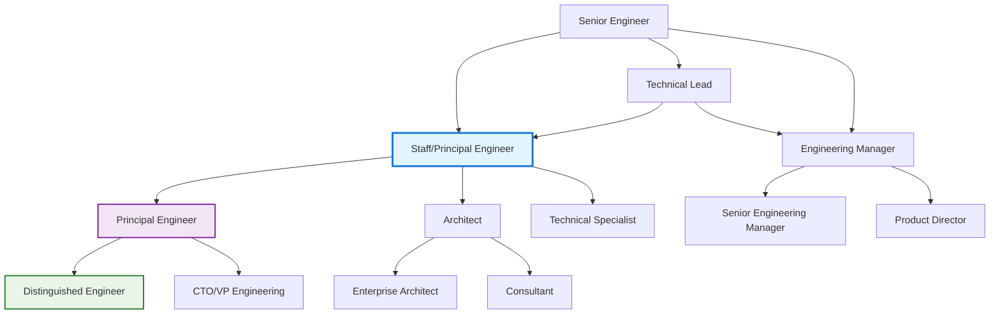
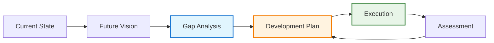

# Advanced Career Development for Technical Leaders

!!! quote "Career Excellence"
    *"The best time to plant a tree was 20 years ago. The second best time is now."*

    **— Chinese Proverb**

Advanced career development for technical leaders involves strategic thinking about your professional growth beyond traditional promotion ladders. As you progress in your technical leadership journey, career advancement becomes less about climbing a hierarchy and more about building influence, expanding impact, and creating value in increasingly complex ways.

## The Modern Technical Career Landscape

### Beyond the Traditional Ladder

Traditional career progression models are evolving to reflect the reality of modern technical organizations:

**Traditional Model**: Junior → Senior → Lead → Manager → Director
**Modern Model**: Multiple interconnected paths with lateral movement and specialization

### Career Capital Building

Build multiple types of career capital simultaneously:

**Technical Capital**: Deep expertise in technologies and domains
**Social Capital**: Network of professional relationships and reputation
**Organizational Capital**: Understanding of how businesses and organizations work
**Cultural Capital**: Ability to navigate different cultural and professional contexts

## Strategic Career Planning

### The 70-20-10 Development Model

Allocate your professional development efforts strategically:

**70% - Challenging Assignments**: Learn through stretch projects and new responsibilities
**20% - Learning from Others**: Mentoring, coaching, peer learning, and networking
**10% - Formal Training**: Courses, conferences, certifications, and structured learning

### Career Vision Development

Create a compelling vision for your professional future:

**5-Year Vision**: Where do you want to be in 5 years?
**Impact Statement**: What kind of impact do you want to have?
**Value Proposition**: What unique value will you bring to organizations?
**Success Metrics**: How will you measure your progress and success?

### Gap Analysis and Development Planning

Systematically identify and address skill gaps:

## Skill Diversification Strategies

### T-Shaped Professional Development

Develop both depth and breadth in your professional capabilities:

**Vertical Bar (Depth)**: Deep expertise in your primary technical domain
**Horizontal Bar (Breadth)**: Broad knowledge across multiple domains and disciplines

**Technical Breadth Areas:**
- Adjacent technical domains (backend/frontend, infrastructure/applications)
- Emerging technologies and trends
- Product management and user experience
- Business analysis and strategy
- Data science and analytics

### Cross-Functional Skill Development

Build capabilities that bridge technical and business domains:

**Product Skills**: User research, product strategy, metrics analysis
**Business Skills**: Financial modeling, market analysis, competitive intelligence
**Leadership Skills**: Change management, organizational design, strategic thinking
**Communication Skills**: Technical writing, presentation, cross-cultural communication

### The Portfolio Career Approach

Consider building a portfolio of complementary professional activities:

**Core Employment**: Your primary technical leadership role
**Advisory Work**: Board positions, consulting, strategic advising
**Teaching/Training**: Conference speaking, course development, workshop facilitation
**Open Source**: Meaningful contributions to projects you care about
**Writing/Content**: Technical articles, books, podcast appearances

## Lateral Career Movement

### Strategic Lateral Moves

Use lateral moves to accelerate development and expand opportunities:

**Domain Expansion**: Move between different business domains (fintech, healthcare, e-commerce)
**Technology Diversification**: Experience different technology stacks and architectural patterns
**Company Stage Variation**: Experience startup, scale-up, and enterprise environments
**Geographic/Cultural Expansion**: International experience and cultural competency development

### Internal Mobility Strategies

Maximize growth opportunities within your current organization:

**Cross-Team Projects**: Volunteer for initiatives that span multiple teams
**Special Assignments**: Seek out special projects that require new skills
**Acting Roles**: Take on interim leadership positions during transitions
**Task Force Participation**: Join working groups addressing organizational challenges

## Professional Network Development

### Network Building Strategy

Build authentic professional relationships strategically:

**Internal Networks**: Colleagues, collaborators, mentors within your organization
**Industry Networks**: Peers at other companies, conference connections, professional associations
**Academic Networks**: University connections, research collaborations, academic conferences
**Community Networks**: Open source contributors, meetup participants, online communities

### Value-First Networking

Focus on creating value for others rather than extracting value:

**Knowledge Sharing**: Share insights, articles, and resources with your network
**Introduction Making**: Connect people who would benefit from knowing each other
**Problem Solving**: Offer help and expertise when others face challenges
**Opportunity Sharing**: Alert others to opportunities they might find interesting

### Professional Reputation Building

Systematically build recognition for your expertise and contributions:

**Content Creation**: Write articles, create videos, or develop tools that help others
**Speaking Engagements**: Present at conferences, meetups, and industry events
**Open Source Contributions**: Contribute meaningfully to projects others use
**Thought Leadership**: Share perspectives on industry trends and technical challenges

## Mentorship and Sponsorship

### Finding Mentors at Advanced Career Stages

Seek mentorship that addresses specific development needs:

**Technical Mentors**: Domain experts who can accelerate your technical learning
**Leadership Mentors**: Experienced leaders who can guide your leadership development
**Career Mentors**: People who have achieved what you aspire to achieve
**Reverse Mentors**: Younger colleagues who can teach you about new technologies and perspectives

### Becoming a Mentor and Sponsor

Give back while building your leadership capabilities:

**Formal Mentoring**: Participate in organizational mentoring programs
**Informal Mentoring**: Provide guidance and support to colleagues naturally
**Sponsorship**: Actively advocate for others' advancement and opportunities
**Knowledge Transfer**: Document and share your expertise with others

## Advanced Learning Strategies

### Just-in-Time Learning

Develop skills right when you need them for maximum retention and application:

**Project-Driven Learning**: Learn new technologies as part of real projects
**Problem-Focused Learning**: Deep dive into topics when facing specific challenges
**Opportunity-Driven Learning**: Develop skills when new opportunities arise
**Trend-Anticipation Learning**: Stay ahead of industry trends with early exploration

### Learning from Failure

Extract maximum value from professional setbacks and failures:

**Failure Analysis**: Systematically analyze what went wrong and why
**Pattern Recognition**: Identify recurring challenges in your professional development
**Recovery Strategies**: Develop resilience and bounce-back capabilities
**Sharing Lessons**: Help others learn from your mistakes and experiences

### Continuous Skill Assessment

Regularly evaluate your skill development progress:

!!! question "Advanced Career Development Self-Assessment"
    **Rate your current level and desired growth (1=Beginner, 5=Expert):**

    === "Technical Leadership"
        - [ ] System architecture and design capabilities
        - [ ] Technical strategy and vision development
        - [ ] Cross-team technical coordination
        - [ ] Technical risk assessment and mitigation

    === "Business Integration"
        - [ ] Understanding of business model and strategy
        - [ ] Product development lifecycle knowledge
        - [ ] Financial modeling and business case development
        - [ ] Market and competitive analysis skills

    === "Organizational Leadership"
        - [ ] Change management and transformation leadership
        - [ ] Cross-functional collaboration and influence
        - [ ] Organizational design and team effectiveness
        - [ ] Culture development and value creation

## Career Transition Management

### Transition Planning

Manage major career transitions strategically:

**Preparation Phase**: Build necessary skills and relationships before the transition
**Transition Phase**: Manage the actual change with clear communication and planning
**Integration Phase**: Successfully establish yourself in the new role or organization
**Optimization Phase**: Continuously improve and expand your impact

### Managing Career Transitions

Navigate common technical leadership transitions:

**IC to Leadership**: Transitioning from individual contributor to leadership roles
**Technical to Business**: Moving from technical roles to business-focused positions
**Specialist to Generalist**: Broadening from deep specialization to broader responsibility
**Corporate to Startup**: Adapting skills for different organizational contexts

## Long-term Career Sustainability

### Avoiding Career Plateau

Prevent career stagnation through continuous challenge and growth:

**Stretch Assignments**: Regularly take on projects that require new skills
**Skill Refresh**: Periodically update technical skills to stay current
**Network Expansion**: Continuously expand your professional network
**Impact Escalation**: Seek opportunities for increasing organizational impact

### Work-Life Integration

Maintain long-term career sustainability through healthy integration:

**Energy Management**: Focus on energy rather than just time management
**Boundary Setting**: Establish clear boundaries between work and personal time
**Health Maintenance**: Prioritize physical and mental health for long-term performance
**Relationship Investment**: Maintain important personal relationships despite career demands

### Legacy and Impact Thinking

Consider the long-term impact you want to have:

**Technical Legacy**: What technical contributions will outlast your direct involvement?
**People Development**: How many people will you help develop and advance?
**Organizational Impact**: What positive changes will you create in organizations?
**Industry Contribution**: How will you contribute to the broader industry or field?

## Cross-Reference Navigation

**Foundation Skills:**
- **[Developing Expertise](developing-expertise.md)** - Building deep technical knowledge
- **[Staying Current](staying-current.md)** - Keeping skills and knowledge up-to-date
- **[Mentorship & Sponsorship](mentorship-sponsorship.md)** - Relationship-based development

**Leadership Development:**
- **[Advanced Mentorship & Career Development](../leadership/advanced-mentorship-career-development.md)** - Leading others' development
- **[Communication & Presentation Skills](../leadership/communication-presentation-skills.md)** - Essential leadership communication
- **[Influence Without Authority](../leadership/influence-without-authority.md)** - Building influence at senior levels

**Strategic Thinking:**
- **[Strategic Thinking](../execution/strategic-thinking.md)** - Thinking strategically about career and business
- **[Change Management](../execution/change-management-technical-transformations.md)** - Leading organizational change

## Further Reading

This chapter draws on insights from career development experts and research:

*   **Bolles, Richard N. *What Color Is Your Parachute?*** Annual guide to job hunting and career change with practical exercises.
*   **Cashman, Kevin. *Leadership from the Inside Out*.** Deep approach to leadership development focusing on authenticity and purpose.
*   **Gelles, David. *Mindful Work: How Meditation Is Changing Business from the Inside Out*.** Mindfulness approaches to career sustainability and effectiveness.
*   **Herminia Ibarra. *Working Identity: Unconventional Strategies for Reinventing Your Career*.** Research-based approach to career transitions and reinvention.
*   **Newport, Cal. *So Good They Can't Ignore You: Why Skills Trump Passion in the Quest for Work You Love*.** Evidence-based approach to career development focused on skill building.