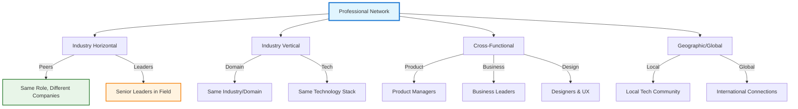

# Networking & Community Building

!!! quote "Community Excellence"
    *"If you want to go fast, go alone. If you want to go far, go together."*

    **— African Proverb**

Professional networking and community building are essential skills for technical leaders. Your ability to build authentic relationships, contribute to technical communities, and leverage collective knowledge directly impacts your learning, career advancement, and ability to solve complex problems.

## The Modern Professional Network

### Beyond Traditional Networking

Professional networking for technical leaders goes far beyond collecting business cards and making small talk:

**Knowledge Networks**: Connections that help you learn and stay current with technology
**Collaboration Networks**: People you can work with on projects and initiatives
**Influence Networks**: Relationships that amplify your ideas and initiatives
**Support Networks**: Mentors, sponsors, and peers who provide guidance and encouragement

### Network Diversity and Strength

Build networks that provide both breadth and depth of connections:

### Strong vs. Weak Ties

Both strong and weak ties serve different purposes in your professional network:

**Strong Ties**: Close relationships with regular interaction
- Provide detailed advice and support
- Offer collaboration opportunities
- Give honest feedback and guidance

**Weak Ties**: Broader connections with less frequent interaction
- Provide access to new opportunities and information
- Connect you to different networks and perspectives
- Often more valuable for job opportunities and novel insights

## Building Authentic Professional Relationships

### Value-First Approach

Focus on creating value for others rather than extracting value:

**Knowledge Sharing**: Share useful articles, tools, and insights
**Introductions**: Connect people who would benefit from knowing each other
**Problem Solving**: Offer help when others face challenges you've encountered
**Resource Sharing**: Share templates, frameworks, and tools you've developed

### Relationship Building Process

Develop relationships systematically over time:

**Phase 1: Initial Connection**
- Meet through conferences, mutual connections, or online communities
- Have genuine conversations about shared interests or challenges
- Exchange contact information and follow up within a few days

**Phase 2: Relationship Development**
- Maintain regular but non-intrusive contact
- Share relevant opportunities, articles, or insights
- Offer help or support when appropriate

**Phase 3: Mutual Value Creation**
- Collaborate on projects or initiatives
- Provide mutual introductions and referrals
- Support each other's professional goals

### Digital Relationship Management

Use technology to maintain and strengthen professional relationships:

**CRM Systems**: Use tools like Notion, Airtable, or dedicated CRM software
**Social Media**: Engage meaningfully on LinkedIn, Twitter, and professional platforms
**Calendar Reminders**: Schedule regular check-ins with important connections
**Content Sharing**: Share and comment on others' professional content

## Community Participation

### Choosing Communities

Participate in communities that align with your interests and goals:

**Technology Communities**: Language-specific groups, framework communities
**Industry Communities**: Domain-specific groups (fintech, healthcare, e-commerce)
**Local Communities**: Regional tech meetups and user groups
**Online Communities**: Forums, Discord servers, Slack groups
**Professional Organizations**: ACM, IEEE, industry associations

### Participation Strategies

Contribute meaningfully to community discussions and activities:

**Active Listening**: Read and understand community dynamics before participating
**Helpful Contributions**: Answer questions, share resources, provide feedback
**Content Creation**: Write blog posts, create tutorials, share experiences
**Event Participation**: Attend meetups, conferences, and community events

### Building Community Leadership

Gradually take on leadership roles in communities you care about:

**Organizing Events**: Help organize meetups, conferences, or workshops
**Content Curation**: Maintain resource lists, newsletters, or community wikis
**Mentorship Programs**: Lead or participate in community mentorship initiatives
**Speaking and Teaching**: Present at events or create educational content

## Professional Development Through Networking

### Learning Networks

Build connections that accelerate your professional learning:

**Study Groups**: Form or join groups focused on specific technologies or topics
**Book Clubs**: Participate in professional development book discussions
**Mastermind Groups**: Small groups that meet regularly to support each other's growth
**Peer Learning**: Exchange knowledge and experiences with peers in similar roles

### Mentorship Networks

Develop relationships that provide guidance and support:

**Finding Mentors**: Identify people whose career path or expertise you admire
**Being a Mentor**: Share your knowledge and experience with others
**Peer Mentoring**: Exchange mentorship with colleagues at similar levels
**Reverse Mentoring**: Learn from junior colleagues about new technologies and perspectives

### Sponsorship and Advocacy

Build relationships with people who can advocate for your career advancement:

**Sponsors**: Senior leaders who actively promote your career advancement
**Advocates**: People who speak positively about your work and capabilities
**Champions**: Colleagues who support your initiatives and proposals
**References**: Professional contacts who can vouch for your skills and character

## Digital Networking and Online Presence

### Professional Online Presence

Build and maintain a professional presence that attracts valuable connections:

**LinkedIn Optimization**: Complete profile with clear value proposition and recent activity
**Technical Blog**: Share insights, experiences, and learnings through writing
**Social Media**: Engage professionally on Twitter, GitHub, and other platforms
**Speaking Profile**: Maintain a speaker profile for conference and event opportunities

### Content Strategy for Network Building

Create and share content that demonstrates expertise and provides value:

**Technical Articles**: Deep dives into technologies or methodologies you've used
**Experience Sharing**: Lessons learned from projects, failures, and successes
**Industry Commentary**: Thoughtful perspectives on industry trends and developments
**Resource Curation**: Collections of useful tools, articles, or best practices

### Online Community Engagement

Participate meaningfully in online technical communities:

**Platform-Specific Strategies:**
- **GitHub**: Contribute to open source projects, maintain useful repositories
- **Stack Overflow**: Answer questions in your areas of expertise
- **Reddit**: Participate in relevant subreddits with helpful contributions
- **Discord/Slack**: Engage in real-time discussions in professional communities

## Event Networking and Conference Participation

### Conference Strategy

Maximize learning and networking opportunities at industry events:

**Pre-Conference Planning**: Research speakers, attendees, and schedule in advance
**Goal Setting**: Define specific learning and networking objectives
**Follow-up Planning**: Prepare systems for maintaining new connections post-event

### Networking Event Best Practices

Navigate networking events effectively and authentically:

**Preparation**: Research attendees and have conversation starters ready
**Authentic Conversations**: Focus on genuine interest in others rather than self-promotion
**Active Listening**: Ask thoughtful questions and remember what people share
**Follow-up**: Connect within 24-48 hours with a personalized message

### Speaking and Presenting

Build your professional network through public speaking:

**Conference Speaking**: Present at industry conferences and events
**Meetup Presentations**: Share expertise at local technology meetups
**Webinars**: Participate in or host online educational events
**Podcast Appearances**: Share insights through podcast interviews

## Measuring Network Effectiveness

### Network Quality Metrics

Evaluate the health and effectiveness of your professional network:

**Diversity**: Range of industries, roles, experience levels, and backgrounds
**Reciprocity**: Balance between help given and received
**Activity**: Frequency and quality of interactions
**Value Creation**: Mutual benefit and support within relationships

### Relationship Maintenance

Maintain relationships systematically over time:

**Regular Check-ins**: Schedule quarterly or biannual catch-ups with key connections
**Milestone Recognition**: Acknowledge others' achievements and milestones
**Resource Sharing**: Continue sharing relevant opportunities and insights
**Event Invitations**: Include network connections in relevant events and opportunities

### Network Assessment Framework

!!! question "Professional Network Assessment"
    **Evaluate your networking effectiveness (1=Needs Improvement, 5=Excellent):**

    === "Network Quality"
        - [ ] My network includes diverse perspectives and backgrounds
        - [ ] I have strong relationships with peers in similar roles
        - [ ] I have connections to senior leaders in my field
        - [ ] My network spans multiple companies and industries

    === "Value Creation"
        - [ ] I regularly help others in my network
        - [ ] I make valuable introductions between connections
        - [ ] I share useful resources and opportunities
        - [ ] Others seek my advice and expertise

    === "Community Engagement"
        - [ ] I participate actively in relevant professional communities
        - [ ] I contribute meaningfully to discussions and events
        - [ ] I have leadership roles in communities I care about
        - [ ] My community involvement helps others learn and grow

## Long-term Community Building

### Creating Lasting Impact

Build communities and relationships that create lasting value:

**Institution Building**: Help create or strengthen organizations that serve the community
**Knowledge Preservation**: Document and share knowledge that others can build upon
**Next Generation Development**: Mentor and develop emerging leaders in your field
**Cultural Change**: Influence positive changes in industry culture and practices

### Sustainable Community Engagement

Balance community involvement with other professional and personal responsibilities:

**Focused Participation**: Choose a few communities for deep engagement rather than surface-level participation in many
**Seasonal Involvement**: Adjust community involvement based on work and personal cycles
**Delegation and Succession**: Train others to take on leadership roles you've held
**Boundary Setting**: Maintain clear boundaries around time and energy investment

## Cross-Reference Navigation

**Professional Development:**
- **[Advanced Career Development](advanced-career-development.md)** - Strategic career planning through networking
- **[Developing Expertise](developing-expertise.md)** - Using networks to accelerate skill development
- **[Mentorship & Sponsorship](mentorship-sponsorship.md)** - Formal mentoring relationships

**Leadership Skills:**
- **[Influence Without Authority](../leadership/influencing-without-authority.md)** - Building influence through relationships
- **[Communication & Presentation Skills](../leadership/communication-presentation-skills.md)** - Skills for community engagement
- **[Working Across Boundaries](../leadership/working-across-boundaries.md)** - Cross-functional relationship building

**Industry Engagement:**
- **[Staying Current with Technology](staying-current-technology.md)** - Using networks to stay informed
- **[Teaching to Learn](teaching-to-learn.md)** - Contributing to community knowledge

## Further Reading

This chapter draws on networking and relationship building research:

*   **Grant, Adam. *Give and Take: Why Helping Others Drives Our Success*.** Research on how generosity and helping others creates professional success.
*   **Granovetter, Mark. *Getting a Job: A Study of Contacts and Careers*.** Classic research on the strength of weak ties in professional networking.
*   **Cross, Rob, and Andrew Parker. *The Hidden Power of Social Networks*.** Understanding how networks drive organizational success.
*   **Ibarra, Herminia. *Working Identity: Unconventional Strategies for Reinventing Your Career*.** Using networks to explore and develop professional identity.
*   **Casciaro, Tiziana, Francesca Gino, and Maryam Kouchaki. *Learn to Love Networking*.** Harvard Business Review research on authentic networking approaches.