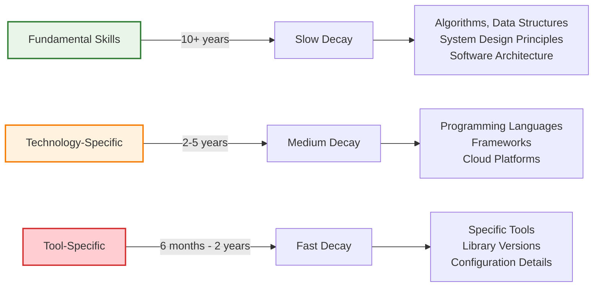
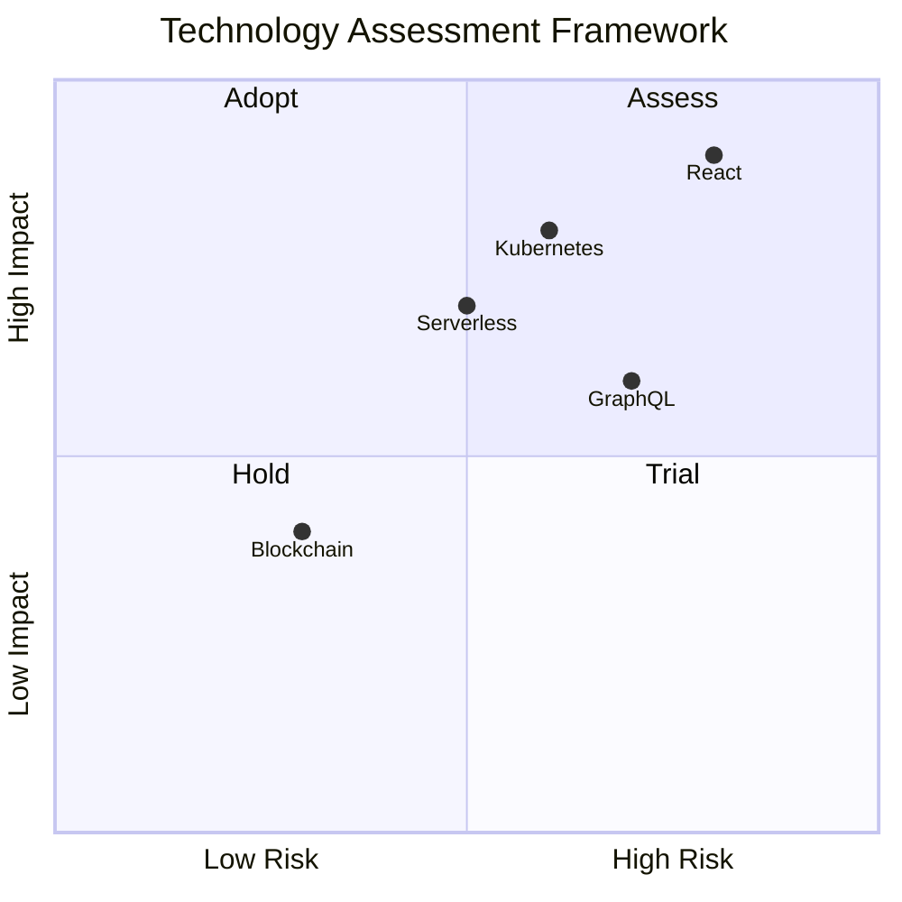

# Staying Current with Technology

!!! quote "Continuous Learning"
    *"The only constant in the technology industry is change. The only skill that will be important is the skill of learning new skills."*

    **— Naval Ravikant**

In the rapidly evolving technology landscape, staying current isn't just about personal growth—it's about maintaining your effectiveness as a technical leader. Your ability to evaluate new technologies, understand industry trends, and adapt your skills directly impacts your team's and organization's competitive advantage.

## The Challenge of Technical Currency

### The Information Overwhelm Problem

The technology industry produces an overwhelming amount of information daily:

**Volume Challenge**: Thousands of new tools, frameworks, and approaches emerge constantly
**Signal vs. Noise**: Distinguishing meaningful innovations from temporary hype
**Time Constraints**: Balancing learning with delivery responsibilities
**Depth vs. Breadth**: Choosing between deep specialization and broad awareness

### The Half-Life of Technical Skills

Different technical skills decay at different rates:

### Strategic Learning Framework

Focus your learning efforts where they'll have the most impact:

**Foundation First**: Invest in fundamental skills that transfer across technologies
**Just-in-Time Learning**: Learn specific tools when you need them for projects
**Trend Awareness**: Stay informed about significant industry shifts
**Experimentation**: Try new technologies in low-risk contexts

## Information Sources and Curation

### Primary Information Sources

Build a diverse portfolio of high-quality information sources:

**Industry Publications:**
- IEEE Software, Communications of the ACM
- Harvard Business Review (technology articles)
- MIT Technology Review
- Wired, Ars Technica

**Technology-Specific Sources:**
- Official documentation and blogs
- Conference presentations and recordings
- GitHub trending repositories
- Technology company engineering blogs

**Professional Networks:**
- Twitter/X technology communities
- LinkedIn professional groups
- Stack Overflow discussions
- Reddit programming communities

### Information Filtering System

Develop systematic approaches to manage information flow:

**RSS/Feed Management**: Use tools like Feedly to aggregate and filter content
**Newsletter Subscriptions**: Curated newsletters that summarize key developments
**Social Media Lists**: Organized Twitter lists for different technology areas
**Bookmark Systems**: Organized bookmarking with tags and categories

### Technology Radar Approach

Use a technology radar to systematically track and evaluate technologies:

**Adopt**: Technologies you're confident in using for new projects
**Trial**: Technologies worth exploring with pilot projects
**Assess**: Technologies to keep watching but not ready to trial
**Hold**: Technologies to avoid or consider retiring

## Systematic Learning Approaches

### The Learning Portfolio Method

Manage your learning like an investment portfolio:

**Core Holdings (60%)**: Deepen expertise in your primary technology stack
**Growth Investments (25%)**: Explore adjacent technologies that could become important
**Speculative Bets (10%)**: Experiment with emerging technologies
**Conservative Investments (5%)**: Maintain knowledge of legacy systems you might encounter

### Project-Based Learning

Learn new technologies through practical application:

**Side Projects**: Build personal projects using new technologies
**Hackathons**: Participate in events that encourage experimentation
**Internal Innovation**: Propose pilot projects at work
**Open Source Contributions**: Contribute to projects using technologies you want to learn

### Community-Driven Learning

Leverage community knowledge and experience:

**Meetups and Conferences**: Attend events focused on technologies of interest
**Online Communities**: Participate in technology-specific forums and chat groups
**Study Groups**: Form or join study groups with colleagues
**Mentorship**: Both seek mentors in new areas and mentor others in your expertise

## Evaluation Frameworks

### Technology Assessment Criteria

Systematically evaluate new technologies before adoption:

**Technical Criteria:**
- Maturity and stability of the technology
- Performance characteristics and scalability
- Integration capabilities with existing systems
- Security and compliance considerations

**Organizational Criteria:**
- Team skills and learning curve
- Available support and community
- Long-term viability and roadmap
- Cost implications (licensing, infrastructure, training)

**Strategic Criteria:**
- Alignment with business objectives
- Competitive advantage potential
- Risk tolerance and impact of adoption
- Timeline and resource requirements

### The Proof of Concept Process

Test new technologies systematically before committing:

**Phase 1: Research** (1-2 weeks)
- Read documentation and tutorials
- Study existing implementations
- Identify potential challenges and limitations

**Phase 2: Prototype** (2-4 weeks)
- Build small, focused prototype
- Test key use cases and edge cases
- Evaluate development experience and tooling

**Phase 3: Pilot** (1-3 months)
- Implement in low-risk production use case
- Monitor performance and stability
- Gather feedback from team members

**Phase 4: Decision** (1 week)
- Evaluate results against criteria
- Make recommendation for broader adoption
- Plan implementation strategy if proceeding

## Time Management for Learning

### The 20% Learning Rule

Dedicate approximately 20% of your professional time to learning and experimentation:

**Daily Learning**: 30-60 minutes of reading, tutorials, or experimentation
**Weekly Deep Dive**: 2-4 hours focused on a specific technology or concept
**Monthly Project**: Dedicate time to a learning project or proof of concept
**Quarterly Review**: Assess learning progress and adjust focus areas

### Learning Time Optimization

Maximize learning efficiency through strategic time management:

**Commute Learning**: Podcasts, audiobooks, or mobile reading during travel
**Background Processing**: Listen to technical talks during routine tasks
**Focused Blocks**: Schedule uninterrupted learning time for complex topics
**Social Learning**: Learn through discussions and collaborative exploration

### Integration with Work

Align learning activities with professional responsibilities:

**Problem-Driven Learning**: Learn technologies that solve current work challenges
**Future Planning**: Learn technologies that support upcoming project needs
**Team Leadership**: Learn so you can guide and support team technology choices
**Innovation Opportunities**: Identify ways new technologies could benefit your organization

## Sharing and Teaching

### Knowledge Transfer

Share your learning to reinforce understanding and help others:

**Internal Presentations**: Share learnings through tech talks and lunch-and-learns
**Documentation**: Write internal guides and best practices documents
**Code Reviews**: Use reviews as opportunities to teach and learn
**Mentoring**: Help team members learn technologies you've explored

### External Sharing

Build your professional reputation through knowledge sharing:

**Blog Posts**: Write about your experiences with new technologies
**Conference Talks**: Present learnings at industry conferences
**Open Source**: Contribute to projects or create tools that help others
**Social Media**: Share insights and resources with the broader community

## Staying Relevant Long-Term

### Career-Resilient Learning

Focus on skills that will remain valuable despite technological change:

**Meta-Skills**: Learning how to learn, problem-solving approaches, and critical thinking
**Domain Knowledge**: Deep understanding of business domains and user needs
**System Thinking**: Ability to understand and design complex systems
**Leadership Skills**: Technical leadership and team management capabilities

### Building Learning Habits

Create sustainable practices for continuous learning:

**Daily Habits**: Regular reading, code review, and technical discussion
**Weekly Routines**: Dedicated learning time and reflection on progress
**Monthly Practices**: Technology evaluation, project planning, and goal adjustment
**Annual Planning**: Career development planning and major learning initiatives

### Measuring Learning Progress

Track your development to ensure continuous improvement:

!!! question "Learning Progress Assessment"
    **Evaluate your learning practices (1=Never, 5=Always):**

    === "Information Management"
        - [ ] I have systematic ways to discover new technologies
        - [ ] I can effectively filter relevant information from noise
        - [ ] I maintain current awareness of industry trends
        - [ ] I track and evaluate technologies systematically

    === "Active Learning"
        - [ ] I regularly experiment with new technologies
        - [ ] I build projects to learn new skills
        - [ ] I participate in technology communities
        - [ ] I allocate dedicated time for learning

    === "Knowledge Application"
        - [ ] I can evaluate new technologies effectively
        - [ ] I make informed technology adoption decisions
        - [ ] I help others learn and adopt new technologies
        - [ ] I share my learning with others regularly

## Cross-Reference Navigation

**Learning Foundations:**
- **[Developing Expertise](developing-expertise.md)** - Building deep technical knowledge
- **[Advanced Career Development](advanced-career-development.md)** - Strategic skill development planning
- **[Teaching to Learn](teaching-to-learn.md)** - Using teaching to deepen understanding

**Professional Network:**
- **[Networking & Community Building](networking-community-building.md)** - Building professional relationships for learning
- **[Mentorship & Sponsorship](mentorship-sponsorship.md)** - Learning from others and helping others learn

**Strategic Application:**
- **[Strategic Thinking](../execution/strategic-thinking.md)** - Connecting technology trends to business strategy
- **[Technical Architecture](../engineering/technical-architecture.md)** - Applying new technologies in system design

## Further Reading

This chapter draws on continuous learning and skill development research:

*   **Newport, Cal. *So Good They Can't Ignore You*.** Evidence-based approach to skill development and career mastery.
*   **Kaufman, Josh. *The First 20 Hours: How to Learn Anything... Fast*.** Techniques for rapid skill acquisition.
*   **Brown, Peter C., Henry L. Roediger III, and Mark A. McDaniel. *Make It Stick*.** Science-based learning strategies for better retention.
*   **Clear, James. *Atomic Habits*.** Building sustainable learning habits through small, consistent actions.
*   **Fogg, BJ. *Tiny Habits*.** Creating lasting behavior change through minimal but consistent practices.