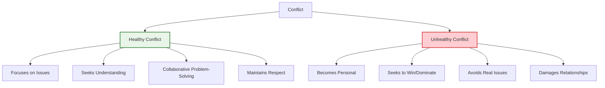

# Conflict Resolution

!!! quote "Conflict Excellence"
    *"Peace cannot be kept by force; it can only be achieved by understanding."*

    **— Albert Einstein**

Conflict is inevitable in software development—competing technical approaches, resource constraints, deadline pressures, and diverse perspectives naturally create friction. As a staff engineer, your ability to identify, understand, and resolve conflicts effectively determines your team's productivity, morale, and long-term success.

## Understanding Technical Conflict

### Sources of Technical Conflict

Common sources of conflict in software development environments:

**Technical Disagreements:**
- Architecture and design approach differences
- Technology choice debates
- Code quality and review standards
- Testing strategy and coverage requirements

**Resource Conflicts:**
- Competing priorities for development time
- Budget allocation for technical improvements
- Staffing and skill allocation across projects
- Infrastructure and tooling resource access

**Process Conflicts:**
- Development methodology preferences
- Release and deployment schedule disagreements
- Code review and approval process debates
- Meeting frequency and format preferences

**Interpersonal Dynamics:**
- Communication style differences
- Experience level and authority perceptions
- Recognition and credit attribution issues
- Work style and preference conflicts

### Healthy vs. Unhealthy Conflict

Distinguish between productive and destructive conflict patterns:

**Healthy Conflict Characteristics:**
- Focus on problems, not personalities
- Seeks mutual understanding and learning
- Maintains professional respect
- Results in better solutions

**Unhealthy Conflict Characteristics:**
- Personal attacks and blame assignment
- Win/lose mentality
- Avoidance of underlying issues
- Relationship damage and team dysfunction

## Conflict Resolution Framework

### The PEACE Method

Systematic approach to resolving conflicts:

**P**repare: Understand the situation and your own perspective
**E**xplore: Listen to all parties and understand their viewpoints
**A**ffirm: Acknowledge valid concerns and emotions
**C**ollaborate: Work together to find mutually acceptable solutions
**E**valuate: Assess outcomes and learn from the process

### Preparation Phase

Before engaging in conflict resolution:

**Situation Analysis:**
- What is the specific conflict about?
- Who are the key parties involved?
- What are the underlying interests vs. stated positions?
- What are the potential consequences of not resolving this?

**Self-Preparation:**
- Examine your own biases and emotional reactions
- Identify your true interests and desired outcomes
- Consider alternative perspectives and solutions
- Plan your approach and communication strategy

### Exploration and Understanding

Gather information and understand all perspectives:

**Active Listening Techniques:**
- Ask open-ended questions to understand concerns
- Paraphrase what you hear to confirm understanding
- Listen for emotions and underlying needs
- Avoid interrupting or rushing to judgment

**Perspective Taking:**
- Understand each party's context and constraints
- Identify shared goals and common ground
- Recognize valid concerns on all sides
- Separate positions from underlying interests

## Communication Techniques

### De-escalation Strategies

Reduce emotional tension and create collaborative atmosphere:

**Emotional Regulation:**
- Remain calm and composed under pressure
- Use a calm, measured tone of voice
- Take breaks if emotions run too high
- Model the behavior you want to see

**Reframing Techniques:**
- Focus on shared goals and objectives
- Reframe conflicts as collaborative problem-solving
- Use "we" language instead of "you" language
- Emphasize learning and improvement opportunities

### Crucial Conversations Framework

Handle high-stakes technical discussions effectively:

**Start with Heart:**
- Clarify what you really want from the conversation
- Identify what you want for yourself, others, and the relationship
- Focus on mutual purpose and respect

**Learn to Look:**
- Watch for safety problems in the conversation
- Notice when people feel unsafe and move to silence or violence
- Monitor your own emotional state and reactions

**Make it Safe:**
- Apologize when you've made mistakes
- Create mutual purpose by finding shared goals
- Use contrasting to fix misunderstandings
- Build safety through respect and shared objectives

### Difficult Conversation Structure

Organize challenging discussions for maximum effectiveness:

**Opening:**
- State your purpose and intentions clearly
- Acknowledge the difficulty of the conversation
- Express your commitment to finding solutions
- Establish ground rules for respectful dialogue

**Body:**
- Present facts objectively without interpretation
- Share your perspective and reasoning
- Listen actively to others' viewpoints
- Explore underlying concerns and interests

**Closing:**
- Summarize agreements and decisions reached
- Identify specific next steps and responsibilities
- Schedule follow-up discussions if needed
- Acknowledge progress and thank participants

## Technical Conflict Resolution

### Architecture Decision Conflicts

Resolve disagreements about technical architecture:

**Decision Framework:**
- Establish clear evaluation criteria upfront
- Document assumptions and trade-offs explicitly
- Use proof-of-concept implementations to test approaches
- Consider long-term maintainability and team capabilities

**Collaborative Evaluation:**
- Involve relevant stakeholders in decision-making
- Use architectural decision records (ADRs) to document reasoning
- Consider multiple alternatives before deciding
- Build consensus around chosen approach

### Code Review Conflicts

Handle disagreements in code review processes:

**Review Standards:**
- Establish clear, documented coding standards
- Focus on objective criteria rather than subjective preferences
- Separate style issues from functional concerns
- Use automated tools to enforce consistent standards

**Constructive Feedback:**
- Provide specific, actionable feedback
- Explain reasoning behind suggestions
- Offer alternative solutions, not just criticism
- Recognize and acknowledge good practices

### Technical Approach Disputes

Mediate disagreements about implementation approaches:

**Evidence-Based Discussion:**
- Gather relevant data and metrics
- Consider performance, maintainability, and scalability implications
- Evaluate team expertise and learning curve requirements
- Assess alignment with existing system architecture

**Experimentation and Validation:**
- Propose spike solutions to test different approaches
- Use time-boxed experiments to evaluate options
- Gather feedback from implementation attempts
- Make decisions based on empirical evidence

## Team Conflict Mediation

### Mediator Role and Responsibilities

When serving as a neutral mediator:

**Neutrality:**
- Remain impartial and avoid taking sides
- Focus on process rather than content decisions
- Help parties communicate effectively
- Facilitate solution generation rather than imposing solutions

**Process Management:**
- Structure discussions for maximum effectiveness
- Ensure all parties have opportunity to be heard
- Keep conversations focused on resolution
- Manage time and energy effectively

### Group Conflict Resolution

Handle conflicts that involve multiple team members:

**Meeting Facilitation:**
- Set clear agenda and objectives for resolution meetings
- Establish ground rules for respectful participation
- Use structured techniques like brainstorming and prioritization
- Document agreements and action items

**Consensus Building:**
- Identify areas of agreement before addressing disagreements
- Use techniques like dot voting or ranking to gauge preferences
- Seek solutions that address core interests of all parties
- Build commitment through participatory decision-making

## Preventive Strategies

### Creating Psychological Safety

Build team environments that reduce destructive conflict:

**Open Communication:**
- Encourage sharing of different perspectives and ideas
- Create regular opportunities for team feedback and discussion
- Address issues early before they escalate
- Model vulnerability and learning from mistakes

**Trust Building:**
- Follow through consistently on commitments
- Admit mistakes and take responsibility for errors
- Give credit generously and share recognition
- Support team members during challenging situations

### Clear Communication Standards

Establish norms that prevent communication conflicts:

**Communication Guidelines:**
- Define preferred communication channels for different types of discussions
- Establish response time expectations for different communication types
- Create standards for meeting effectiveness and participation
- Document important decisions and share them widely

**Feedback Culture:**
- Regular one-on-one discussions between team members and leaders
- Structured retrospectives that address team dynamics
- 360-degree feedback processes for continuous improvement
- Recognition and celebration of collaborative behavior

### Proactive Issue Management

Address potential conflicts before they escalate:

**Regular Check-ins:**
- Scheduled team health discussions
- Individual conversations about concerns and challenges
- Monitoring of team dynamics and collaboration patterns
- Early intervention when issues arise

**Process Improvement:**
- Regular review of team processes and practices
- Adaptation of approaches based on team feedback
- Investment in tools and practices that reduce friction
- Continuous learning about effective collaboration

## Cross-Reference Navigation

**Communication Skills:**
- **[Advanced Conflict Resolution](../leadership/advanced-conflict-resolution.md)** - Advanced techniques for complex conflicts
- **[Communication & Presentation Skills](../leadership/communication-presentation-skills.md)** - Foundational communication skills
- **[Navigating Tough Technical Discussions](../leadership/navigating-tough-technical-discussions.md)** - Technical discussion facilitation

**Team Development:**
- **[Team Formation](team-formation.md)** - Building teams that handle conflict well
- **[Psychological Safety](cultural-transformation-psychological-safety.md)** - Creating safe environments for healthy conflict
- **[Cross-Functional Collaboration](cross-functional-collaboration.md)** - Managing conflicts across teams

**Leadership Applications:**
- **[Influence Without Authority](../leadership/influencing-without-authority.md)** - Building influence through conflict resolution
- **[Working Across Boundaries](../leadership/working-across-boundaries.md)** - Managing conflicts across organizational boundaries

## Further Reading

This chapter draws on conflict resolution research and negotiation theory:

*   **Fisher, Roger, William Ury, and Bruce Patton. *Getting to Yes: Negotiating Agreement Without Giving In*.** Principled negotiation techniques for win-win outcomes.
*   **Patterson, Kerry, Joseph Grenny, Ron McMillan, and Al Switzler. *Crucial Conversations: Tools for Talking When Stakes Are High*.** Framework for handling difficult conversations effectively.
*   **Stone, Douglas, Bruce Patton, and Sheila Heen. *Difficult Conversations: How to Discuss What Matters Most*.** Strategies for navigating challenging interpersonal discussions.
*   **Lencioni, Patrick. *The Five Dysfunctions of a Team*.** Understanding team dynamics that lead to conflict and dysfunction.
*   **Thomas, Kenneth W., and Ralph H. Kilmann. *Thomas-Kilmann Conflict Mode Instrument*.** Assessment tool for understanding personal conflict resolution styles.