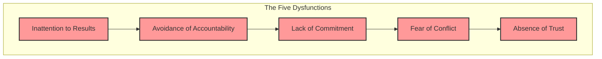

# The Five Dysfunctions of a Team: Diagnosing the Root Cause

## The Scenario

A team you work with is consistently missing its commitments. Their sprint planning meetings seem fine; everyone agrees to the plan. But during the sprint, progress is slow. In the retrospective, no one wants to point fingers, so the same problems happen again next sprint. There's a feeling of apathy and a lack of real debate.

This team is suffering from a classic cascade of failures described by Patrick Lencioni in *The Five Dysfunctions of a Team*. These dysfunctions aren't five separate problems; they are a chain reaction, where one leads directly to the next. As a Staff Engineer, learning to see this pyramid is like having x-ray vision for team dynamics.

## The Pyramid of Dysfunction (from the bottom up)

### 1. Absence of Trust

The root of all dysfunction. This isn't about predicting someone's behavior; it's about being comfortable being vulnerable. On a team without trust, members are afraid to admit mistakes, ask for help, or show their weaknesses.  

**Symptom:** Everyone is guarded. No one says, "I'm in over my head" or "I was wrong."  

### 2. Fear of Conflict

When there's no trust, there can be no healthy, passionate debate about ideas. Conflict is seen as a personal attack. Meetings are boring because there is no real discussion, only "artificial harmony."  

**Symptom:** A lack of vigorous debate. Important topics are avoided. The most common feedback is "looks good to me."  

### 3. Lack of Commitment

Because the team has not engaged in open conflict and debated all the options, individuals don't truly buy into the decisions that are made. They might nod in the meeting, but they haven't committed.  

**Symptom:** Ambiguity about direction and priorities. The same topics are discussed over and over again because no real decision was ever made.  

### 4. Avoidance of Accountability

Since no one is truly committed to the plan, they are unwilling to hold their peers accountable when they see behavior that is counterproductive to the team's goals. It's easier to stay silent than to have a difficult conversation.  

**Symptom:** Low standards. Missed deadlines are tolerated. Mediocrity thrives.  

### 5. Inattention to Results

When no one is holding each other accountable, people tend to focus on their own individual needs (ego, career development, their favorite project) rather than the collective goals of the team.  

**Symptom:** The team loses sight of its objectives and fails to deliver.

## Your Playbook for Building a Functional Team

### To Build Trust

**Lead with vulnerability.** Be the first to admit a mistake or say, "I don't know the answer to that." Share a story about a technical challenge you struggled with. Your vulnerability gives permission for others to be vulnerable.  

### To Master Conflict

**Mine for conflict.** During a design review, if everyone is agreeing, explicitly ask, "What are we missing? What's the biggest risk with this approach?" Assign someone to be the devil's advocate. Remind the team that the goal is the best solution, not consensus.  

### To Achieve Commitment

**Force clarity and closure.** At the end of a discussion, summarize the decision and who is responsible for what. Use a simple phrase: "Do we agree to disagree and commit?" This acknowledges that not everyone has to agree, but everyone has to commit to the chosen path.  

### To Embrace Accountability

**Establish public standards.** Make the team's goals and work visible to everyone. When you see a deviation, have the courage to ask a gentle, public question: "Hey, I noticed we're a bit behind on the API integration. Is there anything the team can do to help?" This makes accountability a shared responsibility.  

### To Focus on Results

**Keep the team's goals front and center.** Start meetings by reminding the team of the key objective for the sprint or quarter. Celebrate collective achievements, not individual heroics.

Fixing a dysfunctional team is not a quick process. It starts at the bottom of the pyramid. By building a foundation of trust, you unlock the team's ability to engage in the healthy conflict necessary to achieve real commitment and, ultimately, real results.
