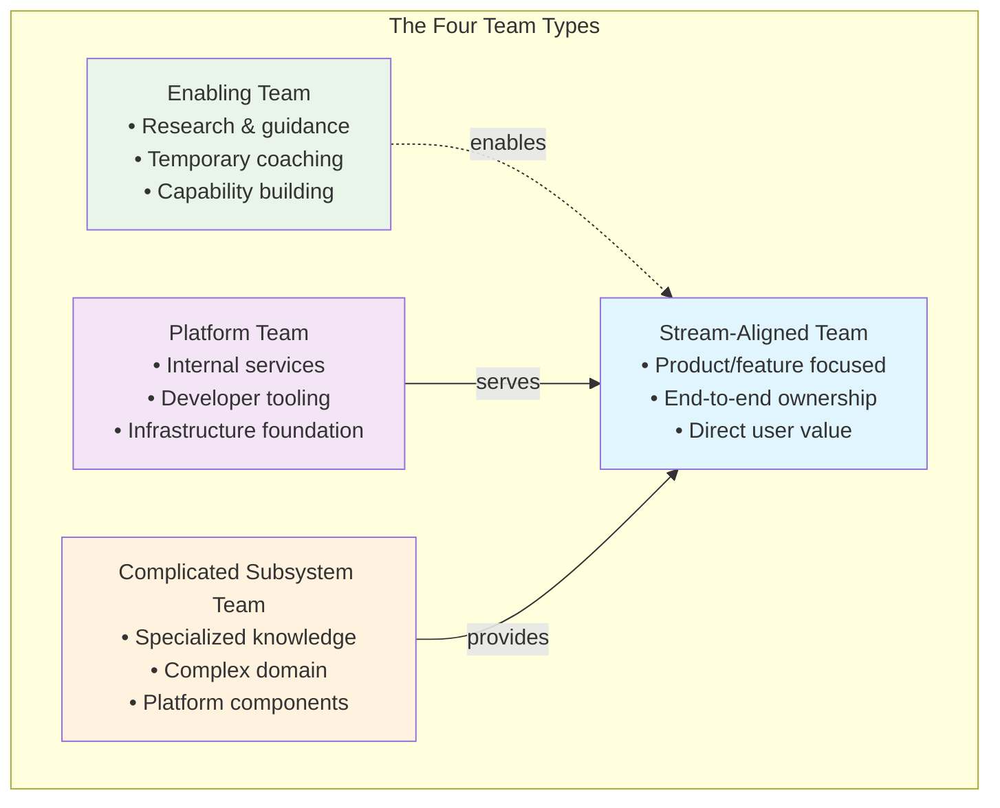
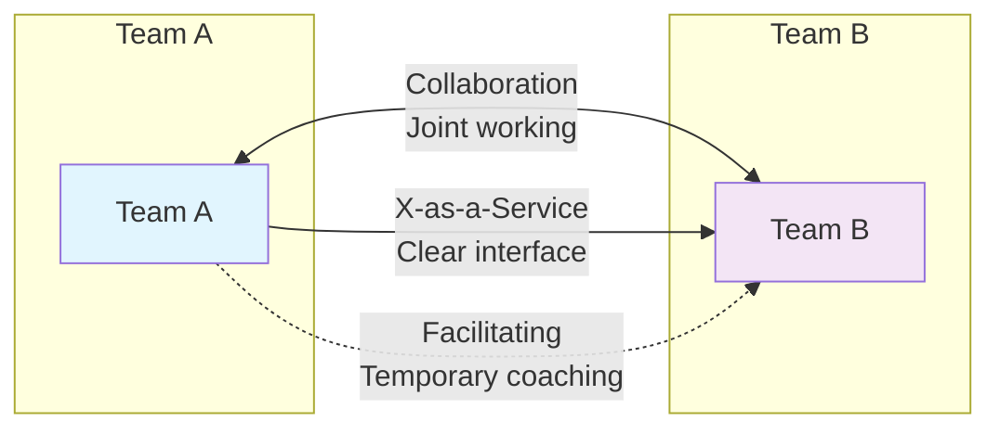
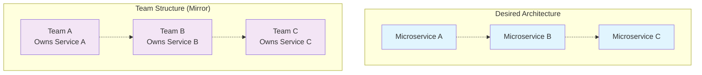

# Organizational Design for Technology Teams

> *"Organizations which design systems... are constrained to produce designs which are copies of the communication structures of these organizations."* - Conway's Law

Here's a scenario you've probably lived through: Your engineering organization has grown from a tight-knit team of 8 engineers who could all fit around a single table to 50+ engineers spread across multiple floors. What used to be quick hallway conversations have become week-long email threads. Simple feature deployments now require coordination across six different teams. Your microservices architecture looks suspiciously like your org chart—which is to say, it's a mess.

Sound familiar? You're experiencing Conway's Law in real time.

As a Staff Engineer, you're uniquely positioned to influence not just what your teams build, but how they're structured to build it. The design of your organization isn't just an HR concern—it's one of the most critical technical decisions you'll make. **The structure of your teams will determine the structure of your systems, whether you plan it or not.**

This section explores how to intentionally design team structures that enable rather than constrain your technical goals. We'll dive deep into research from Matthew Skelton and Manuel Pais, whose groundbreaking work "Team Topologies" provides the clearest framework yet for thinking about organizational design in technology companies.

## The Four Fundamental Team Types

Think about every high-performing engineering organization you've encountered. Despite their differences in size, industry, or technology stack, they all tend to organize around the same four fundamental patterns. Skelton and Pais identified these patterns through extensive research across technology companies, and once you see them, you can't unsee them.

**Here's the key insight**: Most organizational problems in tech companies stem from having too many team types, not too few. The magic happens when you constrain yourself to just these four:

### Stream-Aligned Teams: Your Value Delivery Engine

> **In plain English**: These are the teams that build features users actually see and use.

If you've ever worked at a company where product teams could ship features without waiting for "the platform team" or "the infrastructure team" or "the security team," you've seen a well-functioning stream-aligned team in action. These teams are your primary value delivery mechanism—the ones who turn product ideas into working software that customers love.

**Think of them as end-to-end owners** of a particular slice of user value. A great stream-aligned team can take a feature request on Monday and have it running in production by Friday, without needing approvals, hand-offs, or coordination with other teams.

Here's what makes them special:

**Complete ownership**: They build it, they ship it, they run it. No throwing code over the wall.

**Cross-functional**: All the skills needed for their stream live within the team—frontend, backend, testing, operations, even some design and product sense.

**User-focused metrics**: They measure success by user outcomes, not engineering outputs. Did usage go up? Did customer satisfaction improve? Did the feature solve the problem?

**Your role as a Staff Engineer** is to help these teams succeed by defining clear stream boundaries (what's in their domain vs. what's not), ensuring they have the technical capabilities they need, and ruthlessly removing dependencies that slow them down.

### Platform Teams: The Enablers Behind the Scenes

> **In plain English**: These are the teams that make other engineering teams faster and more effective.

Here's a question that reveals a lot about an organization's maturity: When a product team wants to deploy a new service, do they spend their time writing business logic, or do they spend their time figuring out Kubernetes configurations, setting up monitoring, and wrestling with CI/CD pipelines?

If it's the latter, you need platform teams.

**Platform teams are the unsung heroes** of great engineering organizations. They treat other engineering teams as their customers and build internal products—tools, services, and frameworks—that make everyone else more productive. Think of them as the team behind the team.

The best platform teams understand a crucial truth: **engineering teams don't want to think about infrastructure any more than you want to think about how your electricity gets generated when you flip a light switch.** They want it to just work, reliably and invisibly.

What makes platform teams effective:

**Product mindset**: They don't just build tools, they build *products* with real users (other engineers) who have real problems.

**Adoption metrics**: A platform that nobody uses is just expensive tech debt. They measure success by how many teams adopt their services and how much faster those teams ship.

**Self-service everything**: The goal is to eliminate the "please open a ticket" interactions. Teams should be able to provision infrastructure, deploy services, and get monitoring without talking to anyone.

**Your role as a Staff Engineer** is to define the platform strategy (what should be standardized vs. what teams should choose freely), ensure the platform evolves based on real team needs, and maintain that delicate balance between consistency and autonomy.

### Enabling Teams: The Consultants and Teachers

> **In plain English**: These are the experts who help other teams level up their skills and overcome specific challenges.

Picture this: Your stream-aligned teams are humming along nicely, shipping features and delighting users. But then you realize that none of them really understand security testing, or they're all struggling with performance optimization, or they need to learn a new technology that's critical to the company's future.

You could hire security experts for every team (expensive and probably impossible), or you could create an enabling team of security specialists who work with each team temporarily to build that capability.

**Enabling teams are like internal consultants with a twist**: their success is measured not by how indispensable they become, but by how quickly they can make themselves unnecessary. They're teachers and coaches, not service providers.

The magic happens in how they work:

**Teaching, not doing**: They don't take over the work—they pair with team members to build skills and knowledge that persist after they leave.

**Temporary by design**: Engagements typically last weeks or months, not years. If an enabling team is still "helping" the same team a year later, something's wrong.

**Capability focused**: They're not just solving today's problem; they're building the team's ability to solve similar problems in the future.

**Your role as a Staff Engineer** is to spot capability gaps across teams (often you're the one who can see patterns across the organization), coordinate enabling team interventions, and most importantly, ensure that knowledge actually transfers and sticks.

### Complicated Subsystem Teams: The Deep Specialists

> **In plain English**: These are the teams that handle the really gnarly technical stuff that would bog down everyone else.

Every system has that one component that makes everyone's eyes glaze over when you mention it. Maybe it's the machine learning inference engine that requires deep knowledge of statistical models and linear algebra. Maybe it's the real-time video processing pipeline that needs to squeeze every millisecond of latency out of custom hardware. Or maybe it's the payment processing system that has to navigate the Byzantine world of international banking regulations.

**These are the subsystems that, if you tried to distribute their ownership across stream-aligned teams, would grind your entire engineering organization to a halt.** Not because your engineers aren't smart, but because cognitive load is real and finite.

Complicated subsystem teams are the specialists who own these intricate pieces:

**Deep domain expertise**: They have the mathematical, scientific, or regulatory knowledge needed to make sense of the complexity.

**Interface masters**: They hide complexity behind clean, well-documented APIs so other teams can use their subsystem without understanding its internals.

**Performance obsessed**: They measure success by subsystem reliability, performance, and how well they enable other teams to build on top of their work.

The key insight here is **when to use them**. Not everything needs a complicated subsystem team—most complexity can and should be handled within stream-aligned teams. But when you encounter true irreducible complexity that requires specialized knowledge, these teams prevent that complexity from spreading throughout your organization.

**Your role as a Staff Engineer** is to identify when complexity truly requires separation (vs. when it's just unfamiliar), help define clean interfaces that hide the complexity, and ensure the subsystem continues to evolve in ways that support broader system goals.

## How Teams Talk to Each Other Matters More Than You Think

Having the right team types is only half the battle. The other half is understanding how teams should interact with each other. Get this wrong, and even perfectly structured teams will struggle. Get it right, and you'll see productivity and satisfaction soar across your entire engineering organization.

**Here's what most people miss**: the interaction mode between two teams is just as important as the teams themselves. Skelton and Pais identified three fundamental ways teams can interact, and knowing which to use when is the difference between smooth collaboration and organizational friction.

### Collaboration Mode: Working Side by Side

> **When to use**: When you're figuring things out together, boundaries are unclear, or you need rapid innovation.

Think of collaboration mode as two teams sharing a workspace and a mission. They're in constant communication, making joint decisions, and sharing responsibility for outcomes. It's intense, it's high-bandwidth, and it's perfect for those moments when you need to move fast and learn quickly.

**This is what happens** when you put two teams in collaboration mode:
- Daily standups become joint standups
- Architecture decisions are made together
- Success and failure are shared equally
- Everyone's calendar fills up with cross-team meetings

**The trade-off is real**: you get rapid learning and innovation, but you also get high cognitive load and communication overhead. Use collaboration mode when discovery and speed matter more than efficiency.

### X-as-a-Service Mode: The Professional Handoff

> **When to use**: When interfaces are clear, domains are well-understood, and teams need autonomy.

This is the holy grail of team interactions—one team provides a well-defined service to another with minimal ongoing communication. Think of how you use AWS: you don't have daily meetings with the EC2 team, you just use their APIs and trust they'll meet their SLAs.

**What makes this work**:
- Crystal-clear contracts and interfaces
- Comprehensive documentation that actually gets maintained
- Reliable SLAs and monitoring
- Minimal communication needed for day-to-day operations

**The beauty of X-as-a-Service** is that both teams can operate independently, with maximum autonomy and minimal coordination overhead. But it only works when the service boundaries are mature and well-understood.

### Facilitating Mode: The Temporary Partnership

> **When to use**: When one team needs to build capability, transfer knowledge, or overcome specific obstacles.

Facilitating mode is like having a mentor relationship between teams. One team (usually an enabling team) temporarily partners with another to build skills, solve problems, or implement new practices.

**The key word is temporary**. If a facilitating relationship lasts more than a few months, something's gone wrong. The goal is always to transfer knowledge and capabilities, not create dependencies.

**What success looks like**: The facilitated team can handle similar challenges independently in the future, and the enabling team moves on to help other teams.

## Conway's Law and Organizational Design

Conway's Law states that system design reflects organizational communication patterns. This means:

- **Monolithic organizations produce monolithic software**
- **Siloed teams create tightly coupled systems**
- **Poor team communication results in brittle interfaces**

As a Staff Engineer, you can use this law intentionally:

### The Inverse Conway Maneuver
Design your team structure to promote the architecture you want:

## Cognitive Load Management

Every team has a limited cognitive capacity. Effective organizational design manages three types of cognitive load:

### Intrinsic Load
The effort of processing information inherent to the problem itself.

**Staff Engineer Strategy:** Help teams focus on their core domain by reducing unnecessary complexity.

### Extraneous Load  
The effort of processing information that isn't directly relevant to the main task.

**Staff Engineer Strategy:** Eliminate bureaucracy, simplify tooling, and remove unnecessary process overhead.

### Germane Load
The effort of processing information that contributes to building long-term capabilities.

**Staff Engineer Strategy:** Invest in practices that build team capability (documentation, knowledge sharing, skill development).

## Systems Thinking for Organizational Design

### Understanding Organizations as Living Systems

Here's something most engineering leaders miss: organizations aren't machines that you can fix by replacing broken parts—they're living systems that adapt, evolve, and respond to changes in ways that often surprise us. Peter Senge's work on organizational learning reveals that the most persistent problems in engineering organizations aren't caused by external forces or individual incompetence, but by the underlying systems and structures that we've created ourselves.

Think about the last organizational problem you tried to solve. Maybe teams were duplicating work, or communication was breaking down between engineering and product, or technical debt kept accumulating despite everyone's best intentions. You probably focused on the immediate symptoms: implemented new processes, reorganized teams, or sent people to training. But did the fundamental problems actually get solved, or did they just pop up in new forms?

That's the nature of systems problems—they resist quick fixes because the underlying structures that create them remain unchanged.

**Leverage Points in Engineering Organizations**

Senge identified twelve leverage points where small changes can produce big improvements in system behavior. For Staff Engineers designing team structures, the most powerful leverage points are:

**Mental Models and Paradigms**

The deepest leverage point is shifting how people think about the organization itself. Instead of viewing engineering teams as interchangeable resources to be optimized, what if we saw them as complex adaptive systems that need the right conditions to flourish?

This shift changes everything. Instead of asking "How can we make teams work harder?" you ask "What structural conditions enable teams to do their best work?" Instead of optimizing for resource utilization, you optimize for flow and learning capability. Instead of standardizing everything, you create diversity within coherent frameworks.

**System Structure and Power Distribution**

The second-highest leverage point is changing who has power to make decisions. Traditional engineering organizations concentrate architectural decisions at the top, creating bottlenecks and disconnecting decision-makers from the daily reality of implementation.

Team Topologies suggests a different model: distribute architectural decision-making to the teams closest to the problems, but within clear boundaries and principles. Stream-aligned teams get autonomy over their implementation details, but they operate within platform standards and architectural constraints. This isn't chaos—it's structured autonomy that enables both speed and coherence.

**Information Flow and Feedback Loops**

Most engineering organizations have terrible feedback loops. By the time leadership realizes that a team structure isn't working, months of productivity have been lost and team morale has suffered. By the time teams realize their technical decisions are creating problems for other teams, those problems have already become embedded in production systems.

Systems thinking emphasizes creating fast, accurate feedback loops throughout the organization. This might mean regular cross-team retrospectives, real-time metrics that show the health of team interactions, or architectural fitness functions that alert teams when system boundaries are being violated.

**Learning from System Archetypes**

Engineering organizations tend to fall into predictable patterns of dysfunction—what Senge calls "system archetypes." Recognizing these patterns helps you address root causes rather than just symptoms:

**Fixes That Fail**

You implement a new process to solve a team coordination problem. Initially, it helps—people follow the process, and coordination improves. But over time, the process becomes bureaucratic overhead. People find workarounds, exception cases multiply, and you end up with less coordination than you started with, plus additional process complexity.

**Sound familiar?** This archetype shows up constantly in engineering organizations. The solution isn't better processes—it's designing team structures that need less coordination in the first place.

**Limits to Growth**

Your engineering team is productive, so you hire more engineers to be even more productive. But as the team grows, communication overhead increases exponentially. What used to be quick hallway conversations become week-long email threads. The team gets slower, not faster.

Instead of just adding people, systems thinking suggests examining the underlying structures that enable or constrain productivity as teams scale.

**Tragedy of the Commons**

Every team optimizes for their local goals, but these local optimizations create system-wide problems. The mobile team caches aggressively to improve their performance, overwhelming the API team. The API team adds rate limiting to protect their services, slowing down the web team. The web team implements client-side workarounds that create data consistency issues for the mobile team.

The solution isn't better coordination—it's aligning team incentives with system-wide outcomes.

## Organizational Evolution Patterns

Organizations aren't static. They evolve as businesses and technologies change. Common evolution patterns include:

### Start-up to Scale-up
**Pattern:** Single team → Multiple stream-aligned teams + emerging platform needs

**Staff Engineer Role:** Help identify when to split teams and what platform capabilities to build.

### Monolith to Microservices
**Pattern:** Single large team → Multiple service teams with clear boundaries

**Staff Engineer Role:** Define service boundaries that align with team boundaries and business capabilities.

### Platform Emergence
**Pattern:** Duplicated infrastructure → Dedicated platform team

**Staff Engineer Role:** Identify common needs across teams and advocate for platform investment.

## Assessment Framework: Team Topology Health Check

Use this framework to evaluate your current team structure:

### Stream Team Health
- [ ] Can deploy independently without coordinating with other teams
- [ ] Has all skills needed for their value stream  
- [ ] Clear understanding of user needs and business metrics
- [ ] Owns their services in production

### Platform Team Health
- [ ] Treats other teams as customers, not users
- [ ] Provides self-service capabilities
- [ ] Measures success by stream team adoption and satisfaction
- [ ] Maintains clear APIs and backwards compatibility

### Team Interaction Health
- [ ] Clear understanding of interaction modes with other teams
- [ ] Communication patterns match intended architecture
- [ ] Regular assessment of interaction effectiveness
- [ ] Evolution of interaction modes based on learning

### Cognitive Load Health
- [ ] Teams can handle their assigned responsibilities
- [ ] Minimal context switching between unrelated domains
- [ ] Clear ownership boundaries reduce coordination overhead
- [ ] Regular assessment of team workload and complexity

## Implementation Guidance for Staff Engineers

### 1. Start with Stream Identification
Map your business capabilities and user value streams. This becomes the foundation for team design.

### 2. Apply Team First Thinking
Design teams before architecture. Let team boundaries influence system boundaries.

### 3. Evolve Interaction Modes
Start with collaboration for discovery, evolve to X-as-a-Service for stability.

### 4. Monitor and Adjust
Regularly assess team health and interaction effectiveness. Organizational design is never "done."

### 5. Invest in Enabling Capabilities
Build enabling team capabilities to help stream teams overcome obstacles and acquire new skills.

## Common Anti-Patterns to Avoid

### The Feature Factory
**Problem:** Teams optimized for output rather than outcomes
**Solution:** Focus stream teams on user value and business results

### The Ivory Tower Platform
**Problem:** Platform teams that don't understand user needs
**Solution:** Treat platform as a product with engineering teams as customers

### The Eternal Collaboration
**Problem:** Teams that never evolve beyond collaboration mode  
**Solution:** Intentionally evolve to X-as-a-Service when appropriate

### The Skill Silo
**Problem:** Teams organized by technology rather than value stream
**Solution:** Cross-functional teams aligned to business capabilities

## Key Takeaways

1. **Organizational design is a technical decision** that directly impacts software architecture and delivery capability
2. **Four team types** provide a foundation for scalable organization design
3. **Three interaction modes** enable appropriate coordination between teams
4. **Conway's Law** can be used intentionally to promote desired architecture
5. **Cognitive load management** is essential for team effectiveness
6. **Evolution patterns** help navigate organizational growth and change

## Further Reading

- Skelton, Matthew, and Manuel Pais. *Team Topologies: Organizing Business and Technology Teams for Fast Flow*. 2019.
- Conway, Melvin E. "How Do Committees Invent?" *Datamation* 14, no. 4 (1968): 28-31.
- Miller, George A. "The Magical Number Seven, Plus or Minus Two." *Psychological Review* 63, no. 2 (1956): 81-97.