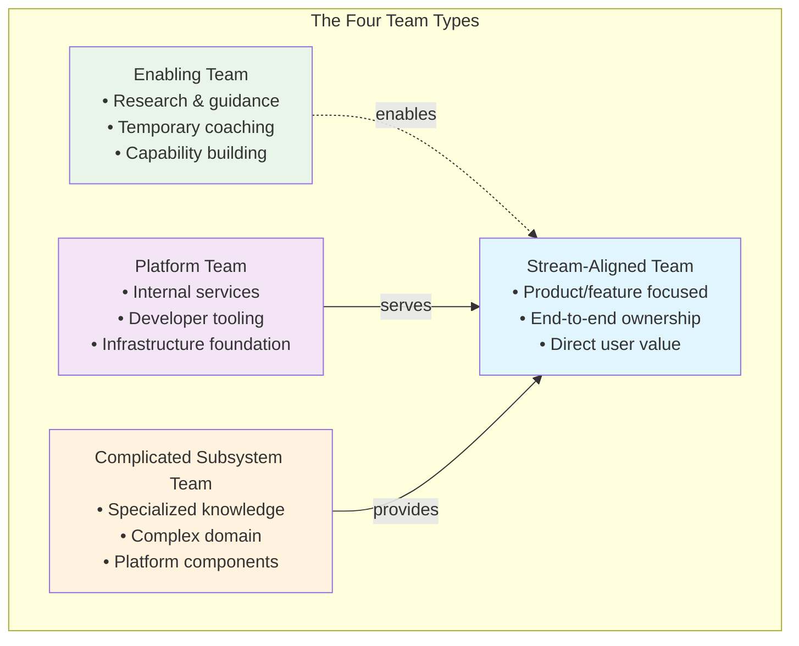
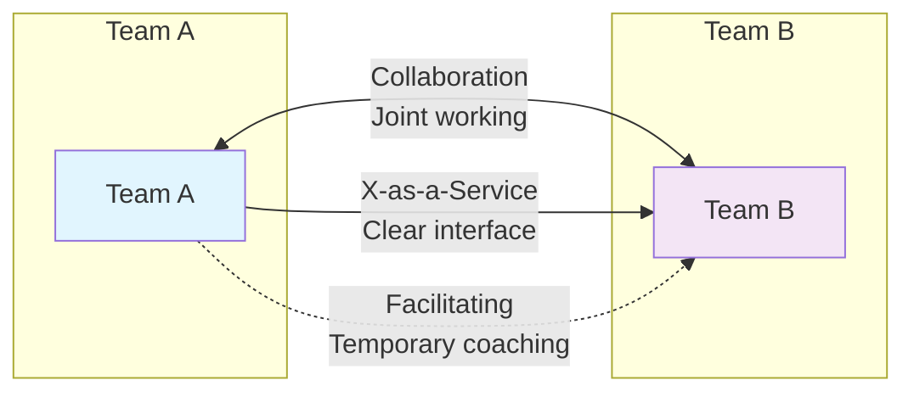
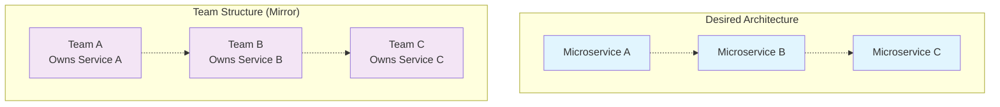

# Organizational Design for Technology Teams

> *"Organizations which design systems... are constrained to produce designs which are copies of the communication structures of these organizations."* - Conway's Law

As a Staff Engineer, you're uniquely positioned to influence how teams are structured and how they interact. The design of your organization isn't just an HR concern—it's a critical technical decision that directly impacts your software architecture, delivery speed, and team effectiveness. This section explores how to intentionally design team structures that enable rather than constrain your technical goals.

## The Four Fundamental Team Types

Based on research from Matthew Skelton and Manuel Pais in "Team Topologies," there are four fundamental team types that form the backbone of effective technology organizations:

### Stream-Aligned Teams
**Purpose:** Deliver a continuous flow of value to users
**Focus:** End-to-end responsibility for a product, service, or set of features

Stream-aligned teams are your primary value delivery mechanism. They should be able to build, test, deploy, and operate their services with minimal hand-offs to other teams.

**Key Characteristics:**
- Cross-functional with all skills needed for their stream
- Direct relationship with users and business stakeholders  
- Owns the full lifecycle from conception to retirement
- Measures success by user and business outcomes

**Staff Engineer Role:** Help define appropriate stream boundaries, ensure teams have necessary capabilities, and remove dependencies that slow delivery.

### Platform Teams
**Purpose:** Provide compelling internal products that accelerate stream-aligned teams
**Focus:** Developer experience, infrastructure, and foundational services

Platform teams treat other engineering teams as their customers. They provide self-service capabilities that reduce cognitive load for stream-aligned teams.

**Key Characteristics:**
- Product thinking applied to internal tools and services
- Strong focus on usability and developer experience
- Maintains backwards compatibility and clear APIs
- Measures success by stream team adoption and velocity

**Staff Engineer Role:** Define platform strategy, ensure platform evolution aligns with stream team needs, and maintain balance between platform standardization and team autonomy.

### Enabling Teams
**Purpose:** Help stream-aligned teams overcome obstacles and acquire new capabilities
**Focus:** Research, coaching, and knowledge transfer

Enabling teams are specialists who work closely with stream-aligned teams to build capabilities and solve complex problems.

**Key Characteristics:**
- Deep expertise in specific areas (security, performance, testing)
- Temporary engagement model (weeks to months)
- Focus on upskilling and knowledge transfer
- Dissolves when capability is established

**Staff Engineer Role:** Identify capability gaps across teams, coordinate enabling team interventions, and ensure knowledge transfer is effective.

### Complicated Subsystem Teams
**Purpose:** Build and maintain subsystems requiring specialized knowledge
**Focus:** Complex algorithms, domain-specific components, or performance-critical systems

These teams handle subsystems that would overwhelm stream-aligned teams with cognitive load.

**Key Characteristics:**
- Deep expertise in mathematical, scientific, or domain-specific areas
- Provides well-defined interfaces to hide complexity
- Long-lived subsystem ownership
- Measures success by subsystem reliability and performance

**Staff Engineer Role:** Identify when complexity requires separation, define clear interfaces, and ensure subsystem evolution supports broader system goals.

## Team Interaction Modes

Teams don't operate in isolation. The way they interact determines the health of your overall system. There are three fundamental interaction modes:

### Collaboration Mode
**When to Use:** Rapid discovery, uncertainty about boundaries, need for high innovation

Teams work closely together on shared goals, with frequent communication and joint decision-making.

**Characteristics:**
- High communication overhead
- Shared responsibility for outcomes
- Rapid learning and adaptation
- Higher cognitive load

### X-as-a-Service Mode  
**When to Use:** Clear interfaces, well-understood domains, need for team autonomy

One team provides a service to another with minimal communication required.

**Characteristics:**
- Low communication overhead
- Clear API contracts and SLAs
- High team autonomy
- Predictable interactions

### Facilitating Mode
**When to Use:** Capability building, knowledge transfer, temporary skill gaps

One team helps another overcome obstacles or acquire new capabilities.

**Characteristics:**
- Temporary interaction pattern
- Focus on knowledge transfer
- Goal of team independence
- Enabling team expertise

## Conway's Law and Organizational Design

Conway's Law states that system design reflects organizational communication patterns. This means:

- **Monolithic organizations produce monolithic software**
- **Siloed teams create tightly coupled systems**
- **Poor team communication results in brittle interfaces**

As a Staff Engineer, you can use this law intentionally:

### The Inverse Conway Maneuver
Design your team structure to promote the architecture you want:

## Cognitive Load Management

Every team has a limited cognitive capacity. Effective organizational design manages three types of cognitive load:

### Intrinsic Load
The effort of processing information inherent to the problem itself.

**Staff Engineer Strategy:** Help teams focus on their core domain by reducing unnecessary complexity.

### Extraneous Load  
The effort of processing information that isn't directly relevant to the main task.

**Staff Engineer Strategy:** Eliminate bureaucracy, simplify tooling, and remove unnecessary process overhead.

### Germane Load
The effort of processing information that contributes to building long-term capabilities.

**Staff Engineer Strategy:** Invest in practices that build team capability (documentation, knowledge sharing, skill development).

## Organizational Evolution Patterns

Organizations aren't static. They evolve as businesses and technologies change. Common evolution patterns include:

### Start-up to Scale-up
**Pattern:** Single team → Multiple stream-aligned teams + emerging platform needs

**Staff Engineer Role:** Help identify when to split teams and what platform capabilities to build.

### Monolith to Microservices
**Pattern:** Single large team → Multiple service teams with clear boundaries

**Staff Engineer Role:** Define service boundaries that align with team boundaries and business capabilities.

### Platform Emergence
**Pattern:** Duplicated infrastructure → Dedicated platform team

**Staff Engineer Role:** Identify common needs across teams and advocate for platform investment.

## Assessment Framework: Team Topology Health Check

Use this framework to evaluate your current team structure:

### Stream Team Health
- [ ] Can deploy independently without coordinating with other teams
- [ ] Has all skills needed for their value stream  
- [ ] Clear understanding of user needs and business metrics
- [ ] Owns their services in production

### Platform Team Health
- [ ] Treats other teams as customers, not users
- [ ] Provides self-service capabilities
- [ ] Measures success by stream team adoption and satisfaction
- [ ] Maintains clear APIs and backwards compatibility

### Team Interaction Health
- [ ] Clear understanding of interaction modes with other teams
- [ ] Communication patterns match intended architecture
- [ ] Regular assessment of interaction effectiveness
- [ ] Evolution of interaction modes based on learning

### Cognitive Load Health
- [ ] Teams can handle their assigned responsibilities
- [ ] Minimal context switching between unrelated domains
- [ ] Clear ownership boundaries reduce coordination overhead
- [ ] Regular assessment of team workload and complexity

## Implementation Guidance for Staff Engineers

### 1. Start with Stream Identification
Map your business capabilities and user value streams. This becomes the foundation for team design.

### 2. Apply Team First Thinking
Design teams before architecture. Let team boundaries influence system boundaries.

### 3. Evolve Interaction Modes
Start with collaboration for discovery, evolve to X-as-a-Service for stability.

### 4. Monitor and Adjust
Regularly assess team health and interaction effectiveness. Organizational design is never "done."

### 5. Invest in Enabling Capabilities
Build enabling team capabilities to help stream teams overcome obstacles and acquire new skills.

## Common Anti-Patterns to Avoid

### The Feature Factory
**Problem:** Teams optimized for output rather than outcomes
**Solution:** Focus stream teams on user value and business results

### The Ivory Tower Platform
**Problem:** Platform teams that don't understand user needs
**Solution:** Treat platform as a product with engineering teams as customers

### The Eternal Collaboration
**Problem:** Teams that never evolve beyond collaboration mode  
**Solution:** Intentionally evolve to X-as-a-Service when appropriate

### The Skill Silo
**Problem:** Teams organized by technology rather than value stream
**Solution:** Cross-functional teams aligned to business capabilities

## Key Takeaways

1. **Organizational design is a technical decision** that directly impacts software architecture and delivery capability
2. **Four team types** provide a foundation for scalable organization design
3. **Three interaction modes** enable appropriate coordination between teams
4. **Conway's Law** can be used intentionally to promote desired architecture
5. **Cognitive load management** is essential for team effectiveness
6. **Evolution patterns** help navigate organizational growth and change

## Further Reading

- Skelton, Matthew, and Manuel Pais. *Team Topologies: Organizing Business and Technology Teams for Fast Flow*. 2019.
- Conway, Melvin E. "How Do Committees Invent?" *Datamation* 14, no. 4 (1968): 28-31.
- Miller, George A. "The Magical Number Seven, Plus or Minus Two." *Psychological Review* 63, no. 2 (1956): 81-97.