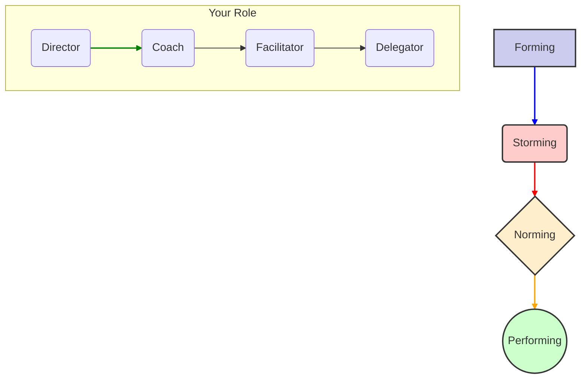

# Team Formation: Navigating the Tides of Team Dynamics

> *"The goal is a team, and the team must be greater than the sum of its parts. But the team doesn't exist until it's formed, and it can't perform until it's been through the storm."*

## The Scenario

A new team has been formed to tackle a high-priority greenfield project. The first two weeks are a honeymoon period. Everyone is polite, excited, and agreeable. But by week three, cracks appear. Two senior engineers are clashing over the choice of a database. The product manager is getting frustrated by the lack of clear timelines. Meetings are becoming tense and unproductive. The team's manager is worried the team is "broken."  

The team isn't broken; it's just following a predictable pattern. But as a Staff Engineer, you need to consider two complementary perspectives: **what type of team** you're forming and **what developmental stage** they're in. The structure and purpose of your team (informed by Team Topologies) determines how you approach their natural development stages (described by Tuckman's model).

## Team Type Determines Formation Strategy

Before diving into team development stages, it's crucial to understand what type of team you're forming. Different team types require different formation approaches:

### Stream-Aligned Teams
**Formation Focus:** End-to-end capability building and user value alignment

These teams need cross-functional skills and direct connection to user outcomes. During formation, emphasize:
- **Skills diversity:** Ensure all capabilities needed for the value stream
- **User connection:** Early and regular contact with actual users
- **Outcome orientation:** Focus on business results, not just technical delivery

### Platform Teams  
**Formation Focus:** Customer empathy and product thinking

Platform teams serve other engineering teams. During formation, emphasize:
- **Customer research:** Understanding developer pain points and needs
- **Product mindset:** Treating internal tools as products with real users
- **Service excellence:** Building for reliability, usability, and backwards compatibility

### Enabling Teams
**Formation Focus:** Teaching and knowledge transfer capabilities

These teams exist to build capability in other teams. During formation, emphasize:
- **Pedagogical skills:** Not just expertise, but ability to teach and coach
- **Temporary mindset:** Success means making yourself unnecessary
- **Systemic thinking:** Understanding problems across the organization

### Complicated Subsystem Teams
**Formation Focus:** Deep expertise and clear interface design

These teams manage complex, specialized domains. During formation, emphasize:
- **Domain expertise:** Deep knowledge in the specialized area
- **Interface thinking:** Ability to hide complexity behind clean APIs  
- **Collaboration skills:** Working effectively with stream teams that depend on them

## The Four Stages

### 1. Forming (The Honeymoon)

The team is new. Members are polite, anxious, and guarded. They are focused on understanding the scope of the work and their role in it. Productivity is generally low as everyone is finding their footing.  

**Characterized by:** High dependence on the leader for guidance, unclear roles, and a focus on avoiding conflict.  

### 2. Storming (The Conflict)

This is the most difficult stage. Team members begin to push against the boundaries established in the forming stage. Conflict erupts over technical approaches, working styles, and team processes. Some teams get stuck here and fail.  

**Characterized by:** Disagreements, power struggles, frustration, and a drop in morale. This stage is stressful but *necessary* for growth.  

### 3. Norming (The Resolution)

The team starts to resolve its differences. They establish agreed-upon processes, roles are clarified, and a sense of team identity emerges. Members begin to trust each other and appreciate their differences.  

**Characterized by:** Increased cooperation, constructive feedback, and the development of team-specific norms (e.g., "how we run our stand-ups," "how we do code reviews").  

### 4. Performing (The High-Performance State)

The team is strategically aware and operates with a high degree of autonomy and trust. They can handle conflict constructively and are focused on achieving their goals. This is the target state.  

**Characterized by:** Shared leadership, efficient decision-making, and a focus on continuous improvement.

## Your Playbook for Navigating the Stages

### When your team is Forming

**Your Role: The Director.** Provide extreme clarity. Over-communicate the team's mission, goals, and individual roles. Facilitate introductions and create low-stakes opportunities for the team to get to know each other. Don't mistake politeness for alignment.  

### When your team is Storming

**Your Role: The Coach.** Do not try to suppress conflict; facilitate it. Help team members argue constructively. Mediate disagreements by focusing the conversation on shared goals and objective data, not on personalities. Reinforce the value of different perspectives. This is where you might use frameworks like Labeling ("It seems like you're concerned about long-term scalability, and you're worried about shipping on time. Both are valid. Let's explore that.").  

### When your team is Norming

**Your Role: The Facilitator.** Help the team solidify its processes. This is the perfect time to introduce and champion practices like Architecture Decision Records (ADRs), team-owned coding standards, or a formal process for on-call rotations. Step back and let the team take more ownership of its own governance.  

### When your team is Performing

**Your Role: The Delegator.** Get out of the way. Trust the team to make decisions. Your job now is to protect them from external distractions, bring them new challenges to keep them engaged, and celebrate their successes. Focus on mentoring the next generation of leaders within the team.

## Team Interaction Patterns During Formation

As teams develop, their interaction patterns with other teams also evolve. Understanding these patterns helps you guide healthy inter-team relationships:

### Collaboration → X-as-a-Service Evolution
**Early Formation (Forming/Storming):** Teams typically need **collaboration mode** with related teams
- High communication for shared discovery
- Joint problem-solving and learning
- Flexible boundaries and shared responsibility

**Later Development (Norming/Performing):** Teams can evolve to **X-as-a-Service mode**
- Clear interfaces and contracts
- Reduced communication overhead  
- Independent delivery cadences

### Facilitating Mode for Capability Building
**Throughout Formation:** **Facilitating mode** with enabling teams
- Temporary coaching and knowledge transfer
- Skill building and capability development
- Goal of eventual independence

## Cognitive Load Considerations

Different team types have different cognitive load patterns that affect their formation:

### Stream-Aligned Teams
- **High intrinsic load:** Complex business domain and user needs
- **Staff Engineer Role:** Reduce extraneous load through tooling and process simplification
- **Formation Goal:** Build germane load through domain expertise

### Platform Teams
- **High germane load:** Building reusable capabilities and abstractions
- **Staff Engineer Role:** Shield from business domain complexity
- **Formation Goal:** Focus cognitive capacity on developer experience

### Enabling Teams  
- **Variable load:** Adapts to the teams they're helping
- **Staff Engineer Role:** Ensure clear engagement boundaries
- **Formation Goal:** Develop teaching and knowledge transfer skills

## Enhanced Playbook: Team Type + Development Stage

### Stream-Aligned Team Formation

**Forming Stage:**
- **Director Role:** Establish clear value stream boundaries and user connection
- **Key Actions:** User research, outcome metric definition, cross-functional skill assessment
- **Interaction Mode:** Collaboration with related teams for boundary discovery

**Storming Stage:**  
- **Coach Role:** Facilitate conflicts around user needs vs. technical constraints
- **Key Actions:** User feedback sessions, outcome-driven decision frameworks
- **Interaction Mode:** Continue collaboration but start defining service boundaries

**Norming Stage:**
- **Facilitator Role:** Help establish delivery practices and user feedback loops
- **Key Actions:** Service ownership definition, monitoring and alerting setup
- **Interaction Mode:** Evolve to X-as-a-Service with platform teams

**Performing Stage:**
- **Delegator Role:** Trust team to optimize their own value delivery
- **Key Actions:** Advanced outcome tracking, innovation time, mentoring others
- **Interaction Mode:** Stable X-as-a-Service, occasional collaboration for innovation

### Platform Team Formation

**Forming Stage:**
- **Director Role:** Establish internal customer research and product thinking
- **Key Actions:** Developer experience audits, internal customer interviews
- **Interaction Mode:** Heavy collaboration with stream teams to understand needs

**Storming Stage:**
- **Coach Role:** Facilitate tension between standardization and flexibility  
- **Key Actions:** Trade-off frameworks, technical decision records
- **Interaction Mode:** Collaboration continues but start service definition

**Norming Stage:**
- **Facilitator Role:** Help establish platform service standards and SLAs
- **Key Actions:** Self-service capability development, documentation systems
- **Interaction Mode:** Transition to X-as-a-Service with clear APIs

**Performing Stage:**
- **Delegator Role:** Trust team to evolve platform based on customer needs
- **Key Actions:** Advanced analytics, platform strategy, ecosystem thinking
- **Interaction Mode:** Primarily X-as-a-Service, strategic collaboration for roadmap

## Team Formation Anti-Patterns

### The Skill Mismatch
**Problem:** Team type doesn't match member capabilities
**Example:** Putting pure technologists on a stream-aligned team that needs business domain expertise
**Solution:** Assess and adjust team composition or provide enabling team support

### The Eternal Collaboration
**Problem:** Teams that never evolve beyond collaboration mode
**Example:** Stream teams that can't deploy without coordinating with platform teams
**Solution:** Intentional evolution to X-as-a-Service through clear interfaces

### The Premature Service Boundary  
**Problem:** Defining rigid interfaces before teams understand their domain
**Example:** Creating APIs during forming stage when requirements are still unclear
**Solution:** Allow collaboration mode during early stages, evolve boundaries with understanding

### The Cognitive Overload
**Problem:** Assigning too much complexity to a single team
**Example:** Stream team responsible for business logic, infrastructure, and specialized algorithms
**Solution:** Use complicated subsystem teams for specialized areas, platform teams for infrastructure

## Assessment Framework: Team Formation Health

Use this checklist to evaluate team formation progress:

### Team Type Clarity
- [ ] Clear understanding of team type (stream, platform, enabling, complicated subsystem)
- [ ] Team composition matches team type requirements
- [ ] Success metrics align with team type purpose
- [ ] Interaction patterns appropriate for team type

### Development Stage Health
- [ ] Recognition of current Tuckman stage (forming, storming, norming, performing)
- [ ] Leadership approach matches current stage needs
- [ ] Conflicts are being addressed constructively (during storming)
- [ ] Team autonomy growing appropriately through stages

### Cognitive Load Management
- [ ] Team's cognitive load is appropriate for their capacity
- [ ] Clear boundaries reduce unnecessary complexity
- [ ] Focus on intrinsic load related to team's core purpose
- [ ] Support systems reduce extraneous load

### Interaction Mode Evolution
- [ ] Appropriate interaction modes with other teams
- [ ] Evolution from collaboration to X-as-a-Service where appropriate
- [ ] Clear interfaces and contracts with dependent teams
- [ ] Regular assessment of interaction effectiveness

Recognizing these stages and team types allows you to be a thermostat, not a thermometer. You don't just reflect the team's temperature; you actively regulate it, guiding them through the inevitable storms while building the right organizational structure for high performance.

## Key Takeaways

1. **Team formation requires both developmental and structural thinking** - consider Tuckman stages AND Team Topologies
2. **Different team types need different formation strategies** - platform teams need product thinking, stream teams need user connection  
3. **Interaction modes should evolve** as teams develop from collaboration through to X-as-a-Service
4. **Cognitive load management** is crucial for effective team formation
5. **Staff Engineers are organizational thermostats** - actively shaping team development, not just observing

## Further Reading

- Tuckman, Bruce W. "Developmental Sequence in Small Groups." *Psychological Bulletin* 63, no. 6 (1965): 384-399.
- Skelton, Matthew, and Manuel Pais. *Team Topologies: Organizing Business and Technology Teams for Fast Flow*. 2019.
- Lencioni, Patrick. *The Five Dysfunctions of a Team: A Leadership Fable*. 2002.
- McChrystal, Stanley. *Team of Teams: New Rules of Engagement for a Complex World*. 2015.
