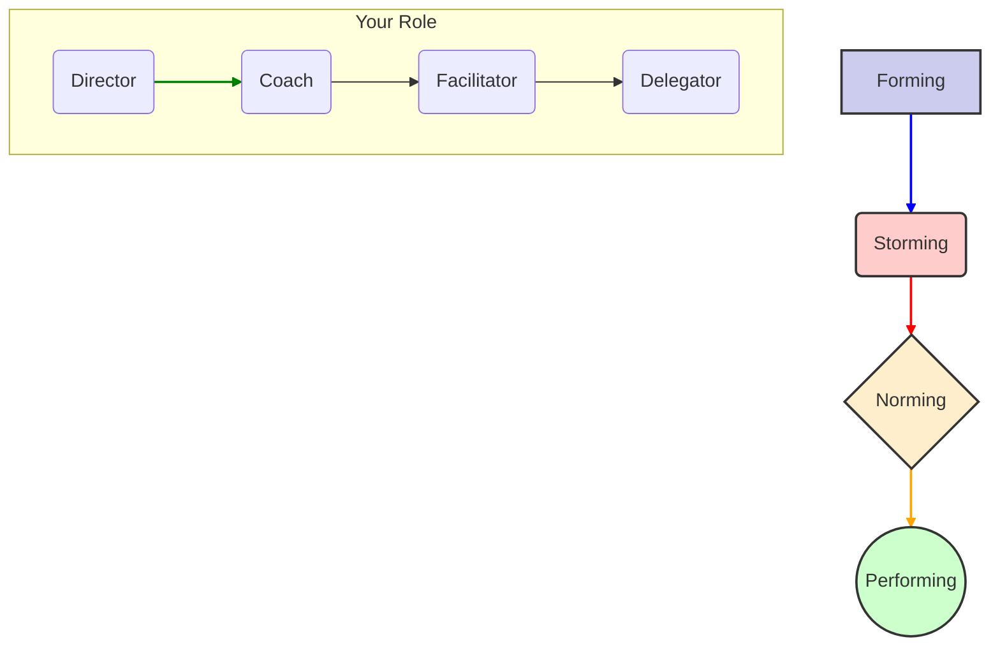

# Team Formation: Navigating the Tides of Team Dynamics

## The Scenario

A new team has been formed to tackle a high-priority greenfield project. The first two weeks are a honeymoon period. Everyone is polite, excited, and agreeable. But by week three, cracks appear. Two senior engineers are clashing over the choice of a database. The product manager is getting frustrated by the lack of clear timelines. Meetings are becoming tense and unproductive. The team's manager is worried the team is "broken."  

The team isn't broken; it's just following a predictable pattern. Psychologist Bruce Tuckman identified four stages of team development that nearly all teams go through: **Forming, Storming, Norming, and Performing.** As a Staff Engineer, your job is not to prevent this from happening, but to recognize which stage your team is in and guide them effectively to the next one.

## The Four Stages

### 1. Forming (The Honeymoon)

The team is new. Members are polite, anxious, and guarded. They are focused on understanding the scope of the work and their role in it. Productivity is generally low as everyone is finding their footing.  

**Characterized by:** High dependence on the leader for guidance, unclear roles, and a focus on avoiding conflict.  

### 2. Storming (The Conflict)

This is the most difficult stage. Team members begin to push against the boundaries established in the forming stage. Conflict erupts over technical approaches, working styles, and team processes. Some teams get stuck here and fail.  

**Characterized by:** Disagreements, power struggles, frustration, and a drop in morale. This stage is stressful but *necessary* for growth.  

### 3. Norming (The Resolution)

The team starts to resolve its differences. They establish agreed-upon processes, roles are clarified, and a sense of team identity emerges. Members begin to trust each other and appreciate their differences.  

**Characterized by:** Increased cooperation, constructive feedback, and the development of team-specific norms (e.g., "how we run our stand-ups," "how we do code reviews").  

### 4. Performing (The High-Performance State)

The team is strategically aware and operates with a high degree of autonomy and trust. They can handle conflict constructively and are focused on achieving their goals. This is the target state.  

**Characterized by:** Shared leadership, efficient decision-making, and a focus on continuous improvement.

## Your Playbook for Navigating the Stages

### When your team is Forming

**Your Role: The Director.** Provide extreme clarity. Over-communicate the team's mission, goals, and individual roles. Facilitate introductions and create low-stakes opportunities for the team to get to know each other. Don't mistake politeness for alignment.  

### When your team is Storming

**Your Role: The Coach.** Do not try to suppress conflict; facilitate it. Help team members argue constructively. Mediate disagreements by focusing the conversation on shared goals and objective data, not on personalities. Reinforce the value of different perspectives. This is where you might use frameworks like Labeling ("It seems like you're concerned about long-term scalability, and you're worried about shipping on time. Both are valid. Let's explore that.").  

### When your team is Norming

**Your Role: The Facilitator.** Help the team solidify its processes. This is the perfect time to introduce and champion practices like Architecture Decision Records (ADRs), team-owned coding standards, or a formal process for on-call rotations. Step back and let the team take more ownership of its own governance.  

### When your team is Performing

**Your Role: The Delegator.** Get out of the way. Trust the team to make decisions. Your job now is to protect them from external distractions, bring them new challenges to keep them engaged, and celebrate their successes. Focus on mentoring the next generation of leaders within the team.

Recognizing these stages allows you to be a thermostat, not a thermometer. You don't just reflect the team's temperature; you actively regulate it, guiding them through the inevitable storms and into a state of high performance.
