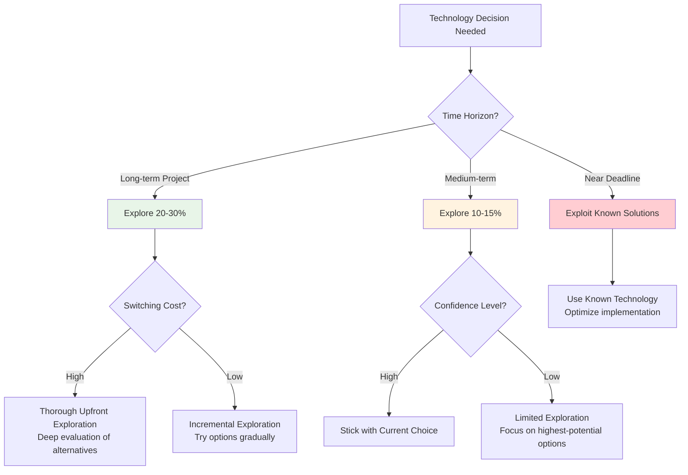

# Algorithmic Decision-Making: Computer Science Tools for Human Problems

> *"The key insight is that we can use the tools of computer science not just to understand how to make computers work better, but to understand how to make human decisions better."* - Brian Christian & Tom Griffiths

Imagine you're leading a team through a complex technical decision: choosing between three different database architectures for your next-generation platform. You have limited time to evaluate options, incomplete information about future requirements, and multiple stakeholders with conflicting priorities. Meanwhile, your current system is showing strain, and every day of delay costs potential users and revenue.

**How do you make the best decision under these constraints?**

Most engineers approach this intuitively—gathering some information, debating trade-offs, and eventually picking what "feels right." But what if there were systematic, mathematically-proven approaches to decision-making under uncertainty that could guide you to better outcomes?

**This is the promise of algorithmic decision-making.** Computer scientists have spent decades developing optimal strategies for problems that sound remarkably similar to the challenges Staff Engineers face every day: How much should you explore new options versus exploit known solutions? When should you stop gathering information and make a decision? How do you balance competing priorities with limited resources?

The breakthrough insight from Brian Christian and Tom Griffiths in "Algorithms to Live By" is that these aren't just computer problems—they're fundamental challenges of decision-making under constraint. **The same mathematical principles that help computers make optimal choices can help humans navigate complex engineering decisions.**

This isn't about turning engineers into robots. It's about augmenting human judgment with systematic approaches that have been proven optimal under specific conditions. When you understand the mathematical foundations of good decision-making, you can make better choices faster, with greater confidence, and with less regret about the roads not taken.

## The Explore-Exploit Dilemma: When to Try New Things vs. Stick with What Works

Every Staff Engineer faces this fundamental trade-off constantly: Should you invest time exploring new technologies, architectures, or approaches, or should you stick with proven solutions that you know work well?

**This is the multi-armed bandit problem** from computer science: Imagine a gambler facing a row of slot machines, each with an unknown payout rate. How do you balance trying new machines (exploring) versus playing the machine that's paid out best so far (exploiting)?

### **The Mathematical Foundation**

Computer scientists have proven that the optimal strategy follows a specific pattern that balances exploration and exploitation based on:

- **How much time you have left** (exploration becomes less valuable as time runs out)
- **How uncertain you are** about your options (more uncertainty justifies more exploration)  
- **The cost of switching** between options (high switching costs favor exploitation)
- **How much you've already learned** about each option (diminishing returns to exploration)

### **Engineering Applications**

#### **Technology Selection Strategy**

**Scenario**: Your team needs to choose a frontend framework. You could stick with React (known quantity) or explore newer options like Svelte, SolidJS, or Qwik.

**Algorithmic Approach**:



!!! tip "Practical Guidelines"
    === "Early Project"
        **Explore 20-30% of time**
        
        - High uncertainty justifies exploration
        - Switching costs are lower early on
        - More time to recover from mistakes
        
    === "Mid-Project"
        **Explore 10-15% of time**
        
        - Balance learning with delivery
        - Focus on high-impact improvements only
        - Document findings for future projects
        
    === "Near Deadlines"
        **Focus on known solutions**
        
        - Exploitation over exploration
        - Optimize existing implementations
        - Save new approaches for next iteration
> **High switching costs** → Explore more thoroughly upfront
>
> **Low switching costs** → Comfortable with incremental exploration

#### **Hiring and Team Building Strategy**

**Scenario**: You're building a team and must decide between hiring proven senior engineers versus taking chances on promising junior candidates.

**Algorithmic Insight**: The optimal strategy depends on your team's growth timeline and the "regret" cost of bad hires.

**Framework Application**:

- **Short timeline, high stakes** → Exploit (hire proven seniors)
- **Long timeline, moderate stakes** → Explore (mix of seniors and promising juniors)  
- **Learning opportunity exists** → Explore (junior hires provide learning about coaching/mentoring)
- **Critical path roles** → Exploit (stick with known quantities)

### **The Upper Confidence Bound Strategy**

When you must balance exploration and exploitation simultaneously, use the Upper Confidence Bound (UCB) algorithm:

**For each option, calculate**: `Estimated Value + Confidence Interval Width`

**Choose the option with the highest UCB score**. This naturally balances:
- High estimated value (exploitation)
- High uncertainty (exploration - give uncertain options a chance to prove themselves)

**Engineering Example - Architecture Decision**:
```
Option A (Microservices): 
  Estimated Value: 7/10 (based on research)
  Confidence: High (lots of data) = ±1
  UCB Score: 7 + 1 = 8

Option B (Modular Monolith):
  Estimated Value: 6/10 (based on research)  
  Confidence: Medium (some data) = ±2
  UCB Score: 6 + 2 = 8

Option C (Event Sourcing):
  Estimated Value: 5/10 (based on research)
  Confidence: Low (little data) = ±4  
  UCB Score: 5 + 4 = 9  <- Choose this to reduce uncertainty

```

**The Counter-Intuitive Insight**: Sometimes you should choose the option you're most uncertain about, because reducing that uncertainty has high information value.

---

## The Optimal Stopping Problem: When to Stop Searching and Decide

One of the hardest decisions in engineering is knowing when to stop gathering information and commit to a choice. Spend too little time researching, and you might miss the perfect solution. Spend too much time, and you suffer from analysis paralysis.

**Computer science provides a mathematically optimal answer**: the 37% rule.

### **The Secretary Problem Foundation**

Imagine you're hiring for a critical role and will interview candidates in random order. You can't go back to previous candidates, and you must decide immediately after each interview whether to hire them. **What strategy maximizes your chance of hiring the best candidate?**

**The optimal strategy**: Interview 37% of candidates purely for learning (reject them all), then hire the first candidate who's better than anyone in that learning sample.

### **Engineering Applications of Optimal Stopping**

#### **Technology Evaluation Process**

**Scenario**: Evaluating databases for a new service. You could spend weeks researching every option, or you could pick the first reasonable choice.

**37% Rule Application**:

1. **Define your search space**: How many options will you seriously consider?
2. **Learning phase**: Spend 37% of your time/effort purely on information gathering
3. **Decision phase**: Choose the first option that beats your learning baseline

**Practical Example**:
```
Database selection with 2 weeks allocated:
- Learning phase: 5 days researching PostgreSQL, MongoDB, Cassandra
- Establish baseline: What constitutes "good enough" performance, scalability, ops complexity
- Decision phase: Evaluate remaining options (Redis, DynamoDB, etc.)
- Choose: First option that clearly beats the baseline from learning phase
```

#### **Architecture Review Process**

**Scenario**: How long should you spend on architecture reviews before implementation?

**Modified Stopping Rule for Reviews**:

- **Initial review threshold**: Stop when diminishing returns set in (new issues found per hour drops below threshold)
- **Critical system modifier**: Extend review time proportionally to blast radius of potential failures
- **Time pressure modifier**: Compress review time but increase post-implementation monitoring

**Framework**:
```python
class OptimalStoppingReview:
    def __init__(self, system_criticality, time_pressure, team_experience):
        self.base_review_time = self.calculate_base_time(system_criticality)
        self.stopping_threshold = self.calculate_threshold(team_experience)
        self.pressure_modifier = self.calculate_pressure_modifier(time_pressure)
    
    def should_continue_review(self, issues_found_last_hour, total_review_time):
        if total_review_time < self.base_review_time * 0.37:
            return True  # Still in learning phase
            
        if issues_found_last_hour < self.stopping_threshold:
            return False  # Diminishing returns
            
        if total_review_time > self.base_review_time * self.pressure_modifier:
            return False  # Time pressure override
            
        return True
```

#### **Performance Optimization Stopping Point**

**Problem**: When do you stop optimizing performance and ship the feature?

**Optimal Stopping Approach**:

1. **Establish baseline**: Measure current performance  
2. **Learning phase**: Try several optimization approaches, establish what level of improvement is possible
3. **Stopping rule**: Stop when marginal performance improvement per unit effort falls below threshold
4. **Ship with monitoring**: Deploy with sufficient monitoring to catch any issues

**Example Timeline**:
```
Week 1: Measure baseline, identify top 3 bottlenecks (learning)
Week 2: Implement obvious optimizations (learning continues)  
Week 3: Evaluate if remaining optimizations beat 37% baseline improvement
Decision: If yes, implement best remaining optimization and ship
         If no, ship current version with monitoring
```

---

## Scheduling and Priority Management: The Algorithms of Time

Every Staff Engineer juggles multiple priorities, deadlines, and competing demands. How do you optimally sequence work to maximize value and minimize stress?

**Computer scientists have developed provably optimal scheduling algorithms** that can guide human decision-making about time allocation and priority management.

### **Shortest Processing Time (SPT) Algorithm**

**The Principle**: When you want to minimize total completion time and maximize the number of tasks finished, do the shortest tasks first.

**Why It Works**: Getting small tasks done quickly creates momentum, reduces the psychological burden of an long todo list, and often unblocks other work.

=== "Shortest Processing Time (SPT)"
    **When to Use:**
    - High context-switching overhead
    - Team morale needs momentum
    - Uncertain requirements
    
    **Benefits:**
    - Maximizes completed tasks
    - Builds momentum
    - Reduces psychological burden
    
    **Application:** Sprint planning with quick wins first

### **Earliest Deadline First (EDF) Algorithm**

**The Principle**: When you have hard deadlines, work on tasks in order of deadline proximity.

**Why It's Optimal**: This is the only strategy that will meet all deadlines if meeting all deadlines is possible.

=== "Earliest Deadline First (EDF)"
    **When to Use:**
    - Hard deadlines exist
    - Must meet all commitments
    - Clear timeline constraints
    
    **Benefits:**
    - Optimal for deadline compliance
    - Prevents missed commitments
    - Clear prioritization logic
    
    **Application:** Release planning and milestone management

### **The Precedence Constraint Challenge**

**Real-world complexity**: Many engineering tasks have dependencies. You can't deploy before you test, can't test before you code, can't code before you design.

**Critical Path Method (CPM)**:

1. **Map all dependencies** between tasks
2. **Find the longest path** through the dependency graph (the critical path)
3. **Optimize the critical path** first—any delay here delays the entire project
4. **Parallelize non-critical work** to fill slack time

=== "Critical Path Method (CPM)"
    **When to Use:**
    - Complex dependencies
    - Large project coordination
    - Resource optimization needed
    
    **Benefits:**
    - Identifies bottlenecks
    - Enables parallelization
    - Optimizes resource allocation
    
    **Example Critical Path:**
    Requirements → Design → Implementation → Integration → Testing → Deploy
2. Junior engineers work on parallel tracks  
3. Front-load risky/uncertain tasks (push them earlier in critical path)
4. Build slack time before hard deadlines
```

---

## Caching and Memory Management: Information Architecture for Humans

Just as computers use sophisticated caching strategies to manage limited memory, humans can apply these same principles to manage attention, knowledge, and information effectively.

### **The Least Recently Used (LRU) Principle**

**Computer Science**: Keep recently accessed data in fast memory, evict the least recently used data when space is needed.

**Human Application**: Organize your information environment to keep recently needed knowledge easily accessible.

**Engineering Information Architecture**:

```python
class PersonalKnowledgeCache:
    def __init__(self, cache_size=100):  # 100 "hot" topics you can access quickly
        self.hot_knowledge = {}  # Recently accessed technical knowledge
        self.warm_knowledge = {}  # Accessible but requires some effort
        self.cold_storage = {}   # Requires research to re-access
        
    def access_knowledge(self, topic):
        if topic in self.hot_knowledge:
            self.hot_knowledge[topic].last_accessed = datetime.now()
            return self.hot_knowledge[topic]
            
        elif topic in self.warm_knowledge:
            # Move to hot cache
            knowledge = self.warm_knowledge.pop(topic)
            self.hot_knowledge[topic] = knowledge
            self.evict_if_needed()
            return knowledge
            
        else:
            # Research required
            return self.research_and_cache(topic)
    
    def evict_if_needed(self):
        if len(self.hot_knowledge) > self.cache_size:
            lru_topic = min(self.hot_knowledge.keys(), 
                           key=lambda t: self.hot_knowledge[t].last_accessed)
            self.warm_knowledge[lru_topic] = self.hot_knowledge.pop(lru_topic)
```

**Practical Applications**:

**Documentation Strategy**:

- **Hot cache**: Keep current project docs and frequently referenced materials easily accessible (bookmarks, desktop, wiki favorites)
- **Warm cache**: Previous project docs, less common but sometimes needed references  
- **Cold storage**: Old projects, rarely needed specs (searchable but not immediately accessible)

**Learning Strategy**:

- **Hot skills**: Current technology stack, active problem domains
- **Warm skills**: Related technologies, adjacent domains
- **Cold skills**: Past expertise that's not immediately relevant but might be useful

### **Temporal Locality in Engineering Work**

**Principle**: Recently accessed information is likely to be accessed again soon.

**Applications**:

**Daily Work Organization**:

- Keep today's relevant files, terminals, and browser tabs easily accessible
- Use workspace management tools that preserve "working sets" of information
- Organize communication tools (Slack channels, email folders) by recency and relevance

**Meeting and Context Management**:

- Maintain "hot context" for current projects (recent decisions, active discussions, key metrics)
- Build systems to quickly restore context after interruptions
- Use calendar blocks to batch similar work and preserve context

### **The Optimal Cache Hierarchy**

**Multi-level caching strategy for engineering information**:

```
Level 1 (Immediate): Current sprint information, today's priorities
Level 2 (Daily): Current project context, frequently used references  
Level 3 (Weekly): Related project information, team knowledge
Level 4 (Monthly): Organization knowledge, industry best practices
Level 5 (Long-term): Career knowledge, fundamental principles
```

**Cache Invalidation Strategy**:

- **Time-based**: Some information becomes stale (performance metrics, team structures)
- **Event-based**: Major changes invalidate related information (architecture changes, team reorganizations)
- **Version-based**: Keep track of when foundational knowledge was last updated

---

## Game Theory for Engineering Decisions: Strategic Thinking in Multi-Player Environments

Engineering decisions don't happen in isolation—they involve multiple stakeholders with different incentives, priorities, and constraints. Game theory provides frameworks for making optimal decisions when other intelligent agents are also making strategic choices.

### **The Prisoner's Dilemma in Engineering**

**Classic Setup**: Two players can either cooperate or defect. Mutual cooperation is better for both than mutual defection, but individual defection is tempting.

**Engineering Manifestation**: Team contributions to shared infrastructure, technical debt cleanup, or documentation.

**Example Scenario**:
```
Two teams share a common service:
- Cooperate: Invest time in improving shared service
- Defect: Only use service, don't contribute improvements

Payoff Matrix:
               Team B Cooperates    Team B Defects
Team A Coop:   Both get benefits   A pays cost, B gets benefits  
Team A Defect: A gets benefits     Both suffer degraded service
```

**Optimal Strategy - Tit-for-Tat with Forgiveness**:

1. **Start cooperatively** (assume good faith)
2. **Mirror the other player's** previous move  
3. **Occasionally forgive** defection to avoid endless retaliation cycles
4. **Be transparent** about your strategy

**Practical Implementation**:
```python
class EngineeringCooperation:
    def __init__(self, forgiveness_rate=0.1):
        self.forgiveness_rate = forgiveness_rate
        self.history = []
        
    def decide_action(self, other_team_history):
        if not other_team_history:
            return "cooperate"  # Start cooperatively
            
        last_action = other_team_history[-1]
        
        if last_action == "defect" and random.random() > self.forgiveness_rate:
            return "defect"  # Retaliate, but with some forgiveness
        else:
            return "cooperate"
    
    def signal_strategy(self):
        # Make your strategy known to encourage cooperation
        return "I'll match your contribution level, but I prefer cooperation"
```

### **Coordination Games: Aligning on Technical Standards**

**Problem**: Multiple teams need to choose compatible technologies, but the specific choice matters less than alignment.

**Example**: Choosing between TypeScript and JavaScript for frontend development across the organization.

**Game Theory Insight**: This is a coordination game where aligned choices are better than misaligned ones, regardless of which specific choice is made.

**Optimal Strategy**:

1. **Establish communication** channels for coordination
2. **Create focal points** (industry standards, existing organizational choices)
3. **Use commitment devices** (public declarations of intent)
4. **Build momentum** around emerging consensus

```python
class TechnicalStandardCoordination:
    def __init__(self, teams):
        self.teams = teams
        self.preferences = {}  # Each team's technology preferences
        self.commitments = {}  # Public commitments made
        
    def find_schelling_point(self):
        # Look for natural focal points for coordination
        industry_standard = self.get_industry_standard()
        existing_org_choice = self.get_current_org_standard()
        highest_preference = self.get_most_preferred_choice()
        
        # Weight factors: existing momentum > industry standard > preferences
        return self.calculate_schelling_point(
            industry_standard, existing_org_choice, highest_preference
        )
    
    def create_commitment_device(self, choice):
        # Make public commitment to encourage others to coordinate
        return f"Our team commits to {choice} for new projects starting {date}"
```

### **Auction Theory: Resource Allocation Decisions**

**Engineering Resource Allocation**: When multiple projects compete for limited engineering resources (senior engineers, infrastructure budget, platform team support).

**Vickrey Auction Principle**: Each bidder submits sealed bids, highest bidder wins but pays the second-highest bid.

**Why It's Optimal**: Incentivizes truthful bidding about the real value of resources.

**Engineering Application**:
```python
class EngineeringResourceAllocation:
    def __init__(self):
        self.resource_requests = []
        
    def submit_request(self, project, resource_type, value_estimate, justification):
        # Projects submit their true valuation of resources
        return {
            'project': project,
            'resource': resource_type,
            'value': value_estimate,  # Business value if they get resources
            'justification': justification,
            'opportunity_cost': self.calculate_opportunity_cost(project)
        }
    
    def allocate_resources(self, requests):
        # Sort by value density (value per unit resource)
        sorted_requests = sorted(requests, 
                               key=lambda r: r['value'] / r['resource_cost'], 
                               reverse=True)
        
        # Allocate to highest value projects until resources exhausted
        allocated = []
        remaining_resources = self.total_resources
        
        for request in sorted_requests:
            if request['resource_cost'] <= remaining_resources:
                allocated.append(request)
                remaining_resources -= request['resource_cost']
                
        return allocated
```

**Key Insights for Staff Engineers**:

- **Make resource requests transparent** to encourage honest valuation
- **Use objective value metrics** where possible (user impact, revenue, cost savings)
- **Account for opportunity costs** in resource allocation decisions
- **Create mechanisms for continuous reallocation** as priorities change

---

## Practical Implementation: Your Algorithmic Decision-Making Toolkit

### **The Decision-Making Framework Integration**

Combine multiple algorithmic approaches into a systematic decision-making process:

```python
class AlgorithmicDecisionFramework:
    def __init__(self, context):
        self.context = context
        self.time_pressure = context.urgency_level
        self.stakeholder_count = len(context.stakeholders)
        self.reversibility = context.decision_reversibility
        
    def make_decision(self, options, constraints):
        # Step 1: Determine if this is explore vs exploit
        if self.should_explore_more(options):
            return self.exploration_strategy(options)
            
        # Step 2: Apply optimal stopping rule
        if self.has_sufficient_information():
            return self.stopping_decision(options)
            
        # Step 3: Consider game theory aspects
        if self.stakeholder_count > 1:
            return self.strategic_decision(options)
            
        # Step 4: Apply scheduling optimization
        return self.scheduling_optimized_decision(options)
    
    def exploration_strategy(self, options):
        # Apply explore-exploit with UCB
        return max(options, key=lambda o: o.estimated_value + o.uncertainty)
        
    def stopping_decision(self, options):
        # Apply 37% rule or diminishing returns analysis
        if self.evaluation_time > self.total_time * 0.37:
            return max(options, key=lambda o: o.estimated_value)
        return None  # Continue evaluating
        
    def strategic_decision(self, options):
        # Consider stakeholder incentives and coordination needs
        return self.find_nash_equilibrium(options)
        
    def scheduling_optimized_decision(self, options):
        # Consider deadlines and dependencies
        if self.has_hard_deadlines():
            return self.earliest_deadline_first(options)
        else:
            return self.shortest_processing_time(options)
```

### **Algorithmic Decision Patterns for Common Engineering Scenarios**

#### **Technology Selection**
1. **Exploration phase** (37% of allocated time): Research options, build proof-of-concepts
2. **Evaluation criteria**: Performance, learning curve, ecosystem, future roadmap
3. **Stopping rule**: When marginal information gain < time cost
4. **Caching strategy**: Document evaluation for future similar decisions

#### **Architecture Design**
1. **Game theory check**: Who are the stakeholders? What are their incentives?
2. **Optimal stopping**: How much design is enough before implementation feedback?
3. **Scheduling optimization**: What's the critical path through design → implementation → validation?
4. **Explore-exploit**: New patterns vs. proven approaches?

#### **Team and Resource Planning**
1. **Coordination game**: How do we align multiple teams on shared goals?
2. **Resource allocation**: What's the most efficient distribution of engineering effort?
3. **Scheduling**: How do we optimize for both individual and team throughput?
4. **Caching**: What knowledge and context need to be readily available?

### **Building Your Algorithmic Intuition**

**Daily Practice**:

- **Morning planning**: Apply shortest-job-first to your daily task list
- **Decision logging**: Record which algorithmic principles you applied and their outcomes
- **Context switching**: Use LRU principles to organize your information environment
- **Meeting efficiency**: Apply optimal stopping to discussions and research

**Weekly Review**:

- **Explore-exploit balance**: How much time did you spend on exploration vs. exploitation?
- **Stopping decisions**: Did you gather information for the right amount of time?
- **Coordination effectiveness**: How well did you align with stakeholders?
- **Resource allocation**: Were your time and attention optimally distributed?

**Monthly Assessment**:

- **Decision quality**: Which algorithmic approaches led to better outcomes?
- **Pattern recognition**: What types of decisions benefit most from systematic approaches?
- **Stakeholder feedback**: How did strategic thinking improve your relationships and outcomes?
- **Knowledge caching**: How effectively are you managing your learning and information?

---

## The Meta-Algorithm: When and How to Apply Algorithmic Thinking

The most important algorithmic decision is **when to use algorithmic thinking** versus when to rely on intuition, experience, or other approaches.

### **Algorithmic Thinking Is Most Valuable When**:

- **High stakes decisions** → The cost of being wrong is significant
- **Repeated decision types** → You'll face similar decisions again  
- **Multiple valid options** → No obviously correct choice
- **Time pressure** → Need efficient decision-making process
- **Multiple stakeholders** → Strategic considerations matter
- **Uncertain outcomes** → Probabilistic thinking helps
- **Resource constraints** → Optimization provides clear value

### **Intuitive Thinking Is Better When**:

- **Unique, one-off decisions** → No pattern to optimize
- **Clear optimal choices** → Algorithm would reach same conclusion
- **Creative problems** → Need novel solutions, not optimal ones
- **Human relationship issues** → Emotional intelligence trumps optimization
- **Rapid response needed** → No time for systematic analysis
- **High context dependency** → Algorithms can't capture all nuances

### **The Hybrid Approach**:

Most real engineering decisions benefit from **combining algorithmic thinking with human judgment**:

1. **Use algorithms to structure the problem** and identify key trade-offs
2. **Apply intuition and experience** to weight factors the algorithm can't capture
3. **Validate intuitive decisions** against algorithmic analysis
4. **Use systematic approaches** to avoid known cognitive biases

**Example - Hybrid Architecture Decision**:
```python
def hybrid_architecture_decision(options, context):
    # Algorithmic analysis
    algorithmic_ranking = evaluate_with_algorithms(options, context)
    
    # Intuitive assessment  
    intuitive_ranking = team_experience_evaluation(options, context)
    
    # Stakeholder considerations
    strategic_ranking = game_theory_analysis(options, context.stakeholders)
    
    # Synthesize approaches
    return synthesize_rankings(
        algorithmic=algorithmic_ranking,
        intuitive=intuitive_ranking, 
        strategic=strategic_ranking,
        weights=determine_weights(context)
    )
```

---

## The Compound Effect: Building Systematic Decision-Making Capability

The goal isn't to become a decision-making robot. **The goal is to develop better judgment by understanding the mathematical principles underlying good decisions.**

When you internalize these algorithmic approaches, you gain:

- **Better calibration** → Your confidence in decisions matches their actual quality
- **Faster decisions** → Systematic approaches cut through analysis paralysis
- **More consistent outcomes** → Reduce the variance in your decision quality
- **Clearer communication** → Explain your reasoning in terms others can follow
- **Reduced regret** → Confidence that you followed optimal processes
- **Transferable skills** → Apply proven approaches to novel problems

**Algorithmic thinking becomes most powerful when it's internalized as enhanced intuition.** You're not mechanically applying formulas—you're using mathematical insights to guide your natural problem-solving abilities.

This is how Staff Engineers develop the judgment to make complex decisions quickly and confidently, even under uncertainty and pressure. **You're not just choosing between options—you're choosing the best process for choosing, based on proven optimal strategies.**

## Further Reading

**Core Algorithmic Decision-Making**:

- Christian, Brian, and Tom Griffiths. *Algorithms to Live By: The Computer Science of Human Decisions*. 2016.
- Cormen, Thomas H., et al. *Introduction to Algorithms*. 2009.

**Game Theory and Strategic Thinking**:

- Dixit, Avinash, and Barry Nalebuff. *The Art of Strategy: A Game Theorist's Guide to Success*. 2008.
- Harford, Tim. *The Logic of Life: The Rational Economics of an Irrational World*. 2008.

**Decision Science and Behavioral Economics**:

- Kahneman, Daniel. *Thinking, Fast and Slow*. 2011.
- Thaler, Richard H., and Cass R. Sunstein. *Nudge: Improving Decisions About Health, Wealth, and Happiness*. 2008.

**Systems and Optimization**:

- Meadows, Donella. *Thinking in Systems: A Primer*. 2008.
- Silver, Nate. *The Signal and the Noise: Why So Many Predictions Fail — but Some Don't*. 2012.