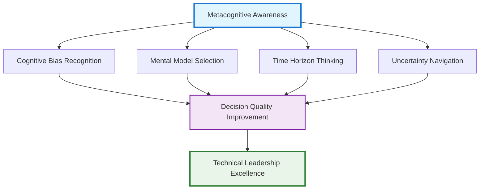
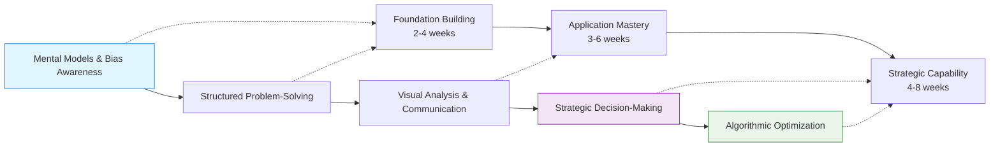

# Critical Thinking: The Bridge from Technical Expert to Analytical Leader

## The Complexity Shift

You're six months into your Staff Engineer role. A critical system is experiencing intermittent failures that cost $50K per incident, but the root cause remains elusive. The database team blames the application layer. The application team points to infrastructure changes. The infrastructure team cites increased load patterns. Everyone has data supporting their position. Everyone is technically correct. Everyone is also missing the bigger picture.

**This is the moment when technical expertise alone becomes insufficient.** You've established your engineering credibility in Chapter 3. You can debug complex systems, design scalable architectures, and implement robust solutions. But Staff-level problems aren't just technical—they're systemic, political, and strategic. Solving them requires a different kind of thinking.

## Your Career Journey Context

**Where You Are**: You've built technical authority through engineering excellence. Teams respect your technical judgment and seek your input on complex problems. But you're starting to encounter challenges that can't be solved with better code or smarter architecture.

**What This Chapter Provides**: The analytical thinking frameworks that separate technical experts from technical leaders. These mental models and problem-solving methodologies work at the intersection of technology, people, and business systems—the space where Staff Engineers operate most effectively.

**Where This Leads**: The thinking skills you develop here become the foundation for leadership influence (Chapter 5), where you'll need to analyze stakeholder motivations and system dynamics. They enable effective teamwork (Chapter 6), where you'll diagnose team dysfunction and design collaborative solutions. They power execution excellence (Chapter 7), where you'll break down complex initiatives into manageable components.

## The Meta-Skill: Thinking About Thinking

Most engineers excel at computational thinking—breaking problems into logical steps, identifying patterns, and optimizing algorithms. But Staff Engineer challenges require what cognitive scientists call "metacognition"—thinking about thinking itself. This meta-skill enables you to choose the right analytical approach for each situation, recognize when your thinking patterns are leading you astray, and continuously improve your decision-making quality.

### The Metacognitive Framework

Effective metacognition operates across four interconnected dimensions that transform how you approach complex technical challenges:



### The Four Pillars of Metacognitive Excellence

**Cognitive Bias Recognition** involves understanding when your brain's pattern-matching shortcuts lead you astray, especially during high-stakes technical decisions. Your experience with similar problems creates mental shortcuts that usually help but sometimes blind you to novel aspects of current challenges. Effective Staff Engineers develop the ability to pause and ask "What assumptions am I making?" and "How might my past experience be limiting my analysis of this situation?"

**Mental Model Selection** requires building a diverse toolkit of analytical frameworks and knowing when to apply each one. Like selecting the right data structure for a problem, you need systematic approaches for analyzing different challenge types—system failures require root cause analysis frameworks, team conflicts need interpersonal dynamics models, strategic decisions benefit from scenario planning methods, and resource allocation problems call for optimization frameworks.

**Time Horizon Thinking** enables you to balance competing demands across different temporal scales. You must simultaneously consider immediate fixes that restore service, medium-term architectural improvements that prevent similar problems, and long-term strategic investments that build organizational capability. This requires consciously shifting between tactical problem-solving and strategic system design perspectives.

**Uncertainty Navigation** develops your capability to make sound decisions with incomplete information, manage risk in complex systems, and maintain strategic direction amid changing requirements. Rather than seeking perfect information before deciding, you learn to identify what information is truly critical, what can be learned through experimentation, and how to build adaptive solutions that remain viable as conditions evolve.

## The Analytical Leadership Transition

The thinking skills in this chapter mark your transition from someone who solves problems to someone who helps others solve problems more effectively:

**Individual Contributor Thinking**: "How do I fix this bug?" "What's the best algorithm for this use case?" "How do I optimize this query?"

**Staff Engineer Thinking**: "Why do bugs like this keep happening?" "What system design patterns would prevent this class of problems?" "How do I help the team develop better debugging skills?" "What are the second and third-order effects of this technical decision?"

This shift is crucial because Staff Engineers rarely solve problems in isolation. You're analyzing complex systems with multiple stakeholders, conflicting constraints, and unclear requirements. Your thinking process needs to account for human psychology, organizational dynamics, and business strategy—not just technical elegance.

## The Systems Behind the Systems

The mental models in this chapter help you see the systems behind the systems. When a deployment pipeline keeps failing, the technical fix might be straightforward—but the systemic solution requires understanding why the process wasn't designed properly initially, why testing wasn't comprehensive, why monitoring wasn't adequate, and why the team culture doesn't prioritize operational excellence.

Critical thinking skills let you:

- **Analyze root causes** rather than just symptoms
- **Predict unintended consequences** of proposed solutions
- **Design interventions** that address systemic issues
- **Communicate reasoning** to stakeholders with different backgrounds
- **Make decisions** under uncertainty and time pressure

## Preparing for Leadership Impact

The analytical frameworks you master here directly enable the leadership skills in upcoming chapters:

**Chapter 5 (Leadership)** requires you to analyze stakeholder motivations, diagnose team dynamics, and design influence strategies—all applications of the mental models you'll learn here.

**Chapter 6 (Teamwork)** depends on your ability to think systemically about team interactions, communication patterns, and collaborative problem-solving processes.

**Chapter 7 (Execution)** needs you to decompose complex initiatives, anticipate risks, and optimize resource allocation—structured problem-solving applied to project management.

**Chapter 8 (Business)** requires you to think strategically about technology investments, analyze business tradeoffs, and translate between technical and business contexts.

**The Foundation Promise**: Master the critical thinking skills in this chapter, and you'll have the analytical foundation needed to excel in the complex, ambiguous, stakeholder-rich environment where Staff Engineers operate. These aren't just problem-solving tools—they're the thinking frameworks that enable technical leadership at scale.

## Critical Thinking Frameworks & Tools

The analytical capabilities that separate technical experts from technical leaders organize into interconnected frameworks, each addressing different aspects of complex problem-solving. These tools work synergistically to create comprehensive analytical capabilities that enable effective decision-making in uncertain, high-stakes technical environments.

=== "Foundation: Cognitive Architecture"

    Understanding how your mind processes information provides the foundation for all other analytical improvements. These cognitive tools shape how you perceive and analyze complex technical challenges.

    ## Mental Models Toolkit

    **Mental Models** function as your cognitive toolkit, providing diverse frameworks like First Principles Thinking, Second-Order Thinking, and Inversion that help you deconstruct and solve complex problems from multiple angles. These models serve as thinking templates that guide your analysis toward more effective solutions.

    **Core Mental Models for Technical Leaders:**

    | Mental Model | Application | Technical Example |
    |--------------|-------------|------------------|
    | **First Principles** | Break complex problems into fundamental truths | Designing a new distributed system by examining core requirements rather than copying existing patterns |
    | **Second-Order Thinking** | Consider consequences of consequences | Evaluating how a microservices migration impacts team structure, operational complexity, and long-term maintainability |
    | **Inversion** | Work backwards from desired outcomes | Starting system design from failure scenarios to build resilience from the ground up |
    | **Systems Thinking** | Understand interconnections and feedback loops | Analyzing how deployment frequency affects code quality, team morale, and business velocity |

    ## Cognitive Bias Awareness

    **Cognitive Biases** represent the systematic errors in thinking that can undermine even the most sophisticated technical analysis. Learning to recognize and mitigate common biases like Confirmation Bias, Planning Fallacy, and Sunk Cost Fallacy transforms your decision-making quality, especially in high-pressure situations where your brain's shortcuts can lead to expensive mistakes.

    **Critical Biases for Technical Decision-Making:**

    !!! warning "High-Impact Cognitive Biases"
        **Confirmation Bias**: Seeking information that supports pre-existing technical opinions while ignoring contradictory evidence

        **Planning Fallacy**: Consistently underestimating the time, costs, and risks of technical projects while overestimating their benefits

        **Sunk Cost Fallacy**: Continuing with failing technical approaches because of previous investment rather than objective future value

        **Anchoring Bias**: Over-relying on the first piece of technical information encountered when making decisions

=== "Application: Systematic Analysis"

    Effective analytical thinking requires systematic approaches that transform chaotic problem situations into structured analysis. These methodologies provide disciplined frameworks for moving from confusion to clarity.

    ## Structured Problem-Solving Methods

    **Structured Problem-Solving** provides methodologies like the 5 Whys, Fishbone Diagrams, and the Scientific Method that move you from confusion to clarity through disciplined inquiry and hypothesis testing.

    **Problem-Solving Framework Selection:**

    ```mermaid
    graph TD
        A[Problem Identification] --> B{Problem Type?}

        B -->|Root Cause Unknown| C[5 Whys Analysis]
        B -->|Multiple Contributing Factors| D[Fishbone Diagram]
        B -->|Hypothesis Testing Needed| E[Scientific Method]
        B -->|Process Improvement| F[Toyota Kata]

        C --> G[Systematic Investigation]
        D --> G
        E --> G
        F --> G

        G --> H[Solution Implementation]
        H --> I[Results Validation]
        I --> J[Knowledge Capture]

        style A fill:#e1f5fe,stroke:#1976d2,stroke-width:2px
        style G fill:#f3e5f5,stroke:#7b1fa2,stroke-width:2px
        style J fill:#e8f5e8,stroke:#2e7d32,stroke-width:2px
    ```

    ## Visual Thinking Techniques

    **Mind Mapping** extends your analytical capability through visual thinking techniques that help you explore complex problem spaces, organize interconnected ideas, and communicate intricate system designs to diverse stakeholders. This visual dimension complements logical analysis by revealing patterns and relationships that pure text-based analysis might miss.

    **Visual Analysis Applications:**

    - **Architecture Decision Records**: Visual documentation of technical choices and their implications
    - **System Dependency Mapping**: Understanding complex relationships between services and teams
    - **Stakeholder Impact Analysis**: Visualizing how technical decisions affect different organizational groups
    - **Problem Space Exploration**: Mapping the full scope of complex technical challenges

=== "Integration: Strategic Decision-Making"

    The ultimate goal of critical thinking development is strategic decision-making capability that connects immediate technical choices with long-term organizational success. These advanced frameworks integrate analytical thinking with business strategy.

    ## Strategic Thinking for Technical Leaders

    **Strategic Thinking** integrates all other frameworks to help you connect day-to-day technical work with high-level business strategy, ensuring your decisions create compound value rather than just solving immediate problems.

    **Strategic Decision Framework:**

    | Decision Horizon | Focus Area | Key Questions | Analytical Tools |
    |-----------------|------------|---------------|------------------|
    | **Immediate (0-3 months)** | Tactical execution | What needs to be fixed now? | Root cause analysis, incident response |
    | **Short-term (3-12 months)** | System optimization | How do we improve current capabilities? | Performance analysis, technical debt assessment |
    | **Medium-term (1-2 years)** | Architectural evolution | What systems need to change? | Technology roadmapping, scenario planning |
    | **Long-term (2+ years)** | Strategic positioning | How do we prepare for future challenges? | Trend analysis, competitive assessment |

    ## Algorithmic Decision-Making

    **Computational Decision Frameworks** apply algorithmic thinking to complex resource allocation, technology adoption, and organizational design challenges. These systematic approaches help you make better decisions by leveraging quantitative analysis and optimization principles.

    !!! tip "Decision-Making Algorithms"
        **Explore vs. Exploit**: When to investigate new technical approaches versus optimizing current solutions

        **Multi-Criteria Decision Analysis**: Systematically evaluating technology choices across multiple dimensions

        **Portfolio Optimization**: Balancing risk and return across multiple technical initiatives

        **Game Theory Applications**: Understanding strategic interactions between teams and stakeholders

## Framework Integration Strategy

!!! success "Comprehensive Development Pathway"
    These frameworks achieve maximum impact when used in combination rather than isolation. The integration pathway builds from foundational cognitive awareness through systematic analysis to strategic decision-making capability.

**Development Sequence:**



| Development Phase | Core Tools | Primary Applications | Success Indicators |
|------------------|------------|---------------------|--------------------|
| **Foundation** | [Mental Models](mental-models.md), [Cognitive Biases](cognitive-biases.md) | Decision-making foundations, Pattern recognition, Error detection | Clear reasoning in technical discussions, bias recognition in decisions |
| **Application** | [Structured Problem-Solving](structured-problem-solving.md), [Mind Mapping](mind-mapping.md) | Complex problem decomposition, Visual communication, Root cause analysis | Systematic debugging approaches, effective stakeholder communication |
| **Integration** | [Strategic Thinking](strategic-thinking.md), [Algorithmic Decision-Making](algorithmic-decision-making.md) | Business-technology alignment, Long-term planning, Resource optimization | Strategic technical decisions, business-aligned architecture choices |

## Cross-Reference Navigation

### Prerequisites for This Chapter

- **[Staff Engineer Archetypes](../intro/index.md)** - Understanding your role context before developing advanced analytical capabilities
- **[Continuous Learning](../learning/index.md)** - Learning frameworks needed to develop and maintain thinking skills

### Related Concepts

- **[Engineering Excellence](../engineering/index.md)** - Technical decision-making benefits from systematic mental models and structured thinking
- **[Leadership & Influence](../leadership/index.md)** - Influencing others requires understanding cognitive biases and decision-making processes
- **[Execution & Strategy](../execution/index.md)** - Strategic execution depends on clear thinking and systematic problem-solving

### Apply These Concepts

- **[Critical Thinking Assessment](../../appendix/tools/critical-thinking-assessment.md)** - Evaluate your ability to apply mental models and avoid cognitive biases
- **[Staff Engineer Competency Assessment](../../appendix/tools/staff-engineer-competency-assessment.md)** - Assess your analytical and strategic thinking capabilities

### Next Steps in Your Learning Journey

1. **[Leadership & Influence](../leadership/index.md)** - Apply critical thinking skills to understand and influence people and teams
2. **[Execution & Strategy](../execution/index.md)** - Use analytical frameworks for complex project and organizational challenges
3. **[Business Integration](../business/index.md)** - Apply strategic thinking to business-technology alignment and decision-making

### Learning Path Recommendations

Strategic development of critical thinking capabilities requires tailoring your learning approach to both your experience level and the specific challenges you face in your Staff Engineer role. These curated learning paths build analytical skills systematically while addressing the real-world problems you encounter daily.

## Critical Thinking Development Pathways

!!! tip "Personalized Learning Approach"
    **Choose the development path that matches your experience level and current analytical challenges**

    === "New Staff Engineers"
        # :material-school-outline: Foundation Building Path

        **Focus:** Establish systematic thinking patterns and bias awareness that enable confident technical decision-making

        ## Core Sequence (4-6 weeks)

        **Week 1-2: Pattern Recognition Foundation**
        Begin with **[Mental Models](mental-models.md)** to build your toolkit of analytical frameworks. Focus particularly on First Principles Thinking and Systems Thinking as these provide the foundation for all other advanced thinking skills. Master the ability to break complex problems into component parts and identify underlying principles that transcend specific technical implementations.

        **Week 3-4: Decision Quality Improvement**
        Progress to **[Cognitive Biases](cognitive-biases.md)** to understand how your brain's pattern-matching shortcuts can lead to poor technical decisions. Learn to recognize Confirmation Bias, Anchoring, and Planning Fallacy in your own decision-making process, especially when evaluating technology choices or estimating project complexity.

        **Week 5-6: Systematic Problem-Solving**
        Conclude with **[Structured Problem-Solving](structured-problem-solving.md)** to develop repeatable methodologies for tackling complex technical challenges. Master techniques like the 5 Whys, Fishbone Diagrams, and hypothesis-driven debugging that transform chaotic incident response into systematic root cause analysis.

        ## Success Indicators
        - You can articulate the reasoning behind technical decisions using mental models
        - You catch yourself falling into cognitive biases during architecture discussions
        - Your debugging approach follows systematic methodologies rather than random investigation
        - Team members seek your input on complex problem analysis

    === "Experienced Technical Leaders"
        # :material-account-tie-outline: Strategic Impact Path

        **Focus:** Advanced analytical capabilities for long-term architectural and business decision-making

        ## Accelerated Sequence (3-4 weeks)

        **Week 1: Strategic Decision Framework**
        Start with **[Strategic Thinking](strategic-thinking.md)** to connect day-to-day technical decisions with long-term business strategy. Develop skills in scenario planning, competitive analysis, and technology trend evaluation that inform architectural roadmaps spanning multiple years.

        **Week 2-3: Computational Decision-Making**
        Progress to **[Algorithmic Decision-Making](algorithmic-decision-making.md)** to apply computational thinking to complex resource allocation, technology adoption, and team formation decisions. Learn when to optimize, when to satisfice, and how to balance multiple competing objectives systematically.

        **Week 4: Integration and Practice**
        Integrate these advanced frameworks through **[Mind Mapping](mind-mapping.md)** exercises that help you visualize complex system relationships and stakeholder interactions. Practice scenario planning for major architectural decisions affecting multiple teams.

        ## Success Indicators
        - Your technical decisions consistently align with business strategy
        - You can model complex tradeoffs using systematic frameworks
        - Executives seek your input on technology investment decisions
        - Your architectural recommendations consider 2-3 year business evolution scenarios

    === "Technical Strategists & Architects"
        # :material-lighthouse-outline: Systems Mastery Path

        **Focus:** Visualization and systems thinking for complex system relationships and uncertain environments

        ## Intensive Sequence (2-3 weeks)

        **Week 1: Complex Systems Visualization**
        Master **[Strategic Thinking](strategic-thinking.md)** with emphasis on systems dynamics, feedback loops, and emergent behaviors in large-scale technical systems. Focus on identifying leverage points where small changes create large system improvements.

        **Week 2: Visual Problem Analysis**
        Develop expertise in **[Mind Mapping](mind-mapping.md)** techniques for exploring complex problem spaces and communicating intricate system designs. Learn to create visual representations that help diverse stakeholders understand technical complexity and architectural implications.

        **Week 3: Uncertainty Navigation**
        Apply these skills to decision-making in uncertain environments where information is incomplete and stakes are high. Practice scenario planning, risk assessment, and building adaptive architectures that remain viable across multiple future states.

        ## Success Indicators
        - You can model and visualize complex system interactions effectively
        - Your architectural decisions account for uncertainty and changing requirements
        - You help others understand complex technical concepts through visual communication
        - Your system designs anticipate and adapt to future business evolution

**Integration Recommendations:**

Regardless of your chosen path, integrate critical thinking skills with your daily work through deliberate practice. Use architecture decision records to document your reasoning process, apply systematic problem-solving during incident response, and teach these frameworks to others to reinforce your own learning and multiply organizational analytical capability.

## Further Reading

**Core Mental Models and Cognitive Science**:

- Kahneman, Daniel. _Thinking, Fast and Slow_. 2011. (Seminal work on cognitive biases and dual-system thinking)
- Parrish, Shane. _The Great Mental Models_ (Volumes 1-3). 2019-2021. (Practical series explaining essential mental models with examples)
- Munger, Charles T. _Poor Charlie's Almanack: The Wit and Wisdom of Charles T. Munger_. 2005. (Championing the "latticework of mental models" approach to decision-making)

**Systems Thinking and Problem-Solving**:

- Meadows, Donella H. _Thinking in Systems: A Primer_. 2008. (Accessible introduction to systems thinking, feedback loops, and leverage points)
- Weinberg, Gabriel, and Lauren McCann. _Super Thinking: The Big Book of Mental Models_. 2019. (Comprehensive survey of mental models from various disciplines)
- Rother, Mike. _Toyota Kata: Managing People for Improvement, Adaptiveness, and Innovation_. 2009. (Structured problem-solving and continuous improvement methodologies)

**Strategic and Algorithmic Thinking**:

- Christian, Brian, and Tom Griffiths. _Algorithms to Live By: The Computer Science of Human Decisions_. 2016. (Applying computational thinking to everyday and strategic decisions)
- Rumelt, Richard. _Good Strategy Bad Strategy: The Difference and Why It Matters_. 2011. (Strategic thinking frameworks for complex business and technology decisions)
