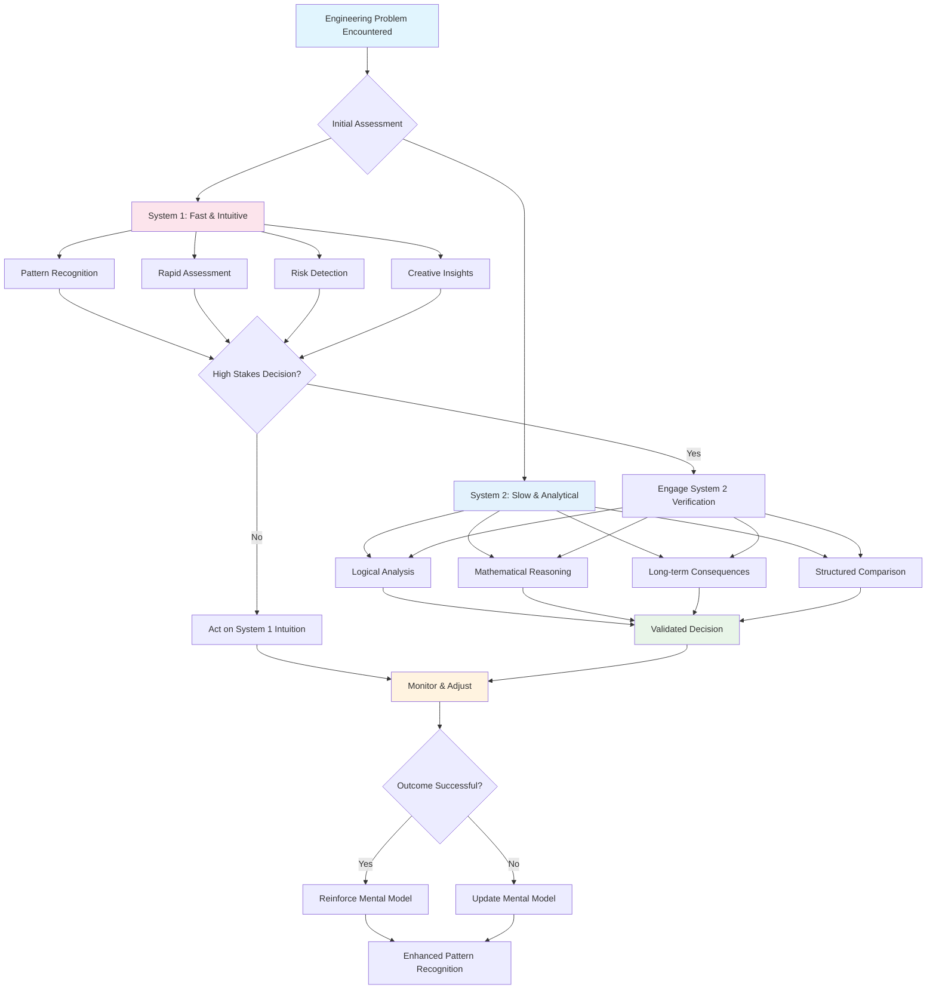

# Mental Models for Engineers: Your Cognitive Toolkit for Complex Decisions

> *"The first principle is that you must not fool yourself — and you are the easiest person to fool."* - Richard Feynman

Picture this scenario: You're in a design meeting where your team is debating three different approaches to solving a scalability problem. The senior engineer is convinced that the current solution just needs better caching. The architect insists you need to completely redesign the data model. The product manager wants to defer the problem until you have more users to validate the assumptions.

Everyone's smart. Everyone has good intentions. But you're stuck because everyone is seeing the same problem through completely different mental frameworks.

**This is where mental models become your superpower.** The most effective Staff Engineers aren't just technically skilled—they have a diverse cognitive toolkit that lets them analyze problems from multiple perspectives, avoid reasoning traps, and make better decisions under uncertainty.

Think of mental models as the difference between having just a hammer in your toolbox versus having a complete workshop. When every problem looks like a nail, your solutions will be limited. But when you can choose the right cognitive tool for each situation, you can solve problems that stump other engineers.

This isn't about being smarter—it's about thinking more systematically. **The human brain is an incredible problem-solving machine, but it comes with built-in biases and limitations.** Mental models help you work with your brain's strengths while compensating for its weaknesses.

## The Neuroscience of Engineering Decisions

Before diving into specific models, let's understand why our brains need help with complex decisions. Research by Daniel Kahneman and others has revealed that human thinking operates through two distinct systems:

### **System 1: The Intuitive Brain**
*Fast, automatic, pattern-matching, emotion-driven*

This is your engineering intuition in action. When you immediately spot that a piece of code "smells wrong" or sense that a proposed architecture won't scale, that's System 1 at work. It's incredibly powerful for:

- **Pattern recognition**: Spotting familiar code anti-patterns
- **Rapid assessment**: Getting a quick "feel" for system complexity  
- **Risk detection**: Sensing when something seems off
- **Creative leaps**: Making connections between seemingly unrelated concepts

**But System 1 has dangerous blind spots:**
- **Anchoring bias**: Fixating on the first solution you think of
- **Confirmation bias**: Seeking evidence that supports your initial hunch
- **Availability heuristic**: Overweighting recent experiences
- **Overconfidence**: Believing your gut feeling more than data

### **System 2: The Analytical Brain** 
*Slow, deliberate, logical, effortful*

This is your analytical problem-solving mode. When you carefully work through the trade-offs of different database choices or systematically debug a complex issue, that's System 2. It excels at:

- **Logical analysis**: Working through cause-and-effect relationships
- **Mathematical reasoning**: Calculating expected values and probabilities
- **Long-term thinking**: Considering second and third-order consequences
- **Structured comparison**: Systematically evaluating multiple options

**But System 2 is expensive to run:**
- **Energy drain**: Requires significant mental effort
- **Time consuming**: Slow when you need quick decisions
- **Limited capacity**: Can only handle a few variables at once
- **Procrastination risk**: Easy to defer difficult analysis

### **The Dual-System Decision Framework**



**Key Insight:** The most effective Staff Engineers use System 1 for rapid pattern recognition and System 2 for high-stakes verification, creating a feedback loop that continuously improves their intuitive decision-making.

**The magic happens when you use both systems effectively.** Mental models serve as bridges between intuitive pattern-matching and rigorous analysis, helping you make better decisions faster.

## The Staff Engineer's Essential Mental Model Toolkit

### **Systems Thinking Models: Understanding Complexity**

Engineering is fundamentally about building complex systems that work reliably. These models help you see the forest, not just the trees.

#### **Stock and Flow: The Foundation of System Analysis**

*Originally from: System Dynamics (Jay Forrester, MIT)*

**The Core Insight**: Every system can be understood as stocks (things that accumulate) and flows (rates of change that affect those stocks).

Imagine you're investigating why your service is experiencing intermittent slowdowns. Instead of looking at individual metrics, use stock and flow thinking:

**Stocks in your system:**
- Queue depth (accumulated requests waiting for processing)
- Database connection pool (available connections)
- Memory usage (accumulated objects in heap)
- CPU utilization (percentage of processing capacity used)

**Flows affecting these stocks:**
- Request arrival rate (increasing queue depth)
- Request processing rate (decreasing queue depth)
- Connection allocation/release rate (affecting pool availability)
- Garbage collection rate (freeing memory)

**The Stock and Flow Mental Model in Action:**

```
If Inflows > Outflows for extended periods → Stock grows until system failure
If Outflows > Inflows consistently → Stock depletes, system becomes responsive
```

**Practical Application**: Instead of just adding more servers (increasing processing outflow), you might discover that connection pool exhaustion (stock depletion) is the real bottleneck. The solution isn't more compute—it's better connection management.

#### **Feedback Loops: Understanding System Behavior**

*From: Systems Thinking (Peter Senge)*

**The Core Insight**: Systems contain reinforcing loops (problems that compound) and balancing loops (self-correcting mechanisms).

**Reinforcing Loop Example - The Death Spiral:**
```
Poor Performance → Unhappy Users → Negative Reviews → 
Reduced Resources → Technical Debt → Poorer Performance
```

**Balancing Loop Example - Auto-scaling:**
```
Increased Load → Higher Response Times → Auto-scaler Triggers → 
More Instances → Reduced Load per Instance → Better Response Times
```

**Staff Engineer Application**: When you see a problem recurring, ask yourself: "What feedback loop is perpetuating this?" Often, the solution isn't fixing the immediate symptom—it's changing the feedback structure.

#### **Leverage Points: Maximum Impact Interventions**

*From: Donella Meadows' "Leverage Points: Places to Intervene in a System"*

**The Hierarchy of Leverage** (from lowest to highest impact):

> **Level 4: Parameters** - Changing numbers, subsidies, taxes
> *Engineering example*: Adjusting timeout values, increasing server capacity
>
> **Level 3: Material Elements** - Changing physical structure
> *Engineering example*: Switching databases, adding load balancers
>
> **Level 2: Rules** - Changing the rules of the system
> *Engineering example*: Implementing code review requirements, deployment policies
>
> **Level 1: Paradigms** - Changing the shared ideas that create the system
> *Engineering example*: Shifting from "deploy and pray" to "test in production"

**The Staff Engineer Superpower**: Most engineers focus on Level 4 and 3 solutions (more servers, different tools). Staff Engineers look for Level 2 and 1 interventions that create lasting change with less effort.

---

### **Decision-Making Models: Thinking Through Uncertainty**

Engineering decisions are made under uncertainty with incomplete information. These models help you make better choices when you can't know everything.

#### **Expected Value: Quantifying Uncertainty**

*From: Decision Theory (Von Neumann & Morgenstern)*

**The Core Insight**: Make decisions based on probability-weighted outcomes, not just best-case or worst-case scenarios.

**The Expected Value Formula:**
```
E(V) = Σ(Probability × Outcome Value)
```

**Engineering Decision Example**: Choosing between two approaches for a critical system migration:

**Approach A: Big Bang Migration**
- 60% chance: Completes in 2 months, saves $100K annually
- 30% chance: Takes 4 months, neutral impact  
- 10% chance: Fails, costs $200K and 6 months

```
Expected Value A = (0.6 × $100K) + (0.3 × $0) + (0.1 × -$200K) = $40K
```

**Approach B: Incremental Migration**
- 80% chance: Completes in 6 months, saves $80K annually
- 15% chance: Takes 8 months, saves $60K annually
- 5% chance: Takes 10 months, saves $40K annually

```
Expected Value B = (0.8 × $80K) + (0.15 × $60K) + (0.05 × $40K) = $75K
```

**The Decision**: Approach B has higher expected value, even though it's slower in the best case.

**Staff Engineer Insight**: Expected value thinking helps you avoid both excessive optimism and paralyzing pessimism by forcing you to consider multiple scenarios systematically.

#### **Opportunity Cost: The Hidden Price of Every Decision**

*From: Economics (Adam Smith, later formalized)*

**The Core Insight**: The true cost of any decision includes what you give up by not choosing the best alternative.

This is perhaps the most underutilized concept in engineering decision-making. Engineers often calculate direct costs (engineer time, server resources, tools) but ignore opportunity costs (what else could be built with those resources).

**Opportunity Cost Analysis Framework:**

> **Direct Costs**: Obvious expenses (time, tools, infrastructure)
>
> **Opportunity Costs**: Best alternative use of resources  
>
> **Hidden Costs**: Ongoing maintenance, complexity, learning curve
>
> **Compound Costs**: How this decision affects future decisions

**Real-World Example**: Your team wants to build an internal dashboard tool.

**Direct Cost**: 3 engineers × 2 months = 6 engineer-months

**Opportunity Cost**: What's the highest-value thing those 6 engineer-months could build instead?
- New user-facing feature estimated to increase retention by 5%?
- Technical debt cleanup estimated to improve developer velocity by 15%?
- Performance optimization estimated to reduce infrastructure costs by $50K annually?

**Hidden Costs**: Dashboard maintenance, user training, feature requests, security updates

**Staff Engineer Perspective**: The question isn't "Can we build this?" but "Is this the best use of our limited engineering resources?"

#### **First Principles Thinking: Breaking Through Assumptions**

*From: Physics methodology (Aristotle, refined by modern scientists)*

**The Core Insight**: Deconstruct problems into fundamental truths, then reason upward, instead of reasoning by analogy or convention.

**The First Principles Method:**
1. **Identify assumptions** in current approaches
2. **Break down to fundamental truths** that are provably true
3. **Reason upward** from those fundamentals
4. **Challenge conventional wisdom** with fresh logic

**Engineering Example**: The team assumes they need a message queue for service communication.

**Conventional Thinking**: "Other companies our size use Kafka, so we should too."

**First Principles Analysis**:
- **Fundamental truth**: Services need to exchange information
- **Fundamental truth**: Information exchange can be synchronous or asynchronous
- **Fundamental truth**: Asynchronous exchange requires temporary storage
- **Question**: Do our services actually need asynchronous communication?
- **Discovery**: 90% of our communication is request-response, only 10% is event-driven
- **Solution**: HTTP APIs for most communication, simple pub-sub for events

**Result**: Avoided complex infrastructure for a problem you didn't actually have.

#### **Inversion: Thinking Backwards to Move Forward**

*From: Charlie Munger's approach to problem-solving*

**The Core Insight**: Approach problems by focusing on what you want to avoid, rather than what you want to achieve.

Instead of asking "How do we build a reliable system?", ask "What would make our system fail catastrophically?"

**The Inversion Process**:
1. **Define the opposite** of your desired outcome
2. **List all the ways** that opposite could happen  
3. **Work backwards** to prevent those failure modes
4. **Design systems** that avoid those pitfalls

**Engineering Application - Building Reliable Services**:

**Traditional Approach**: "How do we maximize uptime?"
- Add monitoring
- Implement circuit breakers  
- Create redundancy
- Write good tests

**Inversion Approach**: "What would cause catastrophic failure?"
- Single points of failure → Design for redundancy at every layer
- Cascading failures → Implement graceful degradation and isolation
- Human error during incidents → Automate recovery, minimize manual intervention
- Silent data corruption → Implement comprehensive data validation and checksums
- Dependency failures → Plan for third-party service outages

**The Power of Inversion**: You discover failure modes you never would have thought of proactively.

---

### **Cognitive Bias Awareness: Debugging Your Brain**

*Research Foundation: Daniel Kahneman & Amos Tversky's Prospect Theory*

As engineers, we like to think we make rational, data-driven decisions. But decades of research have shown that human reasoning contains systematic bugs. The first step to debugging your thinking is recognizing these patterns.

#### **The Anchoring Effect: Why First Impressions Stick**

**The Bug**: Your judgments are heavily influenced by the first piece of information you encounter, even when it's completely irrelevant.

**Engineering Manifestation**: 
- Estimating a project at 6 weeks because that was your first gut reaction
- Fixating on the first architecture you sketched, even when better options emerge
- Setting performance targets based on current metrics rather than actual requirements

**Debugging Strategy**: Before making important decisions, actively seek out different starting points and reference frames.

**Practical Application**:
```python
# Instead of this approach:
initial_estimate = gut_feeling()  # Anchored to first impression
refined_estimate = adjust(initial_estimate)

# Try this approach:  
estimates = [
    bottom_up_estimate(),
    reference_class_estimate(), 
    outside_view_estimate()
]
final_estimate = synthesize(estimates)
```

#### **Confirmation Bias: The Evidence Selection Bug**

**The Bug**: You unconsciously seek information that confirms your existing beliefs and ignore contradictory evidence.

**Engineering Manifestation**:
- Cherry-picking metrics that support your preferred technical solution
- Ignoring user feedback that contradicts your assumptions about feature usefulness  
- Dismissing performance data that suggests your optimization didn't work

**Debugging Strategy**: Actively seek disconfirming evidence and appoint a "devil's advocate" in important decisions.

**Practical Framework**:
```
Before deciding: "What evidence would prove me wrong?"
After deciding: "What would I expect to see if this decision was mistaken?"
During implementation: "What early signals suggest we should pivot?"
```

#### **The Planning Fallacy: Why Projects Always Take Longer**

*Kahneman & Tversky's Nobel Prize-winning insight*

**The Bug**: People systematically underestimate the time, costs, and risks of future actions while overestimating their benefits.

**Why It Happens**:
- **Focus on best-case scenarios** while ignoring typical obstacles
- **Overconfidence** in your ability to avoid common problems  
- **Inside view bias**: Planning based on the specifics of your case rather than historical data

**Engineering Manifestation**: 
- "This migration should take 2 weeks" → Actually takes 8 weeks
- "The refactor will be simple" → Uncovers architectural debt requiring months of work
- "Once we fix this performance issue, we'll be fine" → Reveals three more bottlenecks

**Debugging Strategy - Reference Class Forecasting**:
1. **Identify the reference class**: What category of project is this?
2. **Obtain base rate data**: How long do similar projects typically take?
3. **Adjust for specifics**: What makes your case different from the average?
4. **Apply outside view**: What would an objective observer predict?

**Example Application**:
```
Project: Microservices migration
Reference class: Similar companies' monolith-to-microservices migrations  
Base rate data: Industry average is 18 months for our system size
Our specifics: Experienced team (+), legacy code (-), active development (-)
Outside view adjustment: 18 months × 1.2 = ~22 months
Inside view estimate: 6 months  
Reality check: Trust the outside view more than inside optimism
```

#### **Availability Heuristic: When Recent Memory Distorts Judgment**

**The Bug**: You judge the probability of events by how easily examples come to mind, not by actual statistical likelihood.

**Engineering Manifestation**:
- Overestimating the likelihood of the type of bug you just fixed
- Architectural decisions biased toward preventing the most recent outage
- Technology choices influenced by recent conference talks or blog posts

**Debugging Strategy**: Maintain decision logs and base rates to counteract recency bias.

**Practical System**:
- **Incident log**: Track actual frequency and impact of different failure modes
- **Decision journal**: Record why you chose specific approaches  
- **Retrospective data**: What actually caused problems vs. what you worried about

---

### **Probabilistic Thinking: Embracing Uncertainty**

Engineering decisions happen under uncertainty. Instead of pretending you can predict the future, these models help you think in probabilities and manage risk systematically.

#### **Bayesian Reasoning: Updating Your Beliefs**

*From: Thomas Bayes' theorem, 18th century*

**The Core Insight**: Start with prior beliefs based on base rates, then update systematically as new evidence arrives.

**The Bayesian Formula** (conceptually):
```
Updated Belief = (Prior Belief × New Evidence) / Total Probability
```

**Engineering Investigation Example**:

You're debugging a performance regression. Multiple factors could be responsible:

**Prior Probabilities** (based on historical data):
- Recent code changes: 40% 
- Infrastructure issues: 30%
- Database problems: 20%
- External dependencies: 10%

**New Evidence**: Monitoring shows database query times increased 3x

**Updated Probabilities** (after Bayesian updating):
- Database problems: 60% (significantly increased)
- Recent code changes: 25% (decreased)
- Infrastructure issues: 10% (decreased)  
- External dependencies: 5% (decreased)

**Staff Engineer Insight**: Instead of immediately diving into code review (high prior probability), focus your investigation on database issues (high posterior probability given the evidence).

#### **Base Rate Neglect: The Statistical Foundation**

**The Bug**: People ignore statistical base rates and focus on case-specific details.

**The Fix**: Always start with "What usually happens in situations like this?"

**Engineering Example - Production Issues**:
```
Base rate data from past incidents:
- 70% caused by configuration changes
- 15% caused by code bugs  
- 10% caused by infrastructure failures
- 5% caused by external dependencies

Current incident details:
- Recent code deployment
- New feature launch
- Unusual error patterns
```

**Naive approach**: Focus on the recent code deployment because it's salient

**Base rate approach**: Start with configuration changes because they cause 70% of incidents, even though there was a recent deployment

**Balanced approach**: Use base rates to prioritize investigation, but don't ignore case-specific evidence

#### **Fat-Tailed Distributions: When Extremes Dominate**

*From: Nassim Taleb's work on extreme events*

**The Insight**: Many real-world phenomena follow "fat-tailed" distributions where extreme events are much more likely than normal distributions would predict.

**Engineering Applications**:

**System Load**: Web traffic often shows extreme spikes that are 100x normal levels
- **Thin-tail thinking**: Plan for 2x normal load as "worst case"
- **Fat-tail thinking**: Plan for 100x normal load as rare but inevitable

**Incident Impact**: Most outages are minor, but a few cause massive damage
- **Thin-tail thinking**: All outages are roughly similar in impact
- **Fat-tail thinking**: Focus disproportionately on preventing catastrophic failures

**Code Complexity**: Most modules are simple, but a few are extremely complex
- **Thin-tail thinking**: Spread improvement effort evenly across codebase
- **Fat-tail thinking**: Focus on the most complex modules that cause most problems

**Staff Engineer Strategy**: Design systems that are robust to extreme events, not just typical scenarios.

---

### **Advanced Decision Frameworks: Compound Mental Models**

The real power of mental models comes from using them in combination. Here are frameworks that integrate multiple models for complex engineering decisions.

#### **The Technical Decision Matrix**

Combine multiple mental models into a systematic decision framework:

```python
class TechnicalDecision:
    def evaluate_option(self, option):
        return {
            'expected_value': self.calculate_expected_value(option),
            'opportunity_cost': self.assess_opportunity_cost(option), 
            'reversibility': self.assess_reversibility(option),
            'leverage_level': self.identify_leverage_points(option),
            'fat_tail_risk': self.assess_extreme_scenarios(option),
            'feedback_loops': self.map_feedback_effects(option)
        }
    
    def make_decision(self, options):
        evaluations = [self.evaluate_option(opt) for opt in options]
        return self.synthesize_multi_model_analysis(evaluations)
```

#### **The Pre-mortem Framework**

*Combining Inversion + Probabilistic Thinking + Systems Thinking*

Before starting a major project, imagine it has failed catastrophically and work backwards:

**Step 1 - Inversion**: "Assume this project fails spectacularly. What went wrong?"

**Step 2 - Probabilistic Assessment**: "How likely is each failure mode? What's the expected impact?"

**Step 3 - Systems Analysis**: "What feedback loops or system dynamics could cause these failures?"

**Step 4 - Preventive Design**: "How do we design the project to avoid these failure modes?"

**Example Application - Microservices Migration Pre-mortem**:

*Imagined Failure*: "The migration took 2 years, broke user-facing features multiple times, and the new system is slower than the monolith."

*Failure Analysis*:
- **Underestimated complexity** (Planning Fallacy + Base Rate Neglect)
- **Insufficient testing** (Confirmation Bias - assumed migration code was simpler)
- **Poor service boundaries** (First Principles violation - copied organizational structure instead of identifying natural boundaries)
- **Performance degradation** (Stock & Flow misunderstanding - didn't account for network latency)

*Preventive Measures*:
- Reference class forecasting for timeline estimates
- Comprehensive integration testing strategy
- Service boundary design based on data flow analysis
- Performance testing with realistic network conditions

---

## Building Your Mental Model Practice

### **The Staff Engineer's Mental Model Development System**

**1. The Decision Journal**
Document important decisions with:
- What mental models you applied
- What you predicted would happen  
- What actually happened
- Which models were most/least helpful

**2. The Mental Model Rotation**
Each week, focus on applying one specific mental model:
- Week 1: Expected Value - quantify all significant trade-offs
- Week 2: Inversion - approach problems by preventing failure modes
- Week 3: Systems Thinking - map stocks, flows, and feedback loops
- Week 4: Bayesian Updating - track how your beliefs change with evidence

**3. The Cross-Perspective Exercise**
For any significant decision, ask:
- "Through an economics lens, what are the costs and incentives?"
- "Through a systems lens, what are the feedback loops and leverage points?"
- "Through a psychology lens, what biases might affect this decision?"
- "Through a probability lens, what scenarios should I consider?"

**4. The Team Mental Model Library**
Build a shared vocabulary with your team:
- Create one-page summaries of key mental models
- Share examples of when each model was helpful
- Use mental model language in design discussions
- Celebrate team members who apply models effectively

### **Advanced Practices for Staff Engineers**

**Multi-Model Problem Solving**:
When facing complex decisions, systematically apply multiple mental models and look for convergence or contradiction in their insights.

**Model-Driven Postmortems**:
Instead of just asking "What went wrong?", ask "What mental models could have helped us avoid this problem?"

**Cognitive Bias Audits**:
Regularly examine your past decisions for evidence of systematic biases, especially in recurring types of decisions.

**Reference Class Building**:
Maintain a database of similar decisions and their outcomes to improve your base rate estimates.

---

## The Compound Effect of Mental Models

The goal isn't to become a human computer that mechanically applies frameworks. **The goal is to develop intuition that's informed by systematic thinking.** Over time, these mental models become internalized, allowing you to:

- **See patterns** that others miss because you have more frameworks for pattern recognition
- **Ask better questions** because you can examine problems from multiple angles  
- **Make faster decisions** because you have systematic ways to cut through complexity
- **Communicate more effectively** because you can explain your reasoning in terms others can follow
- **Learn from mistakes** because you have structured ways to analyze what went wrong

**Mental models are the difference between being a senior engineer who solves problems and a Staff Engineer who teaches others how to think about problems.** They transform you from someone who relies on experience and intuition to someone who can systematically work through novel, complex challenges.

The investment in building this cognitive toolkit pays compound returns throughout your career. Every decision becomes a learning opportunity. Every problem becomes a chance to strengthen your thinking. Every conversation becomes an opportunity to share better ways of reasoning about complex systems.

**This is how Staff Engineers become force multipliers—not just through their individual decisions, but through the quality of thinking they bring to their teams and organizations.**

---

## Prerequisites and Related Learning

### **Prerequisites for This Chapter**
- **[Engineering Excellence](../engineering/index.md)** - Technical credibility provides the foundation for applying mental models to complex engineering problems
- **[Continuous Learning](../learning/index.md)** - Active learning practices enable you to continuously expand your mental model toolkit

### **Related Concepts**
- **[Strategic Thinking](strategic-thinking.md)** - Apply mental models to high-level strategy using OODA loops and strategic frameworks  
- **[Structured Problem-Solving](structured-problem-solving.md)** - Use mental models within systematic problem-solving methodologies
- **[Cognitive Biases](cognitive-biases.md)** - Understand how mental shortcuts can lead thinking astray
- **[Decision-Making Frameworks](../execution/decision-making-frameworks.md)** - Integrate mental models into formal decision processes

### **Apply These Mental Models**
- **[Staff Engineer Competency Assessment](../../appendix/tools/staff-engineer-competency-assessment.md)** - Evaluate your critical thinking and decision-making capabilities
- **[Critical Thinking Assessment](../../appendix/tools/critical-thinking-assessment.md)** - Test your ability to apply various mental models to engineering scenarios
- **[Technical Debt Management Framework](../../appendix/tools/technical-debt-management-framework.md)** - Use systems thinking to analyze and manage technical debt

### **Next Steps in Your Learning Journey**
1. **[Strategic Thinking](strategic-thinking.md)** - Learn to apply mental models to business strategy and competitive analysis
2. **[Leadership Influence](../leadership/influencing-without-authority.md)** - Use psychological models to build influence and guide technical decisions
3. **[Advanced Conflict Resolution](../leadership/advanced-conflict-resolution.md)** - Apply mental models to navigate complex stakeholder disagreements
4. **[Revenue vs Risk Decision-Making](../business/revenue-vs-risk.md)** - Use probabilistic thinking and decision models for business-technical tradeoffs

### **Learning Path Recommendations**

**For New Staff Engineers**: Start with **Systems Thinking** and **First Principles Thinking**, then progress to probabilistic and strategic models as you gain experience with complex organizational decisions.

**For Experienced Technical Leaders**: Focus on **Probabilistic Thinking** and **Strategic Models**, especially if you're moving into roles with significant business impact.

**For Architects and Technical Strategists**: Emphasize **Inversion**, **Second-Order Thinking**, and **Opportunity Cost** models for making architectural decisions with long-term implications.

---

## Further Reading

**Core Mental Models**:
- Parrish, Shane. *The Great Mental Models* series. 2019-2021.
- Weinberg, Gabriel, and Lauren McCann. *Super Thinking: The Big Book of Mental Models*. 2019.
- Munger, Charles T. *Poor Charlie's Almanack*. 2005.

**Cognitive Biases and Decision Science**:
- Kahneman, Daniel. *Thinking, Fast and Slow*. 2011.
- Heath, Chip, and Dan Heath. *Decisive: How to Make Better Choices in Life and Work*. 2013.
- Ariely, Dan. *Predictably Irrational: The Hidden Forces That Shape Our Decisions*. 2008.

**Systems Thinking**:
- Senge, Peter M. *The Fifth Discipline: The Art & Practice of The Learning Organization*. 2006.
- Meadows, Donella. *Thinking in Systems: A Primer*. 2008.

**Probabilistic Thinking**:
- Taleb, Nassim Nicholas. *The Black Swan: The Impact of the Highly Improbable*. 2007.
- Silver, Nate. *The Signal and the Noise: Why So Many Predictions Fail — but Some Don't*. 2012.