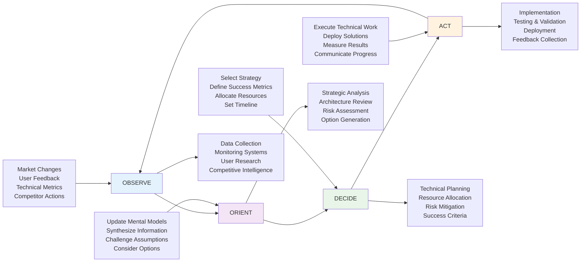

# Strategic Thinking for Engineers: From Technical Excellence to Business Impact

> *"The core of strategy work is discovering the critical factors in a situation and designing a way of coordinating and focusing actions to deal with those factors."* - Richard Rumelt

Picture this scenario: Your engineering team just shipped a beautifully architected microservices platform. The code is clean, the performance is exceptional, and the deployment pipeline is flawless. You're proud of the technical achievement—until you realize the business is struggling to find customers who actually need what you've built.

**This is the classic trap of engineering without strategic thinking.**

You executed brilliantly on the "how" and the "what," but you never deeply understood the "why." The result? Technical success that doesn't translate to business value. Your stakeholders start questioning whether engineering understands the business. Trust erodes. Future projects get more oversight and less autonomy.

**Strategic thinking is what separates Staff Engineers who build impressive systems from those who build systems that create competitive advantage.** It's the difference between being a highly skilled executor and being a force multiplier who amplifies the entire organization's effectiveness.

This isn't about becoming a business strategist instead of an engineer—it's about becoming an engineer who thinks strategically. When you understand how your technical decisions connect to business outcomes, you make better technical decisions. When you can articulate the business impact of technical work, you gain the trust and resources to do more ambitious technical work.

Strategic thinking for engineers is ultimately about **building the right thing, the right way, at the right time.**

## The Anatomy of Good Strategy: Rumelt's Strategic Kernel

Richard Rumelt's groundbreaking research revealed that most "strategies" aren't strategies at all—they're just goals, visions, or wish lists. **Real strategy has three essential components that work together**: diagnosis, guiding policy, and coherent action.

Understanding this framework transforms how you approach technical decisions, project planning, and stakeholder communication.

### **Diagnosis: Understanding the True Challenge**

**The Core Insight**: Most people mistake symptoms for root causes. Good strategy starts with an accurate diagnosis of the underlying challenge, not just the obvious problems.

**Engineering Context**: When your application is slow, the symptom is obvious. But the strategic diagnosis might reveal that performance isn't the real issue—maybe users are abandoning the app because the core workflow is confusing, not because it's slow.

#### **The Diagnostic Process for Engineers**

**Step 1: Distinguish Challenges from Symptoms**

```python
class StrategicDiagnosis:
    def __init__(self, observed_problem):
        self.symptoms = self.identify_symptoms(observed_problem)
        self.root_challenges = self.dig_deeper(self.symptoms)
        
    def dig_deeper(self, symptoms):
        """Apply 5-why analysis with business context"""
        challenges = []
        for symptom in symptoms:
            current_question = symptom
            for _ in range(5):  # 5-why methodology
                why_answer = self.ask_why_with_data(current_question)
                current_question = why_answer
                if self.is_actionable_root_cause(why_answer):
                    challenges.append(why_answer)
                    break
        return challenges
    
    def ask_why_with_data(self, question):
        """Combine qualitative reasoning with quantitative evidence"""
        stakeholder_interviews = self.gather_stakeholder_perspectives(question)
        metrics_analysis = self.analyze_relevant_metrics(question)
        user_research = self.review_user_behavior_data(question)
        
        return self.synthesize_root_cause(
            stakeholder_interviews, metrics_analysis, user_research
        )
```

**Example - "Our Service Is Too Slow"**:

*Symptom*: 95th percentile response time is 2 seconds
*Surface diagnosis*: "We need to optimize our database queries"
*Strategic diagnosis*: 
- Why are users complaining about speed? → They're trying to complete time-sensitive tasks
- Why are these tasks time-sensitive? → They're part of a critical business workflow  
- Why is this workflow critical? → It directly impacts revenue conversion
- Why does speed matter for conversion? → Users abandon after 3 seconds, but our app takes 2+ seconds to show results
- **Strategic insight**: Speed isn't just a technical problem—it's a competitive advantage opportunity

**The Diagnostic Outcome**: Instead of just optimizing queries, you recognize this as a strategic opportunity to differentiate through exceptional user experience.

#### **Strategic Pattern Recognition for Engineers**

Learn to recognize these common strategic patterns in engineering contexts:

**The Capacity Challenge**:
- *Symptoms*: Servers overloaded, outages during traffic spikes
- *Strategic diagnosis*: Current architecture can't scale with business growth
- *Insight*: This is an investment timing decision, not just a technical problem

**The Technical Debt Trap**:
- *Symptoms*: Slower feature development, more bugs
- *Strategic diagnosis*: Accumulated technical debt is constraining business agility
- *Insight*: Technical debt is a business risk that needs quantified trade-off analysis

**The Integration Complexity Crisis**:
- *Symptoms*: Long development cycles, frequent breaking changes
- *Strategic diagnosis*: System boundaries don't match business domains
- *Insight*: This is an organizational design problem that requires technical solutions

### **Guiding Policy: Your Strategic Approach**

**The Core Insight**: A guiding policy isn't a detailed plan—it's an overall approach to dealing with the challenge that rules out many possible actions and focuses effort on specific directions.

**Engineering Context**: Your guiding policy is your architectural philosophy, your technology selection criteria, your team development approach. It's the coherent approach that connects all your tactical decisions.

#### **Developing Engineering Guiding Policies**

**Example Policy Development**:

*Challenge*: Engineering team can't deliver features fast enough to keep up with market demands

*Possible Policies*:
1. **"Optimize for Development Velocity"** → Prioritize tools, processes, and architectures that make engineers more productive
2. **"Optimize for Quality and Reliability"** → Prioritize stability and long-term maintainability over short-term speed
3. **"Optimize for Learning and Adaptation"** → Prioritize fast feedback loops and experimentation capability

**Choosing Your Policy**:
The right choice depends on your strategic context:
- Early-stage startup with product-market fit uncertainty → Choose #3 (Learning)
- Scaling company with established product → Choose #1 (Velocity)  
- Mature company in regulated industry → Choose #2 (Quality)

**Policy Implementation Framework**:
```python
class GuidingPolicyFramework:
    def __init__(self, strategic_context):
        self.context = strategic_context
        self.policy = self.select_guiding_policy()
        
    def select_guiding_policy(self):
        if self.context.stage == "early" and self.context.uncertainty == "high":
            return OptimizeForLearningPolicy()
        elif self.context.stage == "growth" and self.context.competition == "intense":
            return OptimizeForVelocityPolicy()
        elif self.context.stage == "mature" and self.context.regulation == "high":
            return OptimizeForQualityPolicy()
            
    def evaluate_decision(self, technical_decision):
        """All technical decisions should align with guiding policy"""
        return self.policy.evaluate_alignment(technical_decision)
    
    def resolve_trade_offs(self, option_a, option_b):
        """Use policy to break ties between viable options"""
        return self.policy.preferred_option(option_a, option_b)
```

#### **Common Engineering Guiding Policies**

**"Build vs. Buy" Policy Framework**:
- *Build-First Policy*: "We build core competencies in-house and buy commodity capabilities"
- *Buy-First Policy*: "We buy unless building provides clear competitive advantage"
- *Hybrid Policy*: "We build when we can differentiate, buy when we can't"

**Technology Selection Policy**:
- *Proven-Tech Policy*: "We choose mature, well-supported technologies with large communities"
- *Innovation-Edge Policy*: "We selectively adopt emerging technologies that provide competitive advantage"  
- *Simplicity-First Policy*: "We choose the simplest technology that solves the problem effectively"

**Architecture Evolution Policy**:
- *Evolutionary Policy*: "We make incremental improvements while maintaining system stability"
- *Revolutionary Policy*: "We make bold architectural changes to achieve breakthrough improvements"
- *Modular Policy*: "We design for independent evolution of system components"

### **Coherent Action: Aligned Execution**

**The Core Insight**: Coherent action means your individual technical decisions reinforce each other and collectively advance your guiding policy. Random acts of excellence don't create strategic advantage.

**Engineering Context**: Every technical choice—from architecture patterns to tool selection to team processes—should work together toward your strategic goals.

#### **Engineering Coherent Action Framework**

**Example - Velocity-Focused Coherent Action**:

If your guiding policy is "Optimize for Development Velocity," then your actions should coherently support faster development:

```python
class VelocityOptimizedActions:
    def __init__(self):
        self.coherent_actions = [
            # Infrastructure actions
            self.implement_fast_ci_cd_pipeline(),
            self.create_local_development_environments(),
            self.automate_testing_and_deployment(),
            
            # Architecture actions  
            self.design_modular_services(),
            self.implement_feature_flags(),
            self.create_shared_component_libraries(),
            
            # Process actions
            self.streamline_code_review_process(),
            self.implement_continuous_integration(),
            self.create_developer_productivity_metrics(),
            
            # Team actions
            self.invest_in_developer_tooling(),
            self.create_development_standards(),
            self.build_internal_platform_capabilities()
        ]
    
    def validate_coherence(self, proposed_action):
        """Ensure new actions support the velocity goal"""
        return (proposed_action.reduces_friction or 
                proposed_action.increases_automation or
                proposed_action.improves_developer_experience)
```

**Anti-Coherent Action Warning**: If your policy is velocity-focused, but you're spending significant time on:
- Manual testing processes that could be automated
- Complex architecture that slows down feature development  
- Perfectionist code review standards that create bottlenecks
- Technology experiments that don't clearly improve development speed

**Then your actions aren't coherent with your strategy.**

#### **Measuring Strategic Coherence**

Track whether your technical investments are coherently advancing your strategic goals:

```python
class StrategicCoherenceMeasurement:
    def __init__(self, guiding_policy):
        self.policy = guiding_policy
        self.metrics = self.define_success_metrics()
        
    def define_success_metrics(self):
        if isinstance(self.policy, OptimizeForVelocityPolicy):
            return {
                'primary': ['deployment_frequency', 'lead_time', 'development_cycle_time'],
                'secondary': ['developer_satisfaction', 'technical_debt_trend'],
                'warning': ['defect_rate', 'outage_frequency']  # Don't sacrifice quality
            }
        elif isinstance(self.policy, OptimizeForQualityPolicy):
            return {
                'primary': ['defect_rate', 'outage_frequency', 'customer_satisfaction'],
                'secondary': ['technical_debt_ratio', 'code_coverage'],
                'warning': ['deployment_frequency', 'feature_velocity']  # Don't sacrifice agility
            }
            
    def assess_coherence(self, recent_actions):
        """Measure if recent technical decisions advance strategic goals"""
        primary_impact = self.measure_primary_metric_impact(recent_actions)
        secondary_impact = self.measure_secondary_metric_impact(recent_actions)
        warning_impact = self.measure_warning_metric_impact(recent_actions)
        
        return StrategicCoherenceScore(
            advancing_goals=primary_impact > 0,
            supporting_health=secondary_impact >= 0,
            avoiding_traps=warning_impact >= -0.1  # Allow small decreases
        )
```

---

## The OODA Loop: Strategic Adaptation in Fast-Moving Environments

Colonel John Boyd's Observe-Orient-Decide-Act (OODA) loop provides a powerful framework for strategic thinking in rapidly changing technical environments. Originally developed for fighter pilot tactics, it's become essential for engineering teams operating in competitive, uncertain markets.

### **The Engineering OODA Loop Framework**



### **OODA Loop Velocity: The Competitive Advantage**

**Key Insight**: The team that can complete OODA loops faster than their competition gains a decisive advantage. While competitors are still analyzing the situation, you're already three moves ahead.

**Engineering Applications**:

**Observe (Market & Technical Intelligence)**:
- Real-time monitoring of system performance and user behavior
- Continuous competitive analysis and technology trend tracking  
- Regular user feedback collection and analysis
- Technical debt and architecture health assessment

**Orient (Strategic Analysis & Mental Model Updates)**:
- Synthesizing technical metrics with business context
- Updating architectural assumptions based on new data
- Challenging existing technical strategies against current reality
- Generating multiple strategic options for consideration

**Decide (Strategic Choice & Resource Allocation)**:
- Selecting technical approaches based on strategic analysis
- Allocating engineering resources to highest-impact work
- Defining clear success metrics for technical initiatives
- Establishing decision criteria for future choices

**Act (Implementation & Measurement)**:
- Executing technical work with rapid feedback loops
- Deploying solutions with comprehensive monitoring
- Measuring actual results against predicted outcomes  
- Communicating progress and learnings to stakeholders

### **Optimizing Your Engineering OODA Loop**

**Reduce Observation Lag**:
```python
class EngineeringObservationSystem:
    def __init__(self):
        self.technical_monitors = [
            SystemPerformanceMonitor(),
            UserBehaviorTracker(), 
            CompetitorTechRadar(),
            ArchitecturalHealthScanner()
        ]
        
    def continuous_observe(self):
        """Real-time data collection across all strategic dimensions"""
        observations = {}
        for monitor in self.technical_monitors:
            observations.update(monitor.get_latest_data())
        return self.synthesize_strategic_intelligence(observations)
```

**Accelerate Orientation**:
- Pre-built analysis frameworks for common strategic decisions
- Regular architecture review cycles with strategic context
- Cross-functional strategy sessions with product and business teams
- Documented decision trees for recurring technical choices

**Improve Decision Quality**:
- Clear criteria for evaluating technical alternatives
- Risk assessment frameworks for major technical decisions
- Resource allocation models that optimize for strategic outcomes
- Stakeholder communication templates for decision justification

**Optimize Action Execution**:
- Automated deployment and monitoring systems
- Rapid experimentation and A/B testing capabilities  
- Real-time feedback loops from production systems
- Continuous learning and adaptation mechanisms

---

## OKRs for Engineering Teams: Strategic Goal Setting and Measurement

Objectives and Key Results (OKRs) provide a framework for connecting strategic thinking to measurable outcomes. For engineers, OKRs help bridge the gap between technical work and business impact.

### **Understanding OKRs: Objectives vs Key Results**

**Objectives**: Qualitative descriptions of what you want to accomplish
- Inspirational and memorable
- Time-bound (usually quarterly)  
- Actionable by the team

**Key Results**: Quantitative measures that indicate success on the objective
- Specific and measurable
- Achievable but ambitious  
- Verifiable (binary success/failure)

### **Engineering-Specific OKR Framework**

#### **Level 1: Infrastructure and Platform OKRs**

**Objective**: "Build a world-class development platform that accelerates engineering velocity"

**Key Results**:
- KR1: Reduce average deployment time from 45 minutes to 10 minutes
- KR2: Achieve 99.9% CI/CD pipeline success rate  
- KR3: Increase developer productivity score from 7.2 to 8.5 (internal survey)
- KR4: Reduce average environment provisioning time from 2 days to 2 hours

**Strategic Alignment**: This OKR supports a "Optimize for Velocity" guiding policy by removing friction from development workflows.

#### **Level 2: Product and Feature OKRs**

**Objective**: "Deliver exceptional user experience through reliable, performant systems"

**Key Results**:
- KR1: Improve application 95th percentile response time from 800ms to 300ms
- KR2: Achieve 99.95% uptime for all user-facing services
- KR3: Reduce customer-reported bugs by 40% compared to previous quarter
- KR4: Increase user engagement metrics by 15% through performance improvements

**Strategic Alignment**: This OKR connects technical improvements directly to user experience and business metrics.

#### **Level 3: Team and Capability OKRs**

**Objective**: "Build a learning organization that continuously improves engineering practices"

**Key Results**:
- KR1: 100% of engineers complete advanced training in their primary technology stack
- KR2: Implement post-incident learning process with 100% of critical incidents followed by improvement actions
- KR3: Establish cross-team knowledge sharing with monthly tech talks and 80% attendance
- KR4: Increase internal promotion rate to 25% of senior+ engineers advancing annually

**Strategic Alignment**: This OKR builds long-term organizational capability and resilience.

### **The OKR Setting Process for Engineering Teams**

#### **Step 1: Strategic Context Setting**

Before writing OKRs, align on strategic context:

```python
class OKRContextSetting:
    def __init__(self, team_context):
        self.business_strategy = team_context.company_strategy
        self.engineering_challenges = self.assess_current_challenges()
        self.stakeholder_priorities = self.gather_stakeholder_input()
        self.capacity_constraints = self.assess_team_capacity()
        
    def generate_strategic_themes(self):
        """Identify 2-3 themes that should guide OKR selection"""
        return self.synthesize_themes(
            self.business_strategy,
            self.engineering_challenges, 
            self.stakeholder_priorities
        )
    
    def validate_okr_alignment(self, proposed_okr):
        """Ensure OKRs connect to strategic themes"""
        alignment_score = 0
        for theme in self.strategic_themes:
            if theme.supports(proposed_okr):
                alignment_score += theme.importance_weight
        
        return alignment_score > 0.7  # 70% alignment threshold
```

#### **Step 2: Objective Crafting**

**Good Engineering Objectives**:
- Connect technical work to user/business impact
- Inspire the team and create focus
- Are achievable within the timeframe
- Don't conflict with other team objectives

**Examples of Strong vs. Weak Objectives**:

**Weak**: "Improve system performance"
**Strong**: "Deliver exceptional user experience through lightning-fast response times"

**Weak**: "Reduce technical debt"
**Strong**: "Build a codebase that enables rapid, confident feature development"

**Weak**: "Implement microservices"
**Strong**: "Enable independent team velocity through modular system architecture"

#### **Step 3: Key Result Design**

**Engineering Key Result Categories**:

**Performance Metrics**:
- Response time improvements (95th percentile, average)
- Throughput increases (requests/second, transactions/minute)
- Resource utilization optimization (CPU, memory, costs)

**Reliability Metrics**:
- Uptime/availability percentages
- Error rates and types
- Recovery time measurements

**Velocity Metrics**:
- Deployment frequency
- Lead time (code to production)
- Cycle time (development phases)
- Feature delivery rates

**Quality Metrics**:
- Bug rates (customer-reported, escaped defects)
- Test coverage and effectiveness
- Code review quality scores
- Security vulnerability counts

**Developer Experience Metrics**:
- Developer productivity scores
- Tool satisfaction ratings
- Onboarding time for new engineers
- Context switching frequency

### **Advanced OKR Patterns for Engineering Teams**

#### **The Capability-Building OKR**

Focus on building long-term organizational capabilities rather than just delivering immediate outcomes:

**Objective**: "Establish engineering practices that enable sustainable high performance"

**Key Results**:
- KR1: Implement comprehensive observability with 100% of services having SLI/SLO definitions
- KR2: Achieve 90% developer confidence in deployment safety (survey measure)
- KR3: Reduce average incident resolution time from 4 hours to 1 hour
- KR4: Establish chaos engineering practices with monthly resilience tests

#### **The Innovation OKR**

Balance innovation exploration with delivery execution:

**Objective**: "Explore emerging technologies that could provide competitive advantage"

**Key Results**:
- KR1: Complete 3 proof-of-concepts for AI/ML integration opportunities
- KR2: Publish 2 technical blog posts sharing learning from experiments
- KR3: Present findings to product team with 3 concrete integration recommendations
- KR4: Maintain current delivery velocity while investing 20% time in exploration

#### **The Cross-Team Collaboration OKR**

Improve coordination and knowledge sharing across engineering teams:

**Objective**: "Break down silos and accelerate learning across engineering teams"

**Key Results**:
- KR1: Implement shared component library with 80% adoption across teams
- KR2: Establish weekly cross-team architecture reviews with 90% participation
- KR3: Create engineering wiki with 100% of teams documenting their systems
- KR4: Reduce cross-team dependency resolution time from 5 days to 2 days

### **OKR Execution and Management**

#### **Weekly Check-ins and Course Correction**

```python
class OKRExecutionTracking:
    def __init__(self, quarterly_okrs):
        self.okrs = quarterly_okrs
        self.weekly_progress = []
        
    def weekly_checkin(self, week_number):
        """Track progress and identify course corrections needed"""
        progress_update = {}
        
        for objective in self.okrs:
            objective_progress = {}
            
            for key_result in objective.key_results:
                current_value = key_result.measure_current_value()
                progress_percent = key_result.calculate_progress_percent(current_value)
                
                objective_progress[key_result.id] = {
                    'current_value': current_value,
                    'progress_percent': progress_percent,
                    'on_track': self.assess_if_on_track(
                        progress_percent, week_number, quarter_length=12
                    ),
                    'blockers': key_result.identify_current_blockers(),
                    'actions_needed': key_result.suggest_actions()
                }
                
            progress_update[objective.id] = objective_progress
            
        self.weekly_progress.append(progress_update)
        return self.generate_action_plan(progress_update)
    
    def assess_if_on_track(self, progress_percent, week_number, quarter_length):
        expected_progress = week_number / quarter_length
        return progress_percent >= expected_progress * 0.8  # 80% of expected pace
```

#### **OKR Retrospectives and Learning**

**Monthly OKR Retrospectives**:
- What's working well in our OKR execution?
- What obstacles are preventing progress on key results?
- What have we learned about our original assumptions?
- Do our OKRs still reflect the right priorities given new information?

**End-of-Quarter OKR Review**:
- Final scoring and achievement assessment
- Analysis of what drove success or lack thereof
- Lessons learned for next quarter's OKR setting
- Celebration of achievements and learning from failures

---

## Strategic Communication: Translating Technical Work to Business Impact

The ability to communicate technical work in strategic business terms is what separates Staff Engineers from senior engineers. You must be fluent in both languages—technical precision and business impact.

### **The Translation Framework**

#### **Technical Achievement → Business Outcome**

Learn to consistently translate technical work into business language:

**Template**: "By achieving [technical result], we enabled [business capability] which resulted in [measurable business impact]"

**Examples**:

**Technical**: "Reduced database query time by 60%"
**Strategic**: "By optimizing our core database queries, we enabled sub-second search results which increased user engagement by 25% and reduced bounce rate by 15%"

**Technical**: "Implemented automated deployment pipeline"  
**Strategic**: "By automating our deployment process, we enabled daily releases which reduced time-to-market for new features from weeks to days, increasing our competitive responsiveness"

**Technical**: "Migrated to microservices architecture"
**Strategic**: "By modularizing our system architecture, we enabled independent team delivery which increased overall engineering velocity by 40% and reduced cross-team dependencies by 70%"

#### **Strategic Storytelling for Engineers**

**The Business Case Narrative Structure**:

1. **Current State Challenge**: What business problem exists today?
2. **Technical Solution**: What technical approach will address this?
3. **Expected Outcome**: What business results will this enable?
4. **Success Metrics**: How will we measure business impact?
5. **Timeline and Resources**: What investment is required?

**Example - Performance Optimization Business Case**:

"Our users are experiencing slow page load times (3-5 seconds) which is causing 30% of visitors to bounce before seeing our core value proposition. This directly impacts our conversion funnel, costing us an estimated $2M annually in lost revenue.

We propose implementing a comprehensive performance optimization program including database query optimization, CDN implementation, and front-end bundling improvements. Based on industry benchmarks, we expect to achieve sub-1-second load times.

This improvement should increase conversion rates by 15-25% based on similar case studies, potentially generating $3-5M additional annual revenue. We'll measure success through user engagement metrics, conversion funnel analysis, and direct revenue attribution.

The project requires 3 engineers for 8 weeks, with an infrastructure investment of $50K annually. The ROI should be visible within 2 months of completion."

### **Stakeholder-Specific Communication**

#### **Engineering Leadership**

**Focus on**: Technical approach, risk management, team impact
**Language**: Technical depth with strategic context
**Metrics**: Engineering velocity, quality metrics, team satisfaction

**Example Update**:
"The microservices migration is progressing well. We've successfully extracted the user authentication service with zero downtime, validating our deployment approach. Key metrics: deployment frequency increased 3x, and the auth team can now ship independently. 

Risk mitigation: We've identified data consistency challenges that will require event sourcing patterns. This adds 3 weeks to timeline but ensures data integrity. Next extraction targets the payment service, which has cleaner boundaries."

#### **Product Leadership**

**Focus on**: User impact, feature velocity, competitive advantage
**Language**: User-centric outcomes with technical context
**Metrics**: Feature delivery speed, user experience improvements, market responsiveness

**Example Update**:
"Our platform improvements are directly enabling faster feature delivery. Last quarter we shipped 40% more user-facing features compared to the previous quarter. The new deployment pipeline means we can respond to user feedback within days instead of weeks.

Upcoming focus: Performance optimizations that will improve user retention. Based on user research, page load speed is the #1 friction point in our onboarding funnel."

#### **Executive Leadership**

**Focus on**: Business outcomes, competitive positioning, resource efficiency
**Language**: Business impact with minimal technical detail
**Metrics**: Revenue impact, market advantage, operational efficiency

**Example Update**:
"Our engineering platform investments are paying dividends. We're now delivering features 50% faster than last year, while our reliability has improved to 99.9% uptime. This enables us to respond more quickly to market opportunities and customer needs.

The platform also reduced our infrastructure costs by 30% while supporting 3x more users, demonstrating strong operational leverage as we scale."

---

## Building Strategic Thinking Capability

### **The Staff Engineer's Strategic Practice**

#### **Daily Strategic Habits**

**Morning Strategic Question**: "How does my work today advance our strategic objectives?"

**Decision Filter**: Before any significant technical decision, ask:
- What business capability does this enable or constrain?
- How does this align with our guiding policy?
- What trade-offs am I making, and are they strategically sound?

**Communication Practice**: In every technical discussion, include one statement connecting the technical work to business impact.

#### **Weekly Strategic Activities**

**Stakeholder Check-ins**: Regularly connect with product, sales, and customer success teams to understand how technical decisions impact their work.

**Competitive Analysis**: Review competitor technical capabilities and identify opportunities for differentiation.

**Metric Review**: Analyze how technical improvements are translating to business metrics.

**Strategy Validation**: Assess whether current technical strategies are working as expected.

#### **Monthly Strategic Reviews**

**OKR Progress Assessment**: Evaluate progress on key results and course-correct as needed.

**Strategic Coherence Audit**: Review recent technical decisions for strategic alignment.

**Stakeholder Feedback Collection**: Gather input on how engineering is supporting business objectives.

**Strategy Evolution**: Adjust technical strategies based on new information and changing business context.

### **Advanced Strategic Thinking Tools**

#### **The Engineering Strategy Canvas**

Visualize how technical work connects to business strategy:

```python
class EngineeringStrategyCanvas:
    def __init__(self):
        self.business_objectives = []
        self.technical_capabilities = []  
        self.user_needs = []
        self.competitive_advantages = []
        self.resource_constraints = []
        
    def map_strategy(self):
        return {
            'value_propositions': self.identify_technical_value_props(),
            'key_activities': self.identify_critical_technical_work(),
            'key_resources': self.identify_essential_capabilities(),
            'cost_structure': self.analyze_technical_investments(),
            'revenue_streams': self.trace_technical_to_business_value()
        }
```

#### **Technical Debt as Strategic Risk**

Frame technical debt in strategic business terms:

**Technical Debt Strategic Assessment**:
- **Velocity Impact**: How is debt constraining feature development speed?
- **Quality Risk**: How does debt increase the probability of customer-impacting failures?
- **Competitive Risk**: How does debt limit our ability to respond to market opportunities?
- **Talent Risk**: How does debt affect engineer satisfaction and retention?
- **Opportunity Cost**: What business opportunities are we missing due to technical constraints?

---

## The Strategic Staff Engineer: Integrating Technical Excellence and Business Impact

The goal isn't to become a business strategist instead of an engineer—it's to become an engineer whose technical decisions create strategic advantage.

**Strategic Engineers**:
- Build systems that enable business capabilities, not just solve technical problems
- Communicate technical work in terms of business impact and user value
- Make technology choices that advance long-term strategic objectives
- Anticipate how business needs will evolve and design for that future
- Influence organizational strategy through technical insights and capabilities

**This integration of strategic thinking and technical execution is what makes Staff Engineers indispensable.** You're not just building what you're asked to build—you're building what the business needs to succeed, even when stakeholders can't articulate those needs clearly.

Strategic thinking transforms technical work from cost center to competitive advantage, from execution to innovation, from support function to business driver. **This is how Staff Engineers become true partners in business success rather than just highly skilled implementers.**

---

## Prerequisites and Related Learning

### **Prerequisites for This Chapter**
- **[Mental Models](mental-models.md)** - Systems thinking and probabilistic reasoning provide the cognitive foundation for strategic analysis
- **[Engineering Excellence](../engineering/index.md)** - Technical credibility enables you to make strategic technology decisions with confidence
- **[Critical Thinking Frameworks](../thinking/index.md)** - Analytical thinking skills are essential for strategic problem-solving

### **Related Concepts**
- **[Business Strategy Alignment](../business/aligning-technology.md)** - Learn to translate business goals into technical strategy
- **[Revenue vs Risk Frameworks](../business/revenue-vs-risk.md)** - Apply strategic thinking to balance growth and stability
- **[Executive Communication](../business/pitching-to-executives.md)** - Present strategic technical initiatives to business leadership
- **[Decision-Making Frameworks](../execution/decision-making-frameworks.md)** - Integrate strategic analysis into systematic decision processes

### **Apply Strategic Thinking**
- **[Staff Engineer Competency Assessment](../../appendix/tools/staff-engineer-competency-assessment.md)** - Evaluate your strategic planning and business alignment capabilities
- **[Engineering Excellence Assessment](../../appendix/tools/engineering-excellence-assessment.md)** - Use strategic frameworks to assess and improve technical capabilities
- **[Team Health Diagnostic](../../appendix/tools/team-health-diagnostic.md)** - Apply strategic thinking to organizational health and team effectiveness

### **Next Steps in Your Learning Journey**
1. **[Leadership Influence](../leadership/influencing-without-authority.md)** - Use strategic insights to build influence and guide organizational decisions
2. **[Business Partnership](../business/index.md)** - Learn to translate strategic thinking into business value and competitive advantage
3. **[Execution Excellence](../execution/index.md)** - Apply strategic planning to complex project and initiative delivery
4. **[Organizational Design](../teamwork/organizational-design.md)** - Use strategic thinking to design team structures that enable business strategy

### **Learning Path Recommendations**

**For Technical Architects**: Focus on **Technology Strategy** and **OODA Loops** to align architectural decisions with business strategy and competitive dynamics.

**For Team Leads Moving to Staff Roles**: Emphasize **Rumelt's Strategic Kernel** and **OKR Frameworks** to bridge tactical execution with strategic direction.

**For Business-Focused Staff Engineers**: Develop **Strategic Communication** and **Business Model Analysis** skills to become effective technical partners to business leaders.

---

## Further Reading

**Strategic Thinking Foundations**:
- Rumelt, Richard. *Good Strategy Bad Strategy: The Difference and Why It Matters*. 2011.
- Porter, Michael E. *Competitive Strategy: Techniques for Analyzing Industries and Competitors*. 1980.
- Heath, Chip, and Dan Heath. *Made to Stick: Why Some Ideas Survive and Others Die*. 2007.

**OKRs and Goal Setting**:
- Doerr, John. *Measure What Matters: How Google, Bono, and the Gates Foundation Rock the World with OKRs*. 2018.
- Grove, Andrew S. *High Output Management*. 1983.
- Clear, James. *Atomic Habits: An Easy & Proven Way to Build Good Habits & Break Bad Ones*. 2018.

**Business Strategy for Engineers**:
- Cagan, Marty. *Inspired: How to Create Tech Products Customers Love*. 2017.
- Kim, Gene, et al. *The DevOps Handbook: How to Create World-Class Agility, Reliability, and Security*. 2016.
- Forsgren, Nicole, et al. *Accelerate: The Science of Lean Software and DevOps*. 2018.

---

## Prerequisites and Related Learning

### **Prerequisites for This Chapter**
- **[Engineering Excellence](../engineering/index.md)** - Technical credibility provides the foundation for strategic technical decisions and architectural thinking
- **[Mental Models](mental-models.md)** - Systems thinking and analytical frameworks are essential for strategic analysis and decision-making
- **[Continuous Learning](../learning/index.md)** - Strategic thinking requires staying current with technology trends and business environment changes

### **Related Concepts**
- **[Decision-Making Frameworks](../execution/decision-making-frameworks.md)** - Apply strategic thinking within structured decision processes for complex technical choices
- **[Algorithmic Decision-Making](algorithmic-decision-making.md)** - Use computational thinking approaches to support strategic analysis and optimization
- **[Technical Vision](../leadership/technical-vision.md)** - Translate strategic thinking into compelling technical vision and architectural roadmaps
- **[Aligning Technology to Business Strategy](../business/aligning-technology.md)** - Bridge strategic thinking with business partnership and competitive advantage
- **[Revenue vs Risk](../business/revenue-vs-risk.md)** - Apply strategic analysis to business-technical tradeoff decisions

### **Apply Strategic Thinking**
- **[Staff Engineer Competency Assessment](../../appendix/tools/staff-engineer-competency-assessment.md)** - Evaluate your strategic thinking and business alignment capabilities
- **[Critical Thinking Assessment](../../appendix/tools/critical-thinking-assessment.md)** - Test your ability to apply strategic frameworks to complex engineering scenarios
- **[Engineering Excellence Assessment](../../appendix/tools/engineering-excellence-assessment.md)** - Use strategic thinking to evaluate and improve engineering practices

### **Next Steps in Your Learning Journey**
1. **[Technical Vision](../leadership/technical-vision.md)** - Apply strategic thinking to create compelling technical vision and architectural roadmaps
2. **[Influencing Without Authority](../leadership/influencing-without-authority.md)** - Use strategic analysis to build influence and guide organizational technical decisions
3. **[Aligning Technology to Business Strategy](../business/aligning-technology.md)** - Extend strategic thinking to create business value through technical excellence
4. **[Pitching to Executives](../business/pitching-to-executives.md)** - Communicate strategic technical recommendations to senior business leadership

### **Learning Path Recommendations**

**For Technical Architects**: Focus on **Rumelt's Strategic Kernel** and **OODA Loops** to align architectural decisions with business strategy and competitive dynamics.

**For Team Leads Moving to Staff Roles**: Emphasize **Strategic Communication** and **OKR Frameworks** to bridge tactical execution with strategic direction.

**For Business-Focused Staff Engineers**: Develop **Technology Strategy** and **Business Model Analysis** skills to become effective technical partners to business leaders.